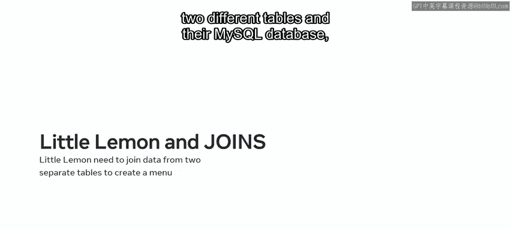
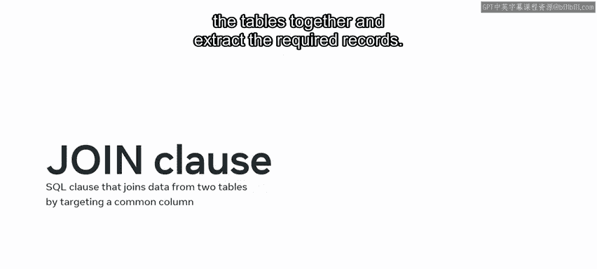
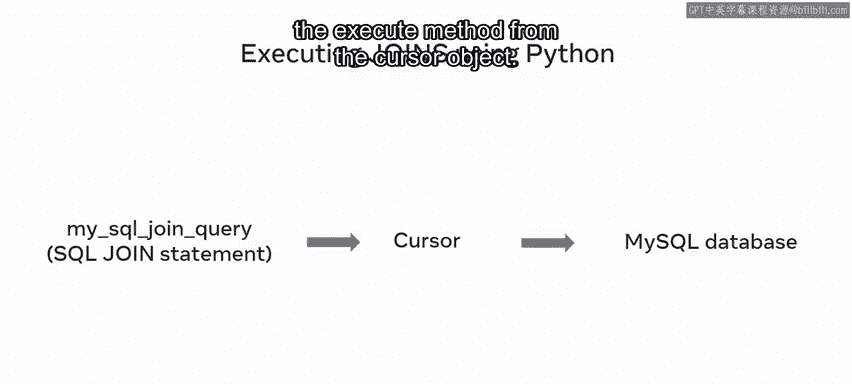
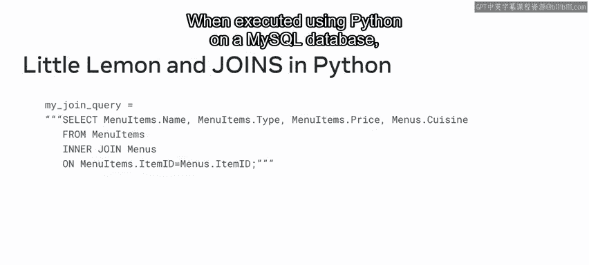
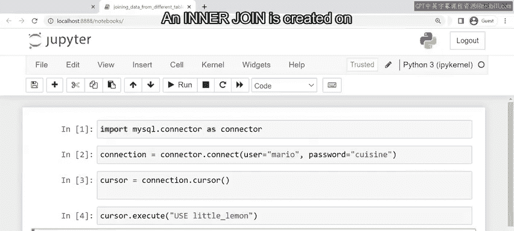
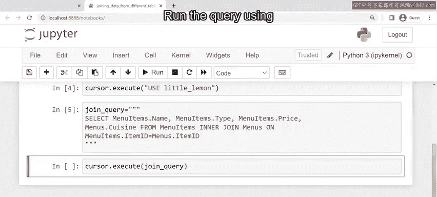
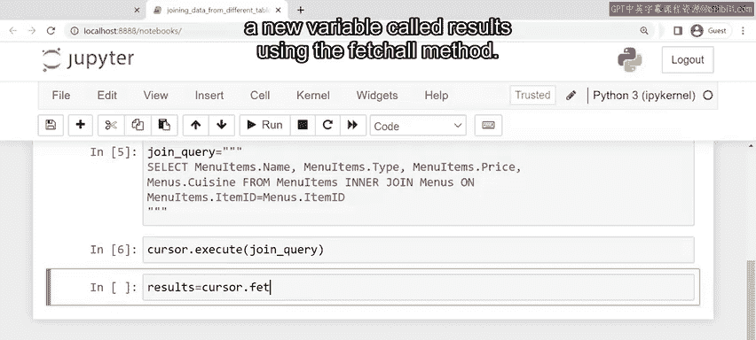
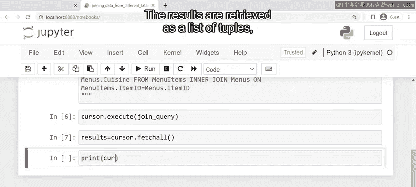
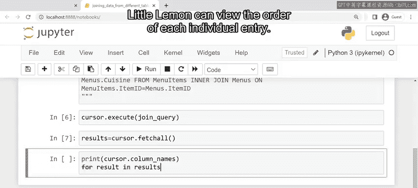
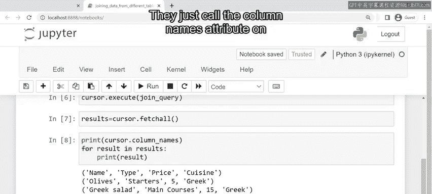

# 80：使用Python将不同MySQL数据库表中的数据联接

在本节课中，我们将要学习如何使用Python对MySQL数据库执行联接操作，以从多个表中提取和组合数据。这对于构建需要整合不同数据源的功能至关重要。

## 概述

在数据库工程的这个阶段，你应该已经具备使用联接操作从多个表中提取数据的经验。同时，也存在需要使用Python在MySQL数据库上执行联接操作的场景。本节将探索使用Python执行联接操作的具体流程。

## 联接操作回顾

上一节我们介绍了数据库联接的基本概念，本节中我们来看看如何在Python中实现它。联接是使用SQL的`JOIN`子句创建的。它针对两个目标表之间的一个公共列。这些公共列用于将表连接在一起并提取所需的记录。



MySQL中使用的联接类型包括：
*   **左联接** (`LEFT JOIN`)
*   **右联接** (`RIGHT JOIN`)
*   **内联接** (`INNER JOIN`)
*   **外联接** (`OUTER JOIN`)

所有这些联接都可以与Python结合使用。

## 使用Python执行内联接

让我们通过一个内联接的例子来了解其语法和创建过程。




首先，需要创建一个SQL查询字符串，并将其传递给一个Python变量。

```python
join_query = “SELECT * FROM table1 INNER JOIN table2 ON table1.common_column = table2.common_column;”
```

然后，使用游标对象的`execute`方法来运行此查询。



```python
cursor.execute(join_query)
```


查询执行后，可以将结果检索到另一个变量中。对包含联接结果的游标对象使用`fetchall`方法。

```python
results = cursor.fetchall()
```

数据将以元组列表的形式被检索。

## 实战案例：小柠檬餐厅菜单功能



现在你已经熟悉了使用Python联接不同表数据的过程，让我们看看如何帮助小柠檬餐厅创建这个查询。

小柠檬餐厅正在其网站上添加一个新的菜单功能。该功能让顾客可以查看菜单项、价格以及每道菜所属的菜系类型。该功能所需的数据位于其MySQL数据库的两个不同表中：`menu`表和`menu_items`表。

正如之前所学，小柠檬餐厅需要使用一个联接查询来提取其网站新菜单功能所需的数据。

他们首先在Python中将联接语句创建为一个字符串对象，并将其存储在一个名为`join_query`的变量中。该联接查询必须从`menu_items`表中选取`name`、`type`和`price`列，同时从`menu`表中选取`cuisine`列。通过两个表共有的`itemID`列创建一个内联接。

```python
join_query = “””
SELECT MenuItems.Name, MenuItems.Type, MenuItems.Price, Menu.Cuisine
FROM MenuItems
INNER JOIN Menu ON MenuItems.ItemID = Menu.ItemID;
“””
```



假设MySQL Connector/Python API已经建立了前后端之间的连接，并且游标对象也已准备就绪。这意味着你现在可以执行你的联接查询了。

使用游标对象的`execute`方法运行查询。



```python
cursor.execute(join_query)
```

当查询执行后，你可以使用`fetchall`方法将游标对象中的所有结果提取到一个名为`results`的新变量中。



```python
results = cursor.fetchall()
```



结果将以元组列表的形式被检索，每个元组代表一行数据。



小柠檬餐厅可以查看每个单独条目的顺序。他们只需调用游标上的`column_names`属性，即可按顺序返回列名。



```python
column_names = cursor.column_names
```

## 总结

在本节课中，我们一起学习了如何使用Python在MySQL数据库上执行联接操作。你现在应该已经具备使用联接从多个表中提取数据的经验，并且熟悉了结合使用联接和Python从MySQL数据库中提取数据的方法。