# 83：使用Python访问MySQL函数

在本节课中，我们将要学习Python中`datetime`库的日期和时间函数。你将了解如何利用这些函数从数据库中提取和操作时间与日期值，并解决一个实际的餐厅预订时间调整问题。

---

## 🕒 Python datetime库概述

`datetime`是Python的一个内置类，它提供了多个函数，用于格式化、修改和处理时间与日期变量。由于它是Python原生库，无需使用`pip`安装即可直接导入使用。

上一节我们介绍了`datetime`库的基本概念，本节中我们来看看它具体提供了哪些功能。

以下是Python `datetime`库中几个核心函数：

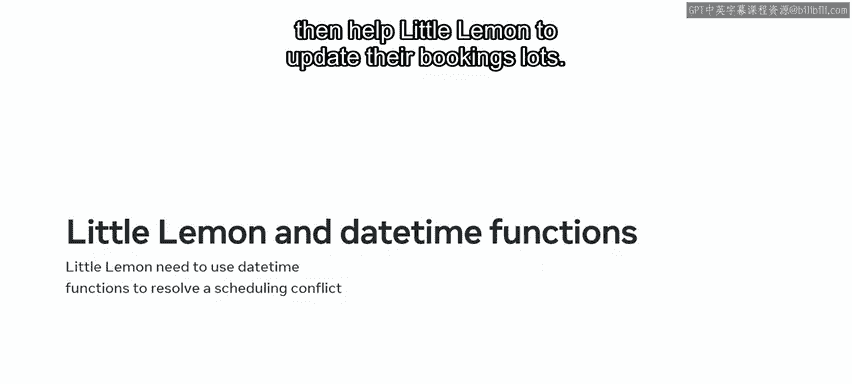

*   `datetime.now()`：用于获取当前的日期和时间。
*   `datetime.date()`：用于获取当前的日期。
*   `datetime.time()`：用于获取当前的时间。
*   `timedelta()`：用于计算两个时间或日期值之间的差值。

---

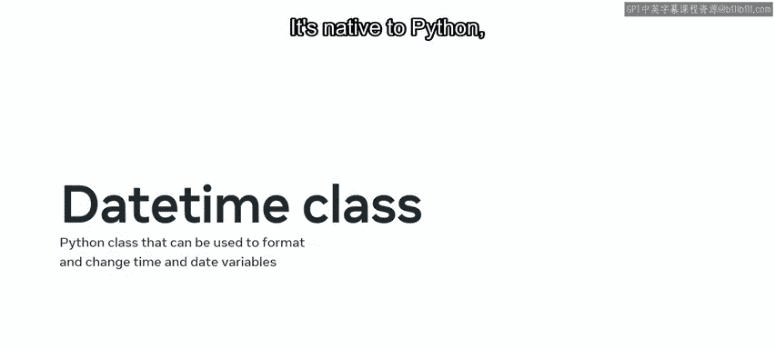

## 📝 导入与基本语法

要开始使用`datetime`库，首先需要将其导入到Python环境中。为了提高代码效率，我们通常会给它设置一个简短的别名。

```python
import datetime as dt
```

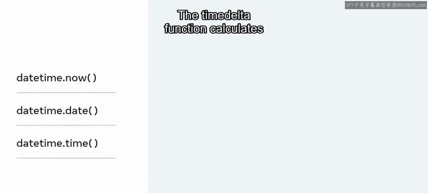

通过以上代码，我们创建了一个别名`dt`。之后，我们就可以使用`dt`来调用库中的函数，而无需每次都输入完整的`datetime`。

现在，我们已经成功创建了一个`datetime`对象，接下来看看如何使用它的功能。

---


## ⏰ 使用datetime.now()获取当前时间

让我们从`datetime.now()`函数开始，学习如何获取当前的日期和时间。

首先，创建一个名为`current_time`的变量。然后，使用我们定义的别名`dt`作为模块名，调用`datetime.now()`函数。最后，指示Python打印出当前的日期和时间值。

```python
current_time = dt.datetime.now()
print(current_time)
```

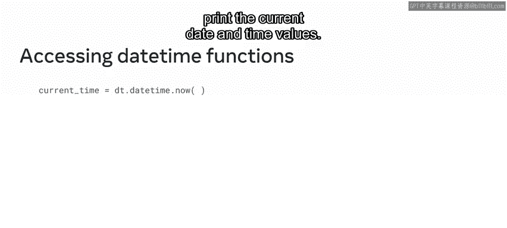

执行这段代码，Python将返回你所在位置的日期和时间。日期以`年-月-日`的格式显示，时间则以`时:分:秒`的格式显示。

但有时你可能只需要知道当前日期或当前时间。你可以再次使用相同的代码，但这次给Python两个独立的打印指令。

```python
print(dt.datetime.now().date())
print(dt.datetime.now().time())
```

当代码执行时，Python会分别显示日期值和时间值。

---

## 🔮 使用timedelta进行时间计算

在制定计划时，预测未来的日期非常有用。例如，下周的今天是几号？`timedelta`函数可以计算两个值之间的差值，并以Python友好的格式返回结果，从而回答这类问题。

为了找到七天后的日期，你可以创建一个名为`week`的新变量。键入`dt`模块，并将`timedelta`函数作为一个对象实例进行访问。然后，将`7天`作为参数传递给它。最后，指示Python打印该变量的结果。

```python
week = dt.timedelta(days=7)
future_date = dt.datetime.now() + week
print(future_date)
```

执行后，Python将返回一周后的日期值。

---

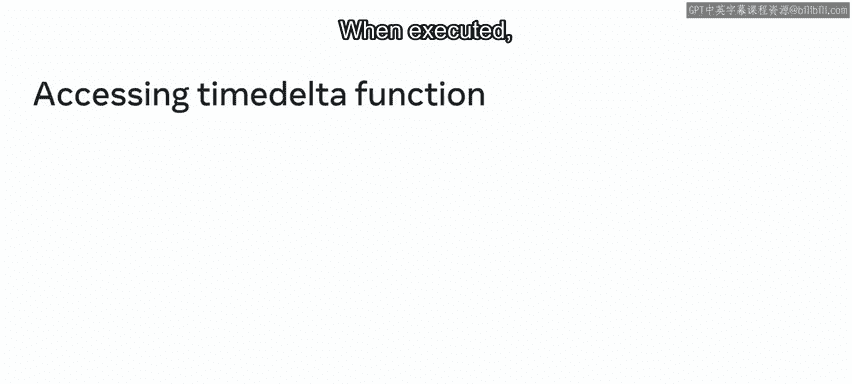

## 🍋 实战：帮助Little Lemon餐厅调整预订时间

现在你已经了解了`datetime`的工作原理，让我们看看能否帮助Little Lemon餐厅解决实际问题。

正如之前所学，Little Lemon餐厅遇到了日程冲突。为了解决这个问题，他们需要将每个预订时段向后推迟一小时。你可以通过指示Python从`bookings`表中检索数据，然后为每个预订时间增加一小时来完成此任务。

我们假设Little Lemon已经传递了他们的登录凭据，创建了一个新的游标实例，并将游标指向了他们的数据库。你的第一个任务是导入`datetime`库，以便处理日期和时间。

```python
import datetime as dt
```

接下来，编写一条SQL `SELECT`语句，从`bookings`表中返回所有数据。

```python
sql_select = “SELECT * FROM bookings”
```

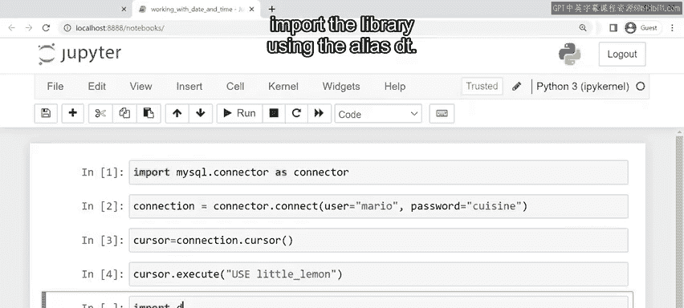

将该语句作为字符串参数传递给游标的`execute`模块。

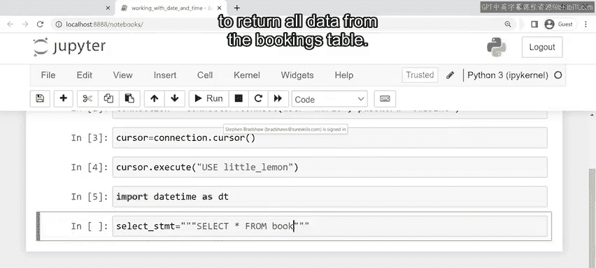

```python
cursor.execute(sql_select)
```

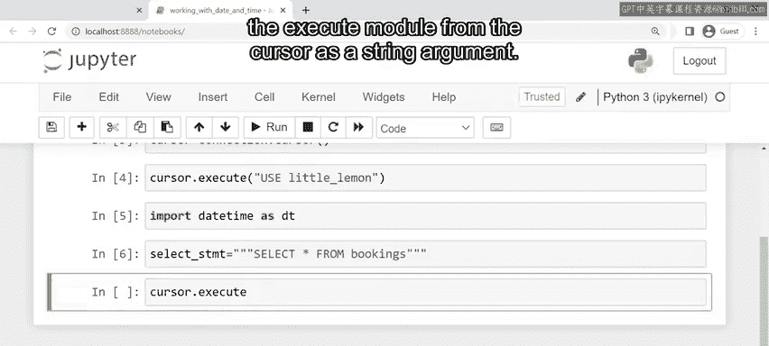

在进入循环之前，指示Python打印`bookings`表的列名，以便查看每一行的项目。

```python
print(cursor.column_names)
```

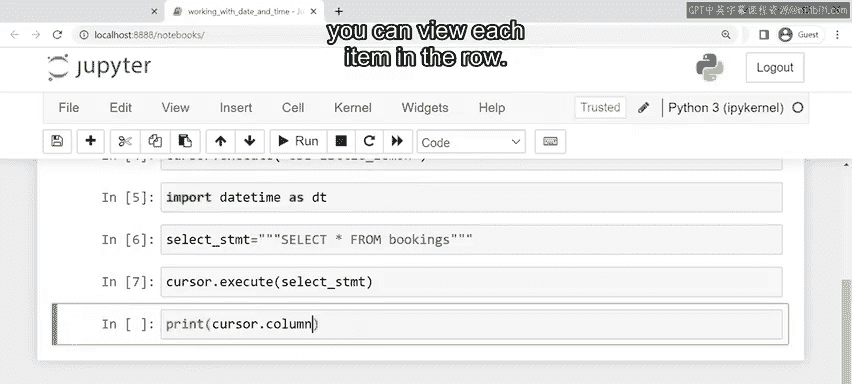

你可以将这些值分配给变量，并创建一个名为`new_booking_slot`的新变量，用于保存更新后的时间段值。

要为每个时间段增加一小时，需要将`1小时`作为参数传递给`timedelta`函数，然后将该函数加到`booking_slot`变量上。

最后，指示Python以文本字符串的形式打印新的预订时间段值。这个文本字符串详细说明了每个预订ID的值，以及其各自旧的与新的预订时间段。

以下是循环遍历查询结果并提取`booking_id`和`booking_slot`列中行的代码：

```python
results = cursor.fetchall()
for row in results:
    booking_id = row[0]
    booking_slot = row[3]
    new_booking_slot = booking_slot + dt.timedelta(hours=1)
    print(f“Booking ID: {booking_id}, Old Slot: {booking_slot}, New Slot: {new_booking_slot}”)
```

结果显示，`booking_id`是第一个值（索引0），`booking_slot`是第四个值（索引3）。

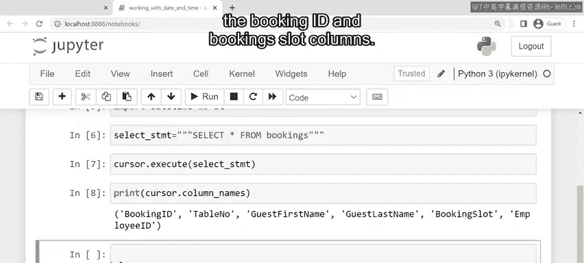

---

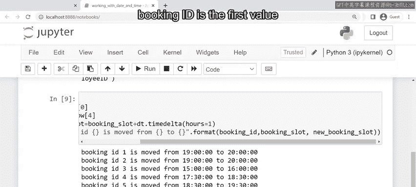

## 📚 课程总结

本节课中我们一起学习了Python中不同的`datetime`函数及其使用方法。你学会了如何获取当前日期和时间、分别提取日期或时间、以及使用`timedelta`进行日期计算。最后，我们应用这些知识，通过为每个预订增加一小时，帮助Little Lemon餐厅解决了日程冲突问题。

处理日期时间函数可能具有一定挑战性，但你已经朝着掌握这个主题迈出了坚实的一步。