# Python 85：存储过程快速回顾 📚

在本节课中，我们将要学习MySQL存储过程的核心概念、语法及其优势。存储过程是数据库工程师用于存储和复用代码的强大工具，能有效提升工作效率和代码质量。

## 概述

存储过程为数据库工程师提供了一种在需要时存储和调用代码的有效方法。接下来，我们将快速回顾MySQL存储过程的工作原理及其应用。

## 存储过程的实际应用场景

上一节我们介绍了存储过程的基本概念，本节中我们来看看它在实际场景中的应用。

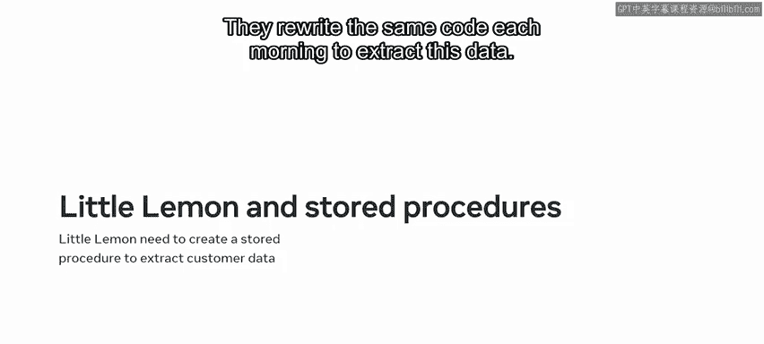

小柠檬餐厅每天早晨都需要检查数据库中的在线预订，以获取当天到店顾客的名单。他们每天早晨都重写相同的代码来提取这些数据。


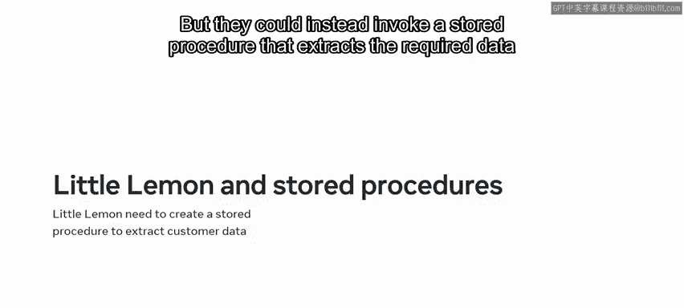

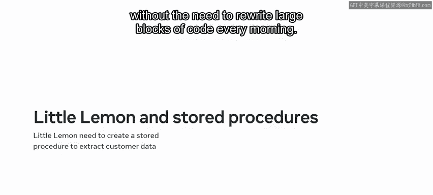

然而，他们可以改为调用一个存储过程来提取所需数据，从而无需每天早晨重写大段代码。


在了解具体做法之前，我们先回顾一下存储过程的基础知识。

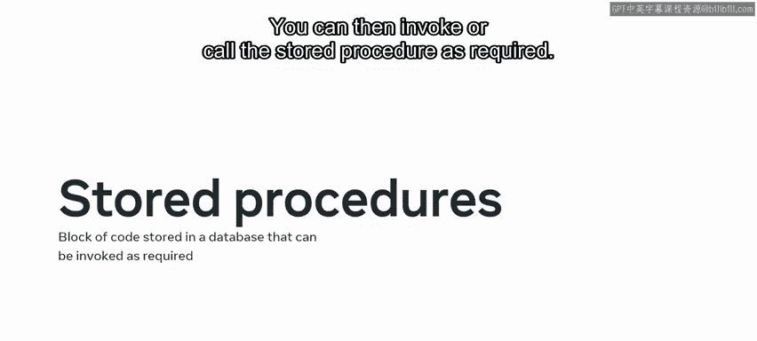

## 存储过程基础

一个存储过程是一段代码块，或一个或多个预编译的查询，可以存储在数据库中。你可以在需要时调用或执行这个存储过程。


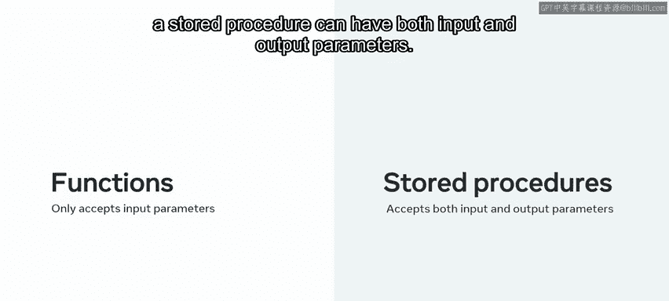

你可能已经知道，这类似于函数的工作方式。但请不要忘记这两个概念之间的关键区别：函数只能有输入参数，而存储过程既可以有输入参数，也可以有输出参数。


使用存储过程主要包含三个步骤，你应该已经熟悉它们了。


以下是使用存储过程的三个主要步骤：
1.  创建存储过程。
2.  调用存储过程。
3.  删除存储过程。

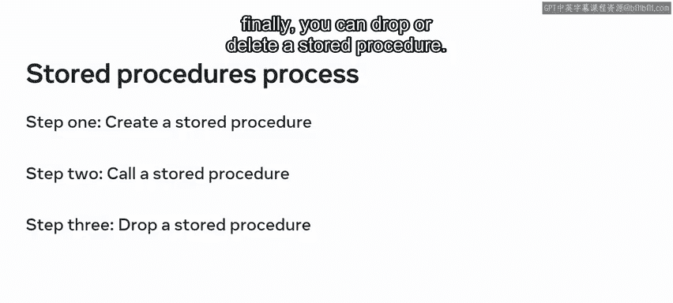


## 存储过程的优势

接下来，让我们快速回顾一下存储过程的好处。

以下是存储过程的三个主要优势：
*   **代码一致性更高**：每次调用时都使用相同的代码块，你可以确切知道它的输出结果。
*   **代码可重用**：你可以在所有数据库任务中根据需要多次使用它。
*   **代码更易于使用和维护**：它作为一个代码块存储，可以根据需要被调用、编辑或删除。

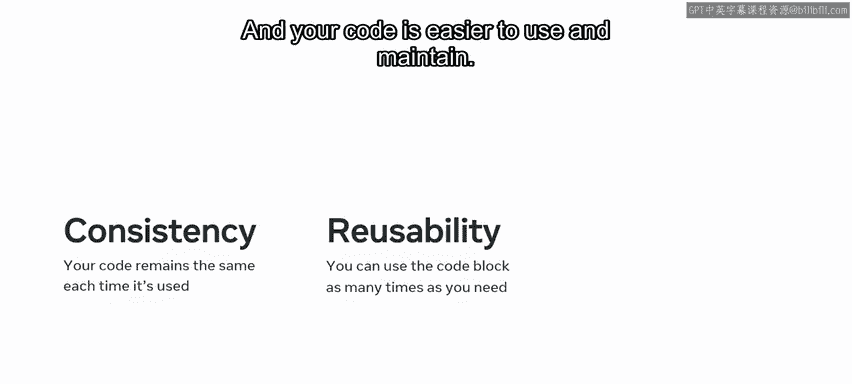


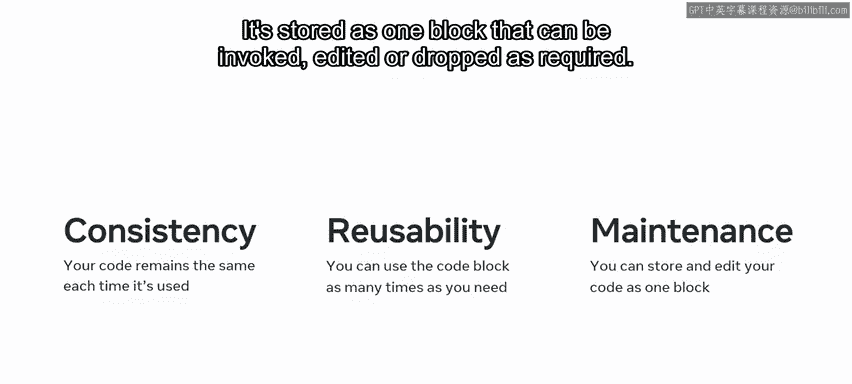


## 存储过程的语法

现在，让我们快速回顾创建存储过程的语法。

要创建存储过程，请以 `CREATE PROCEDURE` 命令开始。然后写上过程名和一对括号来存放参数。确保将所有必需的参数包含在括号内。

```sql
CREATE PROCEDURE procedure_name (parameter1 datatype, ...)
BEGIN
    -- 过程逻辑
END;
```

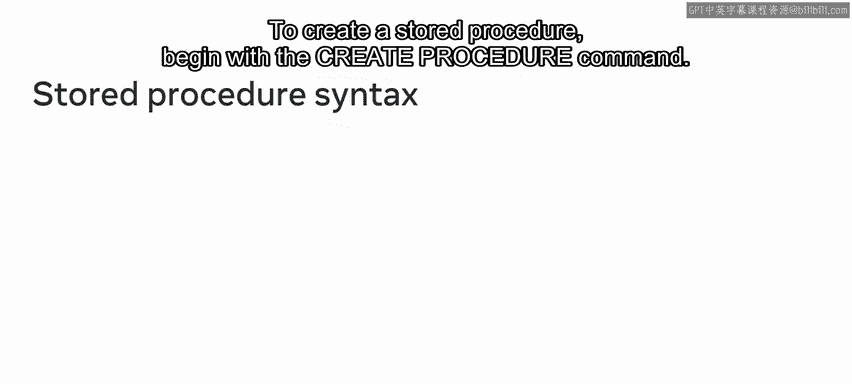

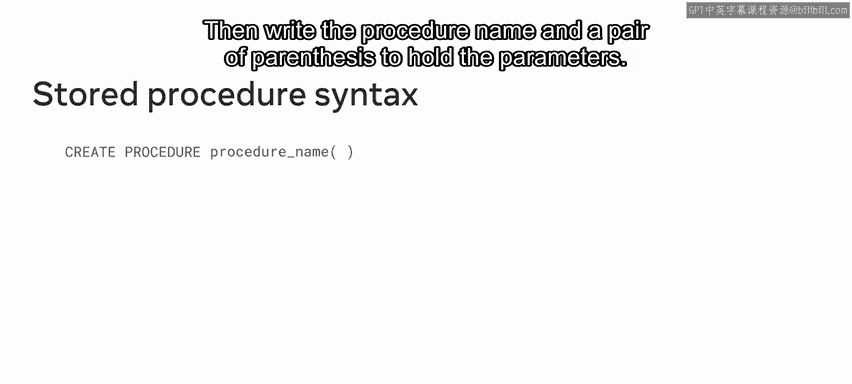


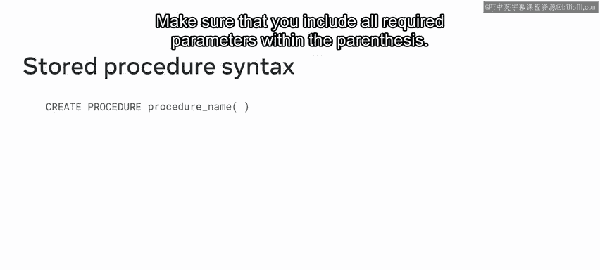


最后，编写过程逻辑的其余部分。

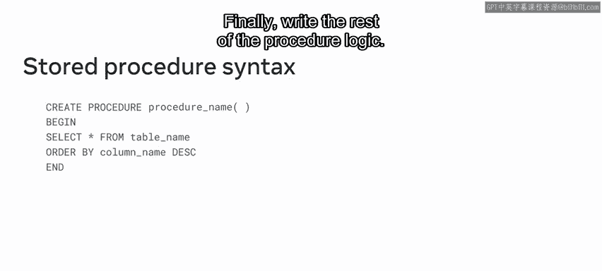


当你需要调用该过程时，只需键入 `CALL` 命令后跟过程名。不要忘记包含括号。

```sql
CALL procedure_name();
```

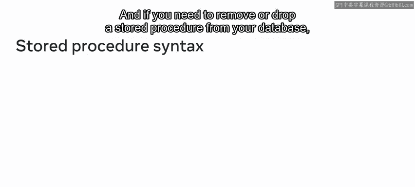

如果你需要从数据库中移除或删除存储过程，则只需键入 `DROP PROCEDURE` 命令后跟过程名。

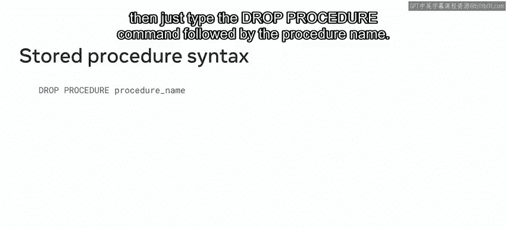

```sql
DROP PROCEDURE procedure_name;
```


在这种情况下，你不需要包含任何括号。

## 应用实例

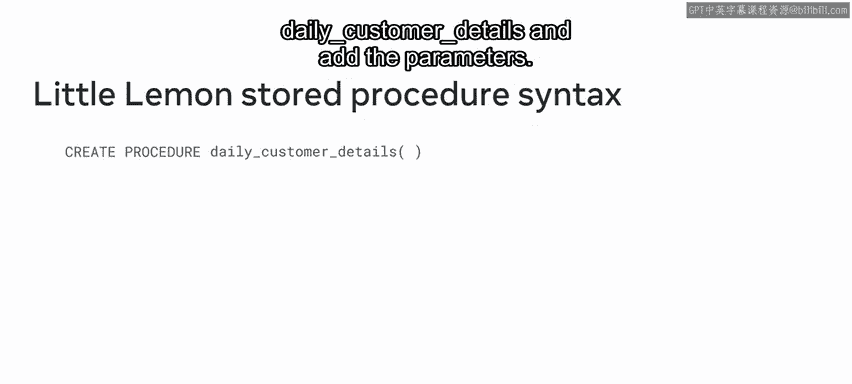

小柠檬餐厅可以使用以下代码创建一个存储过程，用于提取预定到访餐厅的顾客详情。

他们以 `CREATE PROCEDURE` 命令开始。然后将过程命名为 `daily_customer_details`，并添加参数。

```sql
CREATE PROCEDURE daily_customer_details()
BEGIN
    -- 提取当日顾客详情的SQL逻辑
    SELECT * FROM bookings WHERE visit_date = CURDATE();
END;
```

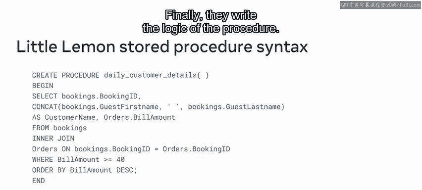


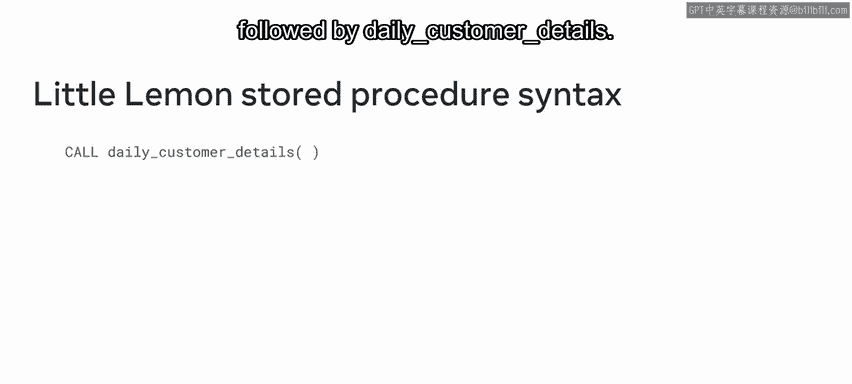

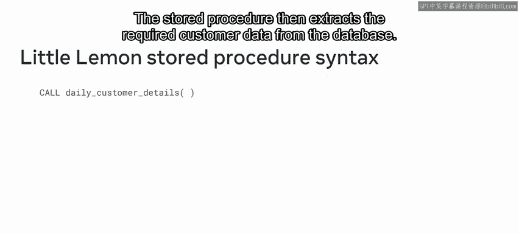

最后，他们编写过程的逻辑。现在，每天早晨，他们只需键入 `CALL` 命令后跟 `daily_customer_details`。存储过程便会从数据库中提取所需的顾客数据。

```sql
CALL daily_customer_details();
```


## 存储过程与Python

既然你已经回顾了存储过程的概念，你可能会问自己：存储过程与Python有何关系？

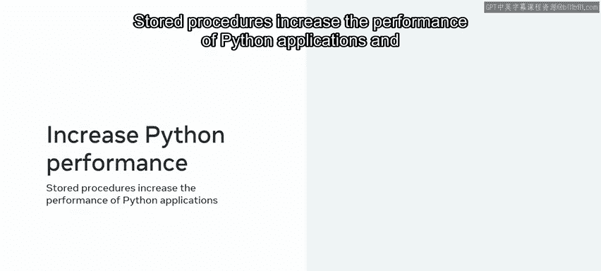

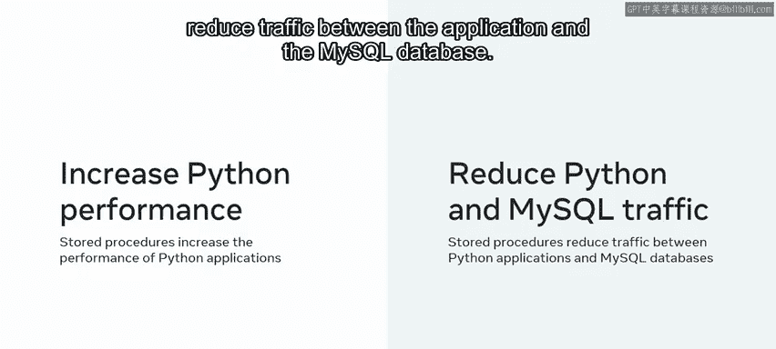

存储过程能提升Python应用程序的性能，并减少应用程序与MySQL数据库之间的网络流量。应用程序只需向数据库发送存储过程的名称和参数，而不是一大段SQL语句。

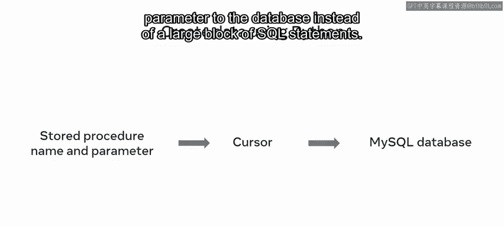


## 总结

本节课中我们一起学习了存储过程的优势，以及如何在数据库中创建、调用和删除它们。你现在已经准备好学习如何使用Python来执行这些操作了。