# 89：模块小结 高级数据库客户端 📚

在本节课中，我们将对“高级数据库客户端”模块进行总结。我们将回顾如何利用Python操作MySQL函数和存储过程，以及如何创建和管理数据库连接池。

---

## 模块回顾

恭喜你完成了本课程的第三个模块。现在，你应该已经熟悉了如何使用Python在MySQL数据库中利用函数和存储过程，以及如何创建和管理数据库连接池。

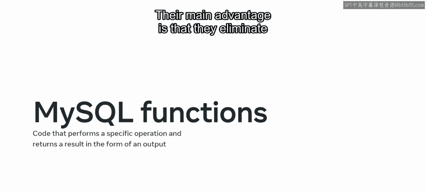

让我们花点时间回顾一下你在本模块课程中获得的关键技能。

---

## 第一课：使用Python调用MySQL函数

在模块的第一课中，你学习了如何使用Python调用MySQL函数。

你首先快速回顾了MySQL函数，并重温了函数提供的优势。其主要优势在于**消除了执行重复任务的需要**。

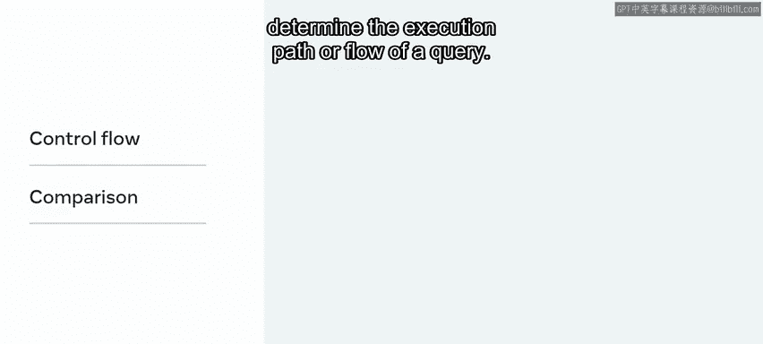

以下是MySQL函数的主要类别：


*   **字符串函数**：用于操作字符串值。
*   **数值函数**：用于对数值数据集执行任务。
*   **日期和时间函数**：用于从数据库中提取日期和时间值。
*   **比较函数**：用于比较数据库中的值。
*   **控制流函数**：用于评估条件并确定查询的执行路径或流程。


接着，你通过探索Little Lemon数据库的示例，学习了如何使用Python访问MySQL函数。你还在实验和测验活动中展示了新掌握的技能和知识。

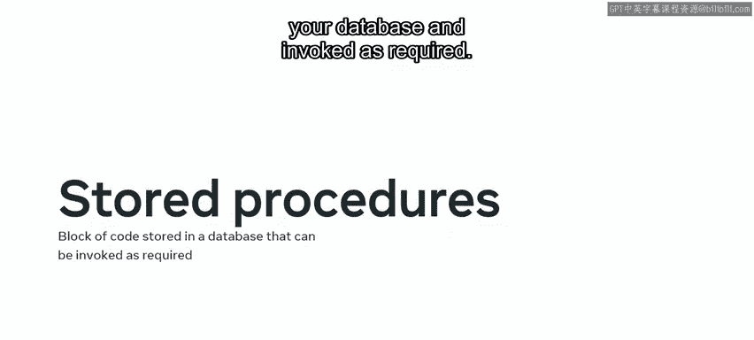

---

## 第二课：使用Python调用存储过程


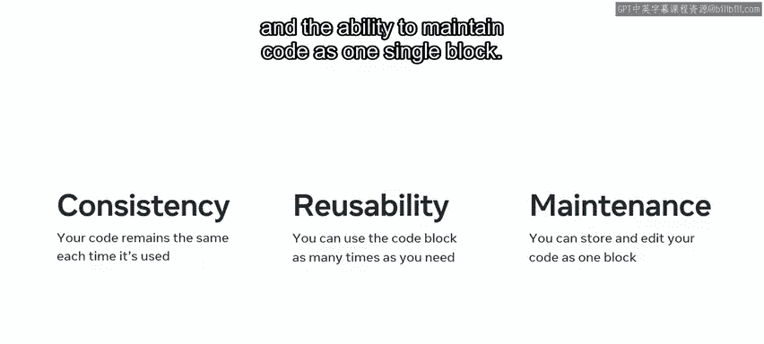

在模块的第二课中，你重温了存储过程的基础知识。你再次了解到，**存储过程是一段可以存储在数据库中并按需调用的代码块**。

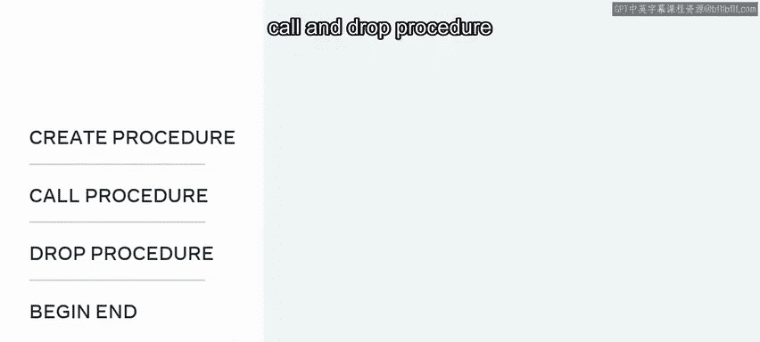

存储过程提供了几个优势，例如**代码一致性、可重用性，以及能够将代码作为一个单独的块进行维护**。

然后，你回顾了用于创建存储过程的语法，包括 `CREATE PROCEDURE`、`CALL` 和 `DROP PROCEDURE` 命令，以及 `BEGIN...END` 代码块。

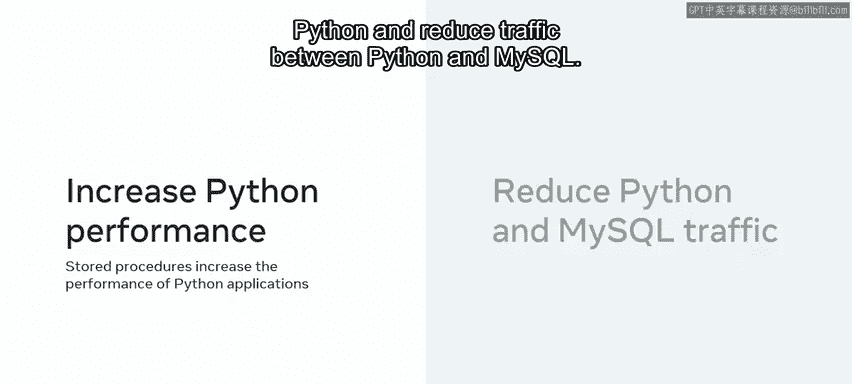

你还探讨了在Python中使用存储过程的优势，例如**提升Python性能**和**减少Python与MySQL之间的网络流量**。

在本课的下一部分，你学习了如何使用Python访问存储过程。你探索了Little Lemon数据库中的一些存储过程示例，例如内连接操作。你看到了如何在Python中利用这些存储过程来查询MySQL数据库。

你还学习了如何在Python中使用 `callproc()` 方法来调用存储过程。

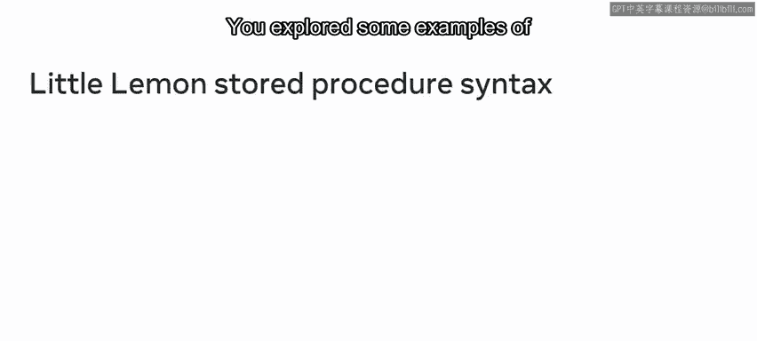

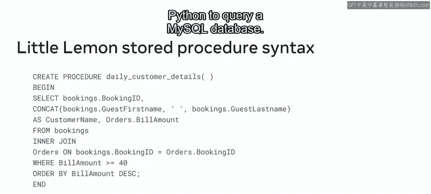

```python
# 示例：调用存储过程
cursor.callproc('procedure_name', [arg1, arg2])
```

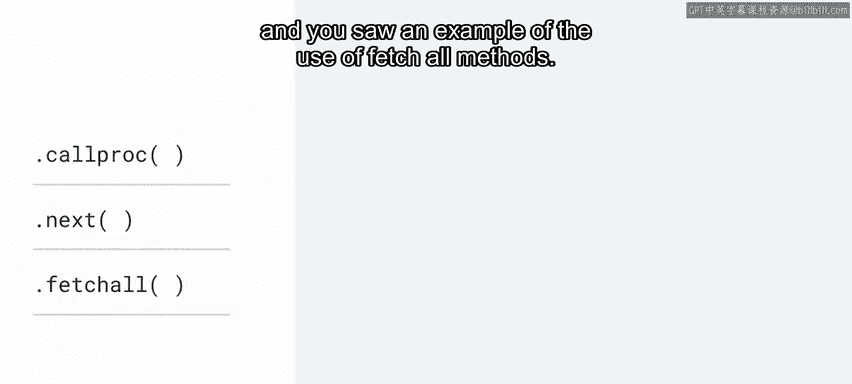

使用Python的 `next()` 函数检索结果，并且看到了使用 `fetchall()` 方法的示例。

当存储过程在Python中成功运行后，数据会以**元组列表**的形式返回。你可以索引数据集或运行for循环来打印所有记录。

之后，你在实验环境中展示了在Python中使用存储过程的能力，并通过测验测试了你对Python和存储过程的知识。

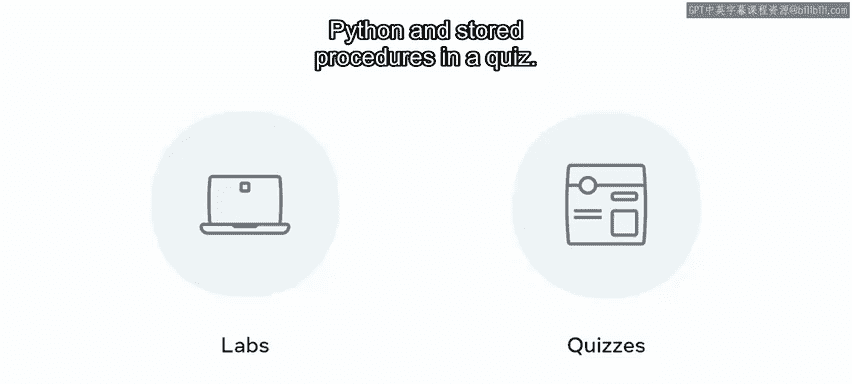

---

## 第三课：连接池

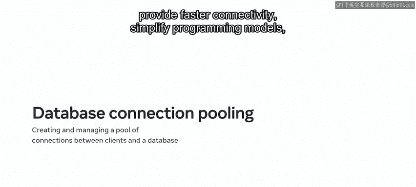

在模块的第三课也是最后一课中，你学习了连接池。在这次回顾中，你了解到连接池**资源充足、提供更快的连接速度、简化编程模型，并能提高Python应用程序的性能**。

接着，你学习了Python MySQL连接池。你了解到数据库连接池是使用 **`mysql.connector.pooling`** 模块来管理和维护的。这个模块需要导入到你的工作环境中，以便访问其功能。

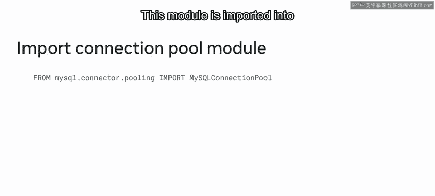

该模块还提供了许多有用的函数和属性，例如：


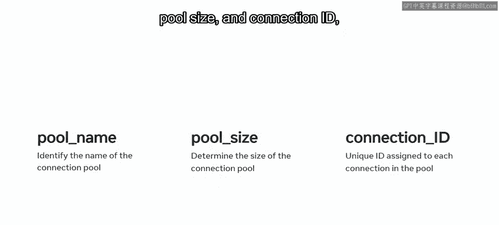

*   `pool_name`
*   `pool_size`
*   `connection_id`

此外，还有几个可用的类方法，如 `get_connection()`、`is_connected()` 和 `close()`。这些方法对于管理和维护模块非常有用。

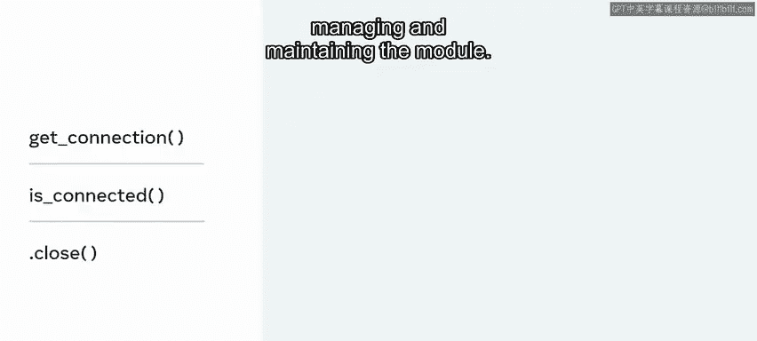

然后，你探索了如何使用MySQL Connector Python API创建MySQL连接池的示例。

你还探讨了数据库连接池的概念。你了解到，数据库连接池涉及**创建和管理一个连接池，以在客户端和MySQL数据库之间建立更快、更高效和优化的连接**。

连接在客户端之间进行管理，用户可以通过使用活动连接随时加入或退出会话。

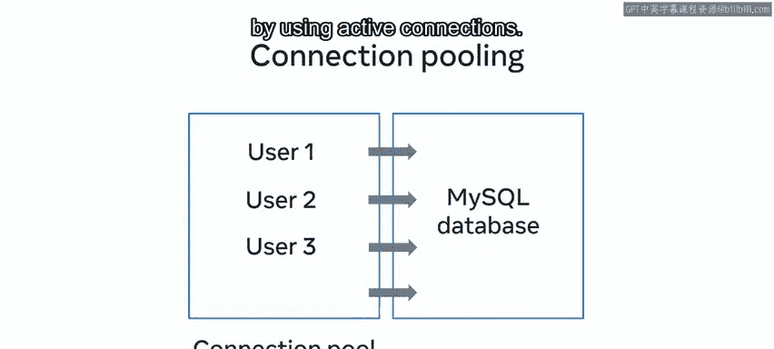

你可以创建具有特定连接数的多个池，从而确保每个用户始终有一个可用的连接。

之后，你完成了一个使用连接池的实验，并通过测验测试了你对连接池的知识。

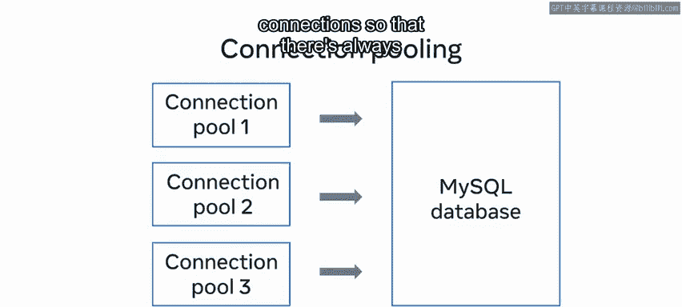

---

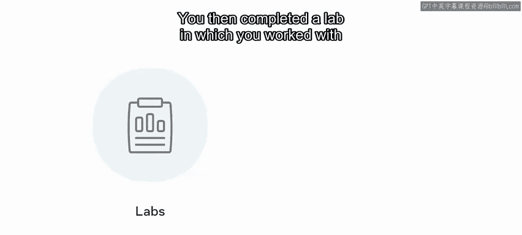

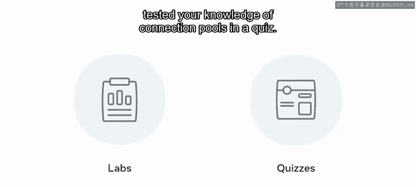

## 总结

本节课中，我们一起回顾了“高级数据库客户端”模块的核心内容。你现在应该具备了使用Python处理MySQL函数和存储过程所需的技能和知识，并且也应该能够创建和管理数据库连接池。

做得很好。我期待在下一个模块中继续指导你，在那里你将使用数据库客户端进行更深入的工作。