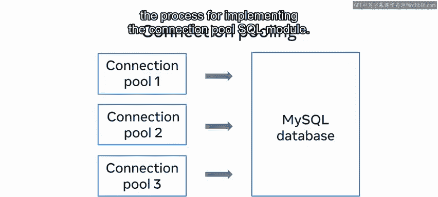

# Python 90：数据库客户端课程回顾 🎯

在本节课中，我们将回顾整个数据库客户端课程的核心内容。我们将系统梳理从建立连接到执行高级操作的关键知识点，帮助你巩固所学。

## 概述

课程主要分为三个模块。第一个模块介绍了如何使用Python连接和操作MySQL数据库。第二个模块深入讲解了增删改查等基本操作。第三个模块则探讨了高级主题，如函数、存储过程和连接池。

## 模块一：建立连接与基础操作

上一节我们概述了课程结构，本节中我们来看看第一个模块的具体内容。你首先学习了MySQL Connector Python API以及如何使用Pip包。

你随后学习了如何安装一个前端的Python客户端，并将其连接到后端的MySQL数据库。

接着，你探索了如何建立Python与MySQL之间的通信以执行CRUD操作。

一旦建立了连接，你便可以访问一个游标对象。

获得游标对象后，你使用Python创建了一个MySQL数据库和表。

然后，你学习了如何使用Python提交对MySQL数据库的更改。

在模块一的第三课也是最后一课中，你深入探讨了MySQL数据库中游标的概念。

你学习了游标在Python和MySQL中如何工作。你还回顾了游标的关键特性，了解到它们是只读的、不可滚动的且敏感的。

随后，你了解到游标类用于翻译Python和MySQL数据库之间的通信。

并且你也学习了如何识别不同的游标类。

此外，你还回顾了交错请求的基础知识。

## 模块二：执行CRUD操作与高级查询

在掌握了连接和基础操作后，第二个模块的重点是使用Python在MySQL数据库中执行创建、读取、更新和删除操作。

你从学习如何在数据库中创建和读取记录开始本模块。

你回顾了这个过程的步骤，并发现了Python如何与数据库通信以执行这些操作。

接着，你学习了如何使用Python执行MySQL的更新和删除操作。

并且你学习了如何将这些更改提交到数据库。

你通过完成一系列实验练习结束了第一课，在这些练习中你展示了使用Python在MySQL数据库中执行CRUD操作的能力。

在模块二的第二课中，你学习了如何使用Python在MySQL数据库中执行高级查询。

这些查询中的第一个涉及使用Python在MySQL数据库中对数据进行过滤和排序。

你重新应用了早期课程中学到的MySQL过滤和排序技术基础，并学习了如何将这些相同的技术应用于Python。

接下来，你学习了如何执行一系列不同的连接操作，以使用Python连接MySQL数据库中不同表的数据。随后，你通过一系列实验有机会测试自己使用Python在MySQL数据库中执行高级查询的能力。

## 模块三：高级数据库客户端技术

在熟悉了基本和高级查询后，模块三专注于高级数据库客户端技术。本模块的第一课首先概述了如何将MySQL函数与Python结合使用。

你首先学习了如何认识MySQL函数的重要性。

并且你回顾了MySQL中可用的不同类型的函数。

你还学习了MySQL如何通过Python使用函数。

在回顾完MySQL函数的基础知识后，

你接着学习了如何使用Python实现或访问MySQL函数。

你还探索了Python中的日期时间函数，并学习了如何利用这些函数通过Python更新MySQL数据库。

随后，你在实验练习中展示了使用这些函数的能力。

在第三模块的第二课中，你探索了如何将MySQL存储过程与Python结合使用。

你重新应用了存储过程的基础知识，并学习了它们与函数的区别以及为何与Python一起使用。

接着，你学习了如何通过使用`callproc`方法在Python中访问存储过程。

并且你还回顾了分隔符的使用。本模块的第三课也是最后一课专注于连接池。

你首先深入理解了数据库连接池的概念。

你学习了如何解释数据库连接池。

并且你学习了如何识别数据库连接池的优势。

接着，你回顾了为数据库创建连接池的步骤，

包括实现连接池SQL模块的过程。

## 总结

本节课中，我们一起系统回顾了数据库客户端课程的全部核心内容。我们从建立Python与MySQL的基础连接开始，逐步深入到执行CRUD操作、高级查询，最后探讨了函数、存储过程和连接池等高级主题。每个环节都强调了理论与实践的结合。

你已经完成了本课程的回顾。现在是时候在分级评估中尝试运用你所学的知识了。

祝你好运。😊