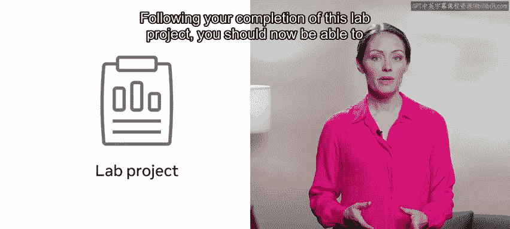
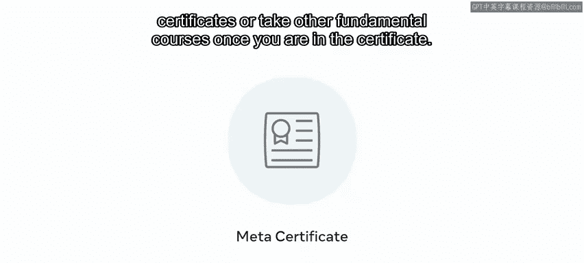

# 91：课程总结

在本节课中，我们将对数据库工程师课程的核心内容进行回顾与总结，并展望未来的学习路径。

你已经完成了这门课程。你付出了努力，并在此过程中掌握了许多新技能。你在MySQL的学习之旅中取得了巨大进步，现在应该已经理解了数据库客户端的概念。

你能够在实验项目中展示部分学习成果，以及你掌握的实用MySQL技能集。



完成该实验项目后，你现在应该能够使用Python与MySQL数据库进行交互、使用Python在MySQL中执行查询，并能运用MySQL的函数、存储过程和连接池。

```python
# 示例：使用Python连接MySQL并执行查询
import mysql.connector
from mysql.connector import pooling

# 创建连接池
connection_pool = pooling.MySQLConnectionPool(
    pool_name="mypool",
    pool_size=5,
    host='localhost',
    database='your_database',
    user='your_username',
    password='your_password'
)

# 从连接池获取连接并执行查询
connection = connection_pool.get_connection()
cursor = connection.cursor()
cursor.execute("SELECT * FROM your_table")
results = cursor.fetchall()
```

随后的分级评估进一步检验了你对这些技能的掌握程度。然而，你仍有更多知识需要学习。如果你觉得本课程有帮助并希望了解更多，那么不妨注册下一门课程。在每一门数据库工程师课程中，你都将持续发展你的技能集。

在最终的实验项目中，你将运用所学的一切知识，创建一个属于自己的功能完整的数据库系统。

无论你是刚起步的技术专业人士、学生还是商业用户，课程结束时的项目都能证明你对数据库系统价值和能力的理解。该实验通过实际应用巩固了你的技能，但它还有另一个重要益处：这意味着你将拥有一个可以放入作品集的功能完备的数据库。

这有助于向潜在雇主展示你的技能。它不仅向雇主表明你具备自我驱动力和创新精神，也充分体现了你作为个人以及你新获得的知识的价值。一旦你完成了这个专业系列的所有课程，你将获得数据库工程证书。

该证书也可作为进阶其他基于角色的证书的凭证。根据你的目标，你可以选择深入学习高级的基于规则的证书，或者在获得此证书后学习其他基础课程。



感谢你。很荣幸能与你一同踏上这段探索之旅。祝未来一切顺利。