# 92：高级数据建模简介 🚀

在本课程中，我们将要学习高级数据建模的核心概念与实用技能。我们将从数据模型的基础知识开始，逐步深入到数据库规范化、数据仓库架构、维度建模以及使用工具进行数据分析和可视化。本课程旨在为你构建坚实的理论基础，并通过实践练习帮助你掌握关键技能。

## 概述

欢迎来到数据库工程学的下一门课程。本课程的重点是高级数据建模。我们将花一些时间来回顾你将在这些模型中发展的一些新技能。

## 1：高级数据建模入门 📊

上一节我们介绍了课程概述，本节中我们来看看高级数据建模的具体内容。

你将首先学习高级数据库建模这一主题。你将了解到，数据模型提供了不同数据元素的可视化表示，并展示了它们彼此之间的关系。你还将发现数据建模在Meta公司是如何被应用的。

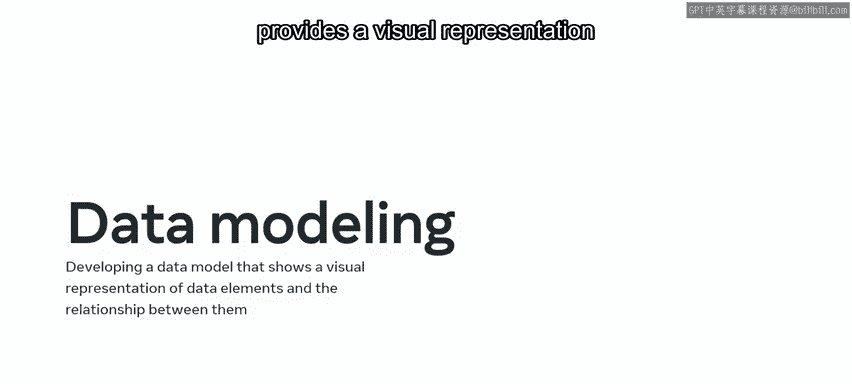

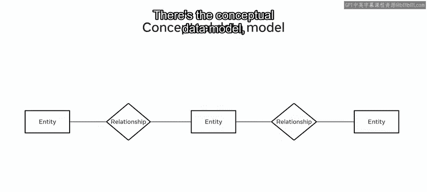

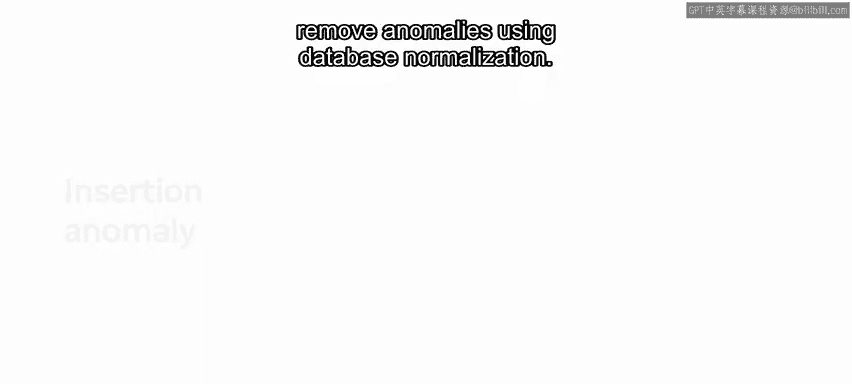

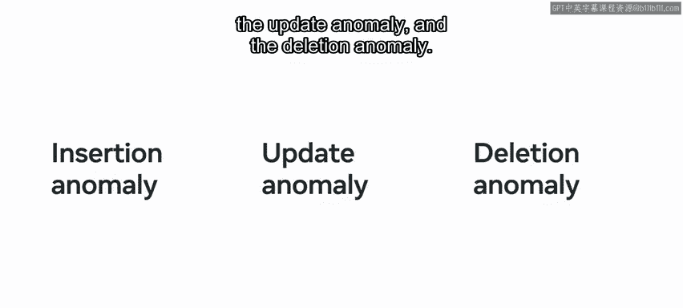

## 2：数据库模型的类型 🏗️

上一节我们介绍了数据模型的基本概念，本节中我们将更详细地探讨不同类型的数据库模型。

你将了解到数据库模型有三个层次。分别是**概念数据模型**、**逻辑数据模型**和**物理数据模型**。你还将回顾可用于设计数据库的不同种类的模型。

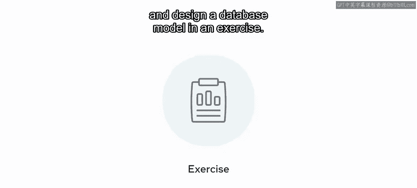

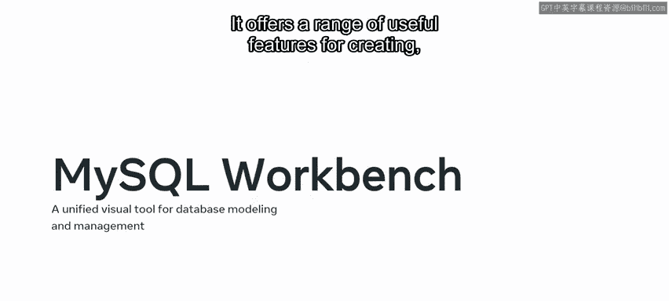

## 3：数据库规范化 🧹

上一节我们探讨了数据模型的类型，本节中我们来看看如何通过数据库规范化来构建你的表，以消除异常。

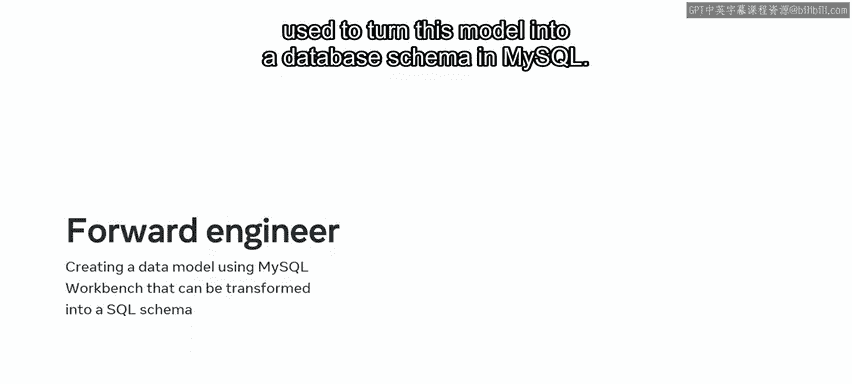

这些异常包括**插入异常**、**更新异常**和**删除异常**。你还将探索一个数据模型的示例，并在一个练习中设计一个数据库模型。

## 4：MySQL Workbench 工具介绍 🛠️

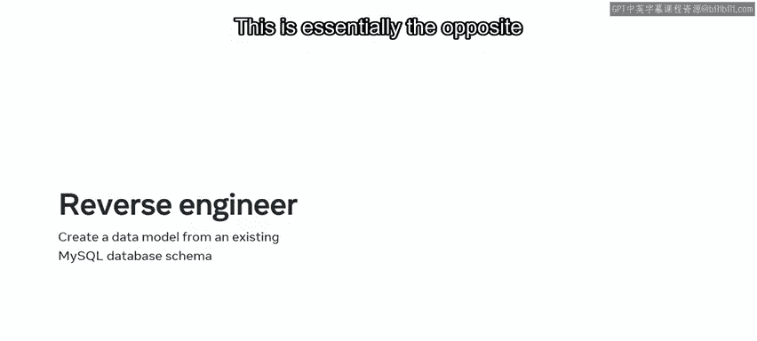

上一节我们学习了数据库规范化，本节中我们将介绍一个强大的可视化工具。

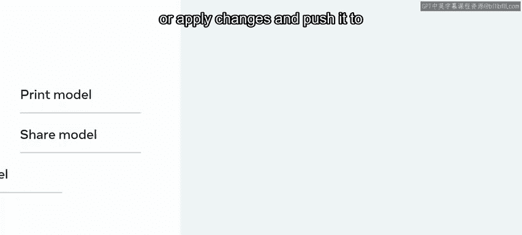

在本模块的下一课中，你将学习MySQL Workbench。你将了解到MySQL Workbench是一个用于数据库建模和管理的统一可视化工具。它提供了一系列有用的功能，用于创建、编辑和管理数据库。

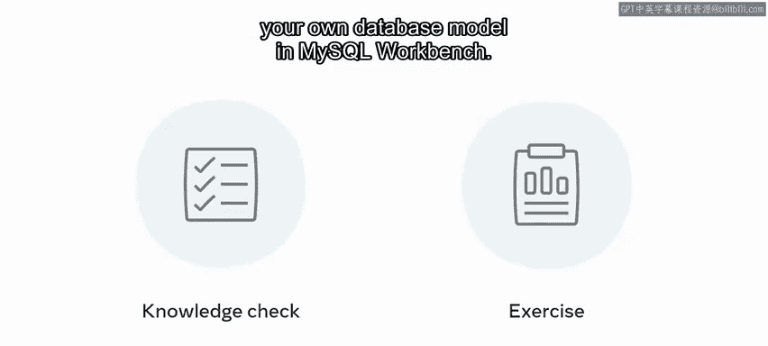

你将发现如何使用MySQL Workbench构建数据模型图，然后学习如何使用MySQL Workbench的**正向工程**功能将此模型转换为MySQL中的数据库模式。

你还将学习如何使用MySQL**逆向工程**一个模型。这意味着你可以从现有数据库创建数据模型或ER图。这本质上与正向工程功能相反。

你可以打印模型、共享它，或者应用更改，并使用正向工程方法将其推送到数据库。

你还将通过一个测验项目和一个练习来完成本课，在该练习中，你将在MySQL Workbench中设计自己的数据库模型。

## 5：数据仓库概述 🏭

上一节我们介绍了MySQL Workbench工具，本节中我们将进入一个新的模块，探讨数据仓库的主题。

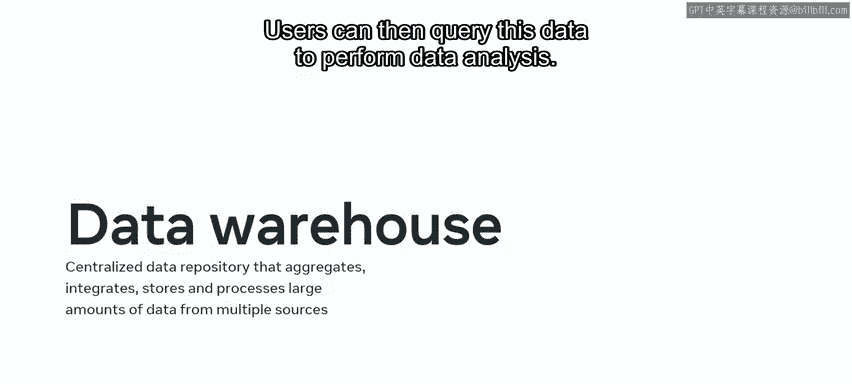

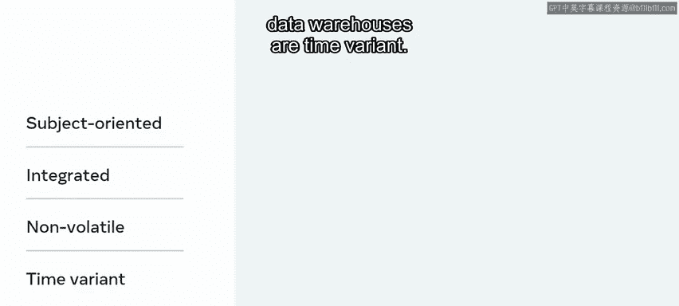

在这个模块中，你将学习数据仓库的架构并构建一个维度数据模型。你将从数据仓库概念的概述开始。你将了解到，数据仓库是一个集中式数据存储库，它从多个来源加载、集成、存储和处理大量数据。然后可以查询这些数据以执行数据分析。

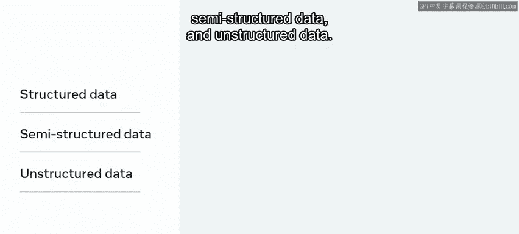

你将发现数据仓库由四个关键特征定义：它是**面向主题的**、**集成的**、**非易失的**，并且数据仓库是**随时间变化的**。你还将回顾数据仓库处理的不同形式的数据，包括**结构化数据**、**半结构化数据**和**非结构化数据**。

然后你将探索数据仓库的架构，并了解到它包括以下组件：**数据源**、**数据暂存区**（包括ETL过程）、**数据仓库本身**和**数据集市**。

一旦数据从数据源加载，它就会被集成并存储在数据仓库中。然后它被组织在数据集市中，用户可以在那里执行数据分析并展示他们的发现。这些组件控制着来自不同来源的数据流。它们还处理和集成这些数据，以便用户可以执行数据分析。

你还将探索一个真实世界数据项目的案例研究。

## 6：维度数据建模 ⭐

上一节我们介绍了数据仓库的基础，本节中我们来看看本模块的第二课：维度数据建模。

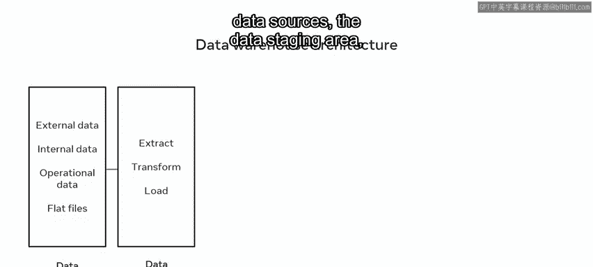

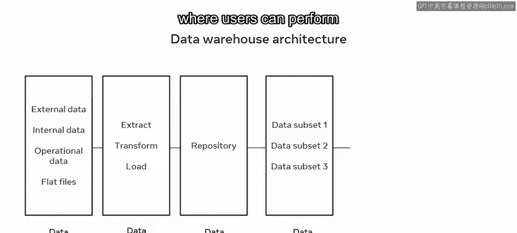

本课从维度数据建模的基础知识概述开始。你将了解到它基于**维度**和**事实**，并使用**星型模式**和**雪花模式**进行设计。然后你将探索一些维度数据建模的实践示例，并了解到在创建模型时需要遵循四个关键步骤。

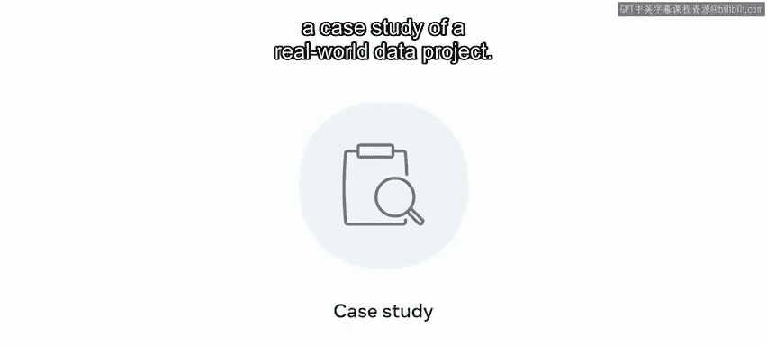

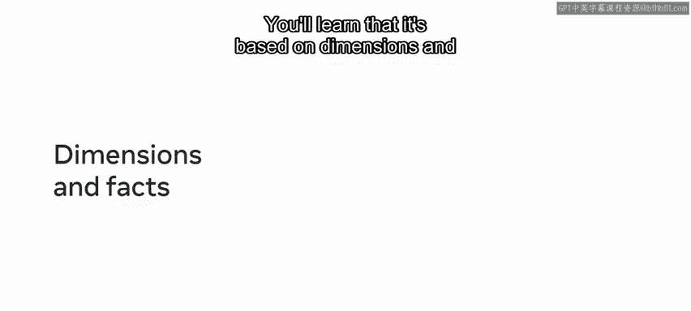

以下是创建维度模型的四个关键步骤：
1.  选择要探索的业务流程。
2.  选择粒度或详细程度。
3.  选择维度。
4.  选择事实。

一旦你做出了所有这些选择，你就可以创建模式。最后，你将进行一个练习，在该练习中你将创建自己的维度模型。

## 7：数据分析基础 📈

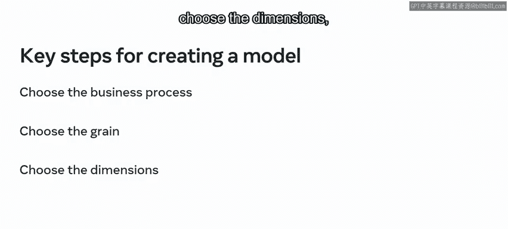

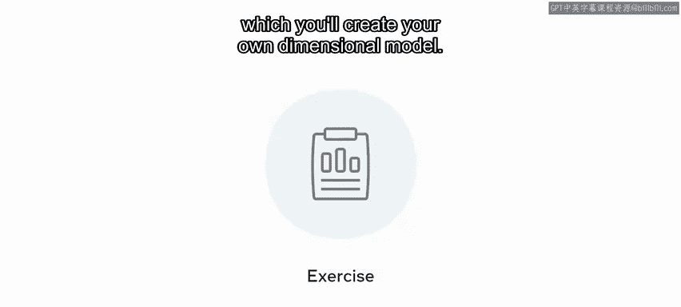

上一节我们学习了维度建模，本节中我们将进入本课程的第三个模块，在维度和度量的背景下探索数据分析，并学习如何使用高级分析工具执行可视化数据分析。

你将从数据分析的概述开始。你将回顾数据分析的基础知识，以及你在数据库工程旅程的其他阶段所使用过的关键类型的数据分析。

你还将了解到，你将处理两种通用类型的数据：**定量数据**（指数值数据）和**定性数据**（指非数值数据）。

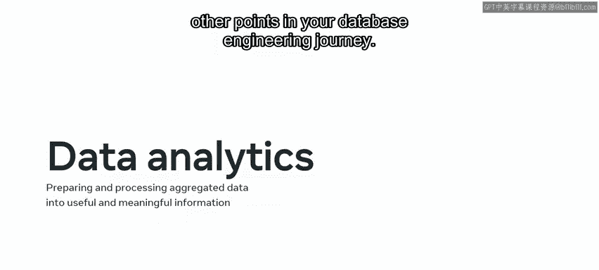

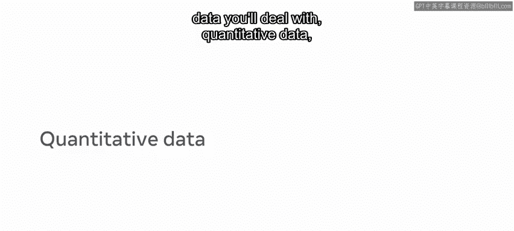

当你确定了需要哪种数据后，你可以使用四种测量尺度来处理和分析它：**名义尺度**、**顺序尺度**、**等距尺度**和**比率尺度**。

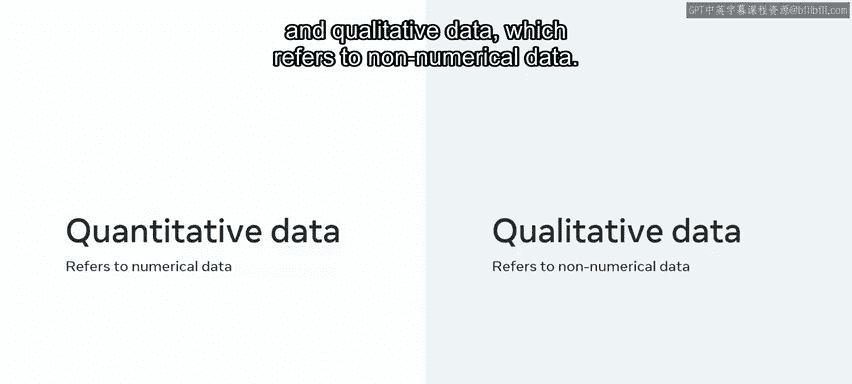

## 8：数据挖掘与机器学习 🤖

上一节我们介绍了数据分析的类型和测量尺度，本节中我们将学习数据挖掘和机器学习的主题。

你将了解到，**数据挖掘**是检测数据模式的过程，而**机器学习**是教会计算机如何学习的过程。机器学习利用数据挖掘模型来处理数据，如**分类分析**、**关联规则**、**聚类分析**和**回归分析**。

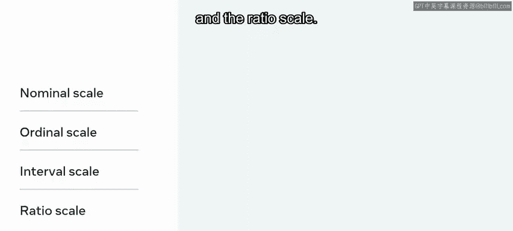

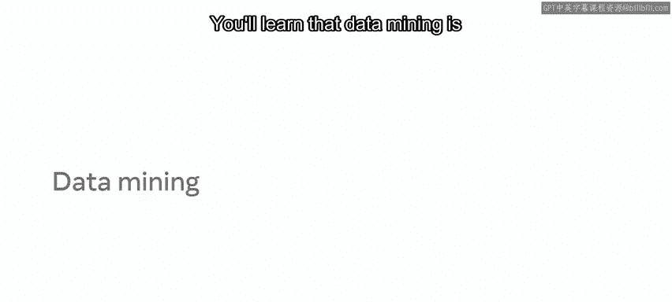

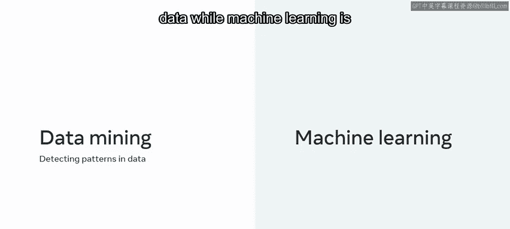

## 9：数据可视化 🎨

上一节我们探讨了数据挖掘与机器学习，本节中我们来看看数据可视化。

你将了解到，在可视化数据时，你必须考虑你的受众以及他们正在寻找的信息。然后你需要选择一个最能传达此信息的合适图表。

最后，你将通过讨论使用何种数据分析报告来结束本课。

## 10：Tableau 数据分析工具实践 📊

上一节我们讨论了数据可视化，本节中我们将进入本模块的最后一课，回顾数据分析的主题，并学习如何使用Tableau等数据分析工具。

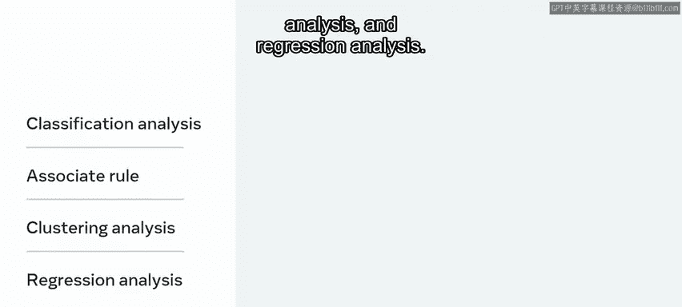

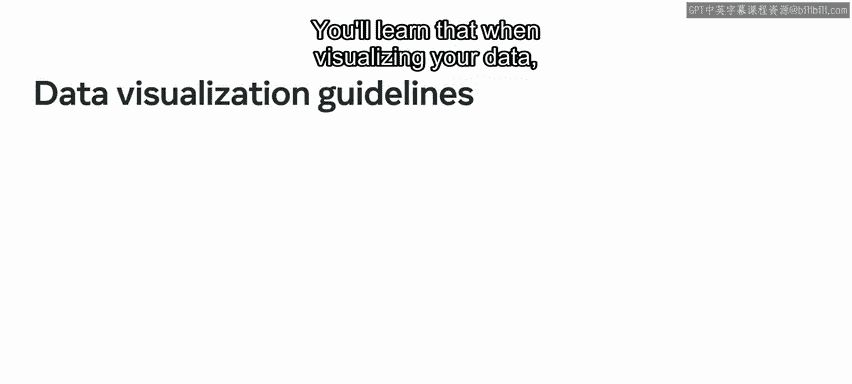

作为Tableau介绍的一部分，你将了解其主要功能是什么，以及它们如何帮助你执行数据分析。然后你将学习如何使用Tableau分析数据。

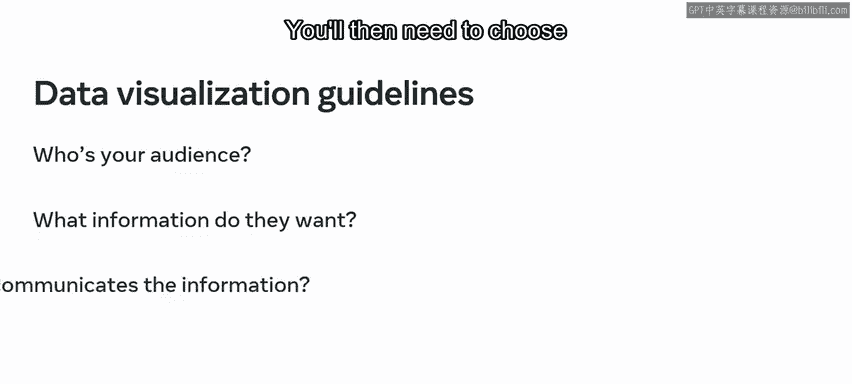

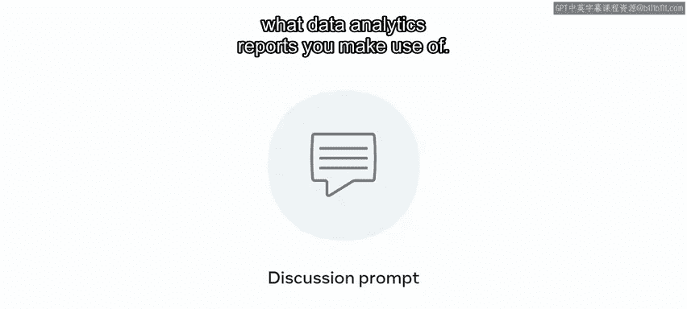

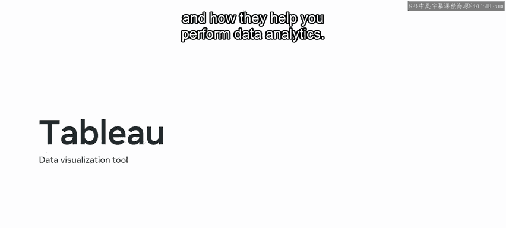

以下是使用Tableau进行数据分析的基本步骤：
1.  下载、启动和导航Tableau。
2.  加载和准备待分析的数据。
3.  过滤和可视化数据。
4.  创建交互式仪表板。

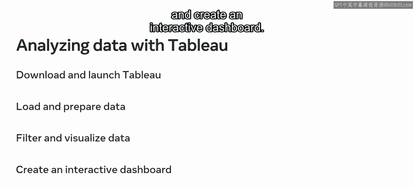

最后，你将完成一个练习，在该练习中你将在Tableau中执行数据分析。

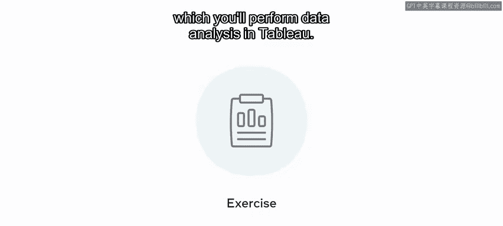

## 总结

本节课中我们一起学习了高级数据建模的完整路径。我们从数据模型和规范化开始，探索了数据仓库和维度建模，最后深入到了数据分析、可视化以及使用Tableau等工具进行实践。现在你已经完成了本课程介绍，是时候开始你的高级数据建模之旅了，祝你好运。