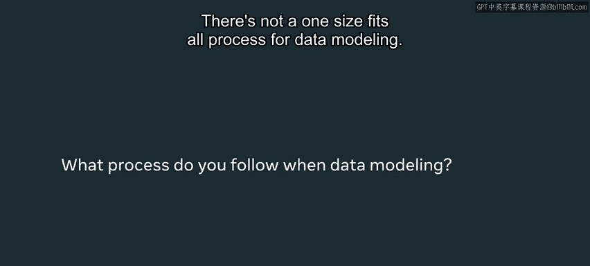
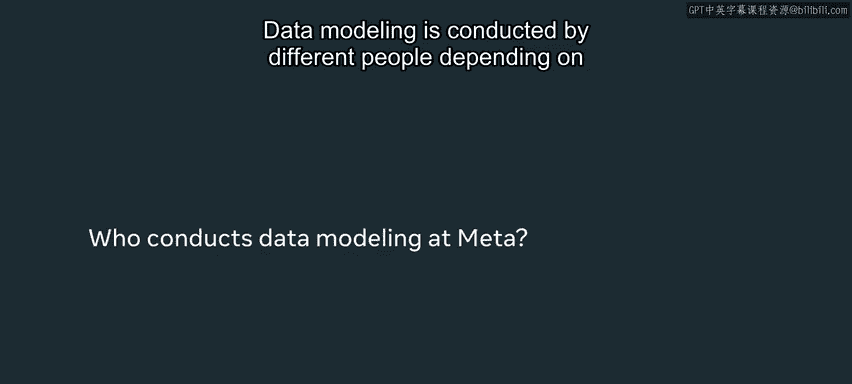
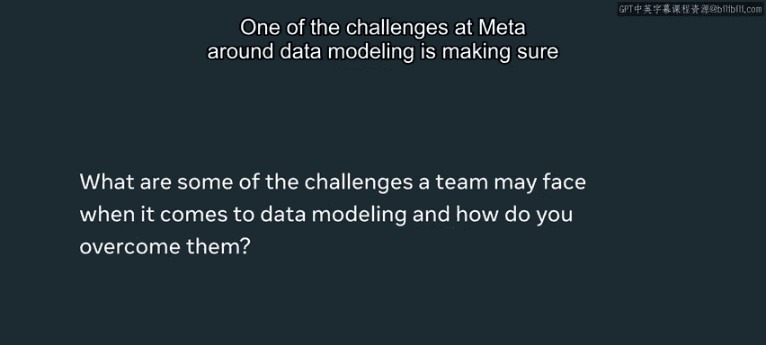
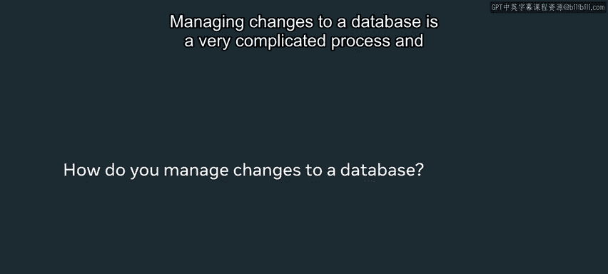
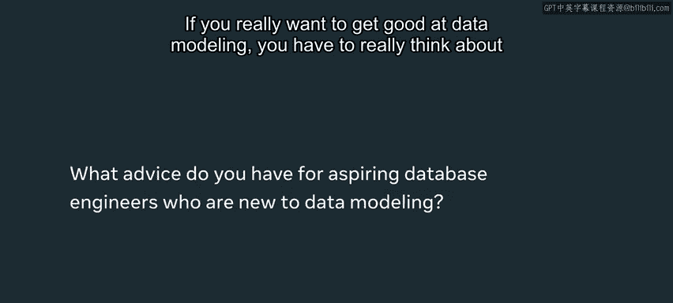

# Python 93：元数据如何使用数据建模 📊

在本节课中，我们将学习元数据在数据建模过程中的应用。我们将探讨数据建模的行业背景、在Meta等大型科技公司的实践流程、面临的挑战以及工程师在其中的角色和责任。

---

随着互联网、Web 3.0和元宇宙的发展，行业不断演进。你将从事需要连接数据库的系统开发工作。很少有职位不要求这项技能。因此，这是你为成功职业生涯所能学习的最重要的基础技能之一。

我的名字是Moxie，我使用AM代词，是Meta门洛帕克办公室的一名软件工程师。

数据建模没有放之四海而皆准的流程。为一个新产品开发新数据模型的过程，与改造旧产品以添加新功能或遵守新法规的过程截然不同。因此，你必须根据遇到的需求调整流程。这就是为什么学习这些技能如此重要。

---

## 数据建模的参与者 👥

数据建模由不同的人员执行，具体取决于我们正在更改或创建数据模型的背景。

如果我们正在构建一个已有商业案例的新产品，这通常由首席工程师主导，并与产品的高层需求进行讨论。如果我们为用户隐私或特定功能更改数据模型，主导讨论的可能是个人工程师，也可能是参与监管流程的人员。

关于Meta，非常重要的一点是，每位工程师都有权参与讨论并提出更改。因此，尽管最初设计数据模型并将其提出的可能是首席工程师，但每位工程师都应能够参与讨论，并提出自己的想法，以改进我们的数据模型，满足用户和产品的需求。

---

## 数据建模的挑战与责任 ⚖️

上一节我们介绍了数据建模的参与者，本节中我们来看看其中的挑战。

在Meta，数据建模面临的挑战之一是确保我们正确使用用户数据，并且在访问新数据时对数据负责。这是一个巨大的挑战，因为我们能够访问大量数据，我们必须确保只用于特定需求，并为所有这些用途获得实际批准。这可能是一个非常艰巨的过程，因为我们必须证明其合理性。

以下是需要详细说明和论证的关键方面：
*   **数据来源**：我们从哪里获取数据。
*   **数据使用**：我们如何使用数据。
*   **数据存储**：我们如何存储数据。
*   **存储期限**：我们存储数据多长时间。

涉及大量细节。你必须为这些会议做好充分准备，并准备好论证为何包含或不包含某些数据。

---

## 管理数据库变更 🔄

管理数据库的变更是一个非常复杂的过程。有许多团队专门负责确保数据安全存储、可靠且有备用方案。

从工程角度，你必须考虑很多因素。但从整体基础设施来看，有许多团队在管理和部署代码及数据库变更，以使这一切正常运行。像Meta或Facebook这样拥有数十亿用户的公司，不可能由单一个体来维护。因此，理解这一点很重要：因为数据库是我们所有产品的共同节点，我们必须非常谨慎地进行更改，并且需要与许多其他不同的团队协调。

---

## 数据建模的核心考量 🤔

如果你真的想做好数据建模，你必须认真思考以下几个核心问题：
*   **获取数据的目的**：你为何获取数据。
*   **存储数据的方式**：你如何存储数据。
*   **保护数据的措施**：你如何保护数据。

因此，在进行数据建模时，你必须认真思考用户赋予你的信任。特别是当你处理用户信息时，需要考虑很多方面。构建数据模型需要回答的问题有时很棘手，你需要思考权衡取舍。

---

## 总结 📝

本节课中我们一起学习了元数据在数据建模中的应用。数据库是非常复杂的系统，需要大量的协调工作。即使一个单一的数据模型可能由一个人设计，你仍然需要与许多其他技术和跨职能合作伙伴协调，才能构建一个成功的数据库。我希望你能从本视频中学到，数据建模不仅仅是技术设计，更涉及责任、协作和深刻的业务思考。