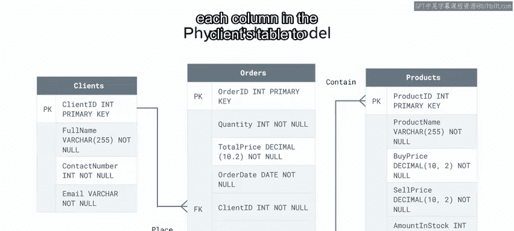
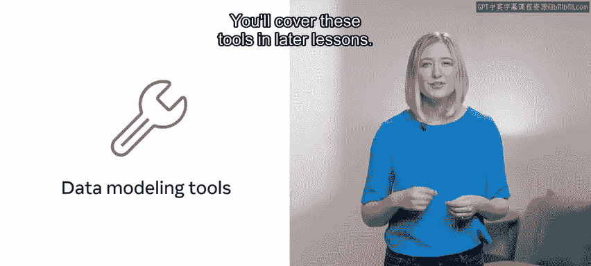

# 94：数据建模概述 📊

在本节课中，我们将要学习数据建模的基本概念。数据建模是数据库系统开发的关键前期步骤，它帮助我们规划数据的存储和访问方式，以确保系统的高效运行。我们将探讨数据建模的定义、不同层级模型的作用，并通过一个珠宝店的案例来理解其实际应用。

---

## 什么是数据建模？ 🤔

上一节我们介绍了课程目标，本节中我们来看看数据建模的核心定义。

开发数据库系统时，需要确保其高效运行并能快速提取信息。创建此类系统的最佳方法是首先设计一个数据模型。通过数据模型，你可以在创建数据库系统之前，规划数据在数据库中的存储和访问方式。

数据模型提供了数据元素的可视化表示，并展示了它们彼此之间的关系。换句话说，它展示了数据库系统的结构。这种结构有助于你理解数据在数据库中如何被存储、访问、更新和查询，同时也确保了结构的一致性和高质量。

数据建模用于开发各种类型的数据库，特别是**实体关系数据库**。这些数据库是使用**实体关系图**进行规划的。

---

## 数据模型的三个层级 🏗️

理解了数据建模的基本概念后，本节我们将深入探讨其三个不同的抽象层级。

数据建模分为三个层级：概念数据模型、逻辑数据模型和物理数据模型。让我们花些时间来探索这些不同的类型。

### 概念数据模型

你可能在之前的课程中已经熟悉了概念数据模型。概念数据模型由称为**实体**的高级抽象数据元素组成。数据元素或实体之间的关系，将数据库系统中相关的数据记录链接起来。概念模型的目的是通过可视化表示其包含的实体及彼此间的关系，来呈现数据库系统的高级概览。

MG珠宝店可以利用概念数据模型来创建他们的数据库系统。他们可以将客户、产品和订单呈现为实体，然后记录这些实体之间的关系。概念模型为逻辑数据模型提供了基础。

### 逻辑数据模型

同样，你应该对之前课程中的逻辑数据模型示例有基本的了解。逻辑数据模型在概念模型的基础上，提供了实体及其各自关系的更详细概述。它识别每个实体的**属性**，定义**主键**并指定**外键**。

MG可以在其概念数据模型的基础上，用它来创建逻辑数据模型。他们的逻辑数据模型必须包含每个实体所需的所有属性，例如每个实体包含的属性列表。然后，它需要定义这些列中哪些作为每个表的**主键**。例如，`client_id`列是`clients`表的主键。

MG的逻辑数据模型还需要指定他们用于在表之间创建关系的**外键**。在当前模型中，`clients`表通过`client_id`外键连接到`orders`表。

### 物理数据模型

物理数据模型用于创建数据库的内部SQL模式，该模式在数据库管理系统中实现。

物理数据模型必须概述诸如**数据类型**、**约束**和属性等特性。例如，MG需要为每个属性定义特定的数据类型，比如`clients`表中`full_name`属性的`VARCHAR`类型，或`contact_number`属性的`INTEGER`类型。他们还需要应用相关的约束。他们可以为`clients`表中的每一列施加`NOT NULL`约束，以确保每一列都包含数据。

此外，还有一系列工具可用于生成和执行物理数据模型的内部模式，这些工具将在后续课程中介绍。

---

## 总结与回顾 📝

本节课中，我们一起学习了数据建模的基础知识及其在数据库系统开发中的重要作用。

你现在应该熟悉了数据建模的基础知识，以及它在数据库系统开发中所扮演的重要角色。你也应该能够区分不同层级的数据模型，并解释每个模型如何为数据库系统的创建做出贡献。

通过为MG珠宝店设计从概念到物理的模型，我们看到了一个完整的建模流程如何帮助将业务需求转化为高效、结构清晰的数据库系统。出色的工作。