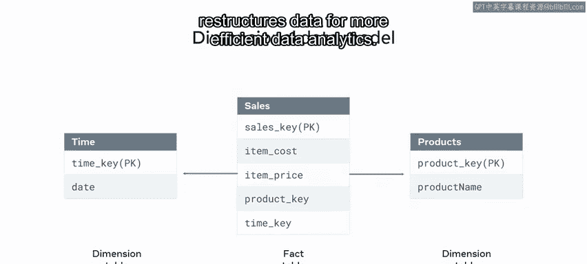

# 95：数据模型类型 📊

在本节课中，我们将学习如何为数据库系统选择合适的数据模型。我们将探讨几种主要的数据模型类型，分析它们的优缺点，并了解它们各自适用的场景。

---

## 关系数据模型

上一节我们介绍了数据模型的重要性，本节中我们首先来看看最常用的关系数据模型。你可能在之前的课程中已经接触过它。

关系数据模型是一种流行且广泛使用的数据库模型。它将数据库表示为一组**关系**。每个关系以**表格**的形式呈现，通过**行**和**列**来存储信息。

该模型的一个关键优势是比其他模型更简单易用。你可以快速识别和访问数据。然而，在复杂的关系数据库系统中，数据之间的关系可能变得难以导航。此外，在进行数据分析时，你可能需要以不同的方式组织和构建数据。

---

## 实体关系模型

接下来，我们看看与关系模型相似的实体关系模型。

实体关系模型与关系数据模型类似。关键区别在于，你可以通过为每个表分配其独有的属性集，将每个表呈现为一个独立的**实体**。该模型还涵盖了实体之间的多种关系类型，例如：
*   **一对一**关系
*   **一对多**关系
*   **多对多**关系

例如，M&G公司可以使用实体关系模型来可视化其“客户”表和“订单”表之间的关系。这两个实体通过“客户ID”列连接，形成一对多关系。换句话说，一个或多个订单属于一个特定的客户。

---

## 层次数据模型

现在，让我们转向以树状结构组织数据的层次数据模型。

层次数据模型以**树状**或**父子**结构组织数据。每条数据记录都有一个**父节点**，也可以拥有自己的**子节点**。其主要缺点是只能用于记录节点之间的一对多关系。每个子节点只能有一个父节点。

M&G公司可以使用此模型来描述其“订单”和“客户”实体之间的关系。客户连接到根节点，每个订单连接到相关的客户，而每个客户可以连接到多个订单。M&G可以根据需要继续添加节点。

---

## 面向对象模型

数据库开发者的另一个选择是面向对象模型。

面向对象模型基于**面向对象**的概念。在此模型中，每个对象被转换为一个**类**，该类定义了对象的特征和行为。

该模型的一个关键优势是，你可以定义对象之间不同类型的关联，例如**聚合**、**组合**和**继承**。这使得面向对象数据库适用于需要面向对象方法的复杂项目。

该模型也严重依赖于**继承**特性。继承是指一个类从另一个类继承其属性。你可以创建一个**父类**或**超类**（也称为基类）来保存公共属性。随后的每个**子类**都继承父类的属性。

然而，如果你使用此模型，则需要很好地理解面向对象原则和相关的编程技能。

M&G可以利用面向对象模型在类之间保留属性。他们可以创建一个名为“人员实体”的基类或父类，其中包含属性和操作。然后，“员工”和“客户”类从“人员实体”类继承这些属性和操作。因此，每个员工和客户都是一个人。

---

## 维度数据模型

最后，我们来了解基于两个关键概念的维度数据模型。

维度数据模型基于两个关键概念：**维度**和**事实**。
*   **事实**是从过程中获得的度量值。例如，从M&G业务数据中获得的销售事实。
*   **维度**定义了这些度量值的上下文，例如特定的销售期间。

因此，销售事实衡量的是M&G每周销售特定产品的数量。

该模型的关键优势在于，它优化了数据库以实现更快的数据检索，并重组数据以提高数据分析的效率。在本课程后面，你将更详细地探讨维度数据模型。

---

## 总结

本节课中，我们一起学习了可用于构建数据库系统的不同类型的数据模型，以及它们的一些关键优点和缺点。你在数据库建模的旅程中取得了很大的进步。