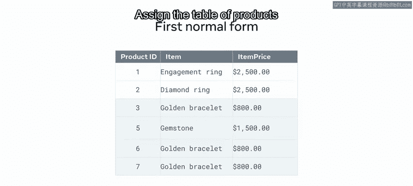
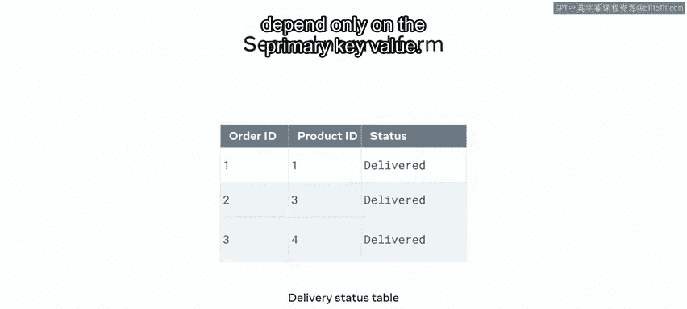
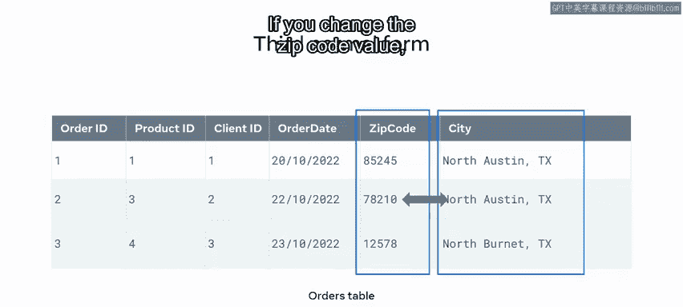
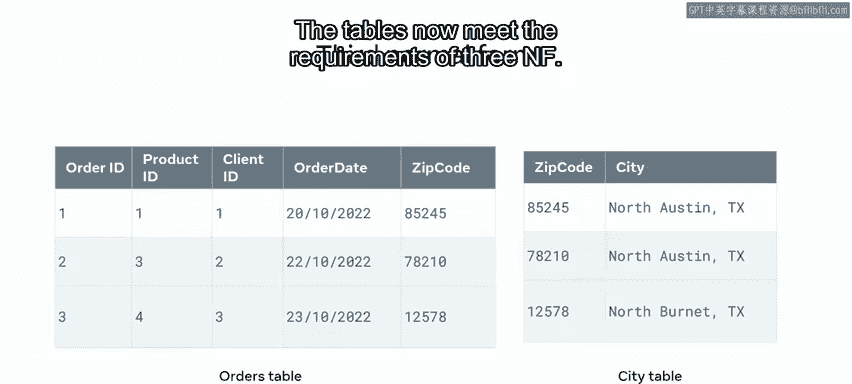

# Python 96：关系数据库模型归一化回顾 🔄

在本节课中，我们将要学习数据库规范化的重要性及其应用方法。规范化是数据库设计中的核心过程，旨在通过结构化表来减少数据冗余、避免数据修改异常并简化数据查询。我们将回顾三种主要的范式，并通过实例演示如何应用它们来解决数据异常问题。

---

## 规范化的重要性

在数据库工程实践中，处理数据库表时，你经常会遇到可能导致数据不一致的异常。通过应用规范化过程，可以解决这些异常。

上一节我们介绍了规范化的基本概念，本节中我们来看看具体的规范化方法。

## 常见的数据库异常

以下是三种最常见的数据库异常：

*   **插入异常**：向表中插入新数据时，需要同时插入额外的、不必要的数据。
*   **更新异常**：更新表中某一列的一条记录时，发现这会导致表中其他多处数据也需要更新。
*   **删除异常**：删除一条数据记录时，会导致数据库中其他必需的数据集也被意外删除。

## 三级规范化方法

接下来，我们快速回顾如何使用数据规范化的三个级别来帮助解决或避免这些异常。

### 第一范式

第一范式，有时称为 **1NF**，它强制数据的原子性，并消除数据库表中不必要的重复数据组。换句话说，每个字段中每个值只能有一个实例。

重复的数据组会导致数据冗余和不一致。例如，在 M&G 公司的产品表中，“商品”列的同一单元格中存储了“订婚戒指”和“钻石戒指”两种产品。这违反了原子性规则。每列应只包含一个值的实例。

你可以通过创建两个新表来解决此问题：

1.  创建一个 `products` 表，用于保存与产品实体相关的所有数据。为该表分配一个 `product_id` 列，以标识每条唯一记录。
2.  创建一个 `clients` 表，用于保存与客户实体相关的所有数据。同样，创建一个 `ID` 列来标识每条唯一记录。

此解决方案从表中删除了所有不必要的重复数据。

### 第二范式

上一节我们介绍了如何确保数据的原子性，本节中我们来看看如何消除部分依赖。

要使表符合第二范式，即 **2NF**，它必须已经满足第一范式，并且不能包含任何基于函数依赖或部分依赖构建的关系。该表必须使用复合主键定义。

例如，M&G 的 `delivery_status` 表有一个由 `order_id` 和 `product_id` 组成的复合主键。为了符合第二范式，你必须识别是否存在任何非键属性仅依赖于复合键的一部分。

`delivery_status` 表中的 `order_date` 是一个非键属性。它可以仅通过 `order_id` 列来确定。这称为**部分依赖**。这在第二范式中是不允许的，因为所有非键属性必须通过使用复合键的两部分来确定。

可以通过从 `delivery_status` 表中移除 `order_date` 属性来解决此问题。换句话说，将 `order_date` 列保留在 `orders` 表中。现在，你的表符合第二范式：所有非主键属性都仅依赖于主键值。

### 第三范式

最后，我们来看第三范式，它主要解决传递依赖问题。

第三范式，即 **3NF**，旨在移除不必要的数据重复，确保数据的一致性和完整性。同样，一个表必须遵守第一和第二范式，然后才能应用第三范式。

第三范式解决了传递依赖问题。传递依赖是指非键属性相互依赖。

例如，M&G 的 `orders` 表中的 `city` 和 `zip_code` 是非键属性。然而，可以根据 `zip_code` 值来确定 `city` 值。如果你更改了 `zip_code` 值，就需要更改 `city` 名称值。这意味着一个非键属性依赖于另一个非键属性，这违反了第三范式。

为了解决这个问题，可以将表拆分为两个表：

1.  一个 `orders` 表，包含所有相关数据。
2.  一个 `city` 表，包含两列：`zip_code` 和 `city_name`。

现在，所有非键属性都仅由每个表中的主键决定。因此，这些表现在满足了 **3NF** 的要求。

---

## 总结

本节课中我们一起学习了数据库规范化的三个基本范式。应用这三种规范化形式是解决数据库中可能出现的任何异常的好方法。通过建模你的数据库，使其易于使用、访问和查询，可以解决任何数据冗余和不一致的问题。你现在应该熟悉了规范化的过程以及如何将其应用到你的数据库中。