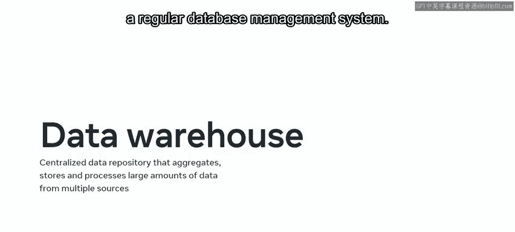
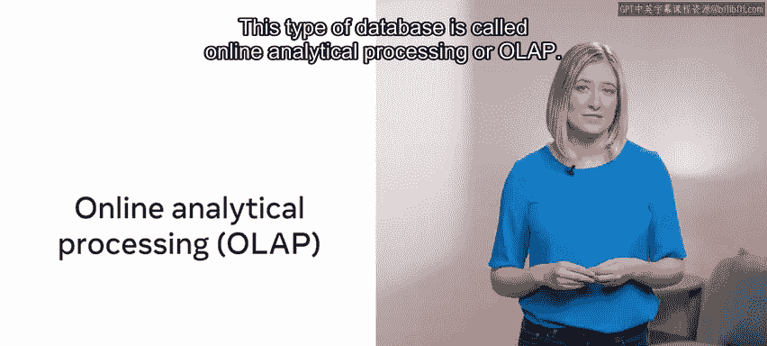
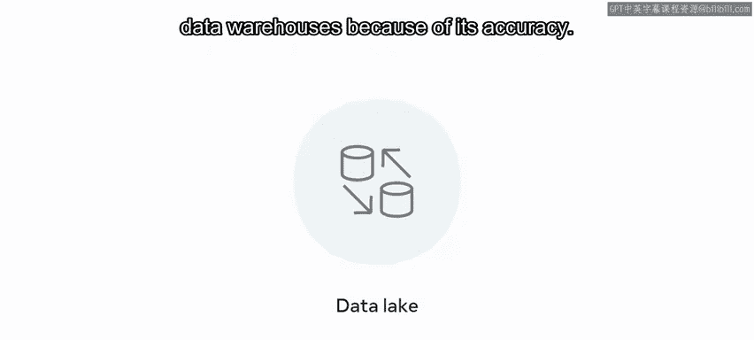

# 101：数据仓库概述 📊

在本节课中，我们将要学习数据仓库的基本概念。我们将了解数据仓库是什么，它与常规数据库有何不同，并探讨其核心特征以及数据分析中可能遇到的不同数据类型。

## 什么是数据仓库？🏗️

常规数据库实时收集、存储和处理来自事务的数据。但是，如果需要聚合和分析来自多个来源的数据，数据仓库就是完美的解决方案。它可以聚合来自一系列来源的数据，并使用不同的工具进行分析。

接下来，我们将更详细地探讨数据仓库的概念。

## 数据仓库与常规数据库

数据仓库是一个集中式的数据存储库，它聚合、存储和处理来自多个来源的大量数据。它将数据分析工作负载与常规数据库管理系统的标准事务工作负载分离开来。

**公式：数据仓库 = 集中式存储库 + 多源数据聚合 + 数据分析**



用户随后可以查询这些数据以执行数据分析。这种类型的数据库被称为**联机分析处理**。

常规数据库侧重于实时收集、存储和处理数据。它也被称为**联机事务处理**。

## 数据仓库的四大特征

数据仓库有四个关键特征：面向主题、集成性、非易失性和时变性。让我们从面向主题开始，逐一探讨这些特征。

### 面向主题



构建数据仓库时，需要选择一个或多个要探索的主题领域。例如，一家公司可以构建一个专注于销售的数据仓库，然后利用该仓库查找所有与销售流程相关的信息，例如最畅销和最滞销的产品。

### 集成性

集成性意味着数据仓库整合了来自一系列不同来源的数据。数据必须以一致的格式进行集成。集成数据还必须解决诸如命名冲突和数据类型不一致等问题。

### 非易失性

非易失性意味着数据一旦加载到数据仓库中就不应被删除。数据仓库的目的是分析现有数据。拥有的数据越多，分析结果就越好。

### 时变性

数据仓库会聚合长时间段内的数据，以便能够衡量数据随时间的变化。这有助于用户发现数据元素之间的趋势、模式和关系。

上一节我们介绍了数据仓库的四大特征，本节中我们来看看数据仓库可能处理的不同数据类型。

## 数据分析中的数据类型

数据仓库会遇到三种形式的数据：结构化数据、半结构化数据和非结构化数据。以下是每种类型的简要说明。

### 结构化数据

这是以结构化格式呈现、具有明确定义数据模型的数据。关系数据库模型通常用于结构化数据。其组织有序的表格帮助用户使用SQL访问、管理和搜索数据。数据仓库通常使用结构化数据。这种数据类型为特定目的而组织，因此更容易从中获得洞察并找到特定问题的答案。

**代码示例：SQL查询结构化数据**
```sql
SELECT product_name, SUM(sales_amount)
FROM sales_table
GROUP BY product_name
ORDER BY SUM(sales_amount) DESC;
```

### 半结构化数据

半结构化数据是仅部分结构化的数据。进行数据分析需要付出更多努力。电子邮件消息就是半结构化数据的一个例子。它可以包含发件人和主题等结构化数据，但正文是非结构化的，可以包含文本、图像和视频等几种不同类型的数据。

### 非结构化数据

这种数据类型不遵循任何特定的预定义数据模型。它可以包括任何类型的数据，如文本、视频或音频。这种数据可以在不应用任何数据模型的情况下收集和存储，但分析非结构化数据需要高级数据分析机制，如机器学习和数据挖掘。半结构化和非结构化数据更适合数据湖。数据湖类似于数据仓库，但它可以处理非结构化数据。数据科学家更广泛地使用数据湖。由于准确性考虑，企业更倾向于使用结构化数据和数据仓库。

## 总结



本节课中我们一起学习了数据仓库的基础知识。你现在应该能够解释什么是数据仓库，概述其主要特征，以及数据分析中可以使用的不同类型的数据。这是很大的进步，我期待在后续课程中继续引导你探索这些主题。