# 13：维度数据建模实践 📊

在本节课中，我们将学习如何构建一个维度数据模型。我们将回顾维度数据模型的核心概念，并详细介绍构建该模型的四个关键步骤。通过一个名为“全球超市”的案例，我们将一步步了解如何应用这些步骤来解决实际的业务问题。

---

在本课程的这个阶段，你应该已经熟悉了维度数据模型及其相关的许多关键概念。

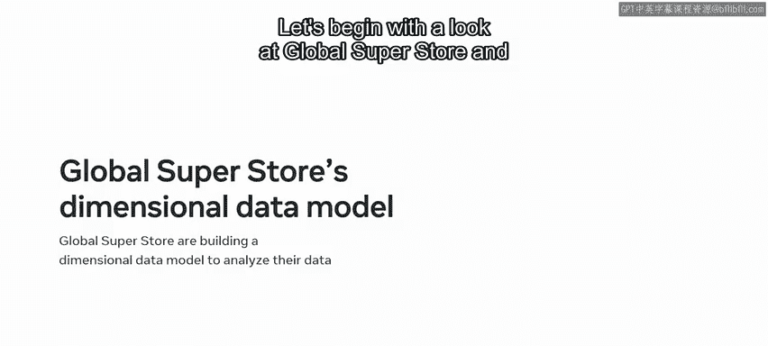

但是，如何构建一个维度数据模型呢？构建维度数据模型的过程围绕着四个关键步骤展开，这被称为金博尔维度数据建模法。

在本视频中，你将探索这种方法，并详细回顾这四个步骤。让我们从了解全球超市及其对维度数据模型的使用开始。

---

上一节我们介绍了课程目标，本节中我们来看看具体的案例背景。

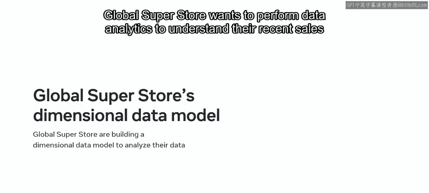

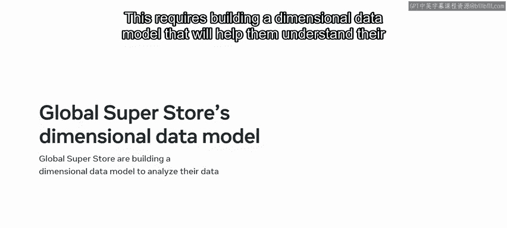

全球超市希望进行数据分析，以了解他们近期的销售数据。

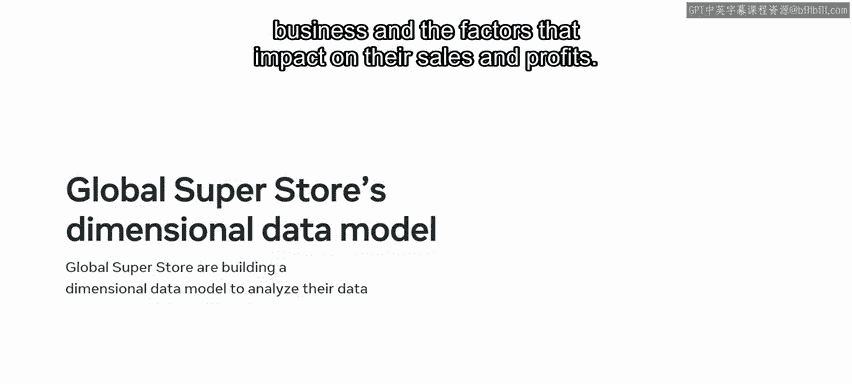

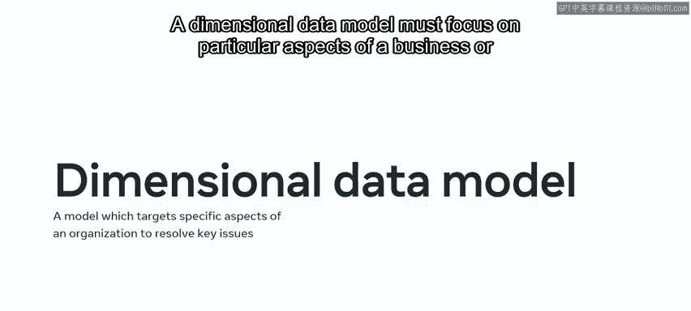

这需要构建一个维度数据模型，该模型将帮助他们理解其业务以及影响其销售额和利润的因素。

在探索全球超市的流程之前，让我们快速回顾一下维度数据模型的目的，并概览这四个关键步骤。

维度数据模型必须专注于业务或组织的特定方面，以解决具体问题。

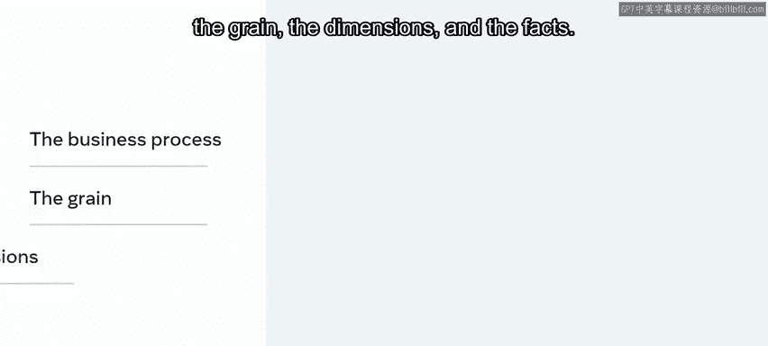

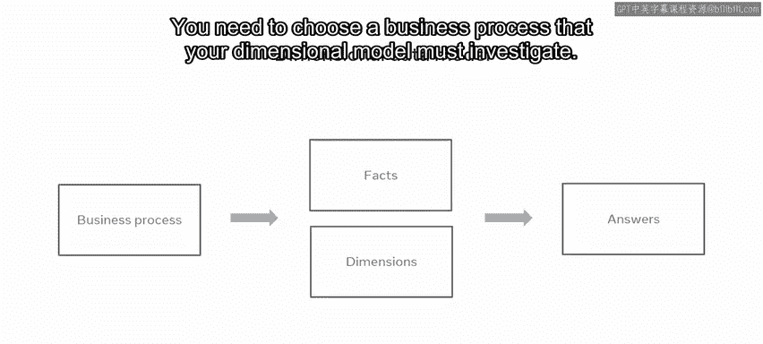

该模型是使用一种系统化的方法创建的，该方法围绕着四个关键步骤。

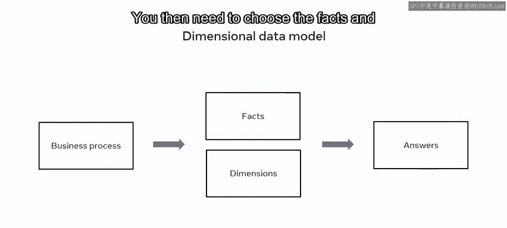

这些步骤包括：**业务过程**、**粒度**、**维度**和**事实**。

每个步骤都是一个选择。你需要选择一个你的维度模型必须调查的业务过程。

然后，你需要选择能够提供所需答案的事实和维度。

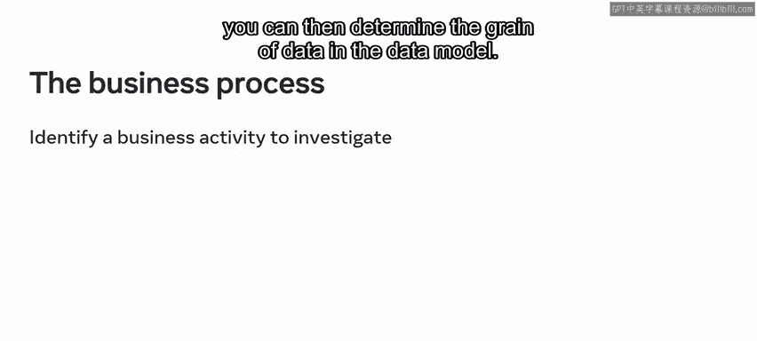

---

上一节我们概述了四个步骤，本节中我们将逐一深入探讨，理解它们如何为构建维度数据模型的过程做出贡献。

以下是构建维度数据模型的四个核心步骤：

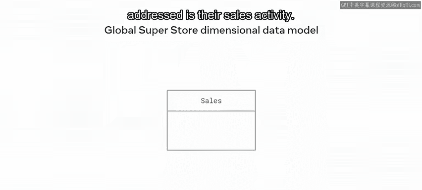

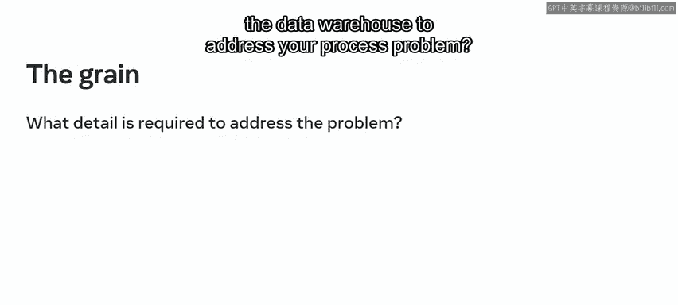

1.  **选择业务过程**
    构建维度数据模型时，第一步是识别或选择要解决的具体业务过程。

2.  **确定数据粒度**
    一旦确定了过程，你就可以确定数据模型中数据的粒度。

3.  **选择维度**
    流程的下一步是选择维度。在这一步中，你需要选择相关的维度。

4.  **确定事实**
    既然你已经确定了业务过程、粒度和维度，那么是时候确定事实了。这基本上是回答“你想测量什么？”这个问题。

---

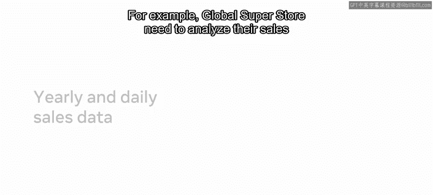

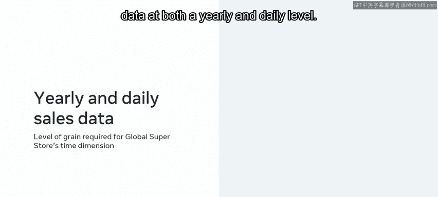

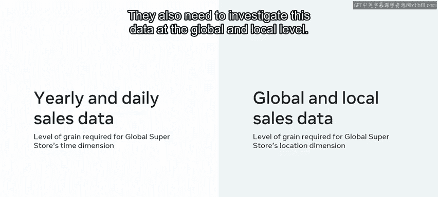

现在，让我们通过全球超市的案例来具体应用这些步骤。

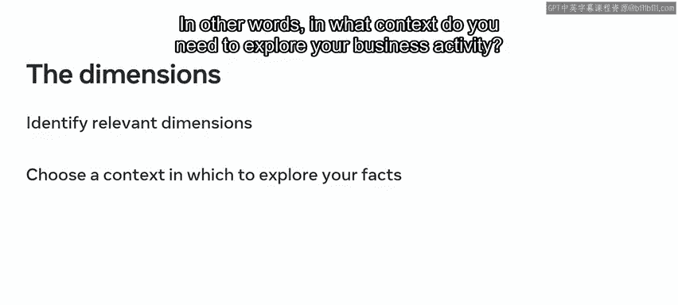

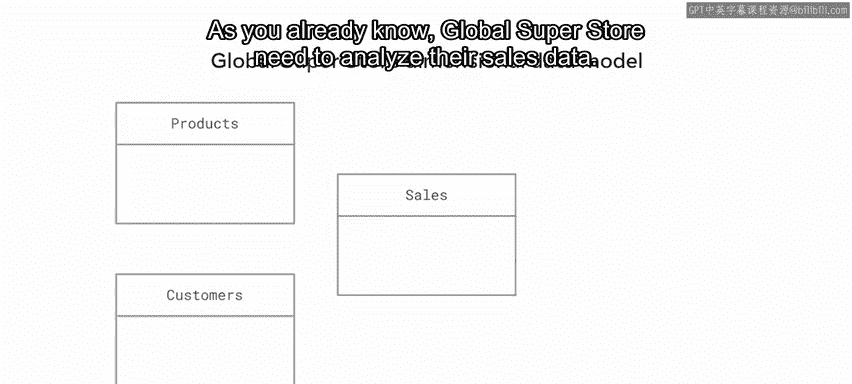

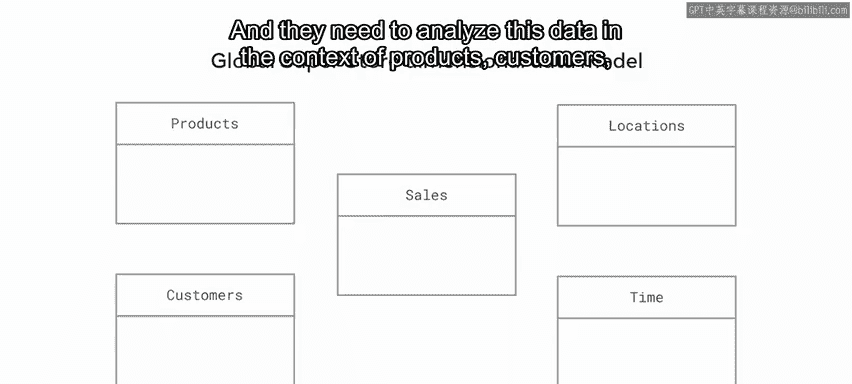

**第一步：选择业务过程**
全球超市已决定要解决的业务过程是他们的销售活动。

**第二步：确定数据粒度**
一旦决定了过程，接下来就需要选择所需的详细程度。这被称为粒度。数据仓库需要何种粒度或详细程度来解决你的过程问题？以及解决问题所需的最低详细程度是什么？

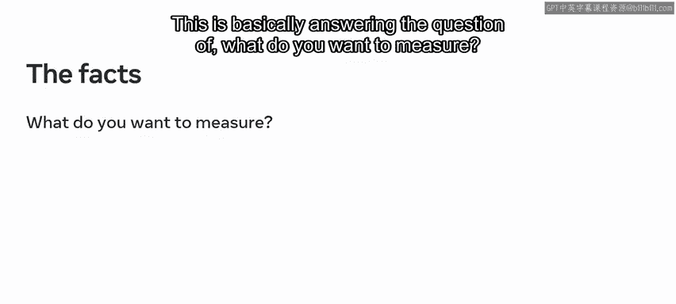

例如，全球超市需要在年度和日度级别上分析其销售数据。他们还需要在全球和本地级别上调查这些数据。

**第三步：选择维度**
在这一步，你需要选择相关的维度。换句话说，你需要在什么背景下探索你的业务活动？

正如你已经知道的，全球超市需要分析他们的销售数据，并且他们需要在产品、客户、时间和地点的背景下分析这些数据。

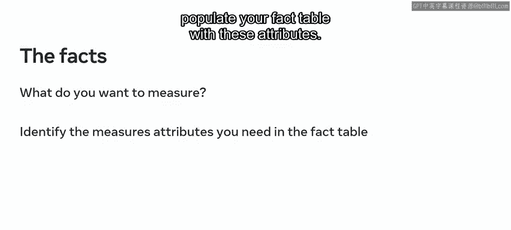

**第四步：确定事实**
你需要选择包含数值数据的度量，并用这些属性填充你的事实表。

例如，全球超市需要使用维度表（位置、产品、时间）来探索他们的事实。他们可以展示每个维度如何影响销售。

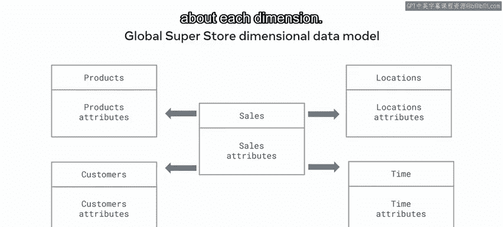

他们还可以包含提供每个维度有用信息的相关属性。

---

上一节我们完成了四个步骤的选择，本节中我们来看看如何将它们整合成最终的模型。

一旦你决定了需要调查的业务过程的哪个方面，并选择了相关的粒度、事实和维度，你就可以创建你的模式。

安排你的维度和维度表。全球超市可以在星型模式中安排他们的维度和度量。

他们的模式在四个不同维度（客户、产品、地点和时间）的背景下检查其销售活动的表现。在每个维度内，都有一组针对所需数据的相关属性。

全球超市根据其业务需求逐步确定了他们的维度和度量。他们现在可以执行不同形式的数据分析来实现其目标。

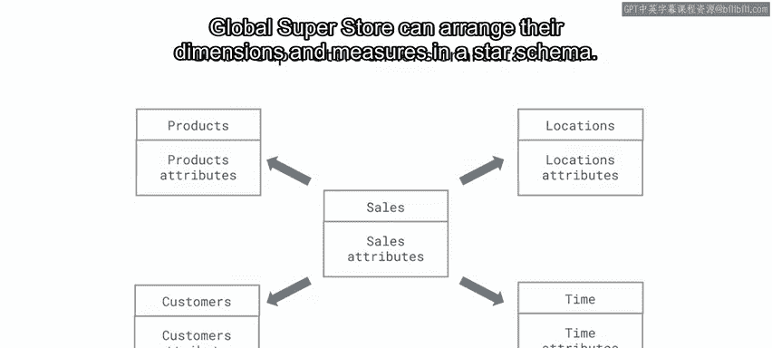

---

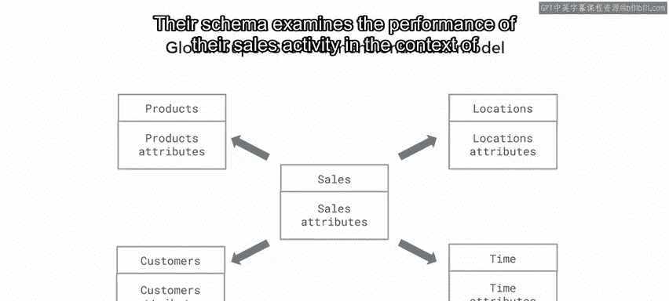

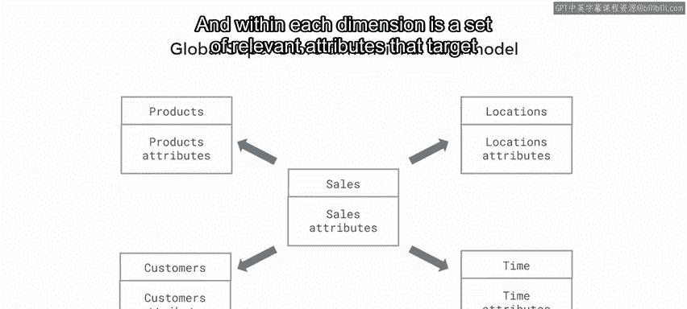

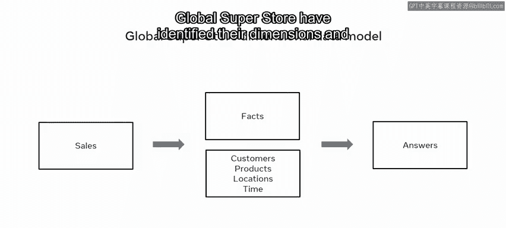

**总结**

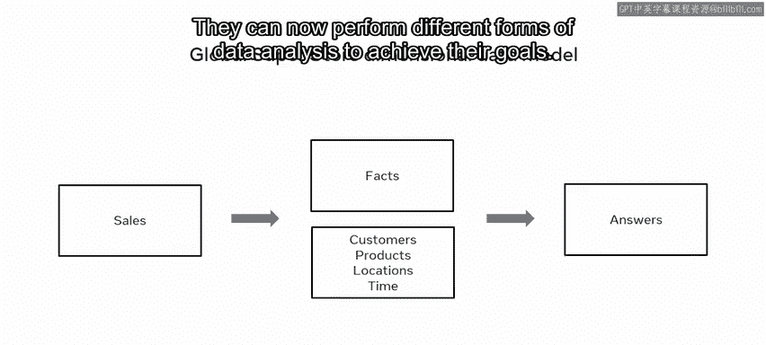

在本节课中，我们一起学习了使用系统化方法构建维度数据模型。你现在应该熟悉了构建维度数据模型的四个关键步骤：**选择业务过程**、**确定数据粒度**、**选择维度**和**确定事实**。你也应该能够识别并解释每个步骤中围绕数据必须做出的决策。你在高级数据建模的旅程中取得了巨大进展。