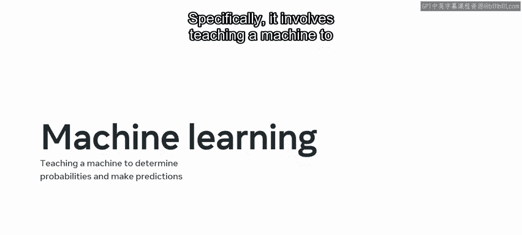
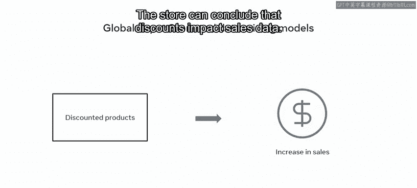

# 108：数据挖掘与机器学习 🧠💾

在本节课中，我们将要学习数据挖掘与机器学习的基本概念。随着数据量的增长，分析和理解数据变得愈发困难。数据库工程师依赖这些高级数据分析方法来发现数据中的模式、范式和趋势，从而帮助企业和组织理解绩效并制定可执行的预测计划。

## 数据挖掘与机器学习的定义 🔍

上一节我们介绍了数据分析的重要性，本节中我们来看看数据挖掘与机器学习这两个核心概念。虽然这两个术语经常互换使用，但它们的工作方式截然不同。

**数据挖掘**是检测数据中模式的过程。基于这些模式，可以获得洞察、做出判断并交付预测。

**机器学习**是教会计算机如何学习的过程。具体来说，它涉及教会机器确定概率并进行预测。

## 机器学习的主要方法 🤖

以下是机器学习的两种主要方法：

*   **监督式机器学习**：基于给定的标签对数据进行分类。例如，给计算机提供标记为“椅子”和“桌子”的图片，计算机学习根据这些标签来识别、分类和分组产品图片。
*   **无监督式机器学习**：基于共享特征对数据进行分类，但不使用标签。例如，计算机根据图片中的形状，学习识别和分类椅子、桌子和书桌等物体的图片。

## 数据挖掘模型示例 📊

机器学习在处理数据时会利用多种数据挖掘模型。让我们花几分钟时间探索一些这些模型的例子。

以下是几种常见的数据挖掘模型：

1.  **分类分析**：此模型将数据项分配到类别或数据类中。然后，你可以使用这些数据来预测项目的目标类别。例如，许多客户购买低价办公产品，他们可以被归类为“低预算客户”，并针对性地推送低价产品的广告。
2.  **关联规则**：此模型识别不同数据元素之间的关系。它根据特定标准判断这些元素之间是否存在相关性。例如，许多购买手机的客户也购买手机充电器和电池包。这表明这些产品应该一起广告和销售。
3.  **异常检测**：此模型揭示特定数据集中的异常数据。换句话说，它检测不符合预期模式的数据异常值。例如，一群有购买低价产品历史的客户突然开始购买昂贵产品。在这种情况下，公司需要重新分类这些客户，并针对性地推送更昂贵产品的广告。
4.  **聚类分析**：此模型在数据中寻找相似性，然后根据发现的相似性或子集内的共同特征，将数据分离成簇或子集。该模型的工作方式与分类分析模型类似，但分类分析模型最初是分配到预定义的组，而不是新发现的组。例如，可以根据客户在公司网店中相似的浏览行为，将客户分类为低预算和高预算群体。
5.  **回归分析**：此模型考虑影响数据的不同因素，然后确定这些因素之间的关系。例如，数据显示每次商店对某些产品打折都会导致销售额增加，因此商店可以得出结论：折扣会影响销售数据。

## 总结 📝

本节课中我们一起学习了数据挖掘与机器学习的基本区别，以及机器学习中监督式与无监督式两种主要方法。我们还探讨了五种关键的数据挖掘模型：分类分析、关联规则、异常检测、聚类分析和回归分析，并了解了它们如何帮助企业从海量数据中提取有价值的洞察和预测。掌握这些概念对于管理和分析大型数据库至关重要。