# Python 109：数据可视化概述 📊

在本节课中，我们将要学习数据可视化的核心概念、关键考量因素以及几种常用的图表类型。数据可视化不仅仅是展示数据，更是将复杂信息转化为易于理解的视觉故事，以帮助决策者快速解读并做出正确判断。

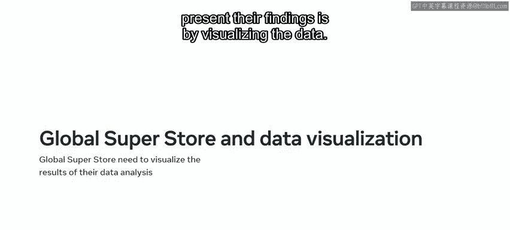

---

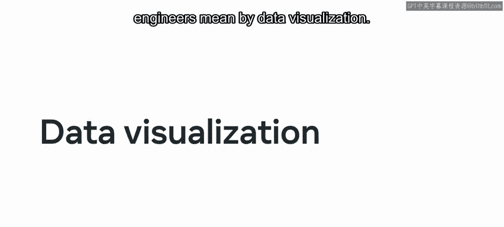

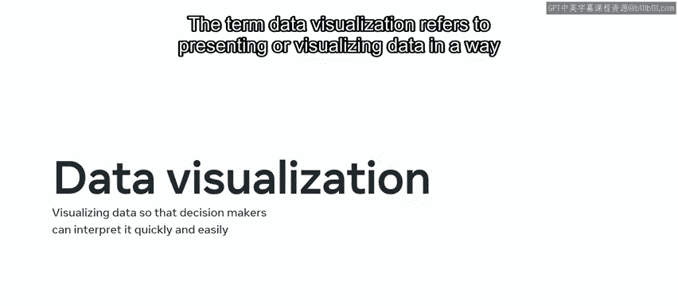

上一节我们介绍了数据可视化的重要性，本节中我们来看看在创建可视化图表前需要考虑哪些关键因素。

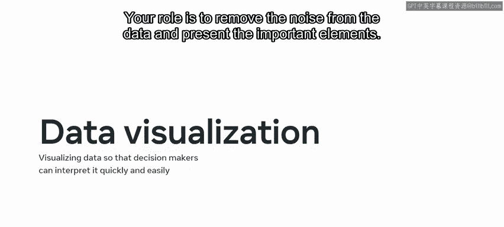

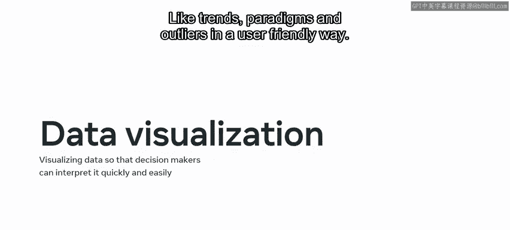

**数据可视化**指的是以决策者能够快速、轻松解读信息的方式呈现或可视化数据。你的角色是从数据中去除噪音，并以用户友好的方式呈现重要元素，如**趋势、模式和异常值**。

换句话说，你如何通过数据讲述一个信息丰富且引人入胜的故事？

决定使用何种类型的可视化数据时，需要考虑四个因素。

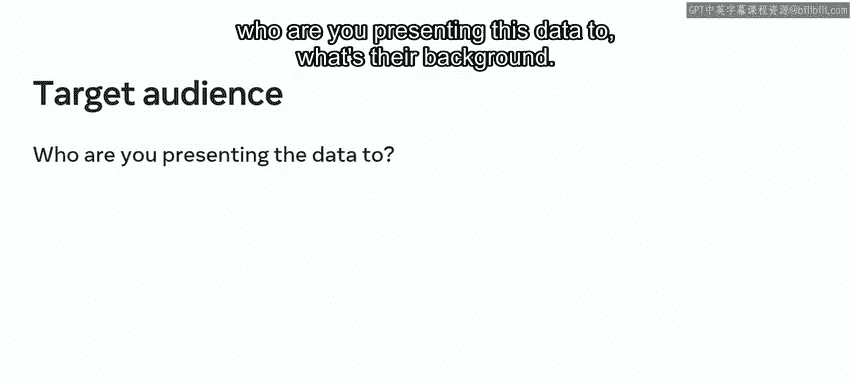

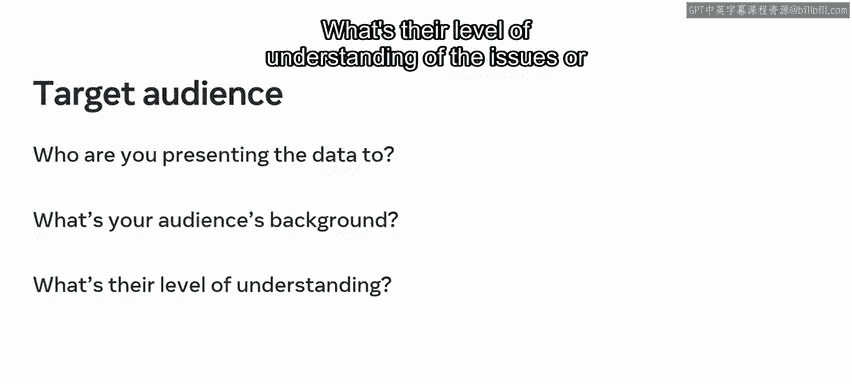

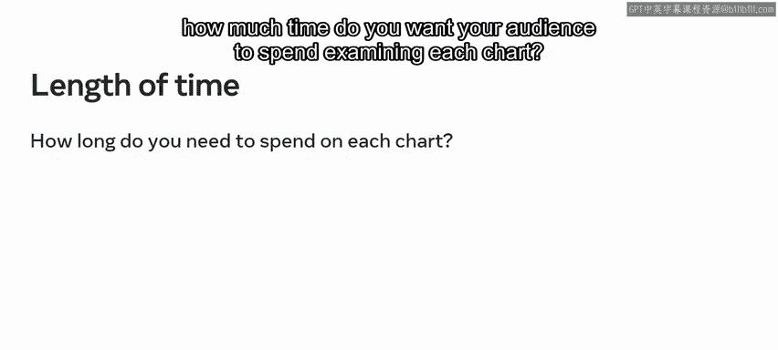

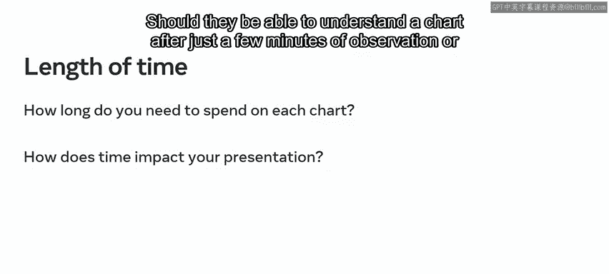

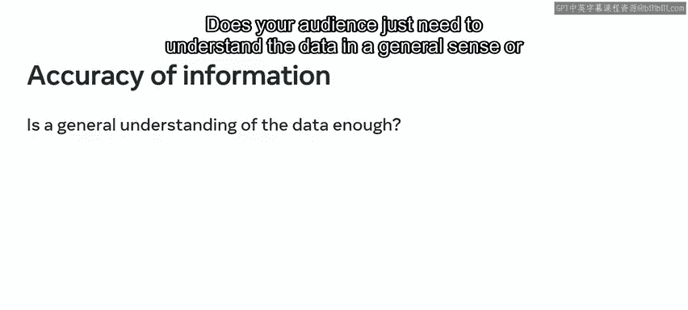

以下是需要考虑的四个关键因素：

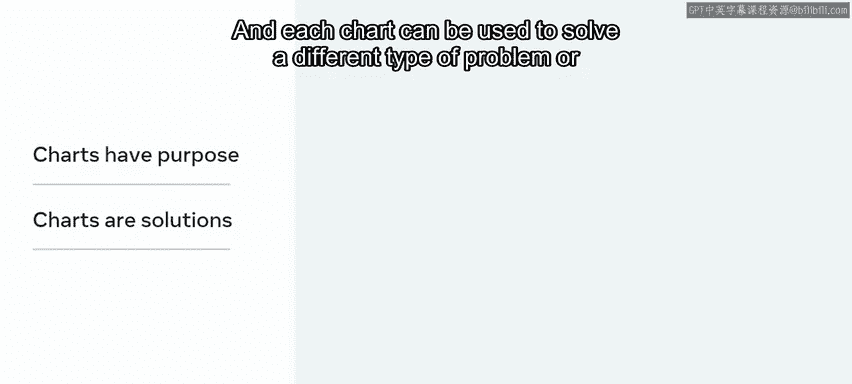

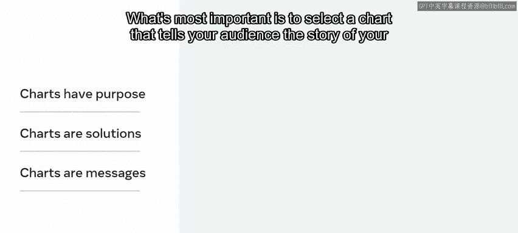

*   **目标受众**：你向谁展示这些数据？他们的背景是什么？他们对所调查问题或主题的理解程度如何？在演示中要考虑这些问题。
*   **信息内容**：你还需要仔细考虑你的可视化包含哪些信息。哪些信息能回答受众的问题？哪些信息是冗余的？
*   **时间**：你希望受众花多少时间检查每个图表？他们应该能在几分钟的观察后就理解图表，还是需要更长时间？
*   **准确度**：最后，思考你的受众需要何种程度的准确度。他们只需要大致理解数据，还是需要深入更精细的细节层面？

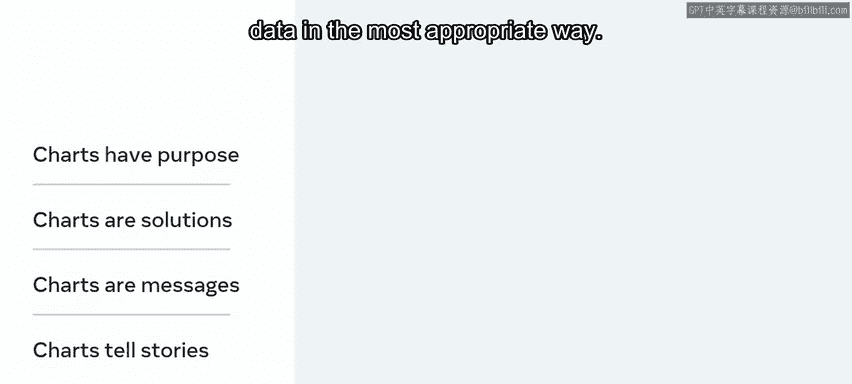

---

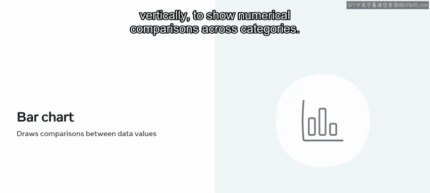

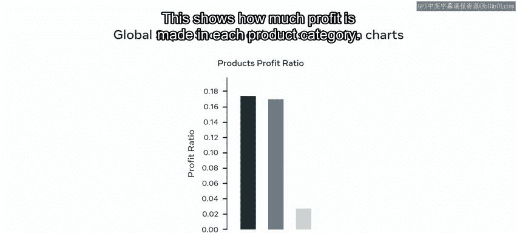

在回答了关键问题、确定了受众并明确了需要展示的数据类型之后，就该决定使用哪种数据可视化图表了。

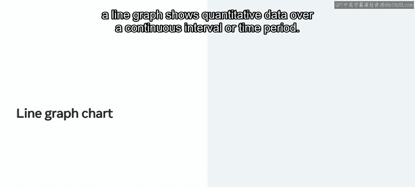

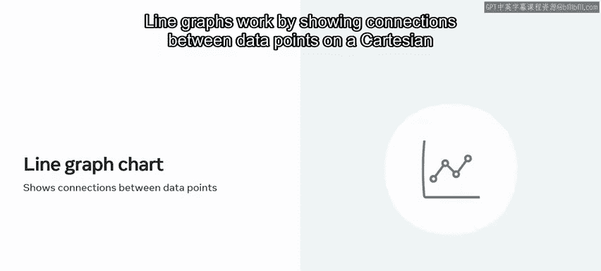

每种类型的图表都有不同的目的，可以用来解决不同类型的问题或传达不同种类的信息。最重要的是选择一个能以最合适的方式向受众讲述数据故事的图表。

让我们探索几个常用数据可视化图表的例子，并了解每种图表传达的信息类型。

以下是几种常见的图表类型及其用途：

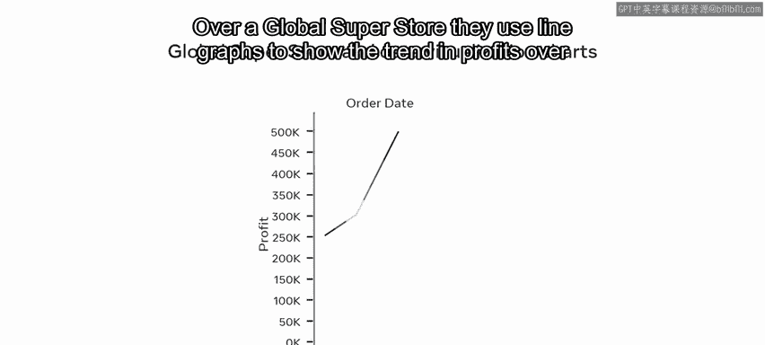

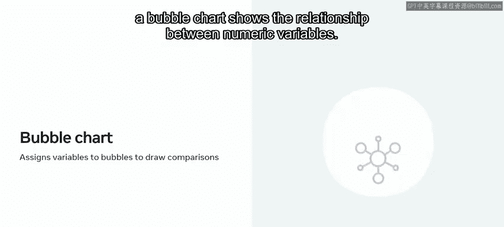

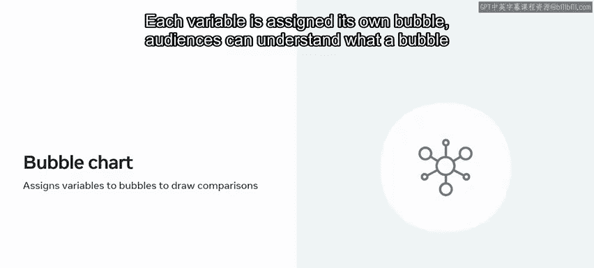

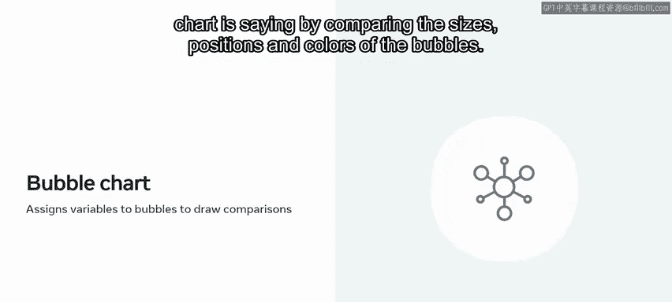

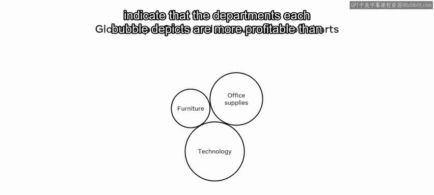

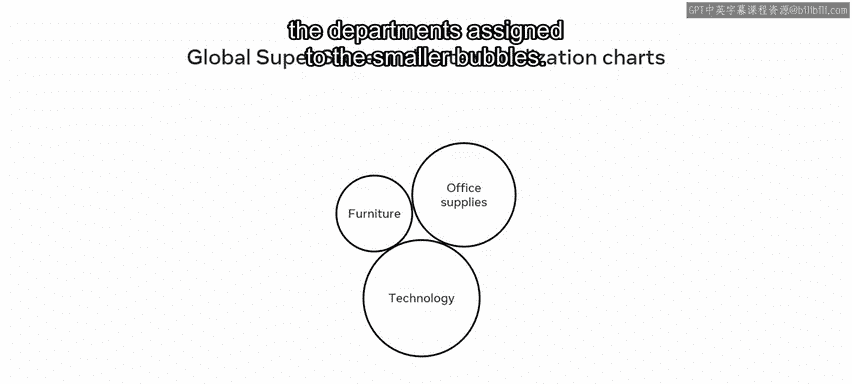

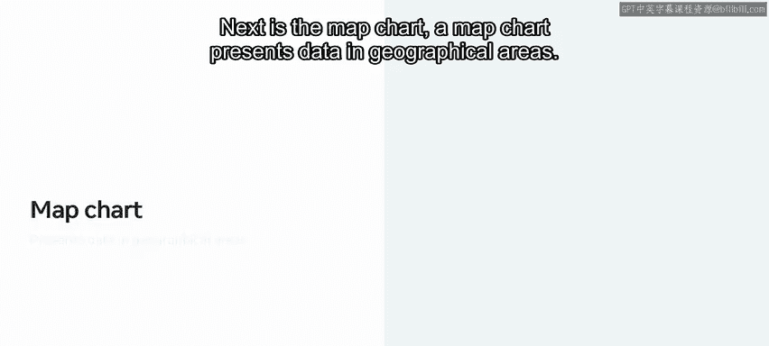

*   **条形图**：这是一种比较类图表。它帮助受众识别数据值之间的差异或相似之处。你可以水平或垂直呈现数据，以显示跨类别的数值比较。Global Superstore 使用条形图来描绘产品销售额与利润率的关系，这显示了每个产品类别产生了多少利润。
*   **折线图**：折线图显示连续区间或时间段内的定量数据。折线图通过在笛卡尔坐标系中显示数据点之间的连接来工作。在 Global Superstore，他们使用折线图来显示过去几年的利润趋势。
*   **气泡图**：气泡图显示数值变量之间的关系。每个变量被分配自己的气泡。受众可以通过比较气泡的大小、位置和颜色来理解气泡图所表达的信息。例如，Global Superstore 气泡图中较大的气泡表明该气泡所描绘的部门比分配给较小气泡的部门利润更高。
*   **地图图表**：地图图表在地理区域中呈现数据。每个数据变量都可以使用各种不同的方法（如颜色和标签）在地图中反映出来。Global Superstore 使用地图图表来可视化不同全球区域的销售额。
*   **散点图**：该图表将变量绘制为笛卡尔坐标网格上的点。然后，你可以使用这些数据点来寻找变量之间的关系。你还可以为每个数据组添加趋势线，或使用类别标签来显示选定类别的表现。Global Superstore 使用这种方法来描绘不同类别或部门的销售额和利润。

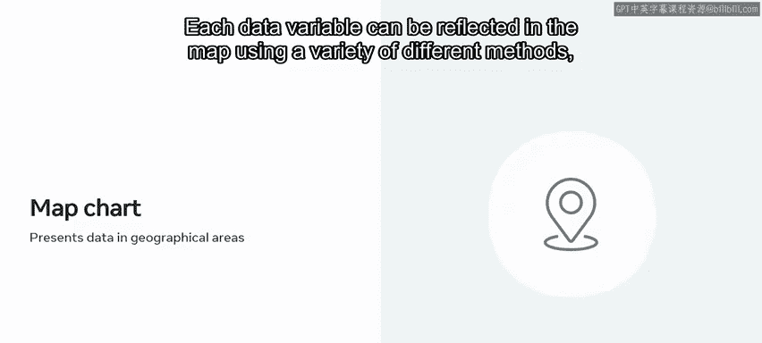

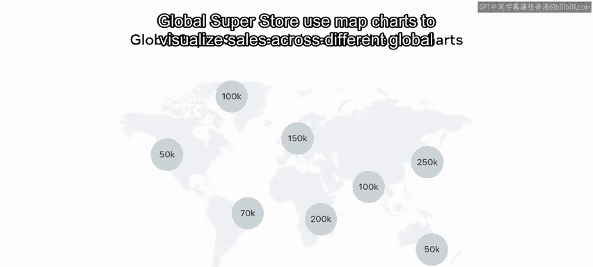

---

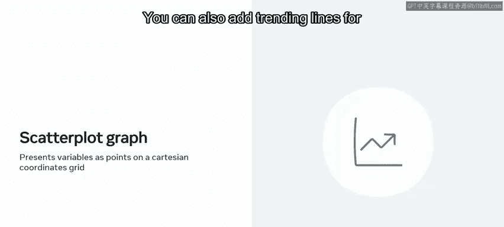

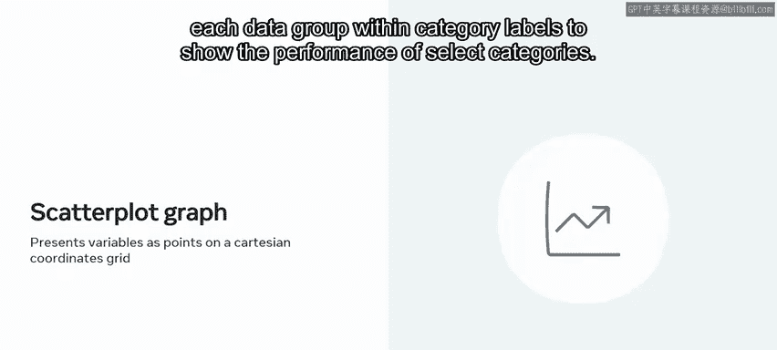

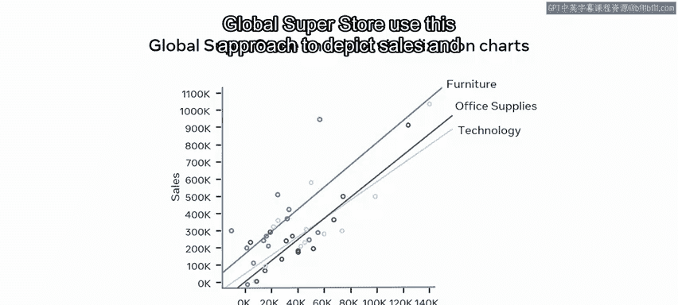

本节课中我们一起学习了数据可视化的核心概念。你现在应该能够解释影响数据可视化的不同因素，并在下次可视化数据时将这些因素考虑进去。同时，你也应该知道如何选择最能通过数据传达你想要讲述的故事的图表或图形。