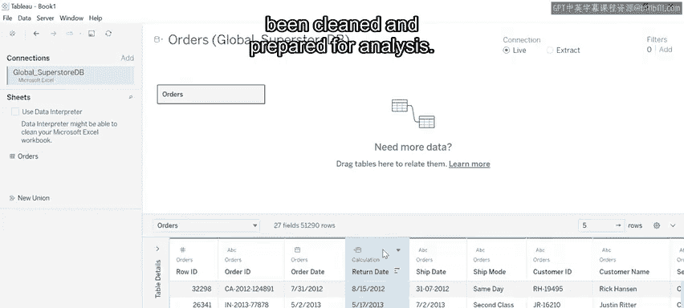
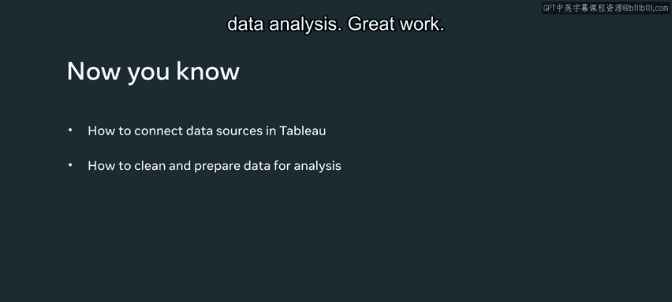

# 111：在Tableau中导入和准备数据 📊

在本节课中，我们将学习如何在Tableau中连接数据源，并对数据进行清理和准备工作，以便进行后续分析。我们将通过一个名为“全球超市”的案例，演示如何操作一个大型Excel文件。

## 概述

上一节我们介绍了数据分析的基本概念，本节中我们来看看如何在Tableau这一具体工具中开始工作。首先需要将数据导入Tableau，然后进行必要的清洗和整理，这是确保分析结果准确可靠的关键步骤。

## 连接数据源

要在Tableau中执行数据分析，首先需要与数据源建立实时连接。

以下是建立实时连接的步骤：
1.  打开Tableau，在左侧“连接”选项卡下的连接页面，点击“Microsoft Excel”。
2.  这会打开一个对话框，用于导航至您计算机上的Excel文件。
3.  选择并打开文件。Excel文件名将显示在屏幕左侧。

连接成功后，Excel文件中的数据会显示在数据窗格中。使用实时连接可以确保对原始数据源的任何更新都能自动反映在您的数据库中。

然而，处理数据提取的速度更快，尤其是在处理大量数据时。

## 认识数据窗格与元数据

数据窗格的左侧是元数据网格，它显示了关于不同数据字段的相关信息。

您可以通过点击相关按钮来显示或隐藏元数据网格。

现在您已经连接到了所需的数据，可以开始对其进行清理和准备，以便分析。

## 数据清理与准备

这个过程包括修复数据中的错误，并调整数据形状，使其更易于理解和分析。您可以通过执行不同类型的操作来实现，例如筛选、排序和重命名数据。

这些操作将在后续视频中详细介绍。

每一列的顶部都标明了该列的数据类型，并配有相应的符号。您可以根据需要更改这些数据类型。

让我们以“订单日期”列为例：
1.  选择该列上方符号旁边的小箭头。
2.  在出现的选项列表中点击它。
3.  此操作会显示该数据字段的关键信息。
4.  点击“ABC”数据类型，然后选择“日期”数据类型。现在数据类型已更改。

您还可以隐藏不相关的表格细节，以便只关注必要的数据。您也可以更改数据窗格中显示的行数。

让我们隐藏“订单日期”列：
1.  再次选择小箭头，然后选择“隐藏”。
2.  该列现在已被隐藏。

要再次显示数据，请点击Tableau设置图标，然后选择“显示隐藏字段”选项。此操作会以淡色版本显示字段，以指示哪些内容已被隐藏。

要恢复这些字段，请点击小箭头并选择“取消隐藏”。

## 拆分与重命名字段

您的下一个任务是将“客户姓名”列拆分为两个单独的列：一列用于客户的名字，另一列用于客户的姓氏。

1.  点击小箭头，然后选择“拆分”选项。这将自动创建两个新字段。
2.  您可以根据需要重命名它们。点击相应的小箭头，选择“重命名”，将列命名为“名字”和“姓氏”。

## 创建计算字段

全球超市还需要您为他们的退货创建一个新的数据字段。该字段必须包含根据公司退货政策，每个产品可以退回的最后日期，即购买日期后的15天。

1.  选择“订单日期”列中的小箭头，然后点击“创建计算字段”。
2.  将这个新字段命名为“退货日期”。
3.  在计算编辑器中，输入以下基本公式：`[订单日期] + 15`。此公式为每个订单日期值增加15天。
4.  这将创建一个新的“退货”列，其中填充了相关数据。完成后，点击“确定”。新的计算字段将被添加到数据窗格中。

## 总结

本节课中我们一起学习了如何在Tableau中连接数据源，并清理和准备数据以进行分析。全球超市的数据现已清理并准备就绪。您现在应该熟悉了如何在Tableau中连接到数据源，并为您自己的数据分析清理和准备数据。

做得好。

