# Python 114：23_高级数据建模课程回顾 📚

在本节课中，我们将回顾《高级数据建模》课程的核心内容。课程涵盖了从基础数据模型概念到高级数据分析工具的完整知识体系，旨在帮助你巩固所学，为后续的评估做好准备。

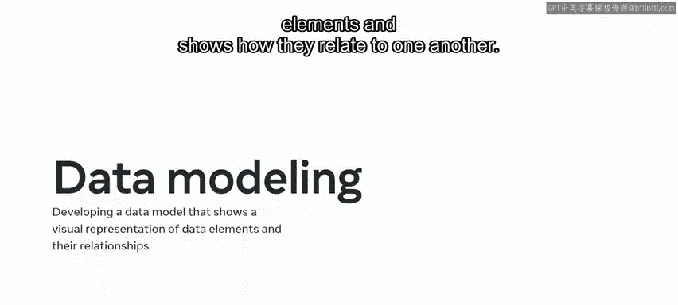

## 课程概述 🗺️

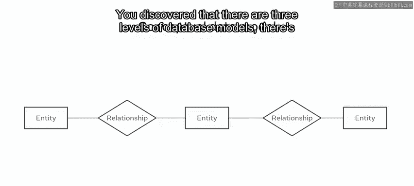

课程从高级数据库建模的简介开始。你了解到，**数据模型**是对不同数据元素及其相互关系的可视化表示。

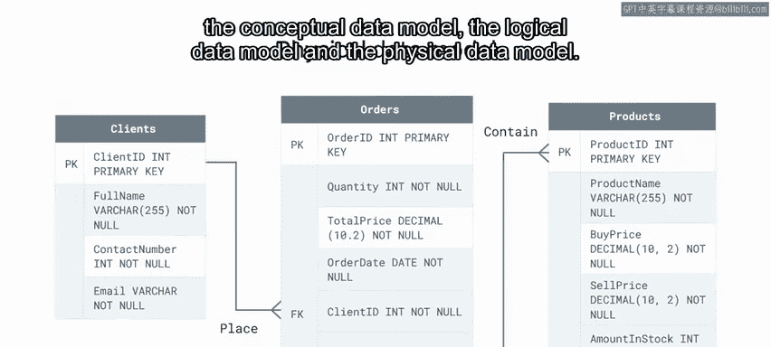

## 数据模型的层次与类型 🏗️

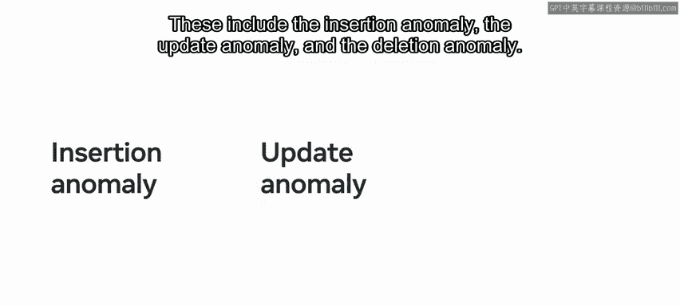

上一节我们介绍了数据模型的基本概念，本节中我们来看看数据模型的不同层次和类型。

你学习了数据库模型的三个层次：
*   **概念数据模型**：描述业务概念和它们之间的关系。
*   **逻辑数据模型**：定义数据结构，如实体、属性和关系，独立于任何数据库管理系统。
*   **物理数据模型**：描述数据在特定数据库管理系统中的实际存储方式。

你还回顾了可用于设计数据库的不同类型的数据模型，例如**实体关系模型**和**面向对象模型**。

## 数据库规范化 🧹

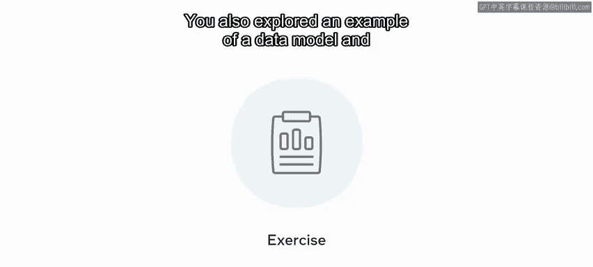

接下来，你学习了如何通过**数据库规范化**来构建表结构，以处理数据异常。以下是三种主要的异常类型：
*   **插入异常**：无法插入某些数据，除非其他无关数据也存在。
*   **更新异常**：更新一个数据项需要修改多行记录，可能导致数据不一致。
*   **删除异常**：删除一个数据项会导致其他重要信息丢失。

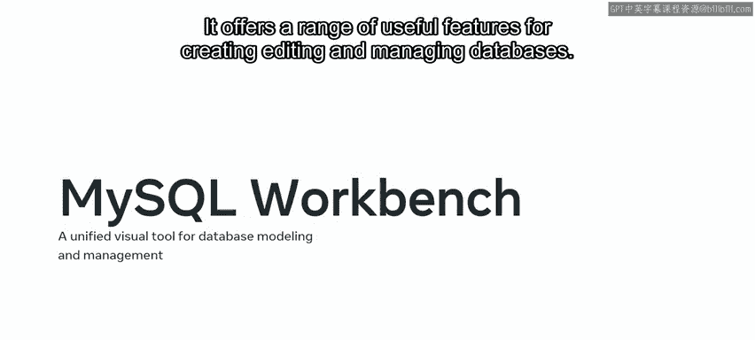

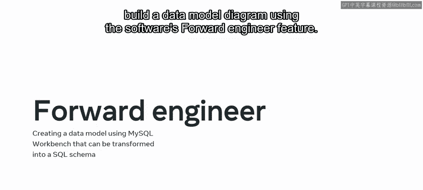

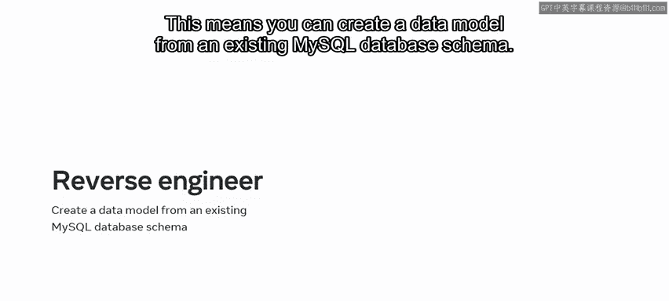

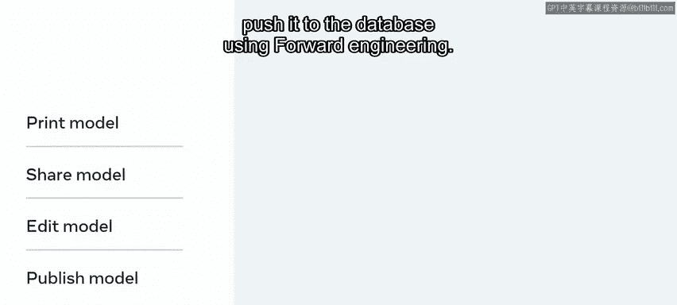

你还通过一个示例数据模型进行了探索，并在练习中设计了一个数据库模型。

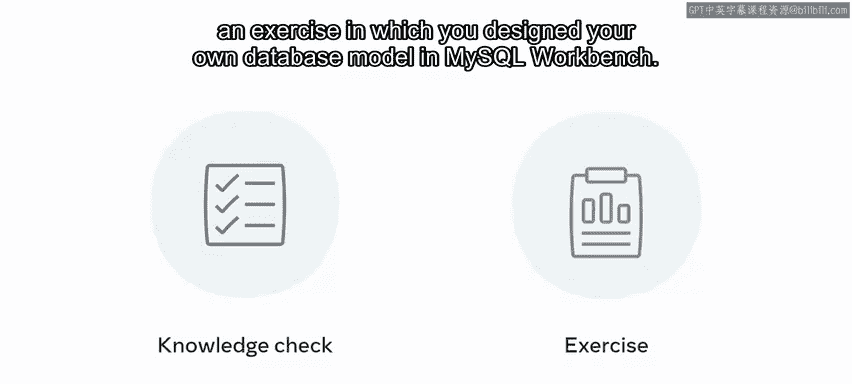

## MySQL Workbench 工具 🛠️

在本模块的下一课中，你认识了 **MySQL Workbench**。这是一个用于数据库建模和管理的统一可视化工具，提供了一系列创建、编辑和管理数据库的有用功能。

你随后学习了如何使用 MySQL Workbench 的**正向工程**功能来构建数据模型图。你还学会了如何使用其**反向工程**功能，即从现有的 MySQL 数据库模式创建数据模型，这本质上是正向工程的逆过程。

此外，你可以打印模型、分享模型，或应用更改并通过正向工程将其推送到数据库。

你通过一个测验项和一个练习完成了本课，在练习中你使用 MySQL Workbench 设计了自己的数据库模型。

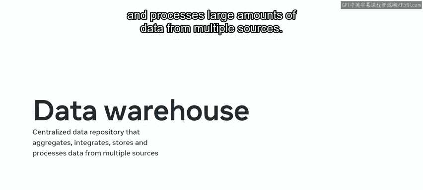

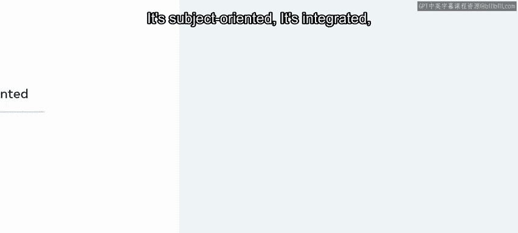

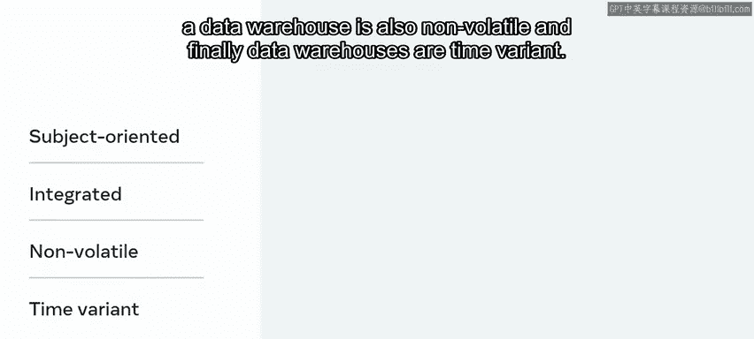

## 数据仓库架构 📦

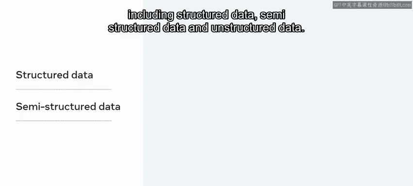

在下一个模块中，你探索了**数据仓库**的主题。你学习了数据仓库的架构，并构建了一个维度数据模型。

你首先概述了数据仓库的概念。数据仓库是一个集中式的数据存储库，它从多个来源聚合、集成、存储和处理大量数据，用户可以查询这些数据以执行数据分析。

你随后发现数据仓库由四个关键特征定义：
1.  **面向主题**
2.  **集成性**
3.  **非易失性**
4.  **时变性**

你还回顾了数据仓库处理的不同形式的数据，包括：
*   **结构化数据**
*   **半结构化数据**
*   **非结构化数据**

接着，你探索了数据仓库的架构，了解到它包括以下组件：**数据源**、包含**ETL过程**的**数据暂存区**、**数据仓库本身**以及**数据集市**。数据从数据源聚合后，在数据仓库中进行集成和存储，然后在数据集市中组织起来，供用户进行数据分析和呈现结果。这些组件控制着来自不同源的数据流，以进行数据分析和报告。

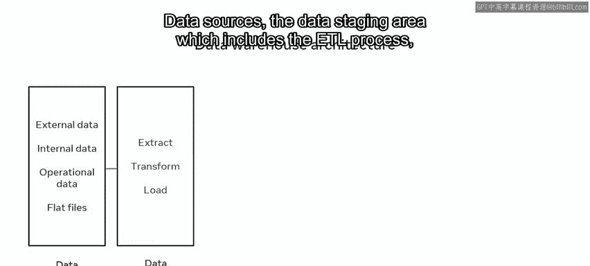

你还探索了一个真实世界数据项目的案例研究。

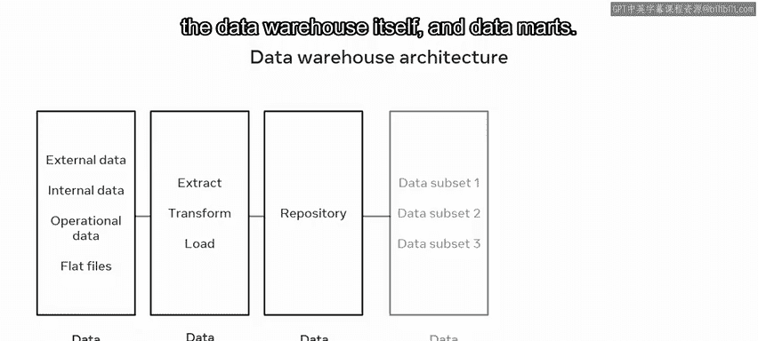

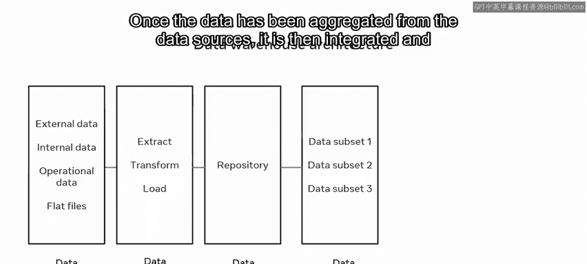

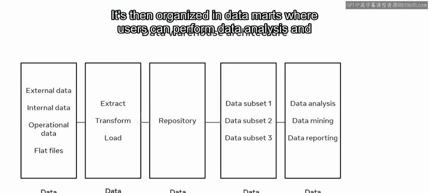

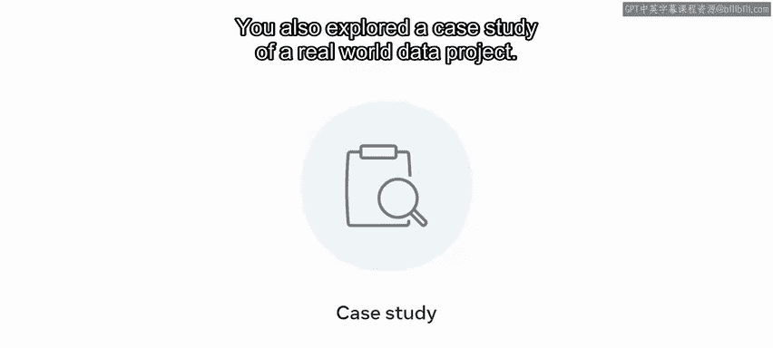

## 维度数据建模 ⭐

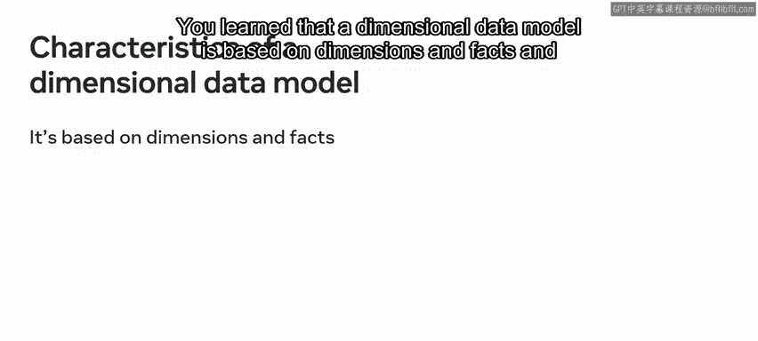

在本模块的第二课中，你探索了**维度数据建模**。课程从维度数据建模的基础知识概述开始。

你了解到维度数据模型基于**维度**和**事实**，并使用**星型模式**和**雪花模式**进行设计。

你随后探索了一些维度数据建模的实例，并了解到创建模型时有四个关键步骤：
1.  选择业务过程。
2.  确定粒度。
3.  确定维度。
4.  确定事实。

最后，你进行了一个练习，在其中创建了自己的维度模型。

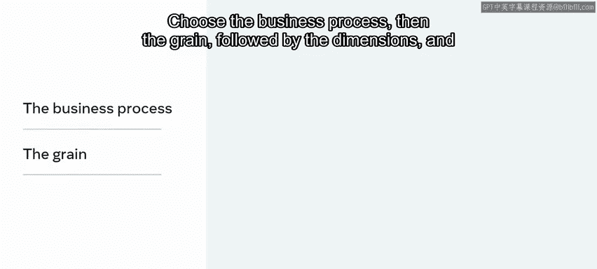

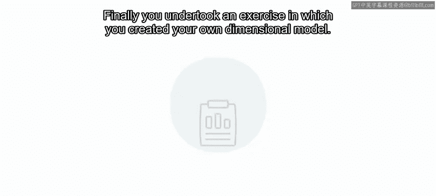

## 数据分析基础与可视化 📊

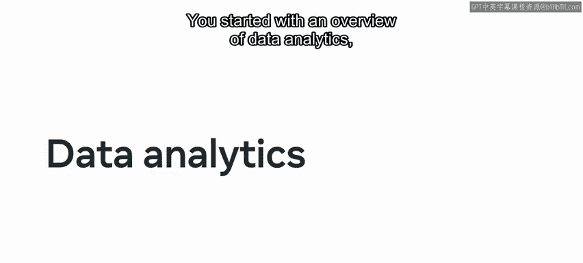

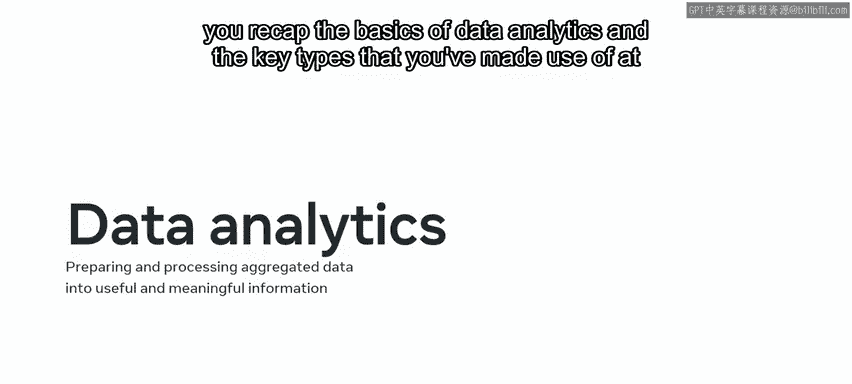

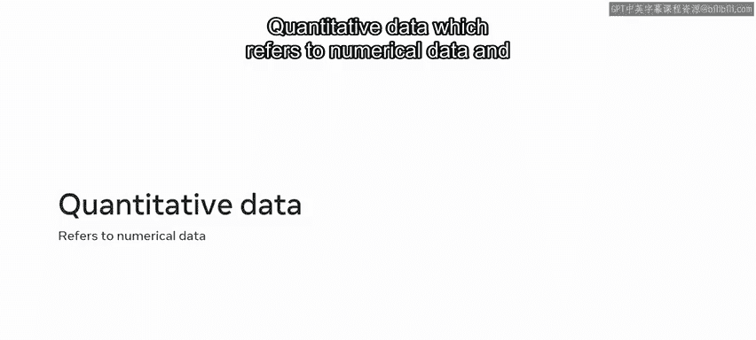

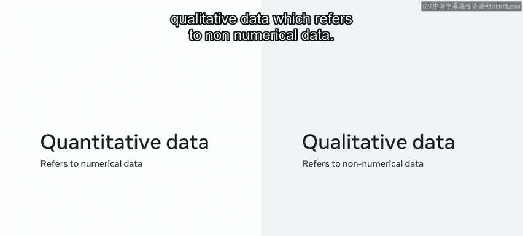

在本课程的第三个模块中，你在维度和度量的背景下探索了**数据分析**，并学习了如何使用高级分析工具执行可视化数据分析。

你从数据分析的概述开始，回顾了数据分析的基础知识以及在数据库工程旅程中使用过的关键类型。

你还了解到你将处理两种通用类型的数据：**定量数据**（指数值数据）和**定性数据**（指非数值数据）。

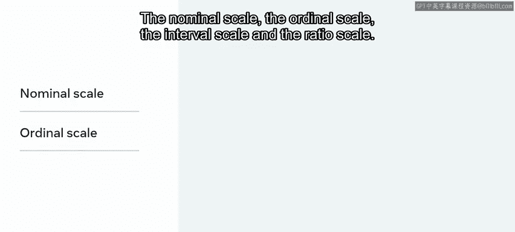

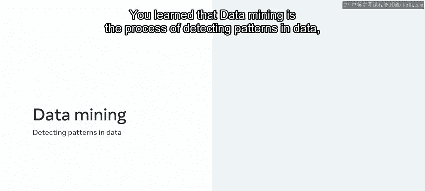

当你确定了需要哪种数据后，可以使用四种测量尺度来处理和分析它：
*   **定类尺度**
*   **定序尺度**
*   **定距尺度**
*   **定比尺度**

接下来，你学习了**数据挖掘**和**机器学习**的主题。数据挖掘是检测数据中模式的过程，而机器学习是教会计算机如何学习的过程。机器学习利用数据挖掘模型来处理数据，例如：
*   **分类分析**
*   **关联规则**
*   **聚类分析**
*   **回归分析**

然后你学习了**数据可视化**。在可视化数据时，你必须考虑你的受众以及他们寻找的信息，然后需要选择一个能最好地传达此信息的合适图表。

最后，你通过一个讨论提示结束了本课，该提示围绕你在工作中使用何种数据分析报告展开。

## Tableau 数据分析工具 🎨

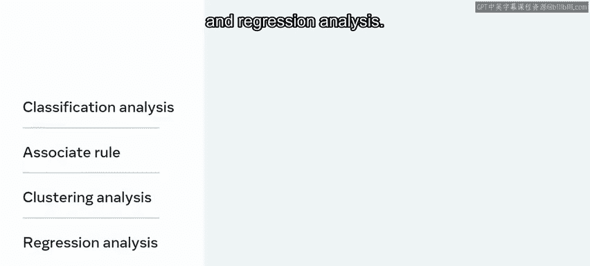

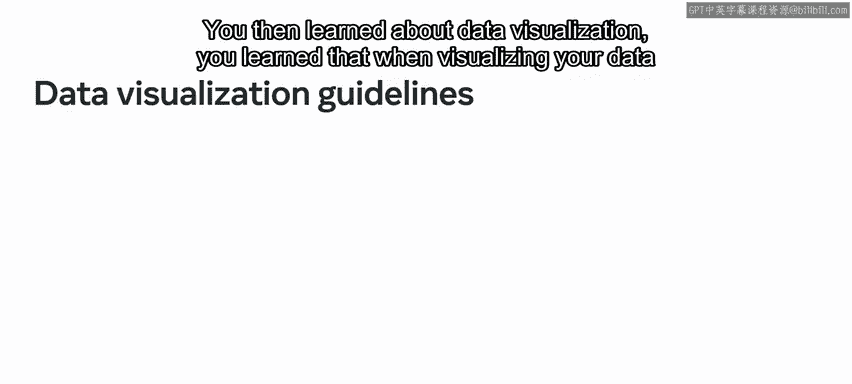

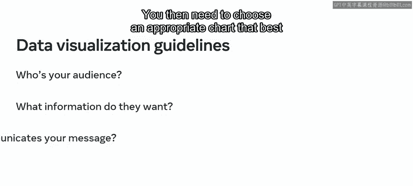

在本模块的最后一课中，你回顾了数据分析的主题，并学习了如何使用像 **Tableau** 这样的数据分析工具。

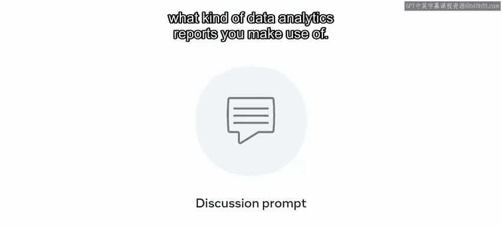

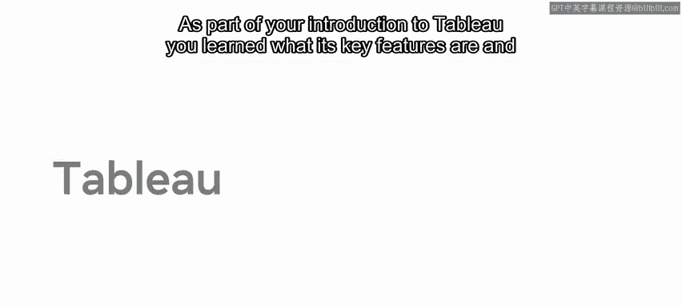

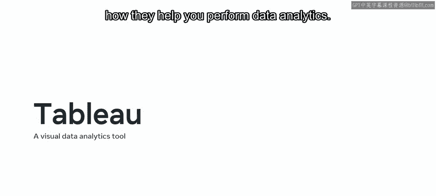

作为 Tableau 介绍的一部分，你了解了它的主要功能以及它如何帮助你进行数据分析。然后你学习了如何使用 Tableau 分析数据，这包括以下步骤：
1.  下载、启动并导航 Tableau。
2.  加载并准备待分析的数据。
3.  过滤和可视化数据。
4.  创建交互式仪表板。

最后，你进行了一个实验练习，在 Tableau 中执行了数据分析。

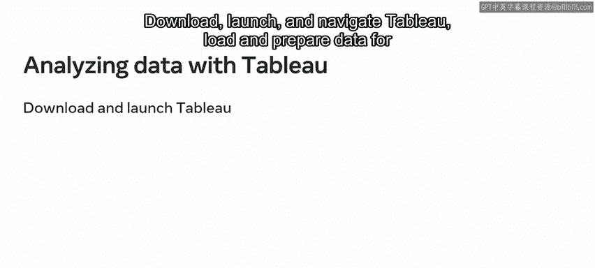

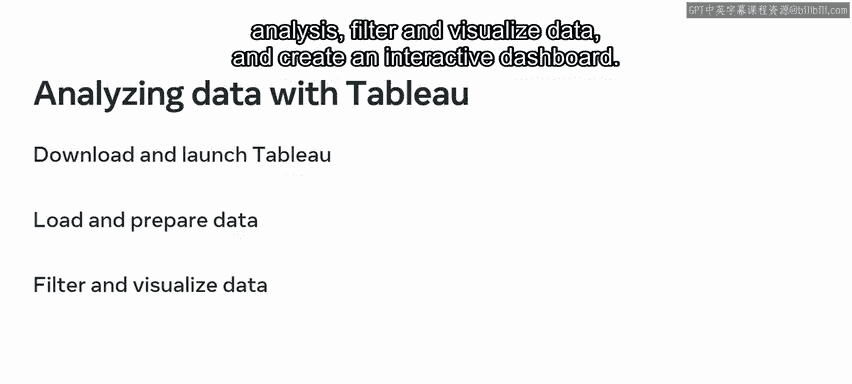

## 总结 🎯

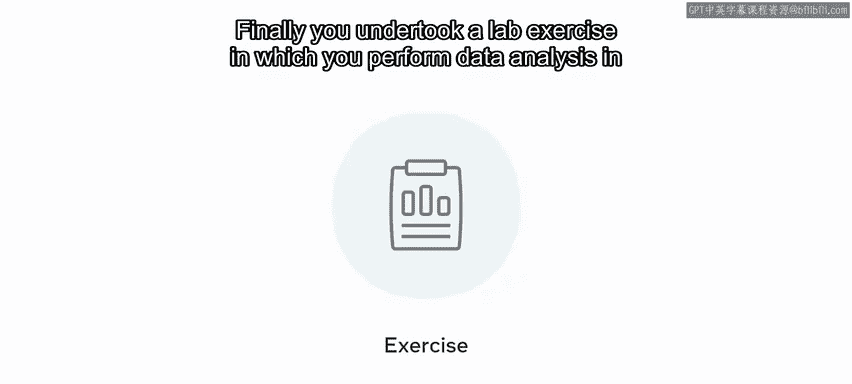

本节课中我们一起回顾了《高级数据建模》课程的全部核心内容。我们从数据模型的基础概念出发，逐步深入到数据库规范化、MySQL Workbench 工具的使用、数据仓库的架构与维度建模，最后学习了数据分析的基础知识以及如何使用 Tableau 进行可视化分析。现在，是时候在分级评估中尝试运用你所学的知识了。祝你好运！