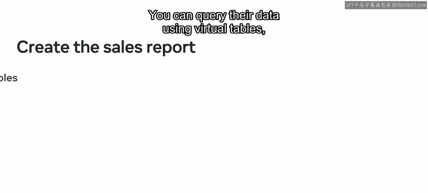
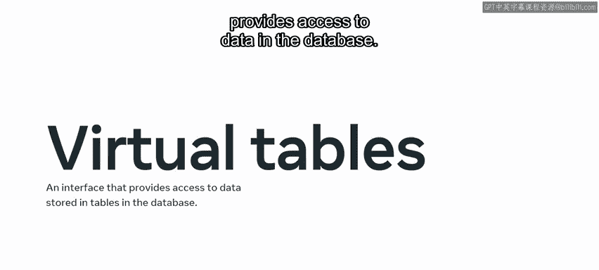
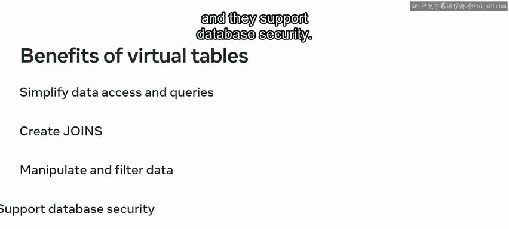
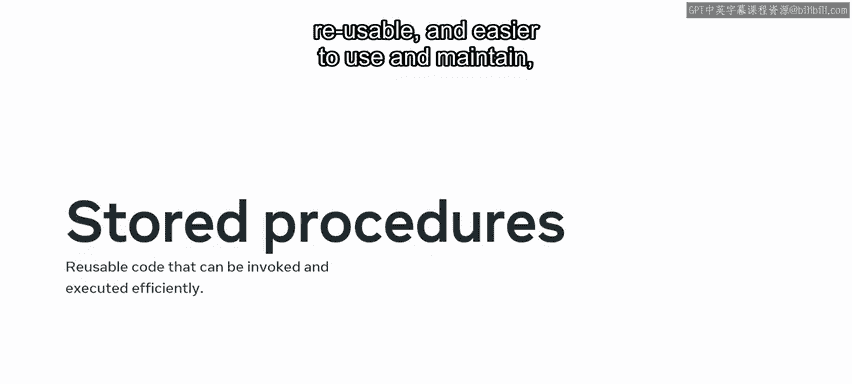
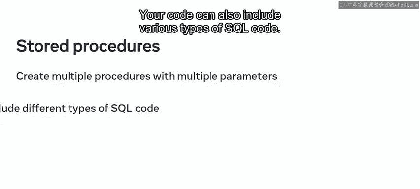
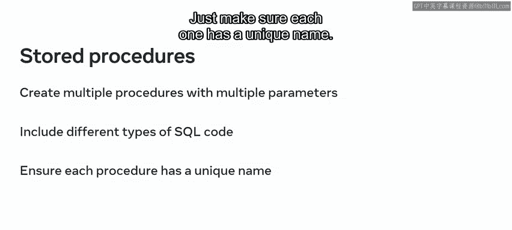
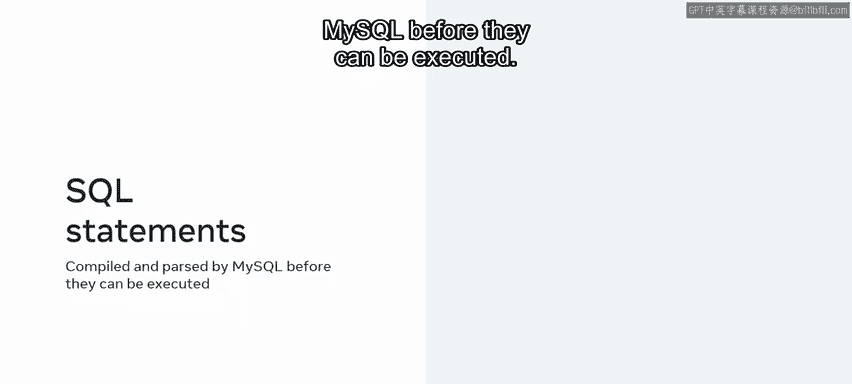
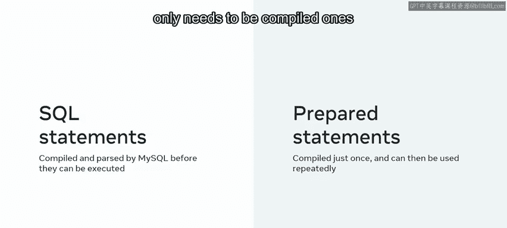
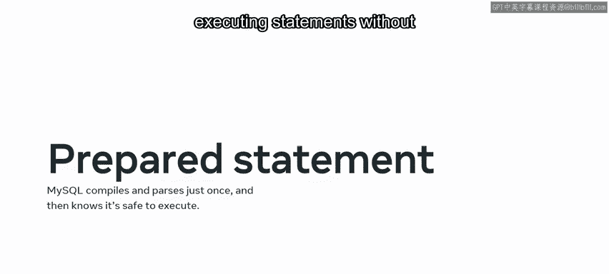

# Python 119：为Little Lemon销售数据创建报告查询 📊

在本节课中，我们将学习如何为Little Lemon餐厅创建销售报告。我们将利用虚拟表、连接、存储过程和预处理语句等技术，从数据库中查询和整理所需的数据。

## 概述

Little Lemon需要从其数据库中的数据创建销售报告。我们可以通过查询数据来帮助他们生成这份报告。查询数据时，我们将使用虚拟表、连接、存储过程和预处理语句。

## 虚拟表（视图） 📋

上一节我们介绍了本课程的目标，本节中我们来看看虚拟表。虚拟表利用其他表中存在的数据，它本身并不物理存储任何数据。它更像是一个提供数据库数据访问的接口。

使用虚拟表有几个好处。以下是其主要优点：

*   简化数据访问和查询。
*   可用于创建虚拟表和基表之间的连接。
*   可以高效地操作和过滤数据。
*   支持数据库安全。

创建虚拟表时，您将使用连接从多个表中构建视图。

## 连接（JOIN） 🔗

上一节我们介绍了虚拟表，本节中我们来看看连接。连接用于基于一个公共列将一个或多个表中的数据记录链接起来。

您可能使用连接来查找数据库中特定活动或对象的信息，或者您可能需要查找相关信息存在于多个表中的情况。

在这些课程中，我们探讨了几种类型的连接。这些包括：

*   **INNER JOIN**：返回两个表中匹配的行。
*   **LEFT JOIN**：返回左表的所有行，以及右表中匹配的行。
*   **RIGHT JOIN**：返回右表的所有行，以及左表中匹配的行。
*   **SELF JOIN**：表与自身连接。
*   **FULL OUTER JOIN**：返回两个表中所有的行。

您可以使用这些连接来查询Little Lemon的数据库并检索他们所需的信息。

## 存储过程 🛠️

上一节我们介绍了如何使用连接查询数据，本节中我们来看看存储过程。存储过程的主要目的是创建可重用的代码块，这些代码块可以被高效地调用和执行。

这使您的代码更加一致、可重用，并且更易于使用和维护。因此，您无需重复键入相同的代码，而是可以将代码块保存为存储过程，然后在需要时调用。

您可以创建任意数量的存储过程，它们可以包含多个参数。您的代码也可以包含各种类型的SQL代码。只需确保每个存储过程都有唯一的名称。

请记住，创建存储过程的方式取决于您需要完成的任务。

## 预处理语句 ⚡

上一节我们介绍了存储过程，本节中我们来看看预处理语句。每次创建SQL语句时，MySQL都需要在语句执行之前对其进行编译和解析。

一个更高效的方法是创建一个预处理语句，它只需要编译一次，然后就可以重复使用。换句话说，您可以创建一个预处理语句，MySQL在执行前仅编译和解析一次。

因此，每次调用该语句时，MySQL都知道它已准备就绪并且可以安全执行。

预处理语句是一种更高效、更优化的执行语句方式，无需消耗宝贵的MySQL资源。

## 总结

本节课中，我们一起学习了为Little Lemon创建销售报告所需的技术和方法。您现在应该熟悉了使用虚拟表、连接、存储过程和预处理语句来查询和整理数据。如果您需要更多关于这些主题的信息，请记住您可以复习之前课程的学习材料。