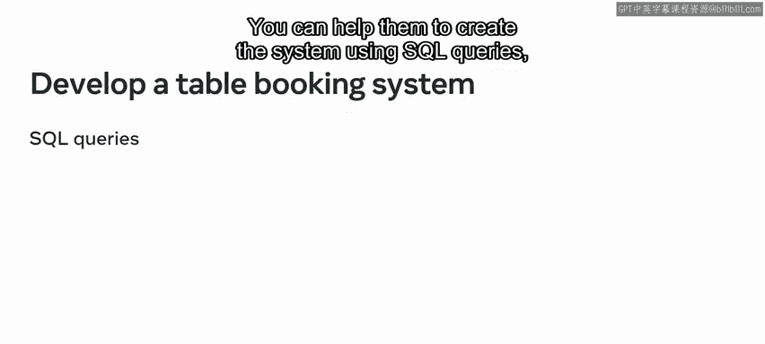
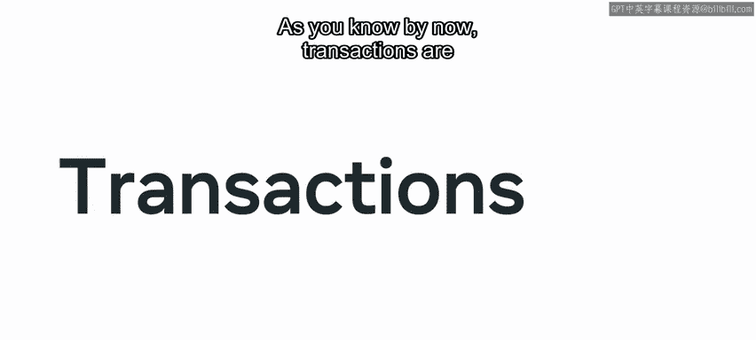
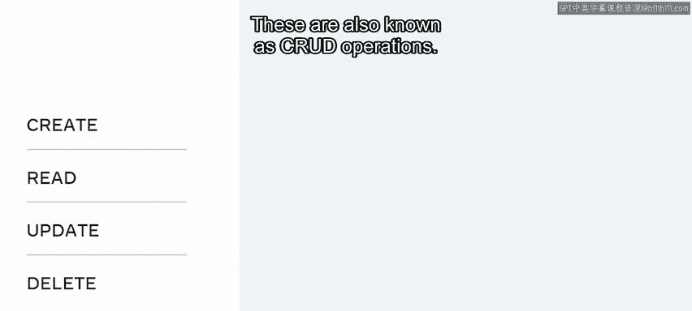
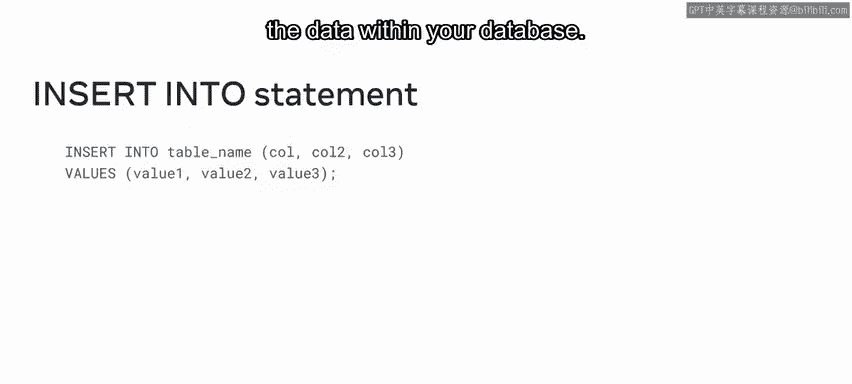
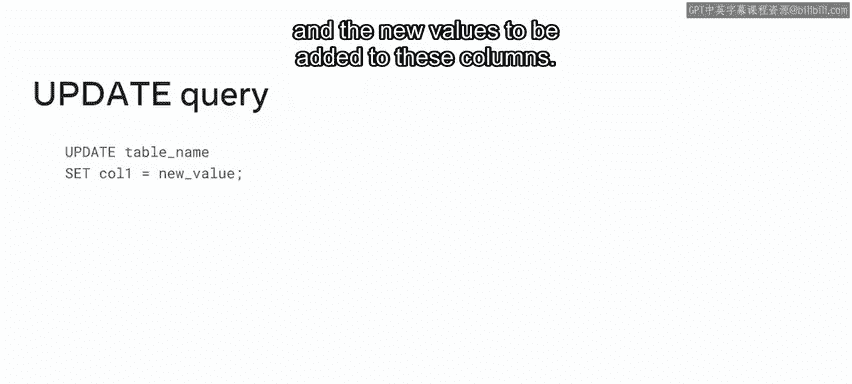
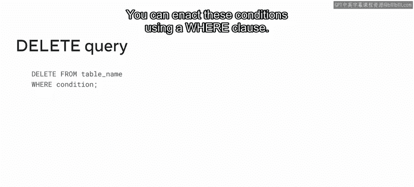
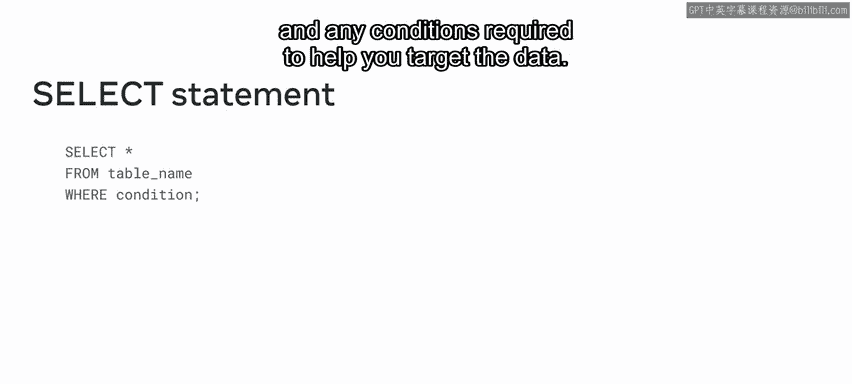
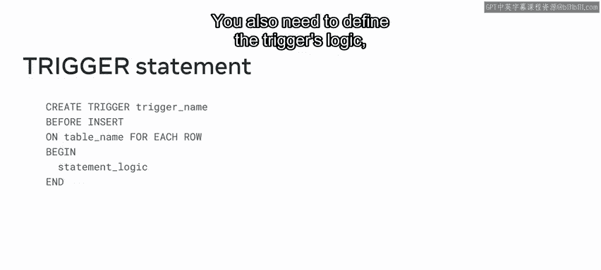

# Python 120：开发桌面预订系统 🍋

在本节课中，我们将学习如何为Little Lemon餐厅开发一个数据库内的餐桌预订系统。我们将运用SQL事务、CRUD操作以及触发器的知识，来创建、管理和测试这个系统。

---



## 开发预订系统的基础：SQL事务与CRUD操作

开发一个餐桌预订系统需要使用SQL事务或查询。



正如目前所了解的，事务是在数据库内执行的语句。需要用到的主要语句类型包括创建、读取、更新和删除查询，这些也被称为CRUD操作。

接下来，我们将回顾如何使用这些查询来完成本课任务的基础知识。

---

## 创建数据：新增预订

您可以通过创建新预订形式的数据，来帮助Little Lemon开发和填充其餐桌预订系统。

可以使用标准的`INSERT INTO`语句来创建数据。请确保在语法中明确以下几点：
*   要插入数据的表名。
*   必须填充的列。
*   这些列需要包含的值。

执行此语句即可在数据库中创建数据。

**示例代码：**
```sql
INSERT INTO Bookings (GuestName, BookingDate, TableNumber)
VALUES ('John Doe', '2023-10-27 19:00', 5);
```



---



## 更新与删除数据：处理变更

有时，最初创建的数据可能需要更改。例如，客人可能想更新预订，或者取消了预订，因此需要从表中删除其数据。您可以使用`UPDATE`和`DELETE`语句来执行这些操作。

使用`UPDATE`查询来修改表中的信息。在查询中需明确以下信息：
*   要更新的表名。
*   要更新的列。
*   要添加到这些列的新值。

**示例公式：**
`UPDATE 表名 SET 列名 = 新值 WHERE 条件；`

如果您要从表中删除或移除信息，则需要使用`DELETE`查询。您的删除查询必须包含以下信息：
*   包含待删除数据的表名。
*   与该数据相关的任何条件。您可以使用`WHERE`子句来设定这些条件。

---

## 验证操作：读取数据

在预订表中创建、更新或删除数据后，您需要运行测试以确保查询已成功执行。







您可以通过读取数据来进行这些测试。读取查询会返回与语句中条件匹配的所有信息。一个基本的读取查询示例是`SELECT`语句。在这种情况下，必须确保`SELECT`语句包含以下内容：
*   存储数据的表和列的名称。
*   您需要的值。
*   帮助您定位数据所需的任何条件。

**示例代码：**
```sql
SELECT * FROM Bookings WHERE BookingDate = '2023-10-27';
```

在本课程中，您已经探索了许多读取查询的示例。重要的是要记住，确保在语句中包含能精确定位所需数据的条件。这条建议适用于所有类型的操作。

---

## 增强功能：使用触发器

您还可以通过使用触发器来增强事务。MySQL触发器是一组以存储程序形式存在的操作。当某些事件发生时，这组操作会自动调用。



您可以为不同类型的事件（如CRUD操作）使用触发器。要使用触发器，首先需要使用`CREATE TRIGGER`语句创建它，然后定义触发器类型（是插入、更新还是删除触发器），以及它应该在事件之前还是之后执行。您还需要定义触发器的逻辑，指定它分配给哪个表，以及应如何应用于该表。

---

## 版本控制与提交

一旦确认代码正确，您可以将进度提交到Git。实施版本控制也是一个好主意。这样，您可以跟踪显示项目不同开发阶段的快照，并在需要时回滚到以前的版本。

---

## 总结

本节课中，我们一起学习了如何利用SQL查询和事务来帮助Little Lemon在其数据库中开发预订表系统。我们涵盖了使用`INSERT`创建预订、使用`UPDATE`和`DELETE`管理变更、使用`SELECT`验证数据，以及使用触发器自动化操作。最后，我们还提到了使用Git进行版本控制的重要性。现在，您应该已经准备好运用这些知识来构建系统了。如果需要更多信息，请记得复习之前课程的学习材料。祝您好运。