# Python 121：模块小结 📊

在本模块中，我们帮助小柠檬餐厅从其数据库中的数据创建了销售报告，并协助他们构建了一个餐桌预订系统。现在，让我们花几分钟时间来回顾一下在本模块中完成的任务、使用的流程和工具。

## 任务一回顾：创建销售报告

在第一个任务中，我们通过使用虚拟表、连接、存储过程和预处理语句查询数据库，为小柠檬餐厅创建了销售报告。

### 虚拟表的使用

我们帮助小柠檬餐厅使用虚拟表来查询数据库，以便利用存在于其他表中的数据。虚拟表的好处包括：
*   简化数据访问和查询。
*   能够从虚拟表和基表创建连接。
*   高效地操作和筛选数据。
*   支持数据库安全性。


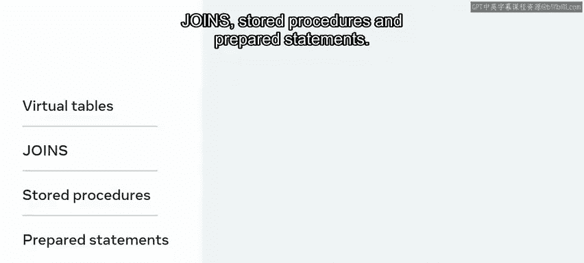

虚拟表可以通过 `CREATE VIEW` 语句创建：
```sql
CREATE VIEW view_name AS
SELECT column1, column2, ...
FROM table_name
WHERE condition;
```


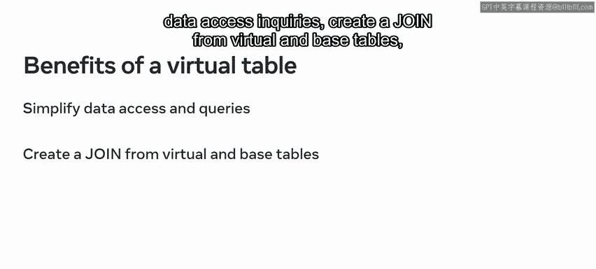

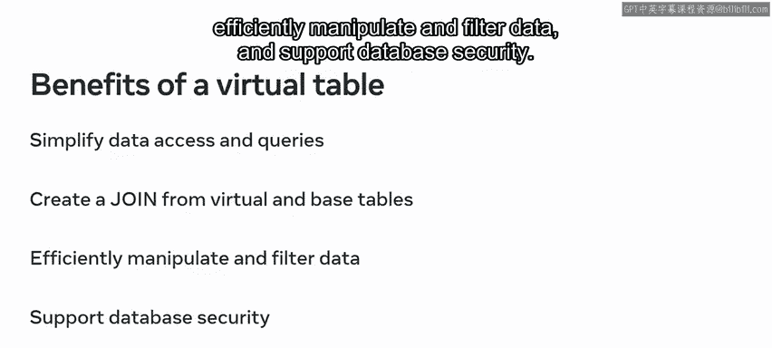

### 连接（JOIN）子句

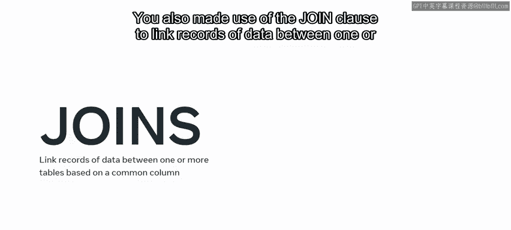

我们还使用了连接子句，基于一个共同的列来链接一个或多个表之间的数据记录。在本模块中，我们使用了以下几种连接类型：


*   **内连接（INNER JOIN）**：返回两个表中匹配的记录。
    ```sql
    SELECT * FROM table1 INNER JOIN table2 ON table1.column = table2.column;
    ```
*   **左连接（LEFT JOIN）**：返回左表的所有记录，以及右表中匹配的记录。
    ```sql
    SELECT * FROM table1 LEFT JOIN table2 ON table1.column = table2.column;
    ```
*   **右连接（RIGHT JOIN）**：返回右表的所有记录，以及左表中匹配的记录。
    ```sql
    SELECT * FROM table1 RIGHT JOIN table2 ON table1.column = table2.column;
    ```
*   **自连接（SELF JOIN）**：表与自身连接。
*   **全外连接（FULL OUTER JOIN）**：返回两个表中所有的记录。

### 存储过程

我们帮助小柠檬餐厅使用了存储过程。存储过程用于创建可重用的代码块，可以高效地调用和执行。使用存储过程使代码更加一致、可重用，并且更易于使用和维护。这样，我们无需重复输入相同的代码，而是可以将代码块保存为存储过程，在需要时调用。

我们可以创建多个存储过程，每个过程可以包含多个参数。在创建过程中，我们可以包含各种语法元素，如SQL语句、变量和控制结构，同时确保每个存储过程都有唯一的名称。创建存储过程的方式取决于需要完成的任务。

存储过程的基本创建语法如下：
```sql
DELIMITER //
CREATE PROCEDURE procedure_name (IN param1 datatype, ...)
BEGIN
    -- SQL statements
END //
DELIMITER ;
```

### 预处理语句

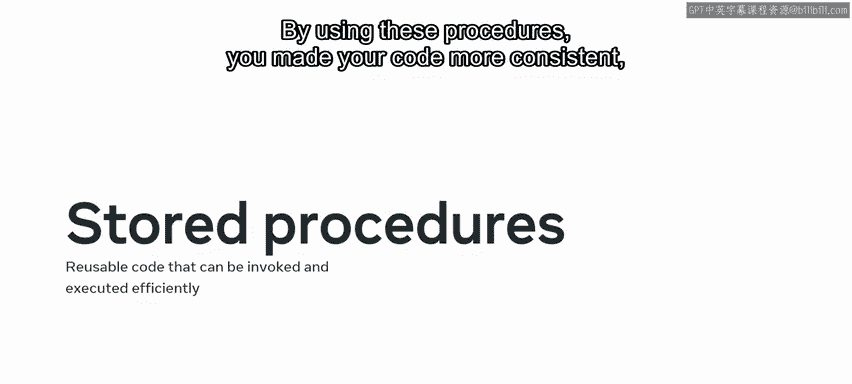

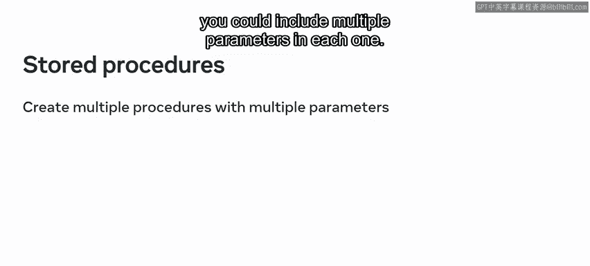

我们还协助小柠檬餐厅使用了预处理语句。每次小柠檬创建SQL语句时，MySQL都需要在执行前对其进行编译和解析。我们向他们展示了一种更高效的方法是创建预处理语句。

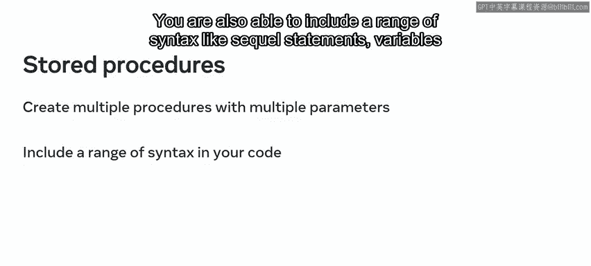

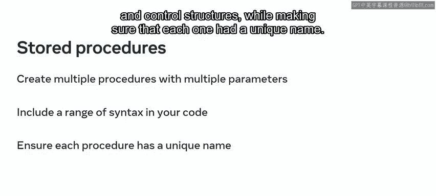

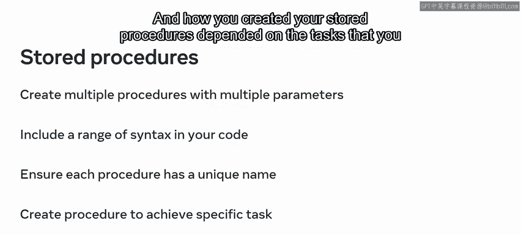

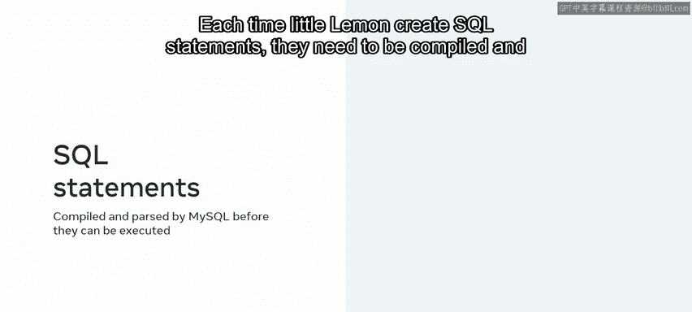

预处理语句可以重复使用，无需每次编译。这是一种更高效、更优化的执行语句方式，不会占用宝贵的MySQL资源。MySQL在预处理语句执行前仅编译和解析一次。

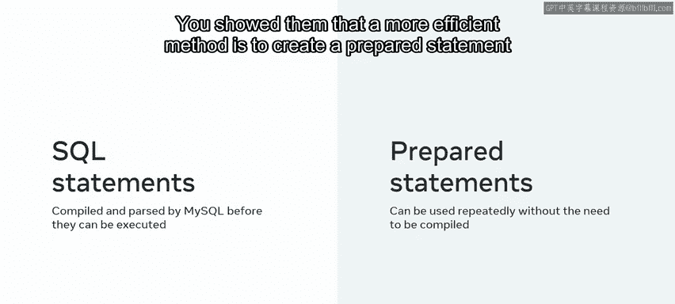

预处理语句的使用示例：
```sql
PREPARE stmt_name FROM 'SELECT * FROM table WHERE column = ?';
SET @value = 'some_value';
EXECUTE stmt_name USING @value;
DEALLOCATE PREPARE stmt_name;
```

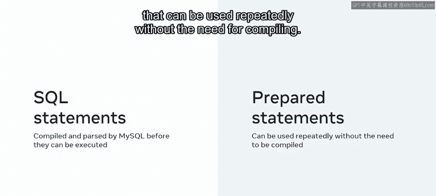

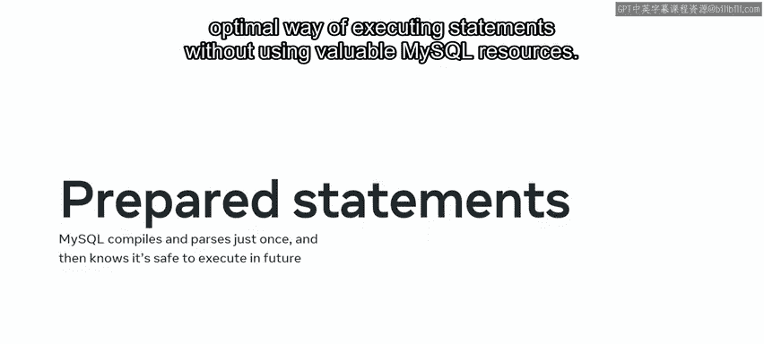

---

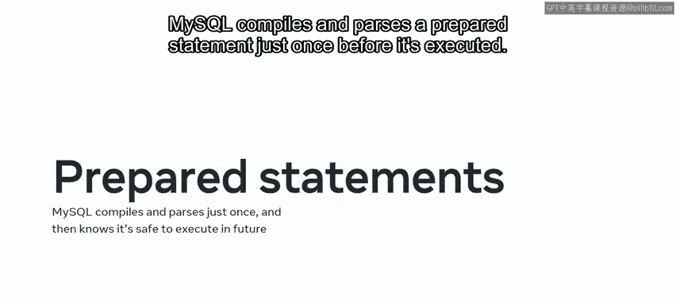

## 任务二回顾：构建餐桌预订系统

在本模块的第二课中，我们帮助小柠檬餐厅在其数据库中构建了一个餐桌预订系统，用于跟踪到访餐厅的客人。

### 数据的创建、更新与删除

我们通过创建新预订形式的数据，帮助小柠檬餐厅开发和填充其餐桌预订系统。我们使用标准的 `INSERT INTO` 语句创建数据，并在语法中明确以下内容：要插入数据的表、要填充的列以及它们需要包含的值。然后，我们执行 `INSERT INTO` 语句以在数据库中创建数据。

有时，最初创建的数据需要更改。我们能够使用 `UPDATE` 和 `DELETE` 语句来执行这些操作。我们使用 `UPDATE` 查询来更改表中的信息，同时在每个查询中明确关键信息。当需要从表中删除信息时，我们再次使用 `DELETE` 查询，并确保明确关键信息。

以下是基本语法示例：
```sql
-- 插入数据
INSERT INTO table_name (column1, column2) VALUES (value1, value2);

-- 更新数据
UPDATE table_name SET column1 = new_value WHERE condition;

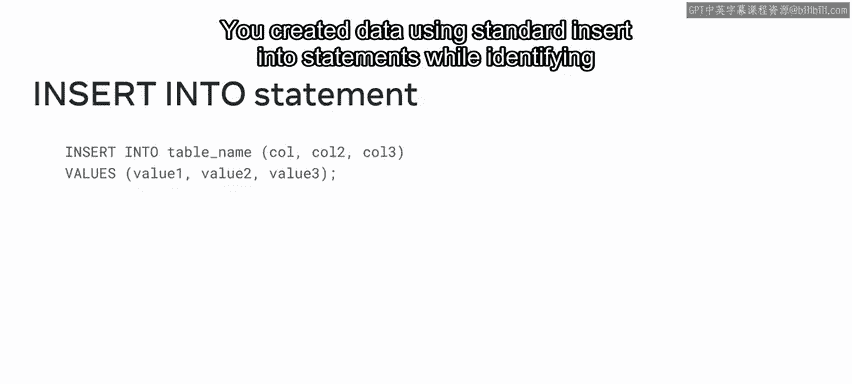

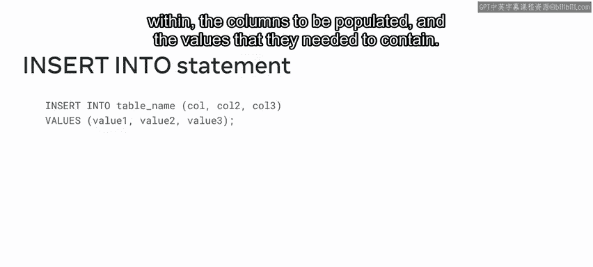

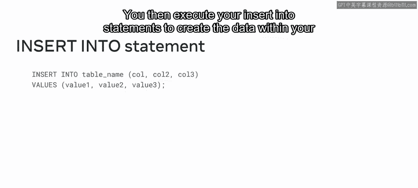

-- 删除数据
DELETE FROM table_name WHERE condition;
```

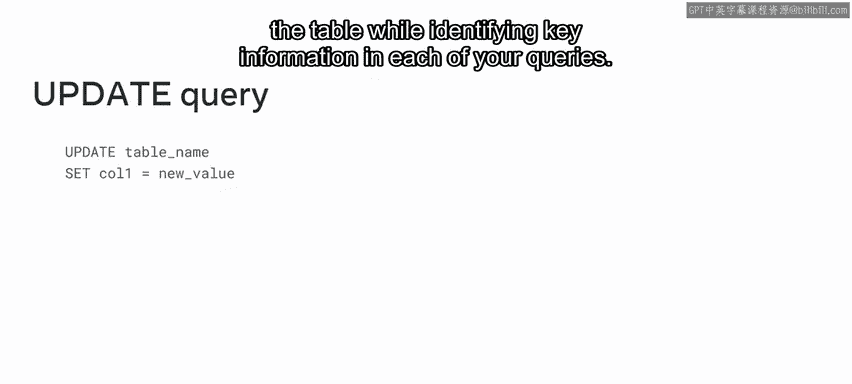


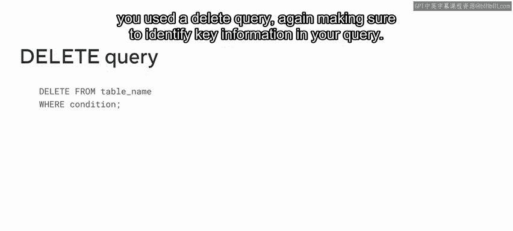

### 数据验证与查询

在预订表中创建、更新或删除数据后，我们运行测试以确保查询成功执行。我们使用 `SELECT` 语句等读取查询来执行这些测试。在这种情况下，我们确保 `SELECT` 语句包含以下内容：包含数据的表和列的名称、所需的值以及任何有助于定位数据的条件。

```sql
SELECT column1, column2 FROM table_name WHERE condition;
```

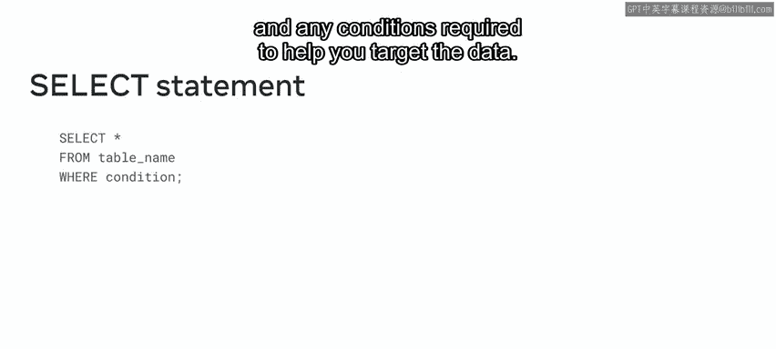

### 触发器（Triggers）的使用

我们还使用了触发器，将一组操作以存储程序的形式保存起来，当特定事件发生时可以自动调用。要使用触发器，首先使用 `CREATE TRIGGER` 语句创建它们。然后定义触发器类型，例如，指定它们是插入、更新还是删除触发器，以及它们应该在事件之前还是之后执行。我们还定义了触发器的逻辑，指定了它们被分配到的表以及应如何应用于该表。

创建触发器的基本语法：
```sql
CREATE TRIGGER trigger_name
BEFORE/AFTER INSERT/UPDATE/DELETE ON table_name
FOR EACH ROW
BEGIN
    -- trigger logic
END;
```

一旦确信代码正确，我们便提交进度以获得一个已实施的版本控制。

---

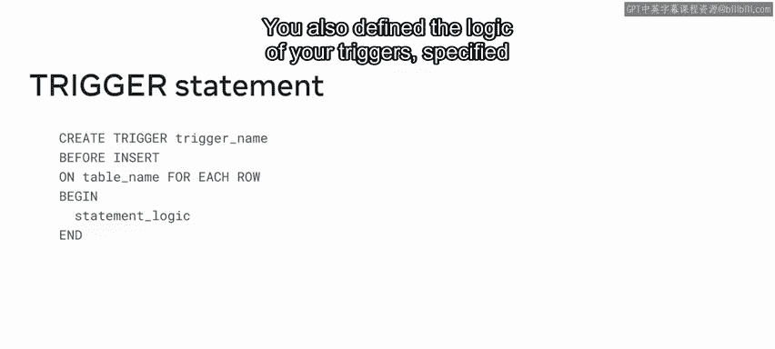

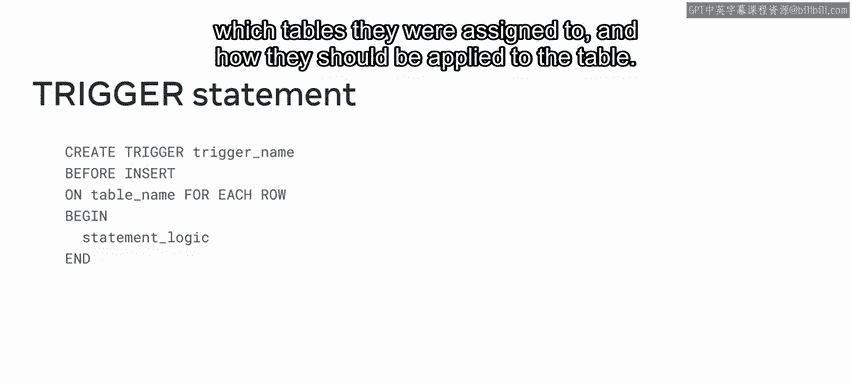

## 总结

在本节课中，我们一起学习了如何帮助小柠檬餐厅使用数据库查询、存储过程和预处理语句来创建销售报告和餐桌预订系统。我们回顾了虚拟表、各种连接、存储过程、预处理语句的创建与使用，以及如何在预订系统中进行数据的增删改查和利用触发器自动化任务。掌握这些工具和技术对于高效管理和操作数据库至关重要。期待在下一个模块中继续为大家提供更多指导。