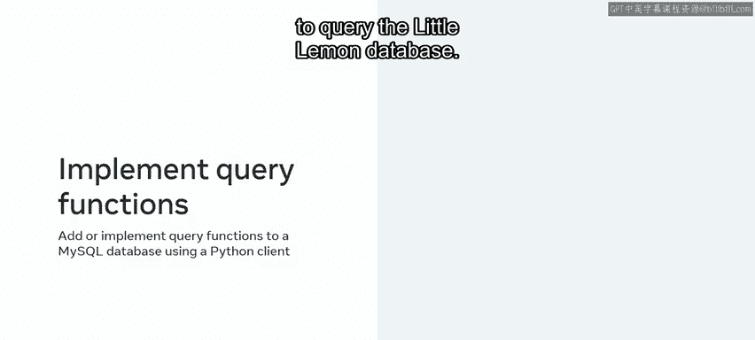

# Python 124：模块小结 🎯

在本模块中，我们帮助小柠檬餐厅进行了高级数据分析以生成数据洞察，并为他们的业务决策提供信息。我们还帮助他们创建了一个数据库客户端，使他们能够通过基于Python的应用程序与数据库进行交互。

现在，让我们花几分钟回顾一下本模块中使用的任务、流程和工具。

## 第一课：使用Tableau进行数据分析 📊

上一节我们介绍了本模块的目标，本节中我们来看看第一课的具体内容。在第一课中，我们使用Tableau帮助小柠檬餐厅利用其数据分析功能生成洞察。

Tableau是一个广泛使用的数据可视化工具。它提供了几个关键功能，我们在分析数据时得以利用。

以下是Tableau的主要功能：
*   **连接多种数据源**：能够连接到广泛的数据源。
*   **处理大量不同数据类型**：可以处理大量不同类型的数据。
*   **创建可视化数据图表**：能够创建可视化的数据图表。
*   **生成实时交互式仪表板**：可以生成实时交互式仪表板。
*   **支持Python和R脚本**：支持使用Python和R编写脚本。
*   **使用交互式UI工具完成任务**：可以通过交互式用户界面工具完成任务。

我们还利用了仪表板功能来分析数据。我们通过启动页面的“连接”窗格将数据源连接到Tableau。

连接数据源后，我们使用创作工作区的UI元素（如工作表、仪表板和故事）来创建数据可视化。我们使用工作表将数据添加到视图中，利用“标记”卡进行分析和可视化数据，并使用行和列功能区。

然后，我们通过一系列处理步骤为分析准备数据，例如：
*   **拆分数据以提高可访问性**。
*   **创建计算数据字段**。
*   **修正数据类型**。
*   **使用Tableau过滤数据**。

我们还利用软件的过滤和可视化功能来聚焦相关数据，以便只关注所需的数据。我们使用了**下钻**、**上卷**和其他过滤功能，从不同角度或不同详细程度展示数据。

此外，我们使用Tableau以仪表板的形式生成**交互式、实时的数据可视化**。我们精心组织的仪表板有助于为小柠檬餐厅的重要业务问题提供清晰的视图和相关答案。

## 第二课：使用Python创建数据库客户端 🐍

在学习了如何使用Tableau进行可视化分析后，本节我们将转向编程工具。在下一课中，我们帮助小柠檬餐厅创建了一个数据库客户端，使他们能够通过基于Python的应用程序与数据库交互。

我们首先使用命令提示符确认了机器上运行的Python版本。在确认正确安装了Python后，我们检查了正在运行的Python 3的具体迭代版本，并确保它与Python官方网站上的最新迭代版本匹配。

确认Python环境后，我们选择了一个IDE（集成开发环境）来运行代码。在本课程中，我们使用Jupyter IDE来演示Python。我们遵循了Jupyter的安装过程，然后输入`jupyter notebook`命令，在默认浏览器中打开一个新的Jupyter笔记本实例。

接着，我们将Python连接到小柠檬的MySQL数据库。我们使用一个专门构建的Python库——`mysql-connector-python`——来完成安装。我们能够使用Pip软件包管理器来实现这一点。安装后，我们检查了环境是否配置正确，以确保库被成功导入。

以下是关键的命令行操作：
```bash
# 检查Python版本
python --version

# 使用pip安装MySQL连接器
pip install mysql-connector-python

# 启动Jupyter Notebook
jupyter notebook
```

设置好Python环境后，我们便可以开始使用数据库客户端。我们完成了一个练习，在其中使用Python添加或实现了查询函数来查询小柠檬数据库。最后，我们将进度提交到了Git。



## 总结 📝

在本节课中，我们一起学习了如何帮助小柠檬餐厅执行高级数据分析以生成数据洞察，从而为他们的业务决策提供信息。同时，我们也帮助他们创建了一个可以使用基于Python的应用程序进行交互的数据库客户端。


做得好。我期待在下一个模块中为您提供更多指导。