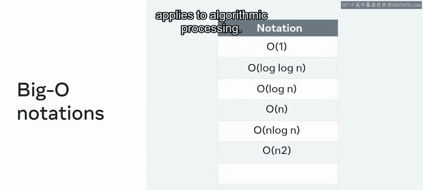
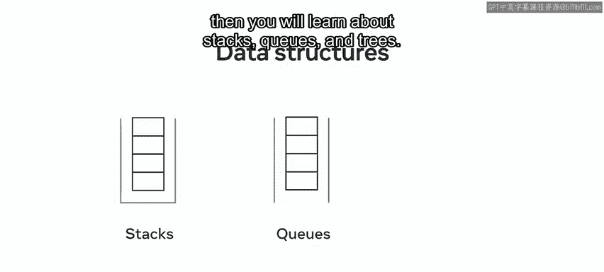
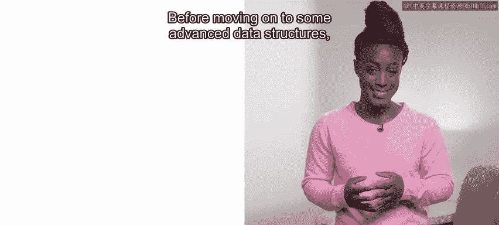
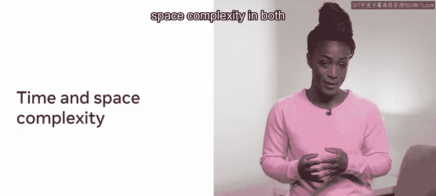
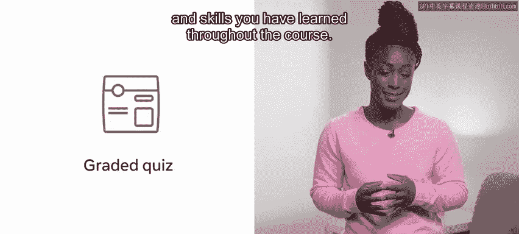

# 127：0_课程介绍

在本节课中，我们将要学习Meta《数据库工程师》课程中关于编程面试准备的介绍部分。我们将了解课程的整体结构、涵盖的核心概念以及学习目标，为后续深入学习打下基础。

## 课程概述

欢迎来到编程面试准备课程。本课程将帮助你为编程面试中独特且具有挑战性的环节做好准备，包括你需要了解或应用的一些问题解决方法与计算机科学基础知识。

## 课程内容预览

以下是本课程将涵盖的关键概念与技能概览。

### 第一模块：面试基础与计算机科学入门

上一节我们介绍了课程目标，本节中我们来看看第一个模块的内容。你将首先了解什么是编程面试、它可能包含的内容以及你可能遇到的各种面试类型。

你还会探索如何为编程面试做准备，重点包括沟通技巧，例如解释你的思考过程、处理错误以及STAR方法。你也将学习如何使用伪代码来演示你如何得出解决方案。

以下是一些有助于任何实际解决方案设计的重要提示，以及如何测试你的解决方案。

接下来，你将学习计算机科学入门知识，从二进制的基本概念开始，了解二进制如何与现实生活中的硬件和计算相关联。

你将探索内存以及计算机内存的关键组件：随机存取存储器（RAM）和只读存储器（ROM），并了解你的计算机如何使用内存来执行任务、处理信息和存储数据。

随后，你将深入学习时间复杂度的核心概念——大O表示法。


**公式：** `O(n)`， `O(log n)`， `O(n²)` 等。



你将了解一些大O表示法的类型，以及它如何应用于算法处理。

你还会探索空间复杂度，这本质上是计算结果所需的空间。

### 第二模块：数据结构

在了解了计算机科学基础后，本节我们将转向数据结构。你将学习数据结构，并理解每种数据结构都伴随着特定的优点和局限性，因此在设计解决方案时理解它们至关重要。

你将从基本数据结构开始，了解不同编程语言中数据结构的实现与能力，以及其总体架构的相似模式。

你将探索主要的基本数据结构：字符串、整数、布尔值、数组和对象。

接下来，你将研究一些集合数据结构，从列表和集合开始。



然后，你将学习栈、队列和树。



**代码示例（栈的LIFO原则）：**
```python
stack = []
stack.append(‘A‘) # 入栈
stack.append(‘B‘)
top_element = stack.pop() # 出栈，返回 ‘B‘
```

在学习了基础与集合数据结构后，我们将继续学习一些高级数据结构，即哈希表、堆和图。

**代码示例（哈希表查找）：**
```python
hash_table = {‘key1‘: ‘value1‘, ‘key2‘: ‘value2‘}
value = hash_table.get(‘key1‘) # 高效查找，返回 ‘value1‘
```

### 第三模块：算法

掌握了数据结构后，本节我们将进入算法世界。你将学习算法入门，包括可用的算法类型以及如何最好地使用它们来排序和搜索数据。

你将首先探索排序算法，了解处理已排序数据或能够对自有数据进行排序如何能显著节省时间。你将探索三种主要排序类型：选择排序、插入排序和快速排序。


你将了解到每种方法都有其权衡，在某些环境下比在其他环境下更有效。

接下来，你将探索搜索算法，了解每种类型如何为其自身的问题解决提供框架。

**公式（二分查找时间复杂度）：** `O(log n)`

你还将深入了解搜索和排序算法中的时间与空间复杂度。

你将深入探讨分治法、递归、动态规划和贪心算法所涉及的过程与底层机制。



### 最终模块：复习与测验




最后，在最后一个模块中，你将有机会在参加分级课程测验前，复习在整个课程中学到的所有内容。该测验将测试你在整个课程中学到的所有关键概念和技能。

## 总结

本节课中，我们一起学习了本课程的广泛概述。具体来说，你了解了本课程将如何帮助你为潜在的编程面试中独特且具有挑战性的方面做好准备，包括你可能需要了解或应用的一些问题解决方法与计算机科学基础知识。

现在，让我们开始学习吧。