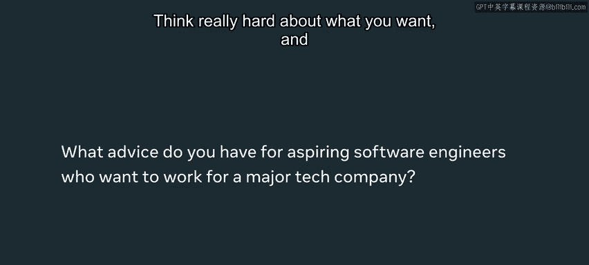

# Python 128：技术招聘过程介绍 🎯

在本节课中，我们将一起了解大型科技公司（以Meta为例）完整的技术招聘流程。我们将从流程概览开始，逐步深入到申请、面试和录用后的各个阶段，并学习来自Meta工程师们的宝贵建议。

## 流程总览

上一节我们介绍了课程背景，本节中我们来看看技术招聘的整体框架。根据Meta工程师们的分享，整个招聘过程可以大致分为三个主要阶段。

以下是这三个核心阶段：
*   **申请阶段**：简历筛选与初步沟通。
*   **面试阶段**：包含技术、行为和系统设计等多轮评估。
*   **校准与录用阶段**：面试官讨论并决定是否发放录用通知。

## 第一阶段：申请与筛选

在申请阶段，招聘人员会对候选人进行初步筛选。这个阶段会淘汰大量候选人，因此精心准备至关重要。

以下是申请阶段的关键环节：
1.  **简历筛选**：招聘人员会审查你的简历和工作经验。
2.  **初步沟通**：招聘人员会与你交流，以更好地了解你的技能、经验以及职业目标，确保你与职位相匹配。

## 第二阶段：面试环节详解

申请通过后，你将进入正式的面试环节。面试不仅考察编程能力，还评估人际交往、项目推动和团队协作等综合能力。

面试通常包含以下几种类型：
*   **技术面试**：可能涉及1到4轮甚至更多。例如**代码面试**，你需要在电话或语音聊天中与招聘人员或工程师一起解决技术挑战。
*   **行为面试**：面试官会了解你的工作方式以及你如何解决问题。
*   **系统设计面试**：你需要设计一个端到端的产品，并讨论其完整的系统架构。

**核心公式**：`成功的面试表现 = 技术能力 + 沟通协作 + 问题解决过程`

对于特定技术方向的职位（如iOS、Android、ML/AI），除了通用的算法和数据结构问题，你还需要准备该领域相关的专业知识。

## 第三阶段：校准与录用

所有面试结束后，招聘团队会聚在一起讨论你在各轮面试中的表现，并决定是否向你发出录用通知。

如果你接受了录用通知，你将进入一个称为“Bootcamp”的流程。在这个过程中，你将学习如何在Meta工作，并与你感兴趣的团队会面，最终由你选择加入哪个团队。

## 来自面试官的建议与常见陷阱

了解了流程后，我们来看看如何更好地准备以及需要避免哪些常见错误。工程师们指出，沟通和结构化思考是许多候选人的薄弱环节。

以下是面试官观察到的常见问题及建议：
*   **代码面试中的沟通缺失**：候选人不解释思路、不提问澄清问题、或不听取面试官的提示。
*   **缺乏结构化解题过程**：面对陌生问题时，没有清晰的解决步骤，直接开始“蛮干式”编码。
*   **过于执着**：遇到困难时陷入僵局，无法接受反馈。面试官看重的是你解决问题的整体方法，而不仅仅是最终答案。

**核心建议**：在模拟面试或练习时，即使遇到难题，也要**完整地走完整个面试流程**，这能为真实面试提供极佳的练习。



## 心态与长期准备

最后，我们来谈谈心态和长期职业规划。保持真实自我并选择与个人价值观相符的公司至关重要。

以下是关于心态和准备的建议：
1.  **做真实的自己**：以真实的面貌呈现自己，这会减轻压力并增加成功几率。
2.  **明确个人价值观**：在选择公司时，除了薪酬和声望，还应考虑那些影响你工作幸福感的因素。
3.  **大量练习与申请**：尽可能多地进行模拟面试，并向多家公司投递简历。每一次实战都是宝贵的经验。
4.  **保持学习与坚持**：面试过程必有起伏，这些都是可以学习的经验。持续学习和推动自己，终将开启精彩的技术生涯。

**代码块示例：模拟面试心态**
```python
# 保持积极，从每次经历中学习
def learn_from_interview(feedback):
    if feedback == "success":
        celebrate_and_prepare_for_next()
    else:
        analyze_weaknesses()
        practice_more()
    return growth

# 坚持是成功的关键
while not job_offer:
    keep_applying()
    keep_learning()
```

## 总结


本节课中我们一起学习了大型科技公司技术招聘的完整流程，包括申请、面试和录用三个阶段。我们深入探讨了技术、行为和系统设计等面试类型，并了解了面试官看重的核心能力——**技术实力、沟通协作和结构化的问题解决过程**。最后，我们获得了保持真实自我、进行大量练习以及明确个人职业价值观的重要建议。记住，充分的准备将使你有能力在世界范围内产生巨大影响，因为软件无处不在，被数十亿人使用。祝你面试顺利！