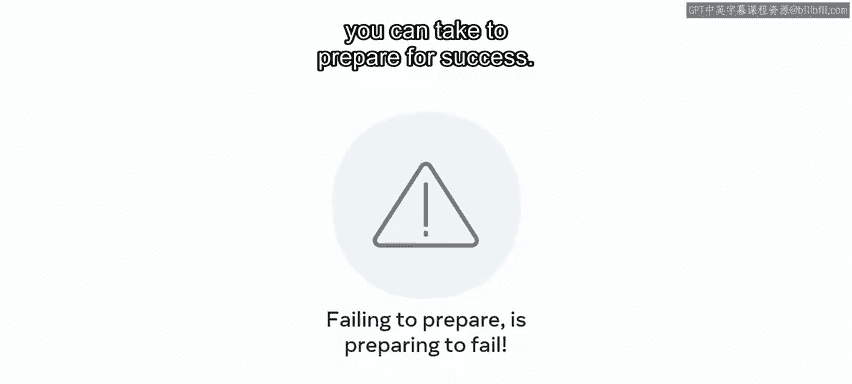
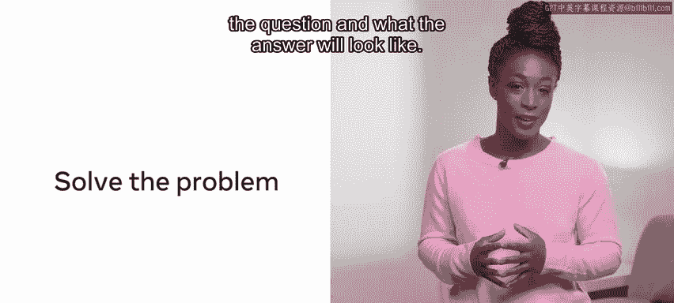
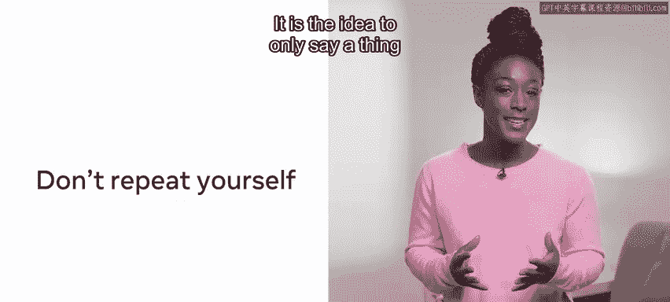
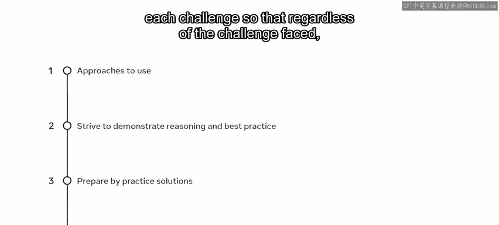

# Python 129：什么是编码面试 👨‍💻

在本节课中，我们将学习什么是技术面试，并掌握一套系统的方法来应对编码面试。我们将从面试的目的开始，逐步介绍准备和解题的核心步骤，包括概念理解、工具运用和代码优化。

## 概述

技术面试是您展示编码能力以证明自己胜任某个职位的环节。通常，您已经通过了初步的筛选电话面试，证明了您的软技能符合公司要求。软技能指的是您的社交行为能力，包括清晰的沟通、良好的职业道德，以及您的个人表现与公司价值观是否一致。技术面试的目的则是确定您在技术上能否承担该职位的责任。

## 面试方法步骤

面对编码面试时，牢记以下步骤将对您有所帮助。

以下是应对编码面试的四个关键步骤：

1.  **准备成功**：为面试做好充分准备。
2.  **先进行概念性解题**：在编写代码前，先在概念层面理解并解决问题。
3.  **运用合适的工具**：选择恰当的数据结构和算法。
4.  **优化解决方案**：改进代码的效率和质量。

深入理解这些概念将帮助您掌握如何应用这套方法。

## 第一步：准备成功

许多候选人在参加技术面试时可能会感到忐忑。如果被问到问题而大脑一片空白怎么办？幸运的是，您可以采取一些步骤来为成功做好准备。未能准备就是在准备失败。

## 第二步：先进行概念性解题

在实施具体解决方案之前，先对问题进行概念性思考是一个好主意。您需要先对问题和答案的形态有一个清晰的认识。

花些时间确保您清楚问题的要求。面试官不会介意您从一开始就寻求澄清。如果有白板，请使用它。在勾勒潜在解决方案之前，先记下问题的主要要点。

这是一个绝佳的机会，可以在编写任何一行代码之前，展示您使用伪代码推理问题的能力。展示您解决问题的能力已经成功了一半。请记住，编码能力可以后天培养，而解决问题的能力则是备受追捧的才能。在分析问题时，请大声说出您的思考过程，向面试官展示您如何参与问题解决，以及为什么选择某种方法而非另一种。

如果您能将问题与已知的问题联系起来，将会大有帮助。在本课程后面，有一个关于“分治法”实践的视频。现在就是运用它的好时机。将大问题分解成小问题有助于解决看似复杂的问题。如果存在额外的时间限制并且您超出了允许的时间，您仍然能够展示出功能完整的代码块。

## 第三步：运用合适的工具

编码面试中提出的问题类型需要在面试时间内完成。因此，解决方案本质上不会过于复杂。它们旨在微观层面测试您解决问题的能力以及您对可用工具的认知。

考虑经典的“数袜子”问题。您会获得一个代表袜子颜色的数组。黄色袜子用数字1表示，蓝色袜子用2表示，红色袜子用3表示，绿色袜子用4表示，橙色袜子用5表示。袜子颜色对应的数字如下：1，2，2，1，1，3，5，1，4，4。请确定存在多少双相同颜色的袜子。

这里有四个1，相当于两双黄袜子。数字3和5代表无法配对的单只袜子（一只红袜和一只橙袜）。有两个2和两个4，分别代表一双蓝袜子和一双绿袜子。

为了简洁地解决这个问题，您可以利用合适的数据结构。在本课程后面，您将复习数据结构。有一个视频概述了字典如何存储键值对。一种解决方案是将袜子颜色作为键，数量作为值存入字典，然后遍历字典并找出所有计数为奇数的键（表示存在无法配对的袜子）。

尽管有很多编程方法可以解决这个问题，但使用现有的数据结构可以最大限度地减少所需代码，并展示对基础构建模块的熟悉程度。只要可能，尽量利用现有的方法，而不是尝试手动实现解决方案。

除了熟悉常用的数据结构外，在进行任何技术面试之前，请复习常见的排序和搜索算法。

## 第四步：优化代码

优化代码是一种良好的实践；这意味着编写或重写代码，使程序使用尽可能少的内存或磁盘空间，并最小化CPU时间或网络带宽。

编写出解决方案是迈向一个体面解决方案的良好一步。请确保留出时间来优化您的代码。您将在本课程中遇到的另一个概念是时间和空间复杂度。您能否向面试官证明您理解这些关键概念？简单来说，这是一种衡量您的解决方案运行速度和占用空间的方法。

在呈现答案时，概述您解决方案的时间和空间复杂度，然后看看是否可以改进。

识别任何重复或重叠的代码。您可以将这些代码模块化成一个可重复调用的函数，并在可能时重用代码。优秀编程的一个常被重复的原则是DRY（Don‘t Repeat Yourself）。其思想是在代码中只表达一次，然后根据需要尽可能多地重用。此外，如果您的代码中有部分由于模块化或未完成的思路而不再需要，请将其删除。

避免过多的循环调用。如果您要在数组中搜索一个值，请在找到该项时终止循环。一个非常容易实现的代码优化是，在找到值时包含一个返回语句，或者使用一个依赖于布尔值的循环。一旦找到结果，循环就可以终止。这提高了整体效率并降低了时间复杂度。

空间复杂度完全是关于巧妙地使用内存。只要有可能，避免创建超出需要的变量。

## 总结

在本视频中，您学习了一些无论面对何种挑战都可以使用的方法。即使您不熟悉某个问题，或者在规定时间内没有得出结果，也要始终努力展示您的推理过程和最佳实践方法。

通过在线解答练习题来为技术面试做准备，并在可能的情况下，对每个挑战采用类似的方法论。这样，无论面对何种挑战，您都能在一个熟悉的框架下工作。编码面试可能看起来是一项艰巨的任务，总会涉及未知因素，而您对成功的渴望可能会带来一些面试前的紧张情绪。请保持冷静，进行逻辑思考。

祝您好运。 🍀