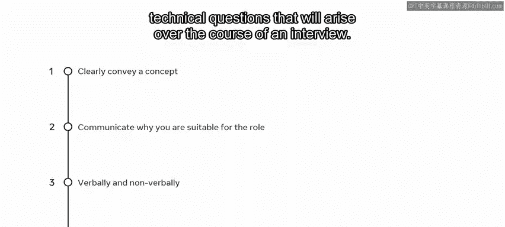

# Python 130：3_交流

在本节课中，我们将学习面试成功的关键要素——沟通。面试的成功与否，几乎完全取决于你如何与面试官交流。你希望传达你的胜任力，而公司则希望找到适合该职位的候选人。本节视频将介绍语言沟通和非语言沟通的技巧。

## 第一印象的力量

永远不要低估第一印象的力量。作为潜在雇员，你与面试官的每一次互动都应反映出你将为组织带来的能力。你能展示的第一个非语言信号就是守时。

**守时**：最好在预定会议开始前至少10分钟到达，尤其是在你不确定面试具体地点的情况下。找到地点需要时间，你希望自己看起来沉着冷静、准备就绪，而不是气喘吁吁、在整个面试过程中都显得慌乱。

## 非语言沟通技巧

上一节我们提到了守时，本节中我们来看看其他重要的非语言沟通技巧。确保在面试过程中保持眼神交流，并积极倾听被问到的问题。

**着装得体**：通常，工作面试要求你穿着专业或商务装。确保你的衣服干净整洁。这显示出尊重，并为你自己树立了积极形象。

**保持良好姿态**：保持良好的姿势，避免坐立不安、不必要地触摸脸部或绞手。虽然在会议前和会议中感到紧张是可以理解的，但这些手势可能会无意中传达出你觉得自己无法胜任这项任务的感觉。

**缓解紧张**：一个缓解紧张的好方法是在会议前做好充分的准备。确保你了解工作的内容、公司的业务及其所代表的价值观。

## 语言沟通技巧

尽管理解非语言沟通的重要性很关键，但语言沟通同样重要。你需要能够与面试官交谈。

**观察与倾听**：在面试中如何表现自己的一个良好指标是观察面试官。仔细倾听。他们会通过提问来了解你是否符合所需的技能和个性特征。通常，面试官会遵循**80/20法则**：他们说话占20%的时间，让你展示自己占80%的时间。因此，在回答之前，请让面试官完全把问题引导给你。

**清晰简洁**：在回答中使用清晰简洁的语言。一个常见的诱惑，尤其是在你做了充分准备的情况下，是试图用你所知道的关于该主题的一切来回答问题。这可能导致回答冗长、偏离主题。更好的回答是紧扣主题，并为后续提问留出机会。一个好的面试官会跟进相关问题，这样可以让对话流畅进行。

**实事求是**：避免夸大你的能力或对自己持消极态度。注意不要使用可能传达对自己负面态度的情绪化词语。例如，与其说“我在那个任务上失败了”，不如说“那个任务很有挑战性，但它为我未来探索的研究领域提供了一些思路”。此外，避免使用过多的俚语、脏话或不恰当的幽默。

## STAR回答法

在面试中遵循的一个好方法是**STAR方法**。最初，面试官会试图让你感到受欢迎，给你机会谈论自己：你的简历上有什么？你对公司或职位了解多少？随着面试的进行，讨论将更多地集中在你的能力和对职位的适合度上。重要的是，你要能够传达为什么你是一个合适的人选。通常，问题会集中在业务需求上，无论是正在使用的技术还是必须克服的问题。面试官想知道你在工作中遇到问题时将如何应对。

因此，尝试使用STAR方法来回答问题。在回答问题时包含以下四点：**情境**、**任务**、**行动**和**结果**。

以下是更清晰地演示该方法的一些示例：
*   **情境**：当时的情况背景是什么？是什么项目？面临哪些挑战？
*   **任务**：你的职责和任务是什么？
*   **行动**：你采取了哪些行动来纠正或应对挑战？
*   **结果**：你的行动带来了什么结果或成果？采取这种方法对结果产生了什么影响？

使用这种方法作为回答的模板，将使你的回答更有深度。它提供了一个可行的回答框架。同时也给了面试官机会，就你感觉舒适的讨论领域提出更多相关问题。

## 总结

本节课中我们一起学习了面试沟通的核心要点。面试官会寻找能够清晰传达概念的候选人。你的首要任务是通过沟通说明你为什么适合这个职位。这需要通过语言和非语言两种方式来完成。最后，**STAR方法**是应对面试过程中出现的技术性问题的一个非常高效的框架。

在任何公司的任何职位上，你可能都需要与利益相关者打交道，无论是处理工作中的复杂问题，还是解释为什么某个解决方案是最优路径。因此，请将你学到的关于沟通的知识自信地应用到实践中。