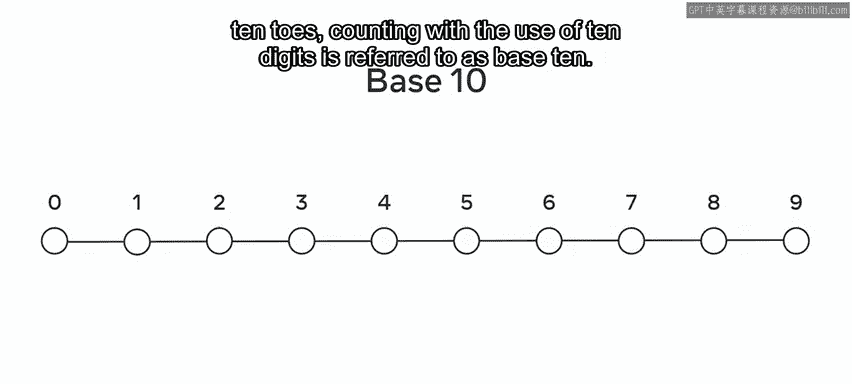
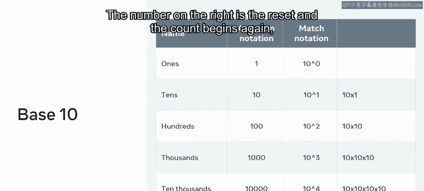
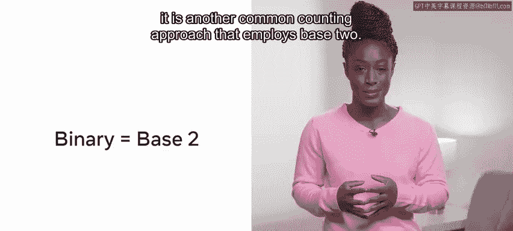
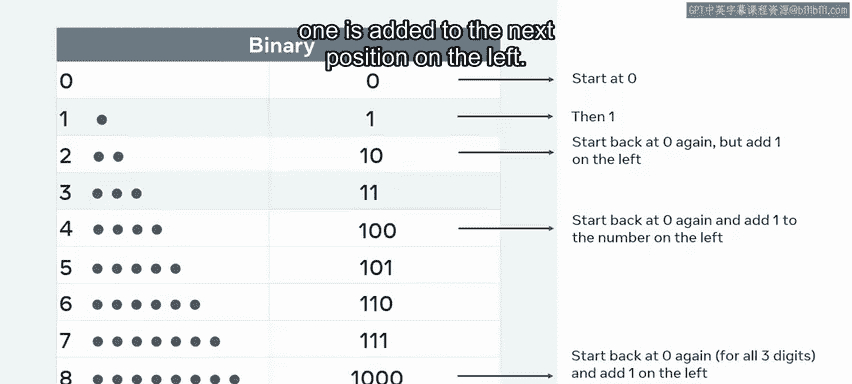
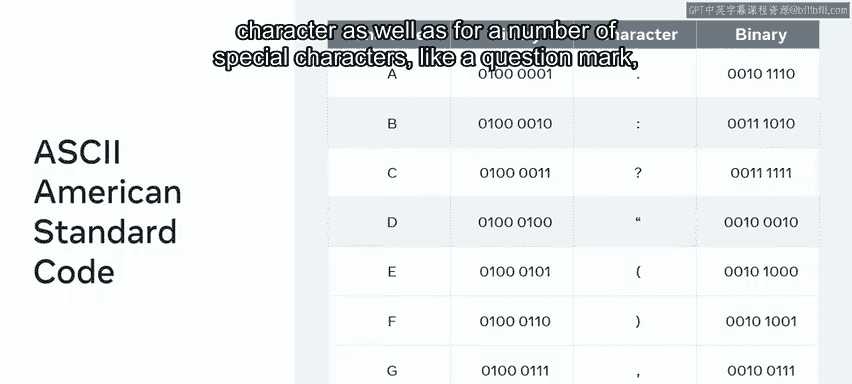

# Python 132：二进制基础

在本节课中，我们将要学习二进制数，了解它们是什么，以及计算机如何使用它们来表示人类语言。我们将探讨位置编码如何将有限的数字集合转化为无限大小的数值表示。最后，我们将学习如何通过计算一个数的幂，来确定这种简单表示法可以容纳多少种状态。

## 十进制计数法

上一节我们介绍了课程目标，本节中我们来看看人类最熟悉的计数系统——十进制。

传统上，我们使用0到9这10个不同的数字进行计数。这源于数学的早期发展，是人类拥有10根手指和10根脚趾的自然结果。使用10个数字进行计数被称为**十进制**。

**公式**：`Base 10`

十进制意味着在使用完10个不同的数字之前，你不需要添加新的数位。每次数字范围用尽时，你都会重置左边的数字，并在右边添加一个0。这个新的数位必须比它右边的数位大10倍。右边的数字被重置，计数重新开始。

以下是十进制计数的过程示例：
*   从0开始，依次增加到9。
*   到达9后，个位重置为0，十位从0变为1，得到10。
*   这个过程持续下去，形成11， 12， ... 99， 然后变为100。

使用数字的位置来表示数值的渐进增长，这被称为**位置记数法**。当我们思考它时，会发现这是一种允许记录无限多数值的早期算法实现。它实现简单，但效果非常强大。

## 二进制计数法

上一节我们回顾了十进制，本节中我们来看看计算机的核心语言——二进制。

二进制使用相同的位置记数法原理。它是另一种常见的计数方法，被称为**二进制**。

**公式**：`Base 2`

这意味着所有的值都只用**1**或**0**来表示。计算机以**字节**为单位存储信息。每个字节由8个**位**组成，每个位可以是1或0。

就像在十进制中计数到9后会添加一位并重置一样，二进制中也会发生同样的事情。但在这种情况下，只使用两个数字来推进计数：你将数字向左移动，将1向左移动，直到所有1和0的组合都被使用完毕，此时你在末尾添加另一个0。在这个阶段，除了开头的一个1之外，所有数字都重置为0。

让我们一步步探索它。以下是二进制计数的步骤：
*   从`0`开始计数。
*   加1得到`1`。
*   再加1，个位从1变为0，并向十位进1，得到`10`（读作“一零”，代表十进制中的2）。
*   在`10`的基础上加1，得到`11`（十进制3）。
*   再次从0开始，但在左边加一个1。一旦所有的1都满了（即`11`），就再次回到0，并向左边的数字加1，但那个数字已经是1了。所以它也回到0，并向左边的下一个位置加1，得到`100`（十进制4）。

## 二进制在计算中的应用

上一节我们学习了二进制如何计数，本节中我们来看看它的实际用途。

二进制在计算中有许多用途。它是将电信号转化为计算机代码的一种非常方便的方式。如果存在信号，则显示为1，否则使用0。

二进制计数系统允许这些基数为二的信号承载、传输和存储大量的信息。布尔值的存储方式与此相同。一个布尔值要么是1（代表真），要么是0（代表假）。利用这种简单的信息表示法，可以构建一些强大的应用程序。

**ASCII码**（美国信息交换标准代码）是一种二进制到字符的编码映射，或者说是一种从二进制到文本的映射。它为每个数字、字符以及许多特殊字符（如问号、括号、句点甚至空格键）都保留了一个二进制数字。前面提到，一个字节由8位组成。每位可以取0或1的值。

## 计算可能的状态数

上一节我们了解了二进制如何表示字符，本节中我们来解答一个关键问题：一个字节能表示多少种不同的值？

这就引出了一个问题：在这里的每个字节中，可以表示多少种不同的值？为此，我们将使用**指数运算**，即计算一个数的幂。

一个例子是 **2的3次方**。即 `2 * 2 * 2`，等于8。

现在，假设你有一个由四个不同数位组成的密码锁。每个数位可以是0或1。这个锁可能有多少个潜在的密码数字？

答案是 **2的4次方**，即 `2 * 2 * 2 * 2 = 16`。你正在处理一个二进制锁，因此每个数位只能是0或1。所以你可以取四个数位，每次乘以2，总数是16。

每次增加一个可能的数位，你都会增加可能的排列组合。所以，同样的锁如果有五个数位，将会有 **2的5次方**，即32种不同的组合。

现在，回到我们最初的问题：一个字节中可以有多少种不同的表示？前面提到，一个字节由8位组成，每位可以是0或1。8位将会有 **2的8次方**，即256种不同的组合。

## 总结

本节课中我们一起学习了二进制数，即计算机的语言。虽然乍一看它似乎仅限于0和1，但我们了解到，通过使用位置编码，它可以用来表示更大的数字集合。

我们学习了计算机如何利用电信号来存储和读取数字，以及指数运算（计算一个数的幂）如何与计算唯一状态数相关联，并如何用它来计算一个数字锁可能拥有的组合数量。

二进制是计算机的语言，理解它如何用于存储信息，将使你在讨论数据及其存储结构时拥有更深刻的理解。