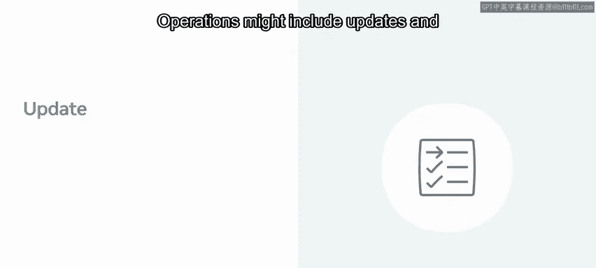
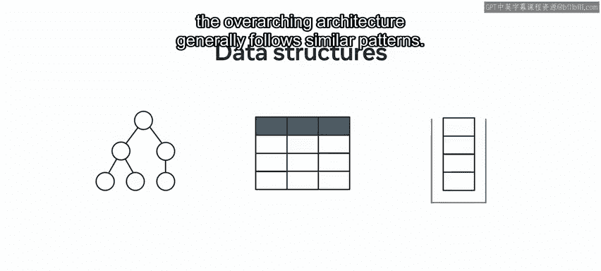
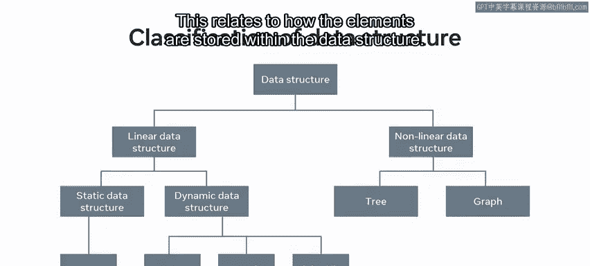
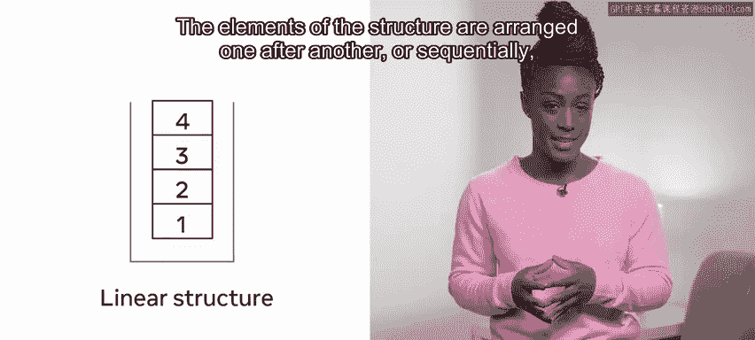
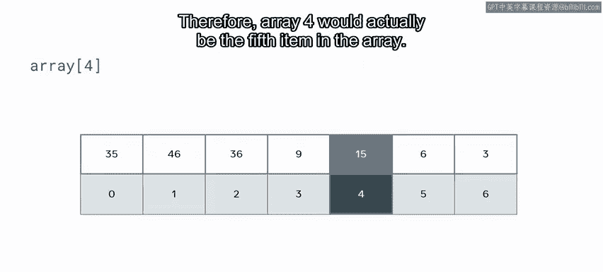
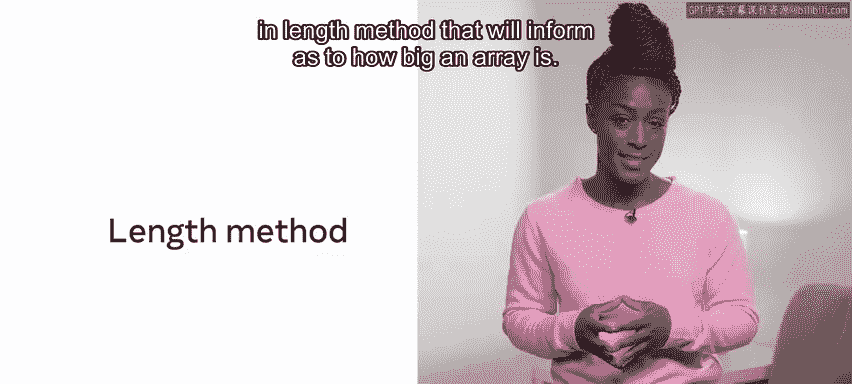

# Python 137：基本数据结构 📚

在本节课中，我们将要学习数据结构的基础知识。数据结构是组织和存储数据的方式，对于任何编程任务都至关重要。理解不同的数据结构及其适用场景，能帮助你编写更高效、更可靠的代码。

## 什么是数据结构？🔍

一个数据结构用于在计算机内存中建模和存储对象，使其易于组织和访问。它可以是简单的、创建后不可更改的**不可变结构**，也可以是允许对其内容执行操作的**可变结构**。

这些操作可能包括对结构内容的**更新**和**查询**。

## 可变与不可变结构 ⚖️

表面上看，似乎应该总是使用可变结构。然而，可变结构需要时间和精力来建模，并且有些对象非常复杂，不易建模。其他因素，如**空间占用**，也可能是一个考量点。

理解数据结构的底层机制是一个巨大优势，因为选择使用特定数据结构的决定可能对项目进展产生深远影响。

## 数据结构的分类 📊

虽然不同编程语言中数据结构的实现和功能可能有所不同，但其总体架构通常遵循相似的模式。

以下是数据结构的通用分类，将不同类型分为两个主要分支：**线性**和**非线性**。这关系到元素在数据结构中的存储方式。

### 线性结构 📈

线性结构与信息的存储方式有关。结构中的元素一个接一个地、或按顺序排列，反映了它们被输入的顺序。

以下是线性结构的例子：
*   **数组**
*   **队列**
*   **栈**
*   **列表**

线性结构意味着每个元素都连接到它前面的元素。有些语言要求同一结构中只能存储相似类型的数据，因此会有整数数组或字符串数组。其他语言则允许混合数组，这意味着在同一数组中存储整数和字符串并不被禁止。但这种简便的方法可能会在后续的错误处理中付出代价。

## 索引与访问 🔢

一旦创建了简单的结构（如列表或数组），它将包含一个**索引**。索引是一种访问元素的方式，这些元素不一定是第一个或最后一个实例。

通常，索引的使用是通过在变量名后附加方括号和表示位置的整数来实现的。例如，`array[4]` 表示所需的元素是数组的第四项。然而，编程语言主要采用**0基索引**，这意味着计数从0开始。因此，`array[4]` 实际上是数组中的第五个元素。

如果请求的索引位置（例如位置8）不存在于数组中，访问数组时可能会抛出错误。这些结构的一个常见特性是，大多数语言都有一个内置的**长度方法**，可以告知数组有多大。

## 作为一等对象的结构 🏷️

数组和列表通常是**一等对象**。这意味着所有可用于其他变量的功能也适用于它们。这个定义通常表明，数据结构可以作为参数传递给函数、作为结果返回或赋值给变量。

将列表或数组传递给函数时，应注意传递的是结构本身，而不仅仅是结构的**引用**。这可以作为一种节省内存的机制，防止复制信息。然而，如果对结构的更改无意中影响了调用环境中的数组，这种情况可能会导致错误。

因此，更好的做法是创建数组的副本，并将副本传递给函数。

## 内存管理 💾

另一个需要注意的与内存相关的问题是**内存泄漏**。如前所述，内存可以被任意分配。如果这块内存不再使用，良好的做法是释放该内存位置。由于粗心的编程或其他问题，程序可能会重复调用，导致分配了过多内存且未释放。

随着时间的推移或通过重复调用，这可能导致应用程序内存耗尽并崩溃。大多数编译器都有复杂的算法来检测和释放内存，以避免此问题。

## 非线性结构 🌳

上一节我们介绍了线性结构，本节中我们来看看非线性结构。与线性结构相反，存在非线性实例，如**树**或**图**。这些结构不允许你一次性平滑地遍历所有数据。相反，你可以探索特定的路径。

这些结构的构成意味着它们可以包含**自然排序**，这使得查询特定数据非常快速。你将在课程后面学习不同类型的排序。

## 总结 📝

本节课中我们一起学习了数据结构。我们了解了数据结构的两种主要类型：**线性**和**非线性**。我们还学习了在决定应使用哪种数据结构时应考虑的一些因素，包括可变性、索引访问、内存管理以及作为一等对象的行为。随着你在本模块中的深入学习，你将进一步探索这些结构，并了解它们各自的优点和缺点。