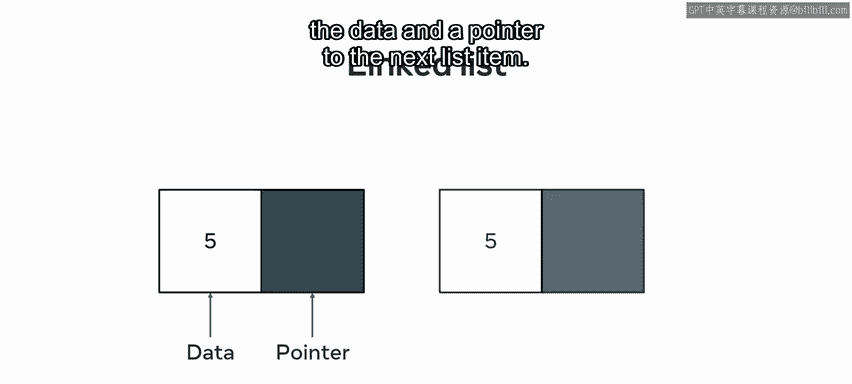
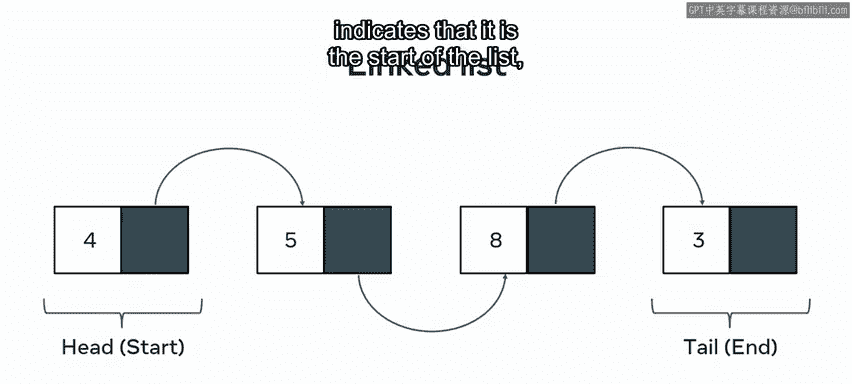
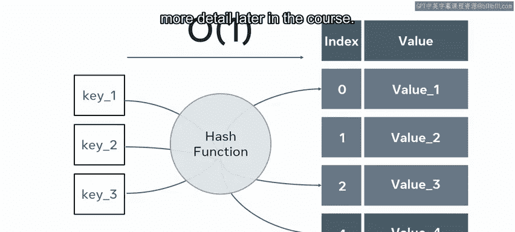
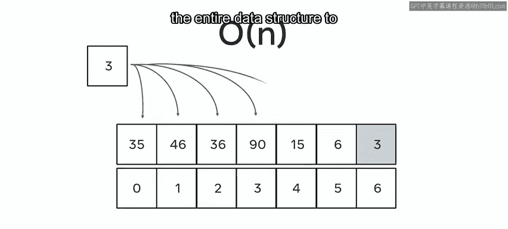

# 138：列表和集合 📚

在本节课中，我们将要学习两种重要的数据结构：列表和集合。我们将探讨它们的基本概念、内部实现、各自的优缺点以及适用场景。

---

## 列表：有序的数据容器 📋

你是否曾经需要存储一些数据，但不确定该使用哪种数据结构？这是一个常见的编程问题。本节中，我们将探索第一种数据结构：列表。

列表是许多编程语言中常见的数据结构。在大多数编程语言中，列表被表示为对象。这意味着除了存储数据，它们还拥有自己的内置方法。例如，可以使用内置的排序方法来排列列表中的数字。

与数组类似，我们通常会看到声明为字符串、整数或浮点数类型的列表。在某些编程语言中，列表可以包含混合类型的元素。

列表是一个抽象概念，指的是一个元素的容器。列表的一种稳定实现是使用数组或链表。

### 基于数组的列表

基于数组的列表是使用数组作为底层数据结构构建的有序集合。因此，它们具有与数组相同的优势和局限性。

基于数组的实现涉及到初始大小的设定，而不是像链表那样简单地指向另一个节点。有些语言要求你最初确定结构的大小，而另一些语言则允许动态增长的结构。

需要注意的是，这种自由在某种程度上是表面上的。对于许多动态结构，在实例化时会自动配置一个初始大小。当达到此限制时，数组会将自己复制到一个具有更大空间分配的新结构中。因此，选择不在开始时任意分配空间，可能会在运行时付出代价，因为此类数据结构可能需要在执行其他操作期间多次扩展。

考虑一个列表在循环中执行操作时动态增长的计算成本。在这种情况下，将初始列表大小设置得更大会更有帮助，而不是动态增长，因为动态增长需要创建并将值复制到越来越大的列表中，成本很高。

### 链表

链表的工作方式不同。链表包含两部分信息：数据和指向下一个列表项的指针。链表从一个空列表开始，可以通过向列表引入新单元来动态增长。

要扩展链表，你只需添加一个新节点并将列表指向其位置即可。这使得它们对于存储大量数据非常快速。

链表的灵活性是通过包含一些额外的存储要求来实现的，特别是在每个节点中，必须有一些对周围节点的引用。链表还有一个头节点和一个尾节点。头节点是一个独特的节点，表示它是列表的开始，而尾节点表示列表的结束。

这种扩展数据结构大小的方法非常强大，可以产生非常大但易于管理的数据集。

---

## 集合：无序且唯一的容器 🔍

上一节我们介绍了列表，本节中我们来看看集合。集合与列表非常相似。然而，集合会以无序的方式存储其元素。尽管有一些有序集合的可能实现，但集合有一些不寻常的特性：集合只保存唯一的元素。因此，向集合中添加一个已存在的元素不会对存储的数据产生任何影响。

集合存储信息的无序过程意味着打印一个集合不一定反映元素被添加到集合中的顺序。一旦一个值被添加到集合中，它就不能改变。相反，你必须删除它并添加一个新值。

集合的搜索速度异常快。这是由于其内部机制。集合使用哈希表来确定存储集合元素的位置。因此，传递给集合的每个数字都会应用一个哈希函数。

### 哈希函数与快速搜索

哈希函数可以定义为一个算法，它接收一些数据并将其映射到一个固定大小的值。理论上，该值是唯一的，并且每次对该数据应用该函数时，都会返回相同的值。

这意味着搜索一个集合可以在 O(1) 时间内完成。这是由于用于在集合中保存值的机制。你将在课程后面更详细地学习哈希函数。

一种 O(N) 的方法是遍历整个数据结构以检查值是否存在。而集合则对输入数据应用映射函数，并检查结果输出来查看值是否存在。

如果存在，则返回值。如果它不存在于集合中，则数据未存储在集合中，因此将返回 false。

### 集合的局限性

虽然集合可以执行异常快速的搜索，但在处理非常大的数据集时，性能会下降。这是由于哈希函数的性质。保留的值越多，发生冲突的风险就越大。冲突是指哈希函数为两个不同的值返回相同的唯一映射。使用的数据集越大，就越容易发生冲突。

---

## 总结 📝

本节课中，我们一起探索了两种非常重要且有用的数据结构：列表和集合，并学习了它们各自固有的优点和缺点。

你现在应该更清楚何时使用每种数据结构，这取决于解决方案的存储需求。列表适用于需要保持顺序或允许重复元素的场景，而集合则适用于需要快速查找和确保元素唯一性的场景。