# 14：哈希表 🗂️

在本节课中，我们将要学习哈希表。你将了解哈希表是什么、它的结构和固有特性，以及它是如何工作的。我们还将探讨使用哈希表的一些优势，并理解哈希碰撞的含义。

## 概述

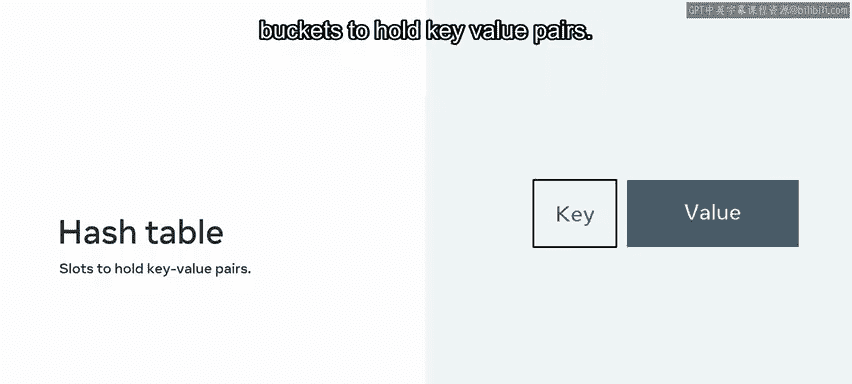

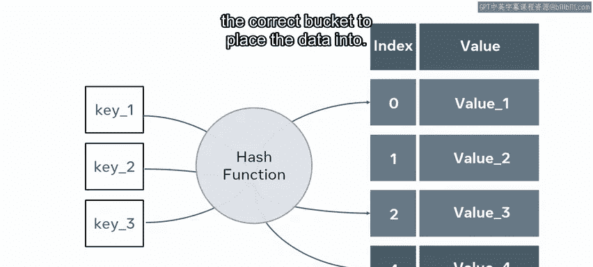

在课程的这个阶段，你已经接触了几种不同的数据结构。你会发现，存储信息并没有一种完美的方法。相反，存在多种多样的方法，每种方法都是特定问题的合适解决方案。

## 哈希表的结构与工作原理

哈希表包含多个槽位或桶，用于存放键值对。它需要一个哈希函数来确定将数据放入哪个正确的桶中。

一个哈希函数是应用于键以生成唯一数字的任何算法或公式。

每个要存储的数据项都必须有一个键和一个值。获取键，并对其应用哈希函数，将其缩减为一个固定大小的值。

有多种哈希函数可供应用。你可能在压缩方面对它们有所了解。当你想通过互联网发送信息时，可能会先将其压缩到可管理的字节数，然后发送，最后在另一端解压。这就是哈希工作原理的一个例子。它将键缩减为一个小的、可管理的大小，然后作为索引指示器。

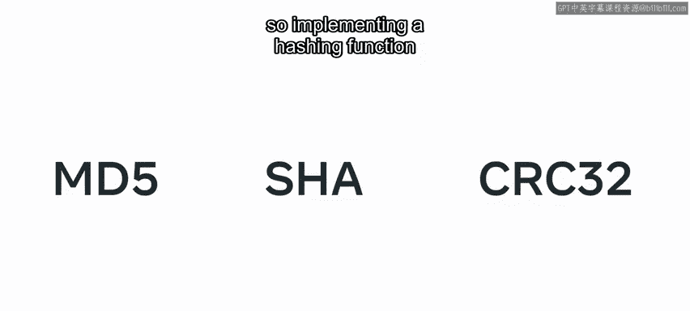

用于生成索引的信息取决于具体的应用。如果数据本身足够小，它可能就是数据本身；也可能是员工ID的最后四位数字；或者可能是字典中的一个键。大多数编程语言都有内置的哈希函数，如MD5、SHA或CRC32。因此，实现哈希函数是一项直接的工作。

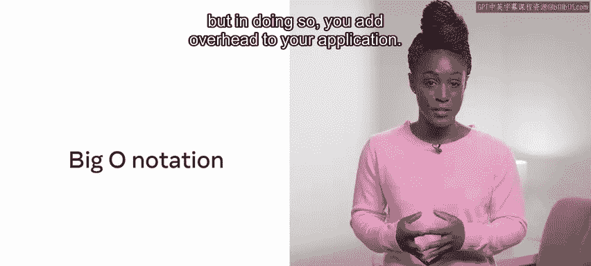

## 哈希表的优势：时间复杂度

在讨论大O表示法时，我们曾介绍过速度和空间常常相互矛盾的观点。这意味着你可以减少检索项目所需的时间，但这样做会增加应用程序的开销。

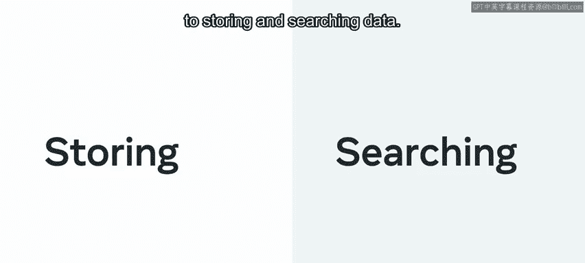

哈希表优先考虑速度而非空间，可以在 **O(1)** 时间内检索一个项目。回想一下关于数组的讨论。当你想检查一个值是否存在时，必须执行一个搜索，检查列表的每个元素并与目标值进行比较。在最坏的情况下，这将花费 **O(n)** 时间，换句话说，如果元素在数组的末尾，它必须进行n次检查。

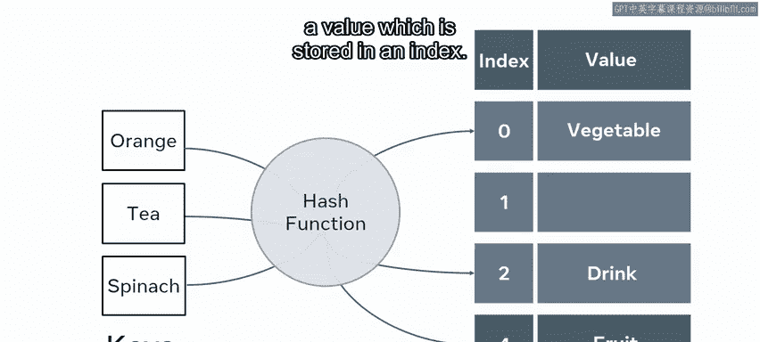

哈希表提供了一种存储和搜索数据的替代方法。这是通过使用索引来实现的。你必须实现一个算法，该算法接收一个键并将其映射到一个存储在索引中的值。

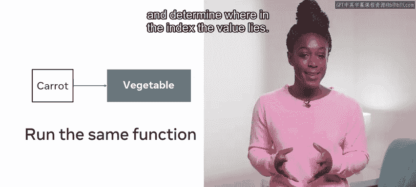

然后，当出现一个新键时，算法只需运行相同的函数，并确定值在索引中的位置。这很像一本书的索引，它将极大地加快识别某些数据位置所需的时间。

你可能会在缓存、字典、数据库索引和集合中找到哈希表的使用。

## 一个简单的哈希表示例

考虑一个场景，你有一个包含10个键的数组，键是数字0到9。你将选择使用一个哈希函数来决定在内存中存储这些数字的位置。

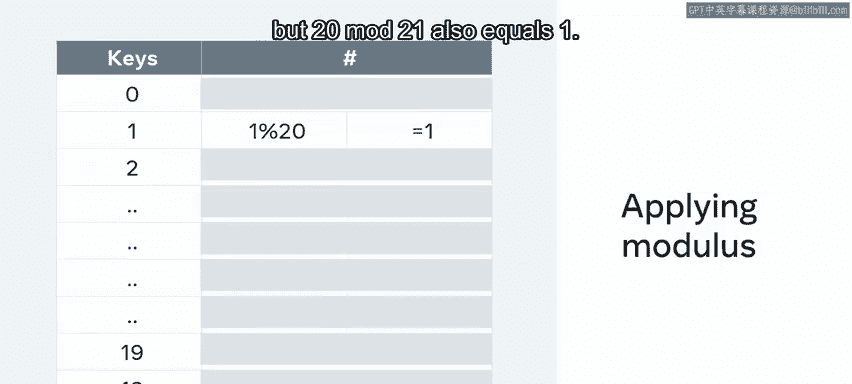

你选择了一种简单的方法，对数字应用模20运算。因此，对于从0到9的每个键，应用你的哈希函数。从 `0 mod 20 = 0` 开始，`1 mod 20 = 1`，`2 mod 20 = 2`，`3 mod 20 = 3`，依此类推。通过这种方式，你将生成9个唯一的值，这些值用于表示内存中与这些键关联的数据的放置位置。这个例子很简单，但说明了创建哈希映射背后的机制。

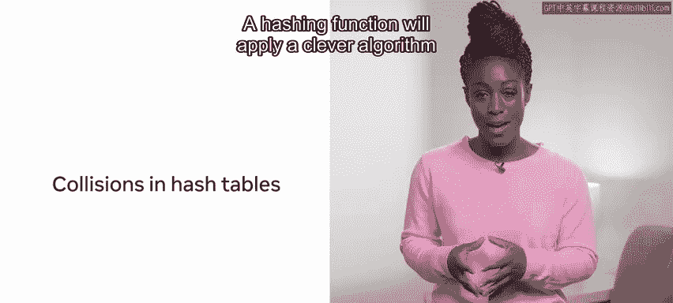

当要存储的键的数量增长超过20时，问题就出现了。记住，`1 mod 20 = 1`，但 `21 mod 20` 也等于 `1`。

## 哈希碰撞及其解决方案

接下来，我们看看哈希表中的碰撞。

什么是哈希表中的碰撞？哈希函数将应用一个巧妙的算法，将键的大小缩减到一个可管理的大小。有些方法比其他方法更复杂。那么，如果两次哈希的结果相同会发生什么？

为了扩展这个想法，值得思考冯·米塞斯的生日悖论。由于概率的原因，有时事件发生的可能性比我们想象的要大。在这种情况下，如果你调查一个只有23人的随机群体，实际上大约有50%的几率其中两人会有相同的生日。这被称为生日悖论。

假设一家公司有24名员工，并且应用了一个巧妙的哈希函数，该函数获取他们生日的日期和月份，并将其用作索引。只有24名员工和一个拥有365个索引槽的哈希表来存放对他们的引用，你可能认为任何两名员工共享生日的概率很低。事实上，研究表明，这种情况发生的可能性超过50%。下次你参加聚会时，一定要检查是否有任何两位与会者生日相同，亲自验证一下。

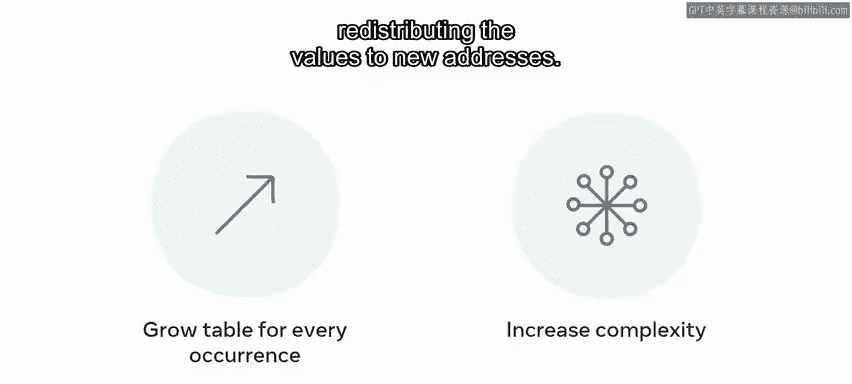

这说明，当哈希函数应用于键时，会产生重复的哈希值，必须为此做出安排。

针对这个问题有几种解决方案。

以下是解决碰撞的两种主要方法：
1.  **动态扩容**：每次发生碰撞时扩展表，然后增加哈希方法的复杂性，将值重新分配到新的地址。通过这种方式，表会自然地增长以匹配所需数据的大小。
2.  **链表法**：在碰撞点创建一个链表，简单地存储额外的值。因此，在发生碰撞时，不是存储一个值，而是存储一个值的链表。

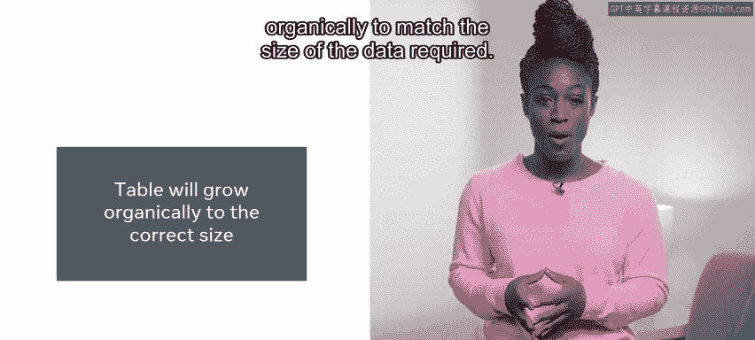

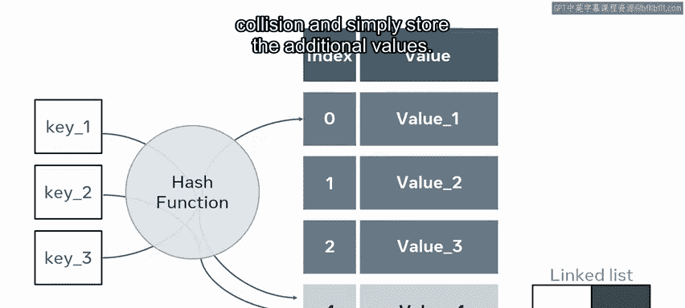

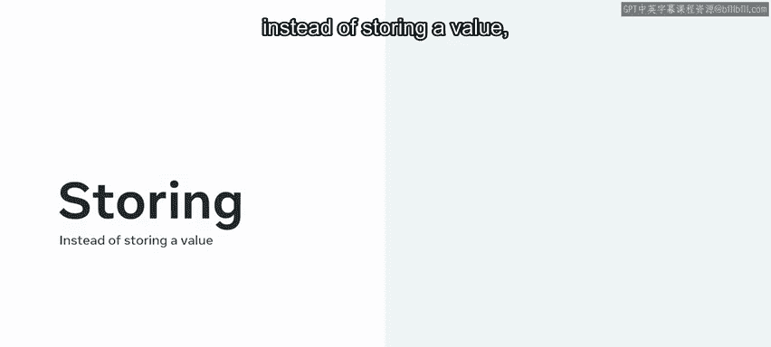

## 总结

在本节课中，我们一起学习了哈希表是什么、它的结构和特性以及它是如何工作的。你还了解到，哈希是一种非常巧妙的方法，它使用哈希函数和索引来实现 **O(1)** 时间的搜索。我们探讨了碰撞以及如何利用它们来确定表的大小。你甚至还了解到，如果你参加的聚会客人超过24位，那么至少两人共享同一生日的可能性是很大的。