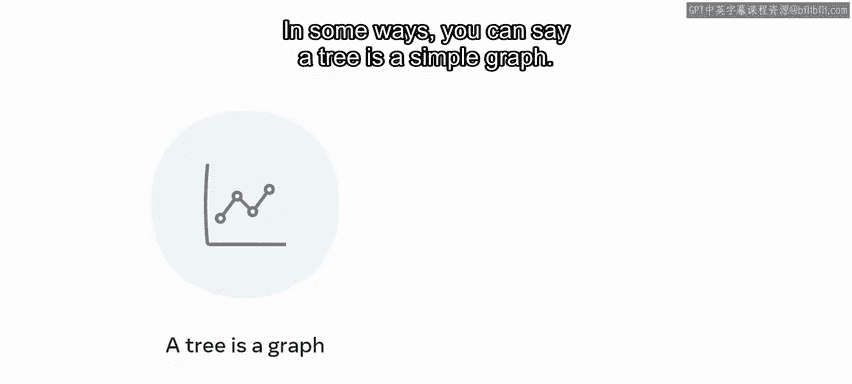
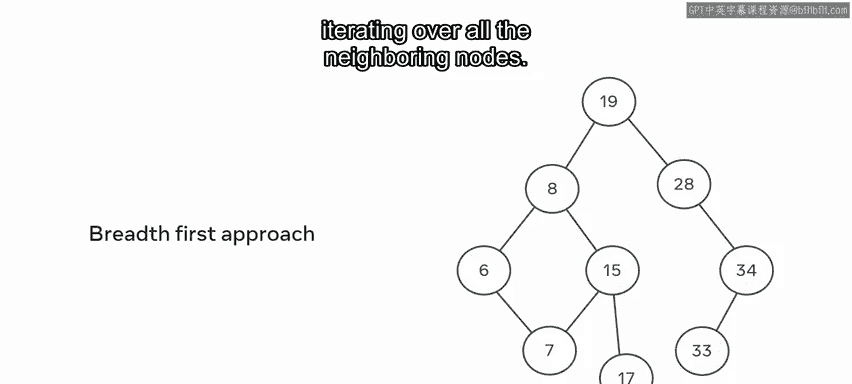
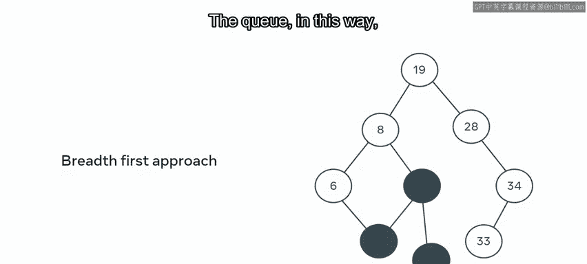
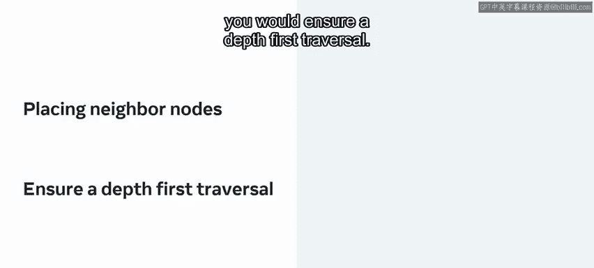
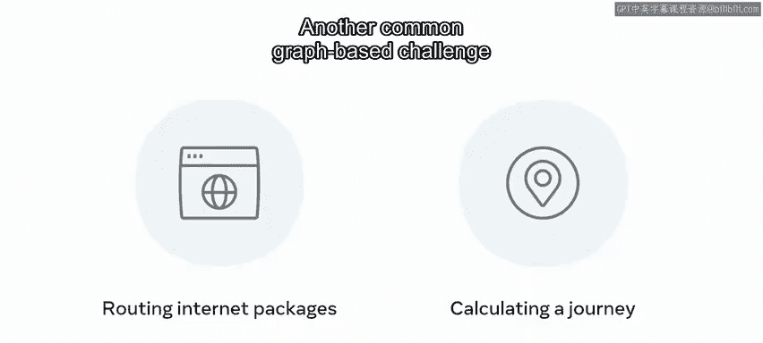
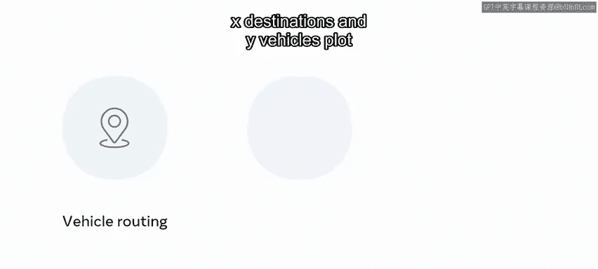
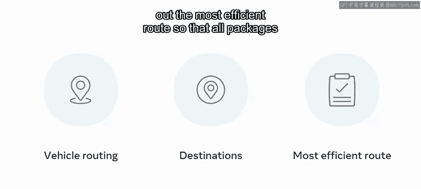

# 143：图数据结构入门 🗺️

在本节课中，我们将要学习一种强大的数据结构——图。图非常适合用来表示实体（如城市、网页、人）以及它们之间的复杂关系（如道路、链接、社交关系）。我们将了解图的基本概念、类型、遍历方法以及它在现实世界中的应用。

---

在计算机科学中考虑一个具体问题时，始终需要思考解决问题可能需要执行哪些操作。通过这种思考，可以选择一个合适的数据结构来存储数据。

假设你在一家大型互联网公司工作，需要存储一系列地点以及它们之间的连接关系。

在这个图示中，我们的城市按照彼此之间的关系被绘制出来。

请注意，并非所有可能的细节都需要被记录。例如，如果你想知道芝加哥到波士顿的距离，你可以很容易地从数据的组织方式中推导出这个信息。

同样的方法可以用来为互联网目的地、单词之间的关系或社交网络上的人与人之间的关系建模。

这种保存信息的方法是基于图的方法。在接下来的内容中，将概述这种方法的一些术语和优势。

---

## 图的基本构成 🧱

上一节我们介绍了图的概念，本节中我们来看看图的具体构成。

这个结构图示是一个图，它由表示目的地的**节点**和显示每个节点如何与另一个节点相关联的**边**组成。

节点之间存在数值，这意味着这是一个**加权图**。

图中没有箭头，这意味着这是一个**无向图**。

与有向图相反，无向图没有优先顺序。

思考有向图和无向图的一种方式，类似于双向街道和单向街道。

---

## 图的连接性与路径 🛣️

有时，在组织数据时，突出某种进展会有所帮助；而在其他情况下，边的存在只是为了显示关联关系。

一个**路径**是由一条边连接的两个或更多节点的序列。

在有向图中，如果边只是单向的，那么这种连接被认为是**弱连接**。

然而，如果两个节点之间有双向连接，那么它就被称为**强连接**。

此时，你可能会认为图类似于树。在某种程度上，你可以说树是一种简单的图。值得注意的是，树有一个起点，并模拟了具有父子关系的层次结构。而图是一种复杂得多的结构，没有起点或终点。

两个相邻的节点被称为**邻居**，通过一个邻居连接的节点被称为**相邻**。

---

## 图的遍历 🔍

和图一样，树也可以进行广度优先和深度优先遍历。回忆一下，**广度优先搜索**涉及访问同一层的每个节点，然后再向下进行；而**深度优先搜索**涉及在移动到下一个分支之前，深入探查每个分支的末端。

以下是实现广度优先搜索的步骤：
1.  选择一个给定的起始位置。
2.  遍历所有相邻节点。
3.  每个邻居节点都有一组连接的节点，可以将它们添加到另一个数据结构——**队列**中。

通过这种方式，你可以系统地访问每个节点。

为了实现深度优先搜索，你可以使用**栈**。回忆一下，栈处理元素的方式与队列不同。

当队列遵循**先进先出**原则时，栈则遵循**后进先出**原则。

因此，通过系统地将所有邻居节点放入栈中，你将确保进行深度优先遍历。

---

## 图的应用实例 🚀

图是一种被广泛研究的数据结构，是许多用于确定节点间重要性的算法的基础。无论节点中存储的是什么元素，一个著名的算法是**最短路径**算法：从节点A到节点E的最快方式是什么？边的权重会告知选择每条路径的成本。

这种方法用于在互联网上路由数据包，或在谷歌地图上计算行程。

另一个常见的基于图的挑战是**旅行商问题**。

一个销售员需要访问几个特定的节点。规划一条在最短时间内覆盖所有节点的最佳路线是什么？这将用于包裹路由。

给定X个目的地和Y辆车，规划出最有效的路线，以便所有包裹都能以最少的资源消耗送达。

---

## 总结 📝

本节课中我们一起学习了图数据结构。

在本视频中，你学习了图如何为你提供一种灵活的数据建模方式，通过数据的存储方式来促进对数据的推断。

这种多功能的方法只保留了最少的信息。从芝加哥到波士顿的距离没有存储在任何地方，但可以被推导出来。很容易查询不同的问题，而无需改变数据的结构。计算步行时的最佳时间可以轻松地替代驾驶时间，而无需大费周章。

整个统计学领域都致力于从节点位置推断信息，这可以用来对存储在那里的任何数据进行推断。