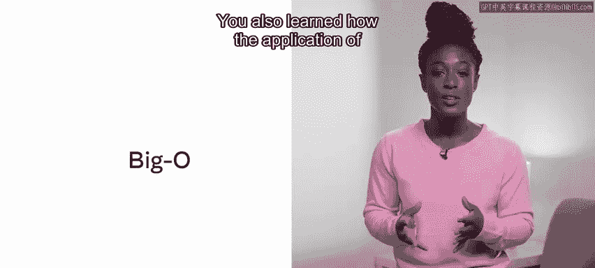
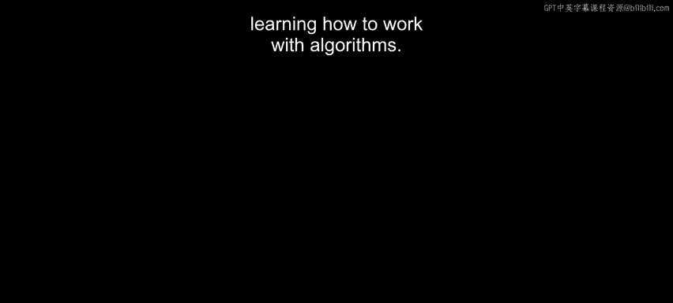

# Python 146：搜索算法

在本节课中，我们将要学习计算机科学中的基础操作——搜索。我们将介绍两种主要的搜索方法：线性搜索和二分搜索，了解它们的实现步骤、优缺点，并学习如何使用大O表示法来评估它们的效率。

---

在上一节中，我们探讨了排序算法。本节中，我们来看看如何在已排序或未排序的数据集中查找特定元素。

**搜索的基本考量**

在计算机科学中，当面对一个数据集合时，经常需要识别其中的特定元素。然而，对“特定元素”的定义可能存在不同的解读。

以下是搜索时需要考虑的几个关键问题：
*   **精确匹配**：例如，给定一个哈希表，是否存在与给定键匹配的键值对？这是一个简单的“一对一”比较，结果要么是找到唯一的键，要么是未找到。
*   **范围或极值搜索**：例如，查找数组中的最大值、最小值或中位数。
*   **处理未找到的情况**：如果要查找的值不存在，应该返回什么？返回空值（Null）可能会影响应用程序的后续运行，需要设计相应的保护机制。
*   **匹配实例**：搜索是应该返回第一个匹配的值，还是最后一个？

（在本课末尾的补充阅读材料中，有一个链接，指向Null的发明者Tony Hoare的演讲，他称Null为“十亿美元的错误”。）

**线性搜索**

最简单的搜索实现是线性搜索。如果你有一个元素数组，线性搜索从索引起点开始，逐个检查数组中的元素，直到找到目标元素或检查完所有元素。

在这种方法中：
*   **最佳情况**时间复杂度是 **O(1)**（目标元素恰好在第一个位置）。
*   **最坏情况**时间复杂度是 **O(n)**（目标元素在最后一个位置或不存在，需要检查每个元素）。

**从线性搜索到二分搜索**

关于数据结构，我们已经知道有些结构（如堆或二叉树）本身具有排序特性。你也可以先对任何数据结构应用排序算法，然后再应用搜索方法。

使用二分搜索可以在每次迭代中将搜索空间减半。

**二分搜索**

二分搜索要求数据在搜索前必须是有序的。它的工作原理是不断将待搜索区间对半分割。

假设我们有一个已排序的列表 `data_list` 和目标值 `target`。以下是二分搜索的步骤：
1.  检查列表中间位置的元素。
2.  如果中间元素等于 `target`，则搜索成功。
3.  如果中间元素小于 `target`，则丢弃左半部分，只在右半部分继续搜索。
4.  如果中间元素大于 `target`，则丢弃右半部分，只在左半部分继续搜索。
5.  重复此过程，每次迭代都将搜索区间减半，直到找到目标或区间为空。

```python
# 二分搜索示例代码（迭代版本）
def binary_search(sorted_list, target):
    low = 0
    high = len(sorted_list) - 1

    while low <= high:
        mid = (low + high) // 2  # 找到中间索引
        if sorted_list[mid] == target:
            return mid  # 找到目标，返回索引
        elif sorted_list[mid] < target:
            low = mid + 1  # 目标在右半部分
        else:
            high = mid - 1  # 目标在左半部分
    return -1  # 未找到目标
```

与线性搜索类似，二分搜索的**最佳情况**也是 **O(1)**（目标恰好在中间）。其**最坏情况**的时间复杂度是 **O(log n)**。这是因为每次迭代后，剩余待搜索的元素数量 `N` 都减半，经过 `k` 次迭代后，剩余元素约为 `N / 2^k`。当 `N / 2^k = 1` 时，`k = log₂N`。

二分搜索的效率远高于线性搜索。然而，必须注意，任何感知到的时间增益都需要抵消掉排序列表所花费的时间。如果列表经常更新，排序过程可能会变得代价高昂。

---

**总结**

本节课中，我们一起学习了线性和二分搜索算法。我们了解了完成这些搜索的步骤及其工作原理，也学习了如何应用大O表示法来估算两者的效率。我们还认识到，通过对标准方法进行一些巧妙的调整（如先排序再二分查找），可以显著提升搜索性能。





在下一课中，你将开始学习如何设计和使用算法。