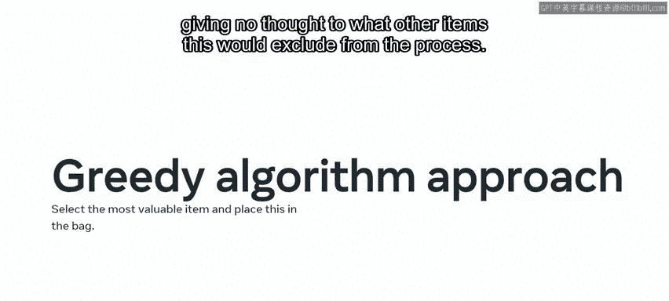
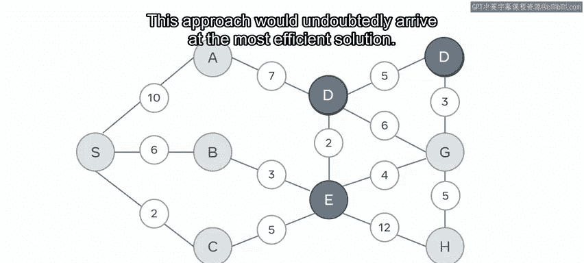

# 150：贪心算法 🧠

在本节课中，我们将学习如何运用贪心算法这一范式来解决复杂问题。贪心算法是一种简单直接的策略，它通过每一步选择当前看起来最优的选项来寻求问题的解决方案。

## 概述：贪心算法的哲学与原理

上一节我们介绍了动态规划等复杂的问题解决方法。本节中，我们来看看一种更简单直接的策略——贪心算法。

有一种哲学原理称为**奥卡姆剃刀**。它指出，最简单的解决方案几乎总是最好的。这个解决问题的原则主张，简单优于复杂。在我们的语境中，贪心算法就是那个简单的解决方案。

贪心算法是动态规划的一种替代方法。这种方法旨在为任务提供即时解决方案，并倾向于局部优化，而非更全面的全局方法。

## 贪心算法 vs. 动态规划

当处理一个被细分为多个部分的问题时，使用动态规划方法会寻找一个全局最优解，即解决每个子问题，选择并实施最佳的子集。

而贪心方法则会查看解决方案列表并实施局部优化。通常，它会选择当前回报最高的选项。

为了让这一点更清晰，我们举一个CPU需要完成一系列任务的例子。

应用动态规划方法需要选择一个能在给定时间内完成的活动子集来执行，这类似于背包问题。这涉及到确定打包哪些物品子集能在装满背包的过程中最大化总价值。

对此问题的贪心算法方法则总是选择最有价值的物品放入背包，而不考虑这会从过程中排除哪些其他物品。😊

因此，在我们的CPU示例中，贪心方法将首先选择运行时间最短的程序，然后是下一个最短的程序，依此类推。虽然这可能不会带来全局最优的解决方案，但它会减少计算最有效物品子集所需的任何开销。

## 实例分析：最短路径问题

为了更好地理解这两种方法的不同，让我们考虑最短路径问题。图像显示了一个包含9个不同节点（A, B, C, D, E, F, G, H, S）的地图。每个节点通过一条带权重的路径连接到另一个节点。这个权重反映了选择这条路径所产生的成本。

你现在面临从节点E到节点F的旅程，并希望规划最有效的路线。

动态规划方法将涉及创建一个表格，并从E开始计算每个潜在节点的成本。然后，它会引入下一组节点并计算累积成本。这种方法无疑会得出最有效的解决方案。

在初始计算完成后使用记忆化技术，结果会被保存下来，后续的旅程将受益于更快的计算时间。😊 这是一种自底向上的全局问题解决方法。

## 贪心算法在路径问题中的应用

贪心方法在其方法论上有所不同。它不是试图找到连接路线的最优子集，而是从节点E开始，查看每个可用的连接。

因此，它有一组权重值可选，即5、3、2、4和12，分别对应节点C、B、D、G和H。该数组中的最小值是2，对应节点D。遵循贪心原则，它会做出这个选择并前进到下一个节点。

假设数据结构是一个有向图，它将面临另外三个节点A、F和G，其值分别为7、5和6。由于F是最终目的地，它会选择F并愉快地到达终点，累计的旅行时间代价为7（从E到D的权重2加上从D到F的权重5）。😊

从视觉上看，你可以发现这是最有效的路径，并且是在没有创建详尽的组合表和计算所有路线的情况下得出的。

然而，如果节点G和F之间的路径权重是2，那么它可能会选择一个次优的解决方案。

## 贪心算法的权衡

这就是选择贪心方法而非动态方法时需要做的权衡。

虽然贪心算法的开销很低，并且编码解决方案相当简单，但它并不总是保证返回最佳选项。

## 总结

本节课中，我们一起学习了贪心算法的方法。此外，你也看到了它与动态解决方案的比较，从而加深了对这种替代方法优缺点理解。

下次你在谷歌地图上规划路线时，可以考虑一下所提供的路线选择，并思考这些路线可能是如何计算出来的。😊