# 前端开发（React/UI、UX/毕业项目/code review）：P102：19_导航最佳实践 🧭

在本节课中，我们将学习如何以用户体验为核心，考虑网站的内容与结构。我们将探讨信息架构与内容策略的最佳实践，并学习如何设计清晰、易用的网站导航。

---

现在，你已经识别出Little Lemon网站存在的导航问题。

接下来，让我们探讨在重新设计中可以运用的最佳实践。

你对设计工作开始感到自信，每次迭代和测试都能获得宝贵的反馈。尽管过程有些重复，但这正帮助Adrian实现其商业和用户目标。

你也开始感觉到，每次迭代都在进步。Tilly的一些反馈，例如“我不知道自己在哪里”，让你意识到这与内容及其组织方式有关。你非常希望解决这个问题。让我们开始吧。

在本视频中，你将学习如何在考虑可用性的前提下，最佳地规划你的内容和结构。你还将学习关于信息架构和内容策略的导航最佳实践。

你已经了解到，在UX设计领域，必须与用户保持开放的对话。有几种方法可以实现这一点。

以下是两种主要方法，可以让用户感到舒适并始终知晓自己的位置。

第一种是内容策略。第二种是信息架构。

值得注意的是，这些方法论内涵丰富且深刻。在本课程中，我们将介绍其入门知识并应用一些关键原则。😊

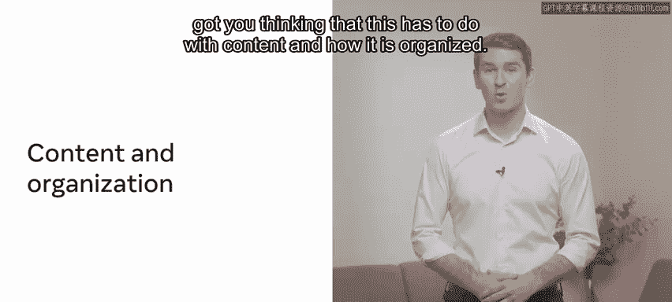

但你应该通过补充阅读资源来探索更多信息，以加深对这些概念的理解。

---

上一节我们提到了内容策略，本节中我们来详细看看它的构成。

内容策略涉及以有意义的方式呈现网站内容，以推广产品。它有助于协调客户的商业目标和UX目标，也有助于围绕用户角色和使用场景来组织内容。

一个通用的经验法则是，从以下几个标题来思考如何构建你的内容：

以下是内容策略的四个关键方面：

*   **优先级**：如何确定内容及其与用户的相关性。
*   **组织**：对内容进行分组、标记和关联的框架，以便用户找到对他们重要的信息。
*   **呈现**：如何将内容片段组合成用户所看到的样子。
*   **规范**：每个内容片段的详细需求。

---

了解了内容策略后，我们来看看如何用它来指导导航设计。

信息架构可用于找出设计良好导航所需了解的内容。对于大型网站，信息可能需要以特定方式构建和索引以支持良好的导航。但在本例中，一个简单的卡片分类任务就能帮助你。

在卡片分类练习中，你将想要包含在网站上的所有独立元素写在便利贴上。然后，你请潜在用户将它们按他们认为合理的逻辑进行分组，并汇总结果。

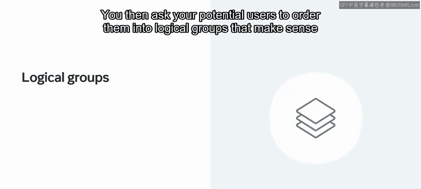

这可以在桌子或墙上完成，将卡片分组到“菜单”、“关于”等部分中。

---

基于卡片分类的结果，我们可以构建出清晰的网站导航结构。

网站导航可以组织成五个部分：主页、关于、菜单、预订和在线点餐。

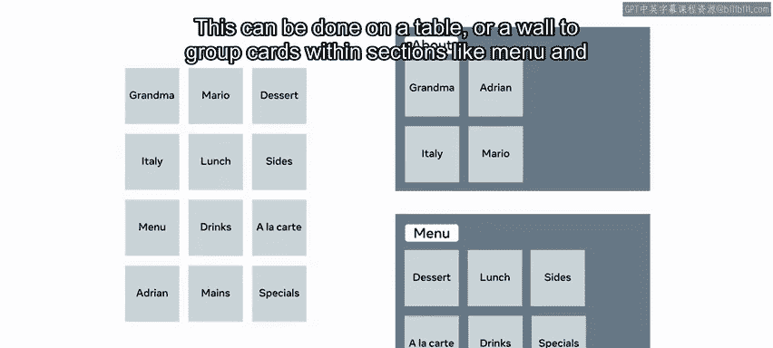
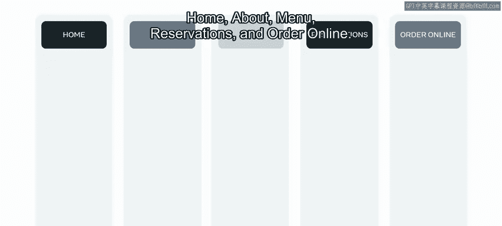

以下是每个导航部分的说明：

*   **主页**：网站的简介摘要。
*   **关于**：包含关于他们的产品、食材、兄弟俩祖母的故事以及社交媒体链接的信息。
*   **菜单**：提供最新的、可打印的传统餐厅菜单明细。
*   **预订**：用于餐桌预订。
*   **在线点餐**：用于外卖点餐。

这个导航栏被称为**主导航**，将位于所有页面的顶部。元素（如导航栏）的层次结构和顺序有助于在产品中创造意义和位置感。

导航栏元素对位置感有很强的影响，它将出现在所有页面上以强化网站结构。

---

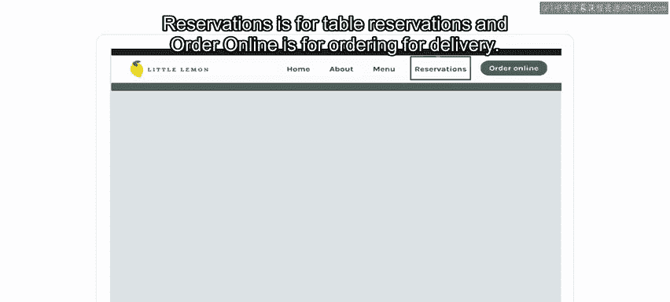

现在，让我们将最佳实践应用到Little Lemon网站的具体设计中。

你的导航位于Little Lemon网站页面的顶部，这是一个熟悉的模式。

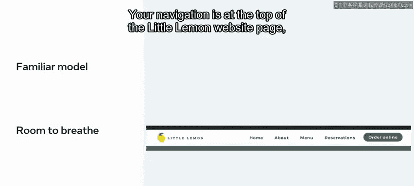

导航有足够的呼吸空间，没有被其他信息或图形所干扰。

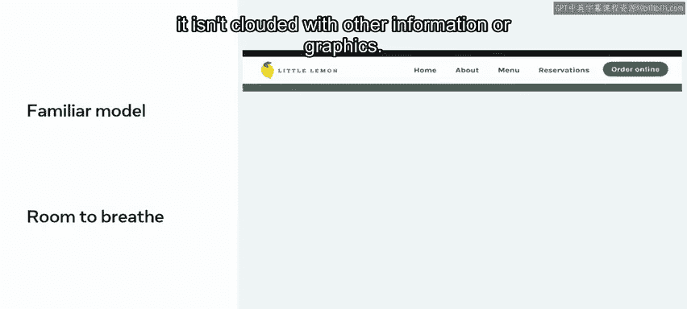

颜色应形成对比，以便链接突出显示。

你的页面导航现在看起来可以用于导航到网站的其他页面，并且链接没有隐藏，它们看起来就是可点击的链接。

如果用户位于某个特定页面，该链接将通过**加粗字体、不同颜色或下划线**来显示为活动状态。

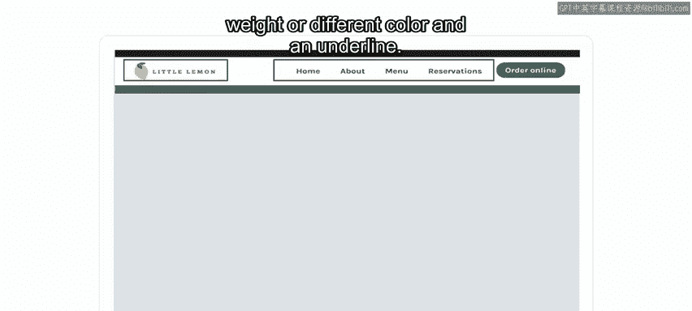

Logo将作为返回主页的链接。页面底部的页脚也将包含指向所有独立页面和社交媒体频道的链接。

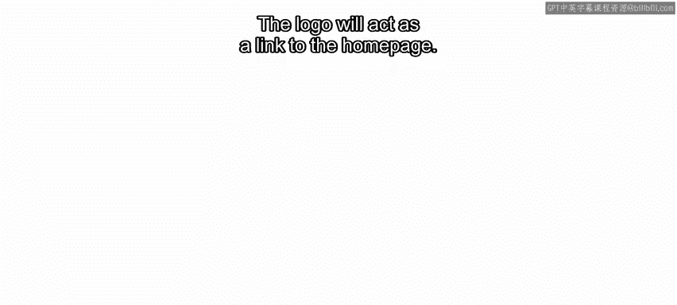
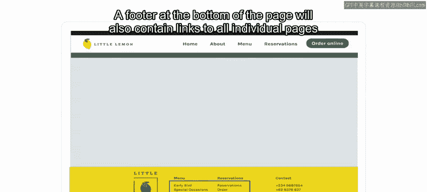

在移动版本上，由于空间有限，你决定使用**汉堡菜单**。当它被点击或轻触时，会打开一个侧边菜单，显示指向网站上其他页面的链接。

---

通过你对Little Lemon网站的全面评估和重新设计，你正在帮助Adrian实现他的商业和用户目标。

在本视频中，我们介绍了信息架构、内容策略和网站导航及其在产品设计中的作用。做得好。

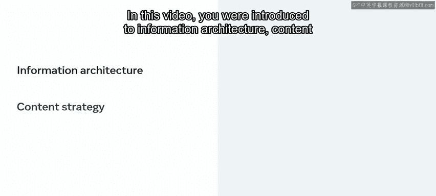

---

**本节课总结**

本节课中，我们一起学习了导航设计的最佳实践。我们首先探讨了如何通过内容策略来有意义地组织内容，然后介绍了通过信息架构（如卡片分类）来理解用户心智模型并构建导航结构。最后，我们将这些原则应用到具体设计中，包括创建清晰的主导航、确保视觉对比和活动状态指示，并为移动端适配汉堡菜单，从而为用户提供始终清晰的位置感和流畅的浏览体验。