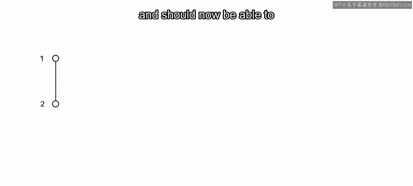
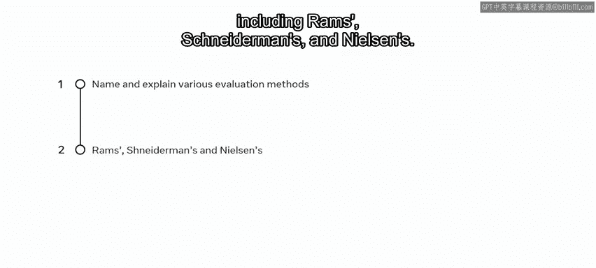
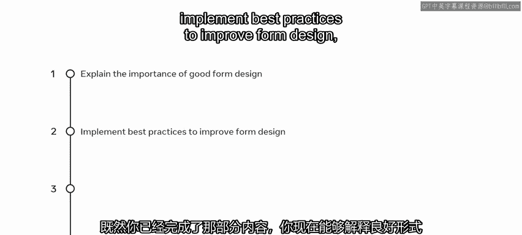
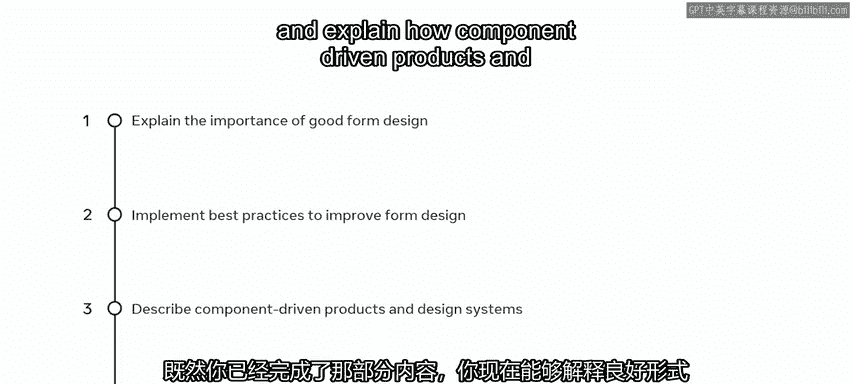
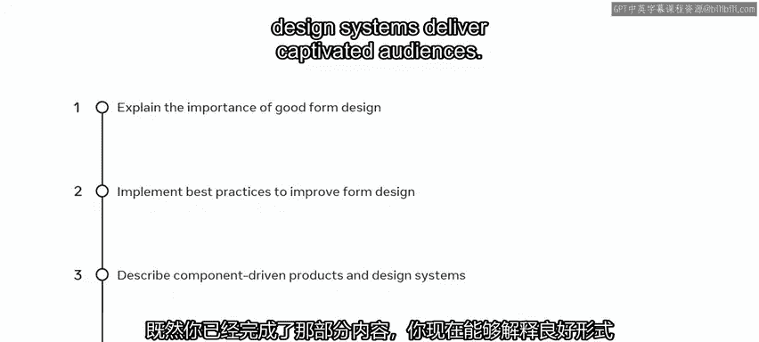
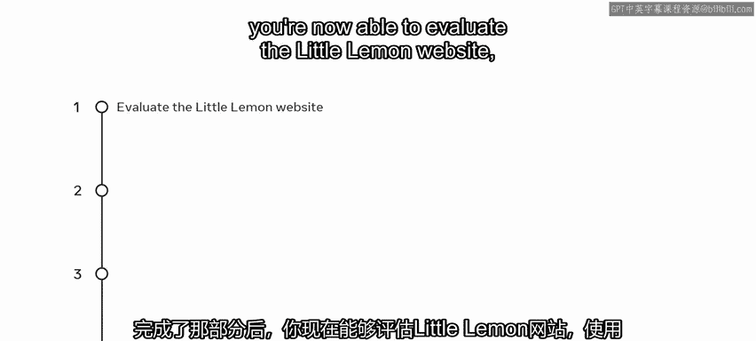
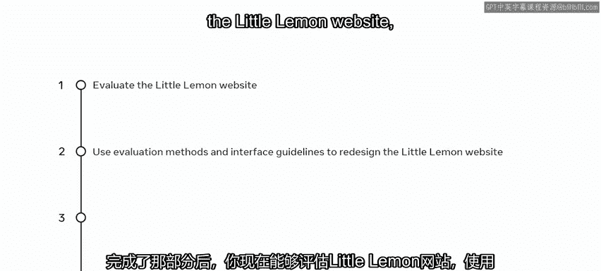
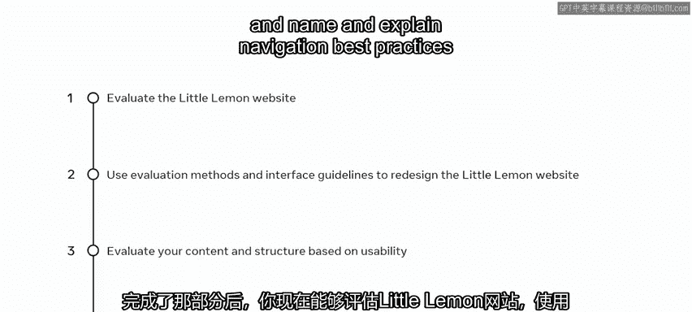
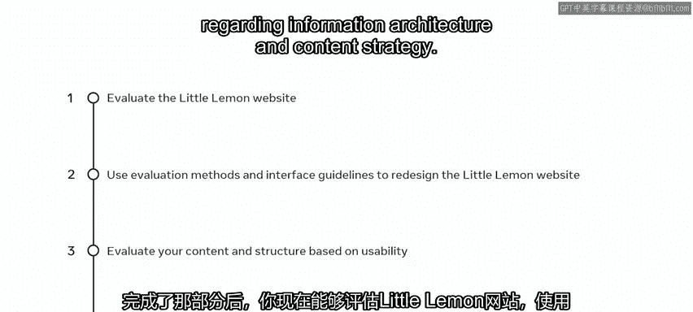

# 前端开发：P103：交互设计评估模块总结 🎯

在本节课中，我们将回顾并总结交互设计评估模块的核心内容与关键技能。你将清晰地了解在本模块中学到的评估方法、设计原则以及如何将它们应用于实际项目中。

---

恭喜你，你已经完成了本课程的第二个模块。

让我们花点时间回顾一下你获得的一些关键技能。

首先，你学习了如何评估UX/UI中的交互设计，现在应该能够列举并解释UX和UI设计中的评估方法，包括**Rams原则**、**Schneiderman的八项黄金法则**以及**Nielsen的十大可用性原则**。

上一节我们介绍了交互设计的评估方法，本节中我们来看看设计中的最佳实践原则。

你学习了如何识别设计中的最佳实践原则。在完成该部分内容后，你现在能够做到以下几点：

以下是你在表单设计和设计系统方面获得的能力：
*   解释良好表单设计的重要性。
*   实施最佳实践以改进表单设计。
*   描述组件驱动产品和设计系统。
*   解释组件驱动产品和设计系统如何吸引并留住用户。

掌握了设计原则后，我们接下来将其应用于具体案例。

你接着学习了如何评估“小柠檬”网站。完成该部分后，你现在能够做到以下几点：

以下是你在网站评估和优化方面的具体技能：
*   评估“小柠檬”网站。
*   使用评估方法和界面指南来重新设计“小柠檬”网站。
*   在考虑可用性的前提下，评估你的内容与结构。
*   列举并解释关于信息架构和内容策略的导航最佳实践。

至此，你现在应该能够做到以下几点：
*   评估UX/UI设计。
*   应用UX/UI最佳实践原则。
*   描述组件驱动产品和设计系统。
*   基于UX/UI设计最佳实践原则评估一个网站。

做得很棒。

---

本节课中我们一起学习了交互设计评估模块的全部要点。我们回顾了关键的UX/UI评估方法、设计最佳实践原则，以及如何将这些知识应用于评估和优化一个真实网站。你现在已经具备了系统评估设计并应用专业原则来提升用户体验的能力。