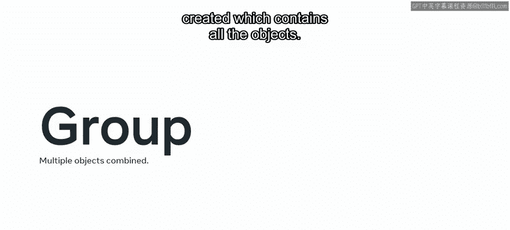
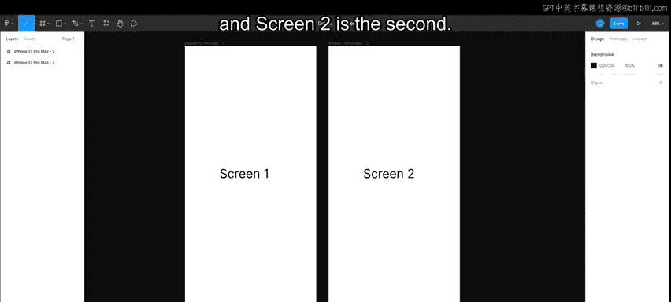
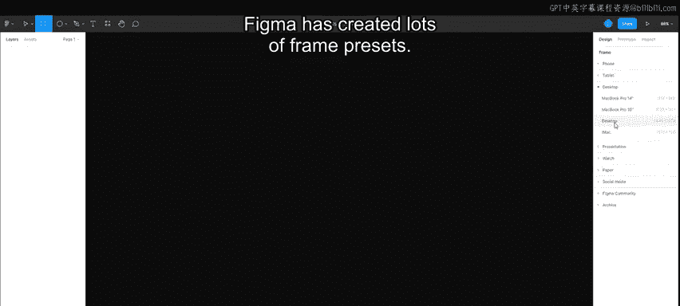
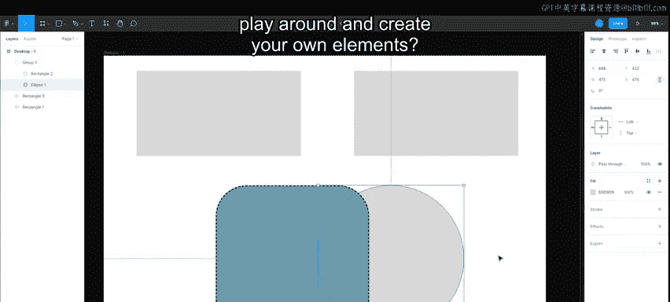

# 前端开发：P104：框架、层和基本形状 🎨

在本节课中，我们将学习Figma中的三个核心概念：框架、图层和基本形状。你将了解如何使用图层面板、如何拖拽和组织图层，以及如何构建和编辑形状。我们还将探讨如何复制、缩放、编组和对齐元素。

## 框架、图层与编组的概念

上一节我们介绍了课程目标，本节中我们来看看Figma中的几个基本概念：框架、图层和编组。

首先，让我们从框架开始。在其他设计工具中，框架可能被称为“画板”。你可以将其视为承载设计的容器。

接下来，定义什么是图层。图层是框架内的一个对象。当你向框架添加一个对象时，就会创建一个新图层。

第三个要介绍的概念是编组。在编组中，多个对象可以被组合在一起。一旦组合，就会创建一个单一的顶层，其中包含所有对象。

框架和编组看起来非常相似。它们都通过嵌套图层或将图层组合在一起来帮助组织文件。然而，框架提供了更多的功能，例如独立的尺寸调整。你将在整个课程中更详细地了解这一点。

## 在实践中探索框架

现在，让我们在Figma中实践这些概念。框架是元素的容器。可以将其想象为应用程序中的一个屏幕。例如，Sc1是你看到的第一个屏幕，Sc2是第二个。如果你添加另一个框架，那将是第三个，依此类推。

以下是创建框架的步骤：
*   点击顶部工具栏上的框架图标，然后点击并拖出一个框架。
*   另一种创建框架的方法是选择框架图标，然后转到右侧面板，Figma在那里提供了许多框架预设。

在这个例子中，我将使用一个桌面框架。

要导航你的框架或画布，请前往屏幕右上角的缩放菜单。它会告诉你当前的缩放级别，并提供一些与缩放相关的有用快捷键提示，例如 `Command`（或 `Ctrl`） + `+` 进行放大，或 `Command`（或 `Ctrl`） + `-` 进行缩小。

要在屏幕上平移，你可以选择工具栏上的手形图标，或者使用键盘上的 `Shift` 键。

## 绘制与编辑基本形状

现在，让我们绘制一些形状。我选择框架，然后转到工具栏中的基本形状工具菜单。我点击圆形图标旁边的箭头以打开形状工具，并选择一个矩形。

我点击并拖出一个矩形。如果我想要一个正方形，我选择矩形图标并在键盘上按住 `Shift` 键来创建一个正方形。创建圆形的过程相同。我选择椭圆工具并按住 `Shift` 键。

要复制矩形，我选中它并按键盘上的 `Ctrl`（或 `Command`） + `D`。矩形已被复制，可以放置在任何我想要的位置。

让我们看看这些形状的属性。我选择正方形，在右侧可以看到它的X和Y坐标、宽度、高度、旋转角度和圆角半径。让我们将半径改为 `100`。

你可能已经注意到，默认情况下每个形状都有灰色填充且没有轮廓。要更改这一点，我转到填充部分，点击小矩形打开调色板。使用圆形图标，我点击选择我喜欢的颜色。如果我想要不同的色调，可以拖动这个滑块。我还可以更改透明度或输入颜色参考编号。

在这里，我也可以应用轮廓（称为描边），并选择其位置：内部、外部或居中。在本例中，我选择外部选项。在右侧，有高级描边设置，可以更改其线条类型。我还可以添加效果。我点击加号图标并添加一个投影。

## 使用图层面板

在屏幕左侧的图层面板中，我可以看到我的形状按照绘制的顺序显示为图层。我将圆形图层移到正方形上方，但后来决定让正方形位于圆形之上。我只需要将正方形图层拖放到圆形图层之上即可。

现在，正确保持图层名称很重要，因此我将“rectangle2”重命名为“square”，将“ellipse1”重命名为“circle”。

图层面板内还有其他功能。我可以打开或关闭图层的可见性，也可以锁定图层，锁定意味着它无法被移动。

## 编组元素

我们有一个圆角正方形和一个圆形，它们是两个独立的元素，可以单独操作。但如果我想让它们作为一个对象一起移动和操作，我选中它们，然后右键点击并选择“编组选择”，或者使用键盘快捷键 `Ctrl`（或 `Command`） + `G`。

这允许这些元素作为一个整体移动。如果你想修改其中一个形状，只需在形状内部双击即可。

## 总结与练习

现在你已经探索了框架、图层和基本形状的基础知识，何不自己动手尝试，创建你自己的元素呢？

在本视频中，你学习了Figma框架、图层和形状的基础知识。我鼓励你自己练习使用这些基本工具，并注意图层面板中编组和框架之间的区别。