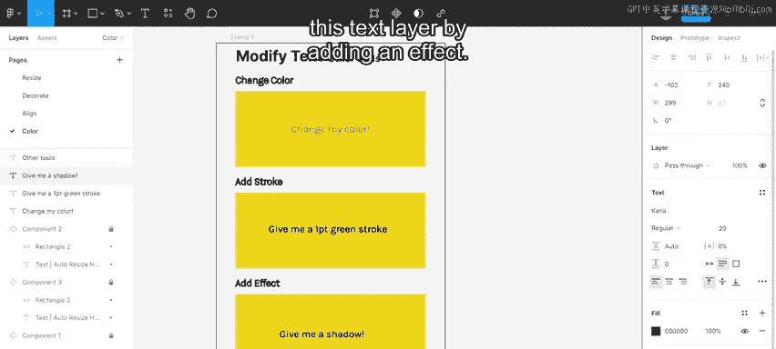
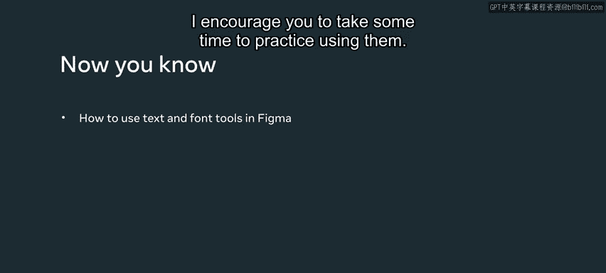

# Meta《前端开发（React／UI、UX／毕业项目／code review）｜Meta Front-End Developer》中英字幕 - P105：22_类型和文本.zh_en - GPT中英字幕课程资源 - BV1uJ4m1e7HT

In interface design， fonts play a very important role。

The font you choose will determine the readability and the appeal of your text。The color， size。

 spacing， and width of text all deliver a message of your product to the users。In this video。

 you will cover the basics of using the text and fonts tools。To get started。

 let's explore the text properties in the design panel on the right sidebar。

 There are two ways to create a text element。To begin typing。

 I click the T icon in the toolbar on the top。 I can also use the T keyboard shortcut。

 Then I can start typing。This creates a text box with an auto resize feature。

 which allows the width of the text box to grow horizontally along with the text。

I can also click and drag to create a fixed text box with specific dimensions。

Since the text box size has been established， the auto resize is fixed。

This allows longer strings of text to move to the next line once they reach the edge of the fixed text box。

To edit an existing text element， I double click inside the text box。

To allow the text box to auto resize， I go to the design panel in the right sidebar and change the auto resize value to height。

Now， when I add new text， the bounding box will enlarge vertically， but not horizontally。

When I use this setting， I ensure the height of the text box is sized based on the line height specified in the font style。

A text box that is sized too small for its contents will automatically resize to the height to fit。

When creating text in Figma， three resizing modes can be applied。Grow horizontally。

 which is the default when you click once to make a new text box。

Fixed the default when you click and drag to make a new text box。And grow vertically。

To customize text in Figma， I can use the drop down in the design panel in the right sidebar。

 I can then select a new font。I can also type in the field to search for a specific font。

 I search for the Oswald font。To further customize text。

 I can select from the drop down menu to choose the style or use shortcut keys。

 such as control B on Windows or command B on a Mac for bold。Control or commands eye for italics。

Control or command you to underline。I can change the font size by typing it in or selecting the new field and pressing the arrows up or down。

I can also change the amount of space between each line of text。 The default is auto。

 Let's increase this to 43。To the right of this property is the character spacing option。

It adjusts the spacing or curning of a certain character combination。By default。

 Figma uses percentage values。 However， if I type in a pixel value， it will change the unit to pixel。

For example， let's change the spacing to four pixels。Now let's explore text alignment。

Horizontal alignment defines how text is distributed within its bounding box， left， right and center。

On the other hand， vertical alignment determines how the text is distributed vertically， top。

 bottom and middle。When I go to the three dots at the bottom of the text option section。

 it brings up three additional tabs。In the basics tab。

 you can choose how you want your text to resize horizontally。

 adjust the horizontal alignment of the text， App decoration to text like strike through and underline。

 Change the spacing between paragraphs of text。Offset the first line of text with a paragraph indentation。

Create numbered or bulleted lists or change the text case。In the details tab。

 you can apply settings such as style， position such as superscript， subscript and fractions。

You can also access any open type features like letter forms。

 character variants and horizontal spacing。Finally， in the variables tab。

 you can adjust the fonts variable ax setting。There are other attributes not within the text properties panel。

 which can be used to modify text， such as changing the color of the text。

 adding a stroke or adding an effect。 Let's make this text green by changing its fill。 Now。

 let's add a green  one point stroke to this text layer。

Then add a drop shadow to this text layer by adding an effect。

All right， I've applied a couple of effects to the text。 In this video。

 you've covered some text and font tools that are available in Figma。

 I encourage you to take some time to practice using them。😊。

