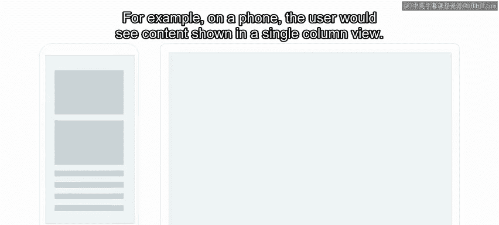
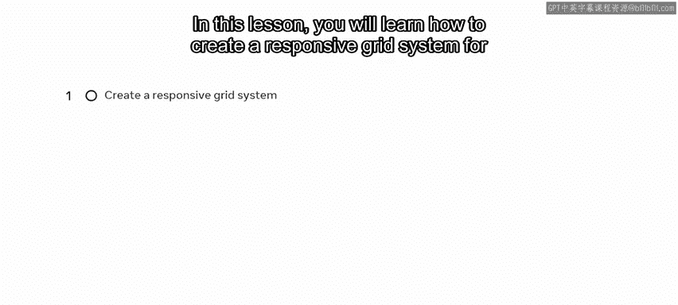
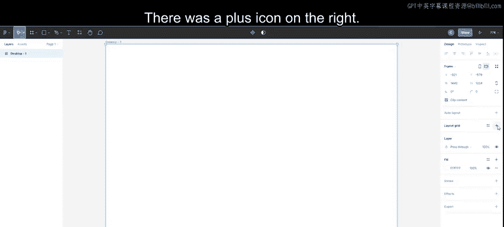
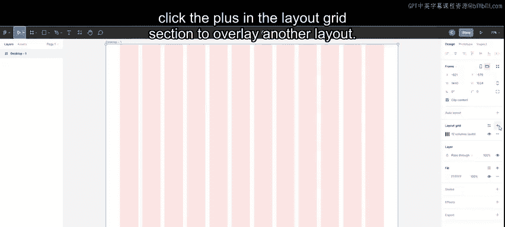
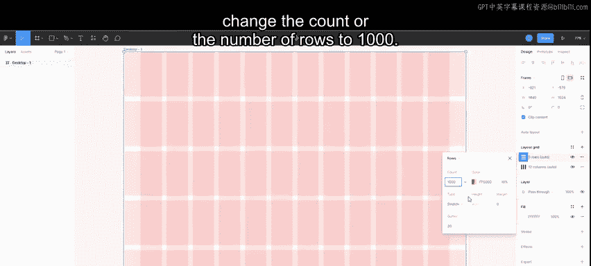

# 前端开发：P106：网格与约束 📐

在本节课中，我们将学习如何为网页或应用创建响应式网格系统，并了解如何利用约束来确保元素在不同屏幕尺寸下都能正确布局。响应式设计是现代网页开发的核心，它能让你的设计自动适应从手机到桌面电脑的各种设备。

## 响应式设计简介

每个人都希望自己的网站拥有移动版本。响应式设计的目标是**一套设计适配所有屏幕分辨率**。例如，在手机上，用户看到的内容以单列视图呈现。而在平板电脑上，相同的内容可能以两列显示。这就是响应式设计发挥作用的地方。

响应式设计是一种利用**弹性布局**的网页创建方法，它消除了为每种设备单独设计布局的需要。

## 网格系统基础

网页或应用由方块和矩形构成，这些元素被包含在一个**网格系统**中。网格系统是一系列不可见的线条和列组成的结构，它们组织页面上的内容，创建对齐和秩序，构成了用户界面的基本框架。

接下来，我们看看如何在Figma中，以响应式网页设计为理念进行设计。

## 创建响应式网格

让我们从创建响应式网格开始。

首先，我选择顶部工具栏上的框架图标，或按键盘上的 `F` 键，这会调出框架面板。然后，我选择桌面框架尺寸：1440 x 1024。

在右侧边栏，有一个名为“布局网格”的区域。其右侧有一个加号图标。点击它，默认会显示一个简单的10像素 x 10像素的网格。

如果点击下方的九个点，会弹出一个窗口，提供调整网格大小和颜色的选项。这些网格是静态且像素固定的，这意味着如果调整框架大小，网格保持不变。

有一个下拉菜单提供三种不同类型的网格。我将从列网格开始。

### 列网格

列网格有助于水平排列内容。选中它后，框架内的网格会变为默认的5列网格，并带有间距（即列之间的空隙）。

最常见的列数配置是：桌面12列、平板8列、手机4列。常见的间距大小为20像素。因此，让我们将网格更改为12列网格。

我将类型保持为“拉伸”，这意味着当我调整框架大小时，列的宽度会自动增长或收缩。

为了使网格具有响应性，我将边距改为70。这是内容与屏幕左右边缘之间的空间。同时，我将间距保持在20。

### 行网格

接下来，让我们在垂直方向上也添加一些秩序。这里我引入**8点网格**，因为大多数流行的屏幕尺寸都能被8整除，它是保持间距一致性的基础。

因此，我选择框架，转到右侧边栏，在布局网格部分再次点击加号，以叠加另一个布局。

在弹出的对话框中，我将网格布局更改为“行”，并将行数更改为1000。

然后，我将类型改为“顶部”，高度改为8。最后，我将间距设置为0。

现在，我们拥有了一个垂直和水平交织的网格系统。

## 添加内容块

现在你会注意到，所有内容都会**吸附到网格**上。这使得排列元素变得更简单，并使所有尺寸保持一致。所有尺寸都能被8整除。

如果我想在没有网格系统的情况下查看框架，可以点击屏幕右上角的缩放百分比，这将打开“视图设置”菜单。在那里，我可以找到打开或关闭网格的选项。

或者，我也可以使用键盘快捷键来切换布局网格的显示：在Mac上是 `Control + G`，在Windows上是 `Control + Shift + 4`。使用相同的命令可以再次显示网格。

## 使用约束

约束是使用网格的另一个好处。我在桌面版本中选择内容框，并为它们添加约束。

约束用于将布局中的内容固定到网格的左侧、右侧、顶部、底部或中心。

在这里，我应用了左约束和右约束。现在，如果我们改变框架的大小，内容会做出响应并相应地改变尺寸。

## 总结

本节课中，我们一起学习了如何创建响应式网格系统，并掌握了如何约束网格内的元素。我们了解了列网格和行网格的设置，以及如何使用8点网格保持设计的一致性。最后，我们探讨了约束的功能，它确保了当屏幕尺寸变化时，界面元素能够智能地调整自身位置和大小。掌握这些基础技能，是构建适配多设备的现代化网页界面的关键。