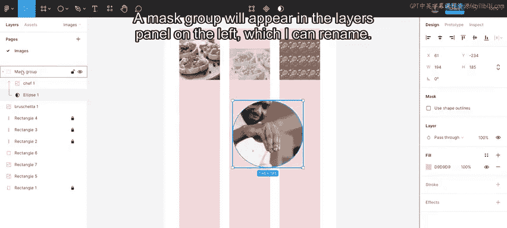
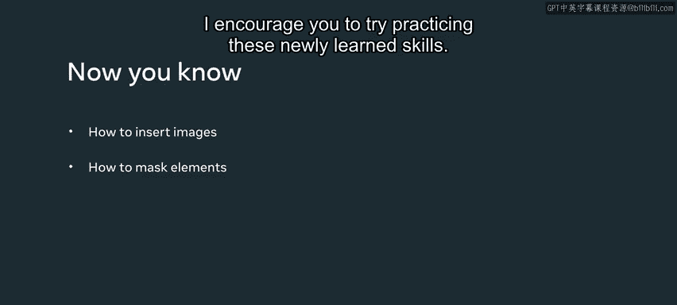

# Meta《前端开发（React／UI、UX／毕业项目／code review）｜Meta Front-End Developer》中英字幕 - P108：25_处理图像.zh_en - GPT中英字幕课程资源 - BV1uJ4m1e7HT

As a designer， you will work with images pretty much every day。

 So you need to know the correct methods of inserting and adjusting images。

 which will help you create beautiful designs。😊，So let's explore images in Figma。In this video。

 you will cover how to insert images and how to mask elements to show specific parts of an image and hide the rest。

There are several ways to insert an image。I can use the place image function。

 change the fill properties， or drag and drop an image。First。

 let's cover how to use the place image function。I go over to the Figma icon on the top left hand side and scroll down to place image。

 or I can use the keyboard shortcut， command， shift K on a Mac， or control shift and K on Windows。

Now， I select an image to upload。 Figma will then display across hair mouse pointer。

I click and drag within the frame to place the image。 I make it one column， wide， and square。

I adjust this in the design panel after adding the image。

 and I set the image to be 112 pixels wide and 112 pixels high， which is the size of the box。

 Then I align the image with the box。Second， I can insert an image by filling an object with the image I want。

I select an object。 Then I go to the fill section in the design panel on the right sidebar and click the gray solid color。

There is a drop down menu， and I select image。 A checkerboard pattern appears with my shape with a prompt to choose an image to upload。

Several image or photo specific options to alter the image。

 such as exposure and contrast are displayed。There are also options in the drop down menu to change how the image is displayed。

The default is set to fill。I can also change it to fit。

Fit allows me to show the full image in my shape， but it may cause blank space around the image。

I can also crop the image that I insert。The crop option allows me to crop the image to the size that I want。

Another option to fill an object with an image is to use the tile option。

 which allows me to create a pattern。Finally， the last way to add an image is to drag and drop the image onto Figma。

One other effect I can apply to images is masking， where I hide some parts of an image and reveal others。

Sometimes I want just one part of an image， and I want it in a specific shape that is different from the shape of the original image。

 Masking helps me achieve that to mask an image。 All I need is the image I want to mask on and the shape I want to mask by。

Let's explore how to do that。 I start by drawing a circle。

I make sure that the image is on top of the shape。 I can do this in the layersars panel。

Then I select both the shape and image and click the use mask button in the options on the top center of the screen。

Now， all I have to do is reshape the picture to fit into the circle。

A mask group will appear in the liars panel on the left， which I can rename。

 I can do this for any kind of shape。

Now， you know how to insert images and how to mask elements。

 I encourage you to try practicingising these newly learned skills。

