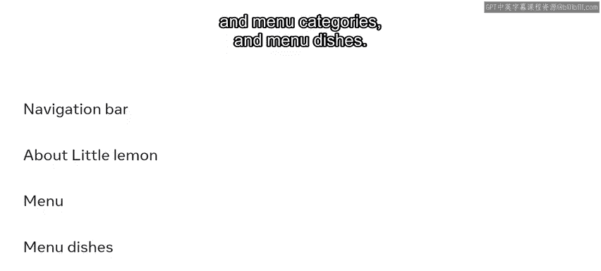
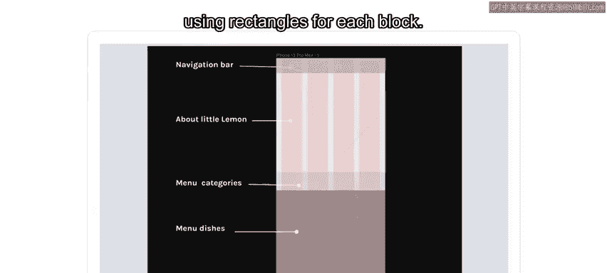
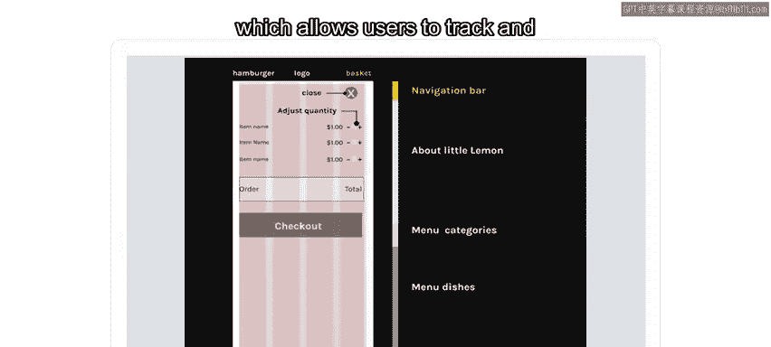
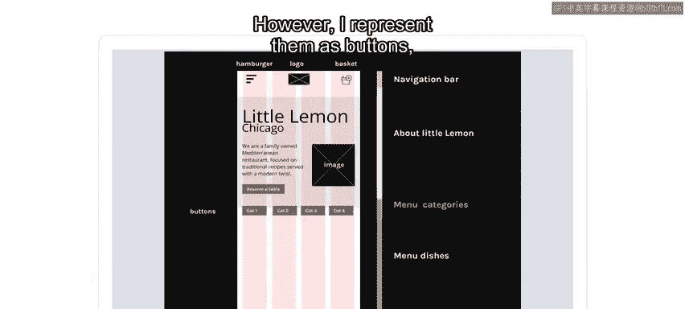
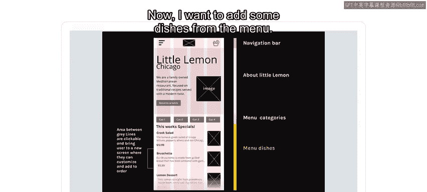
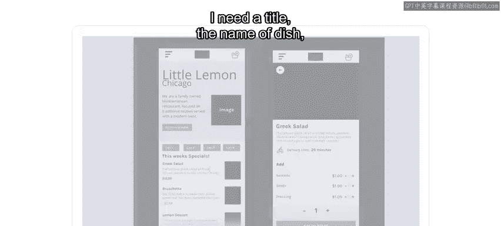
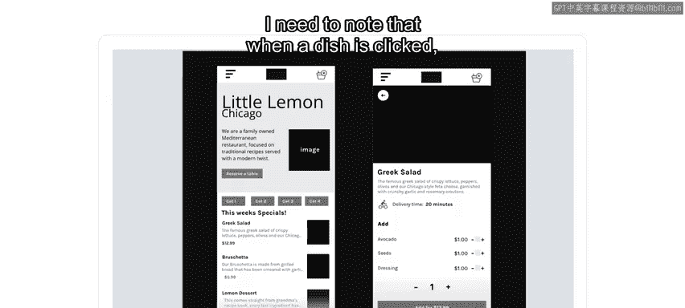

# Meta《前端开发（React／UI、UX／毕业项目／code review）｜Meta Front-End Developer》中英字幕 - P109：26_线框图.zh_en - GPT中英字幕课程资源 - BV1uJ4m1e7HT

The little lemon restaurant has faced difficulties with the order online feature on their website。

 The restaurant's menu is too long requiring endless scrolling。

 There are no options to order a specific number of dishes。

 The user has to repeatedly select a dish and add it to the basket。 How can this be improved。

 You already learned how to create grids， Draw shapes and manipulate objects in Figma。 In this video。

 you will learn to describe the concepts of wire framing and design wire frames using Figma。

The purpose of a wire frame is to create a basic structure for each screen in the design before things like branding。

 colors and images are considered。 It provides a way of communicating ideas quickly。

 which can be refined later。You focus on the user experience and on what they need to accomplish a task。

I will use Figma to draw the wire frames so they can be shared with other team members。

 giving them the opportunity to make comments in the same document。

 I will create three wire frames in this exercise。 First， let's list Adrian's requirements。

They will become content blocks， which will give me a nice skeleton of what content will appear in the wire frame。

 It will show the little lemon brand about and menu categories。

 prices and a customized order section。 It will also show description and photos of dishes。

 delivery or take out options。 The number of dishes in each order and an addd to order button。

 Finally， it will show a login and a pay section and， of course， a navigation bar。😊。

Now I have a good idea of what I need to put on my wireframes。

 I will begin with the mobile version first。In UX， this is a common practice it's called mobile first design this is because most users on the web nowadays access websites on their mobile device。

So I want to make sure that my design works perfectly on a mobile device。In addition。

 it's easier to solve design problems on a small screen and then adapt them to a large one。

On the first frame， I need the content blocks to contain the navigation bar about little lemon and menu categories and menu dishes。

So I select a mobile frame and add a four column layout grid to the frame。

 Then I construct content blocks using rectangles for each block。 Next。

 I move these blocks out of the frame。 Then I make the rectangles narrower。

But I do not change the text。It gives me a rough outline of all the content in the wireframe。

To use as a reference as I am designing within the frame。Now let's focus on the navigation bar。

I need to offer users a way to navigate to the home screen。

 so I add a logo that will take me back to the home screen。I also include a shopping basket。

 as it's an online delivery service。 I chose to use a hamburger menu。 When tapped。

 it opens up a pop up overlay so the user can easily navigate to other pages on the site for the logo。

 I draw rectangle and diagonal lines through it。 This is a conventional way to denote an image placeholder。

 When the basket is tapped， it opens up a pop up overlay。

 which allows users to track and alter what they intend to purchase and an option to check out。

In the about little lemon content block， I want to include the little lemon name， what city it is in。

 a brief description of what type of food it offers a photograph。

 Adrian wants users to have an option to book a table online。

 So I put it in this content block as a button。When clicked。

 the user is brought to another page Now let's work on the menu categories。

I know they have not been decided yet。 However， I represent them as buttons naming them cat1， cat2。

 and so on。

Now， I want to add some dishes from the menu。 I add them on the bottom。

 as this is the first screen of the online page， Adrian wants to highlight this week's specials。

 I need a title， the name of dish， a description， the price and an image。

 This section is scrollable vertically to see further items。

I need to note that when a dish is clicked， the user is taken to another screen I repeat this process for all screens in the order online section。

In the wire frame no color font images are included， it is just the blueprint。

 all that is important here is the layout and functionality。

In this video you explore the concepts of wire framing and how to design wireframes using Figma。

 you're encouraged to practice it and perhaps wireframe the desktop version of the little Le website。

