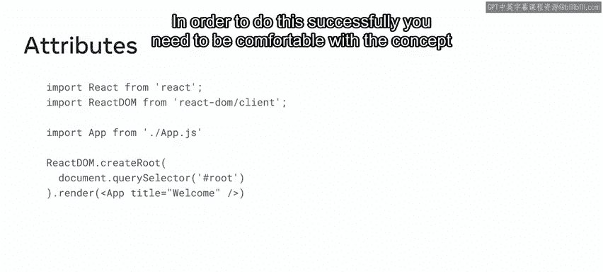
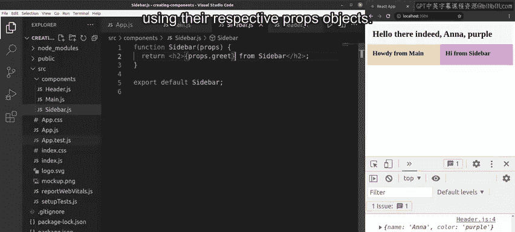

# Meta《前端开发（React／UI、UX／毕业项目／code review）｜Meta Front-End Developer》中英字幕 - P10：9_在组件中使用 props.zh_en - GPT中英字幕课程资源 - BV1uJ4m1e7HT

By now you should be familiar with the concept of props and that they allow you to pass data from one component to another。

Developers use props when they want the flow of data in the app to be dynamic This makes the app more versatile。

 helping it consume data easier in this video you'll learn the syntax involved to use props and components you'll also explore the passing of props to and within a components using functions。

During this course， you were introduced to an example of how to build a simple blog layout in react using components。

Now you'll be introduced to a new component called the naav componentDevelop commonly build navigation menus using HTML unordered lists and navigation menu is basically just a list which can be styled easily with CSS such a snippet of code is well suited to be placed in its own react component making use of the HTML nav elements to act as the block of code to return the JSX from inside the function For example。

 the return statement can contain several HTML like elements such as UL and liI tags and this same nav component can also be rendered as a JSX element to which we can pass dynamic value with props in order to do this successfully you need to be comfortable with the concept of attributes the best way to develop an understanding of attributes is with a live example of building a component using props has a practical way to work with props。

I'm in my app with the header main and sidebar components and all of them are rendered from the app component the app component is in this case referred to as the parent component and the header。

 main and sidebar component are referred to as the children of the app components I'll now pass data from the app component to each of its children components。

First， the header component receives a name prop with a value of Anna。

And a color prop with the value of purple。I'm sending those props from the header JSX element inside the app component return statement。

 press C S or command S on a Mac to save these changes。However。

 my recompiled app is not showing any changes because I send this data through the propps object to the header component。

 I'm not using this data in the header component。So let me open the header component and I'll first pass in the Props Ob。

For now， Ill just console log the props object。Again press Cl S or command S to save the update and wait for it to compile if I now inspect this object in the console。

 I find the console Logged Props object and it comes with two properties。

 the name Anna and the color purple。I can now access the values of the two properties inside the header component using props dot name and props dot collar。

To make sure that the expressions are evaluated inside the JSX syntax。

 I must surround them with an opening and a closing curly brace。

I press C S or command S on the Mac again and wait for it to compile Now my header shows the prop data it received from the parent component。

I'll now update the main and sidebar too。Back in the app component render statement。

 I add the greet prop with the value of Howy in the main JSX element。

And the value of high in the sidebar JSX element， I open the main components file and receive the propps object。

Then outputs the value of opening curly brace， props， dot， greets， closing curly brace。

I can now delete the Hello string。Similarly， in the sidebar components file。

 I'll also receive the propps object and replace the hellello with an opening curly brace。

 props dot greet， closing curly brace。I click file saveve All and wait for the app to compile All my components are now using the data they received from their parent components using their respective props objects you should now be able to effectively demonstrate the passing of props to and within a component using classes and functions great work。

