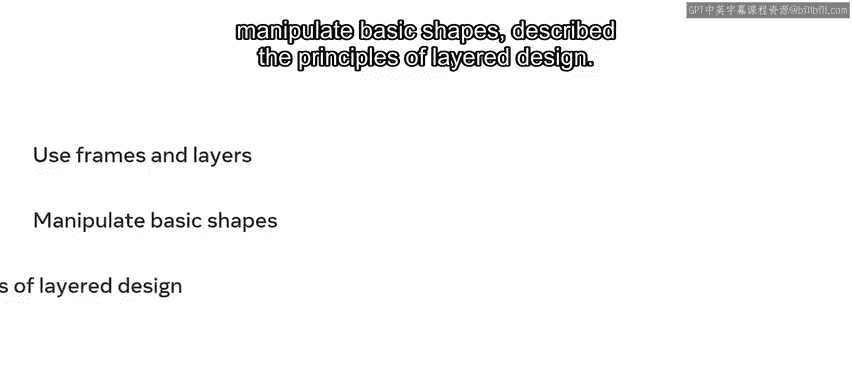
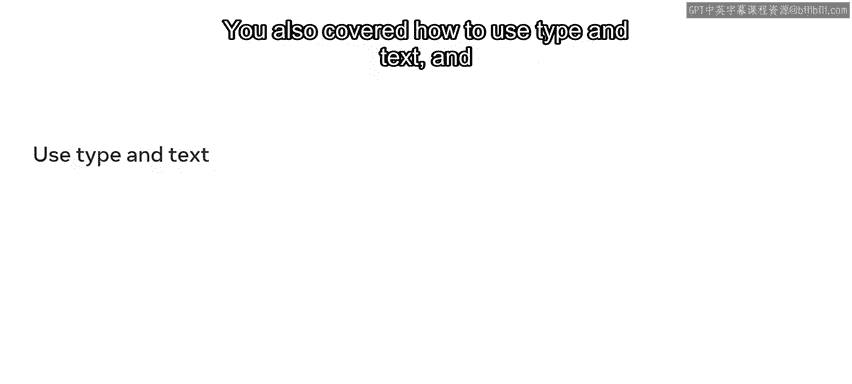
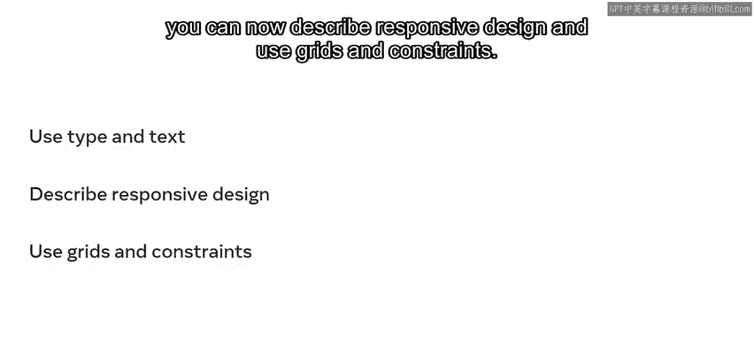
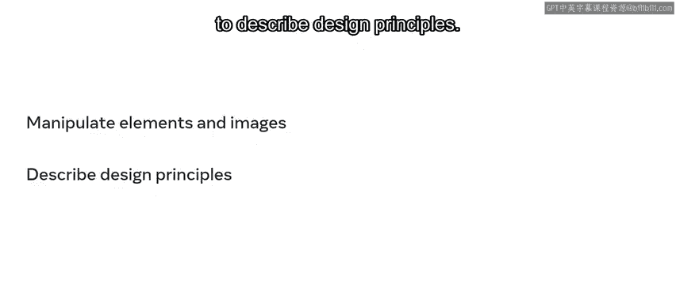
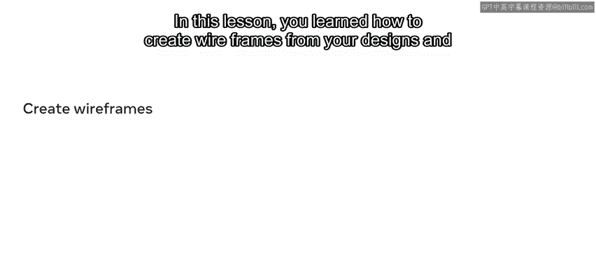
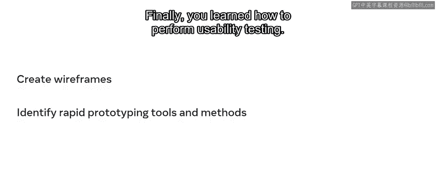

**前端开发（React/UI、UX/毕业项目/代码评审）：P111：28_设计基础应用模块总结** 🎨

在本节课中，我们将一起回顾“应用设计基础”模块的核心内容。这个模块主要围绕Figma工具基础和迭代设计流程展开，旨在帮助你掌握UI/UX设计的基本技能。

---

上一节我们完成了模块的学习，现在我们来总结一下关键的知识点和获得的技能。

你从探索Figma的基础知识开始。完成第一课的学习后，你现在能够：

以下是你在Figma基础部分掌握的核心技能：
*   使用**画框（Frames）** 和**图层（Layers）**。
*   操作基本形状。
*   描述**分层设计（Layered Design）** 的原则。
*   使用**文本工具（T）** 添加和编辑文字。
*   描述**响应式设计（Responsive Design）** 的概念，并运用**网格（Grids）** 和**约束（Constraints）**。
*   操作元素和图像，并描述基本的设计原则。

---

在掌握了一些Figma基础之后，你进入了第二课，重点学习了迭代设计。

以下是迭代设计部分的核心内容：
*   如何根据设计创建**线框图（Wireframes）**。
*   识别快速原型设计（Rapid Prototyping）的工具和方法。
*   如何进行**可用性测试（Usability Testing）**。

---

现在，你已经对设计基础有了初步的理解。你学习了Figma，并掌握了如何使用它来创建线框图、应用设计原则和最佳实践。这是你在UI/UX设计旅程中迈出的又一个重要步骤。

本节课中，我们一起学习了Figma的核心操作、响应式设计概念以及迭代设计流程，包括线框图绘制、原型制作和可用性测试。这些技能是构建有效用户界面的基石。