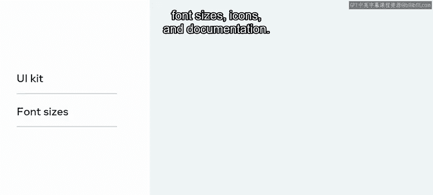
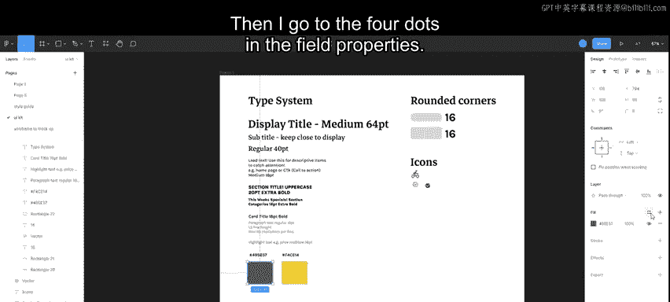
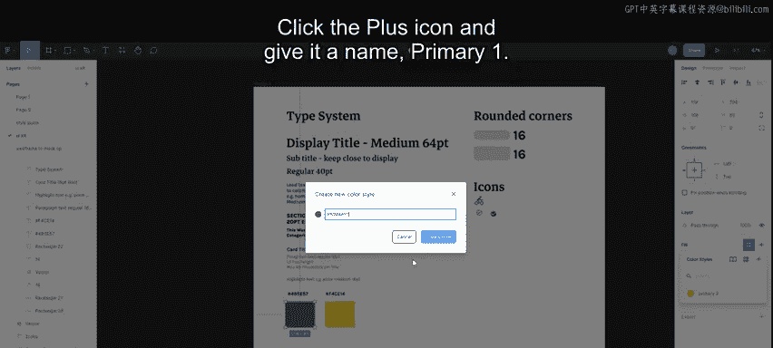
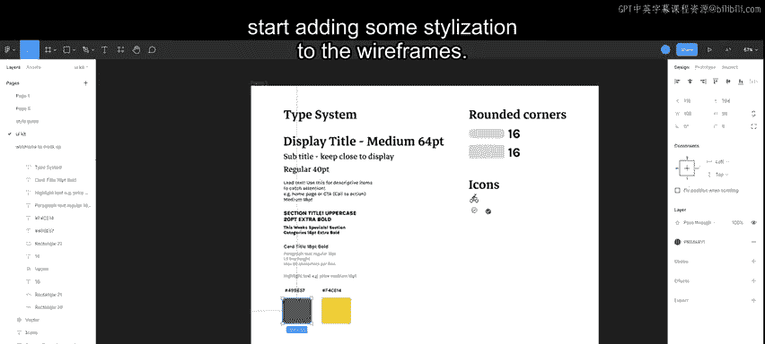
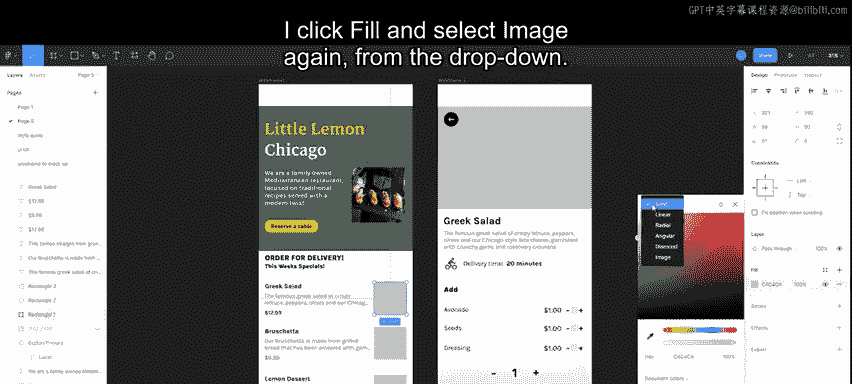
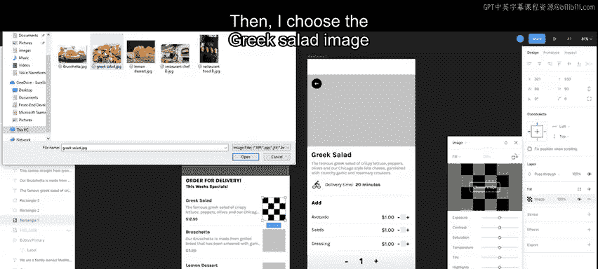
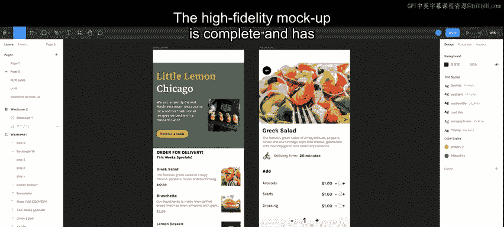
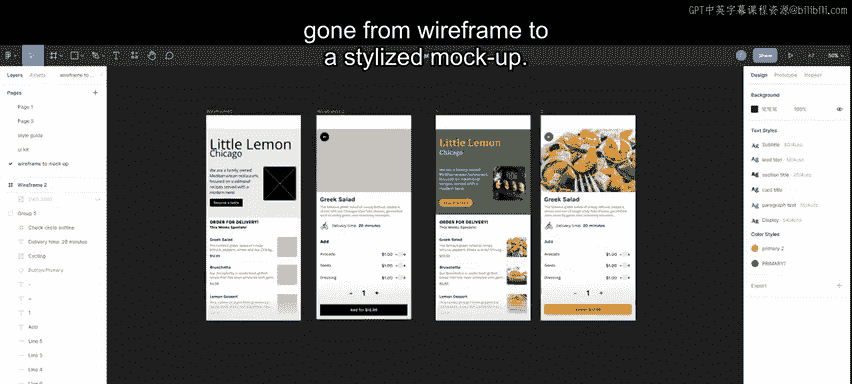

# 前端开发：P113：从线框图到高保真设计 🎨

在本节课中，我们将学习如何将已获批准的应用程序线框图，转化为一个高保真设计。高保真设计是指与最终产品外观高度相似的设计稿。我们将通过添加品牌元素和样式来完成这一过程。

## 准备工作：品牌风格指南与UI套件

在开始设计之前，我们收到了品牌风格指南。这份指南规定了品牌视觉风格的各个方面，包括**字体**、**色彩调色板**以及图片和图像的使用规范。

同时，我们还获得了一个**UI套件**。UI套件是一组文件，包含了关键的UI组件，例如字体大小、图标和相关文档。

上一节我们介绍了设计流程的起点，本节中我们来看看如何利用这些资源创建样式。

## 第一步：基于UI套件创建样式

首先，打开UI套件文件。我们将从创建文本样式开始。

1.  在UI套件中选择“Display Title”文本。
2.  转到屏幕右侧的四个点图标处。
3.  点击“样式”，然后点击加号图标。
4.  将其命名为“Display”，然后点击“创建样式”。这样，文本样式就创建好了。

创建颜色样式的过程与此类似。以下是具体步骤：

1.  我已经为黄色创建了颜色样式，现在需要为绿色创建一个。
2.  选择绿色的色块。
3.  在填充属性中找到四个点图标。
4.  点击加号图标，将其命名为“Primary One”。
5.  点击“创建样式”，颜色样式即创建完成。

至此，UI套件已提供了我们所需的一切基础样式。

## 第二步：为线框图添加样式

现在，让我们将线框图导入，并开始为其添加样式。

首先，选择第一个线框图的背景，为其添加颜色。

1.  点击背景元素。
2.  点击填充属性处的四个点图标，这会显示已创建的所有样式。
3.  选择绿色，即我们刚才创建的“Primary One”样式。

接下来，为顶部的“Little Lemon”文本添加样式。

1.  选中该文本。
2.  在右侧边栏中，选择我们创建的“Display”文本样式。
3.  对此线框图中的其他文本元素重复此操作。

然后，我们需要修改显示文本的颜色。

1.  选中“Little Lemon”文本，将其颜色改为黄色。
2.  将其他文本元素的颜色改为白色。

现在，需要根据UI套件来设计按钮样式。UI套件规定按钮应为圆角，圆角半径为`16`。

1.  选中按钮。
2.  在右侧边栏中，将圆角半径修改为`16`。
3.  接着修改按钮颜色：在填充属性中点击四个点，选择“Primary Two”样式。
4.  同时，将按钮上的文字颜色改为黑色，因为白色在深色背景上不够清晰。

## 第三步：插入图片

目前的设计还需要插入图片。以下是插入图片的步骤：

1.  选中线框图中的图片占位框。
2.  在右侧边栏的填充属性中，将顶部的下拉菜单从“纯色”改为“图片”。
3.  此时会出现一个棋盘格方框，并提示选择图片。
4.  选择所需的图片，它就会出现在元素中。

我们需要为剩余的图片占位框重复此操作：

1.  点击下一个图片占位框的填充属性。
2.  再次从下拉菜单中选择“图片”。
3.  选择“希腊沙拉”图片。
4.  对另外两个图片占位框重复此操作。

## 完成与总结

高保真设计稿现已完成。我们成功地将一个简单的线框图，转变为了一个具有完整品牌样式和视觉元素的精美设计稿。

本节课中我们一起学习了从线框图到高保真设计的完整流程。我们首先利用品牌风格指南和UI套件创建了可复用的样式，然后逐步将这些样式应用到线框图的各个元素上，包括背景、文本、按钮，并最终插入了真实的图片。这个过程确保了设计的一致性，并使其无限接近最终产品。

现在，为什么不自己动手试一试呢？