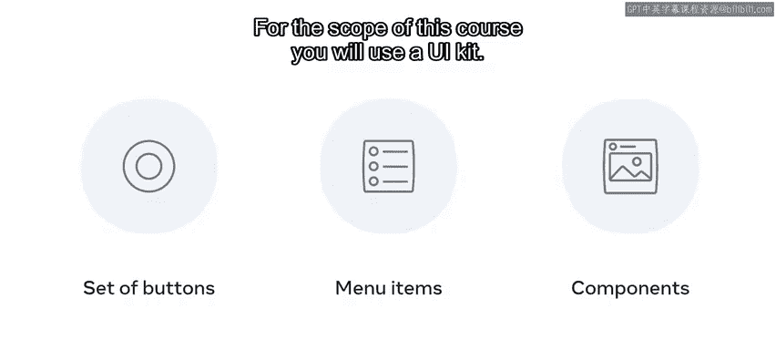
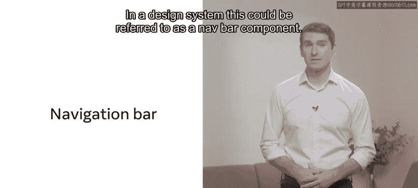
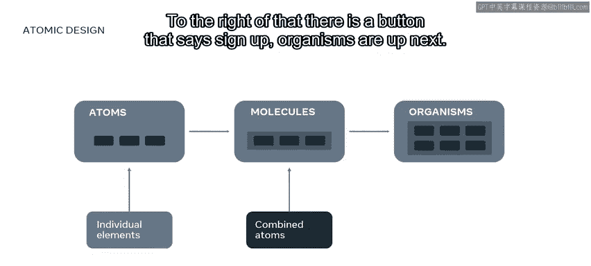
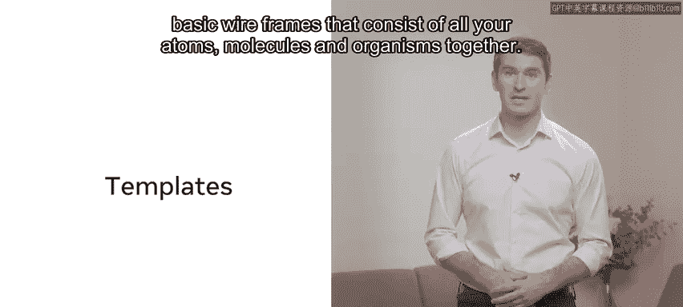
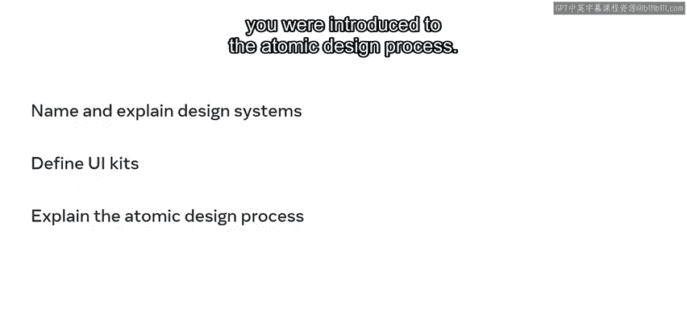

# Meta《前端开发（React／UI、UX／毕业项目／code review）｜Meta Front-End Developer》中英字幕 - P114：31_什么是设计系统.zh_en - GPT中英字幕课程资源 - BV1uJ4m1e7HT

Your client is delighted with how the Little Lemon website is coming together。

 informed by great user feedback you now know that design systems have fantastic resources to generate flexible。

 consistent and reusable designs for the users of the Little Lemon website。

These are also a lot of work， so you have decided to create a smaller UI kit that you will then use to inform your design in the next couple of minutes。

You will learn about design systems and UI kits， you will also differentiate between the two and learn about best practice design for both and finally you will be introduced to atomic design Let's start。

In a previous video， you were introduced to design systems。

 you should now know that a design system is everything that goes into creating your product。

 including typography， colors， icons， layouts， grids， coding standards， and naming conventions。

It can also be a guide on the tone of voice for your content。

 a style guide and documentation for developers， a design system combines all of these in a way that enables your team to develop。

 learn and work together。Some bigger design systems will have a set of rules and guides that aid the reader through do's and don'ts。

Others are simply a set of components and files to inform design layouts。

A UI kit is similar to a design system， but as its name suggests。

 it is limited to the elements and features that populate a user interface or UI。

 A UI kit still shows a systematic approach to design。 For example。

 a typographic scale or a color system。 It can list a set of buttons， menu items or components。

 but it is not as thorough as a design system。For the scope of this course， you will use a UI kit。

Let's consider this navigation bar or Nv bar or menu。In a design system。

 this could be referred to as a navbar component； It is the primary navigation on the website。

It comprises of a logo， some links， and a feature button to call attention to the Little Le's online ordering service。

There is a space on the right with login and sign up information and a search option。

Now that you are more familiar with what design systems in UI kits are。

 let's explore atomic design invented by Brad Frost。

 This is a thought process of assembling design elements to create bigger design components。

And it is explained through a scientific metaphor let's explore this in more detail。

Atoms are individual elements like text boxes， form inputs or links and buttons。

You can think of these as HTML elements。Next you have molecules which combine atoms together。

 think of an input box with a label inside there is a profile icon with a link on the right that says login。

To the right of that， there is a button that says sign up。Organisms are up next。

 you guessed it organisms are groups of molecules， think of a nav bar。

Moving away from the science metaphor， let's explore templates which are like low fidelity or basic wire frames that consist of all your atoms。

 molecules， and organisms together。

Then you have pages， which are more specific refinements of templates。

 Think of actual content and images。 This structured and ordered approach to composing layouts is granular for a reason。

 It enforces consistency and saves time with reusable elements。Think about a search bar。

 it is usually placed on the top of a web page or an app and display similarly across most applications。

This is almost identical to the login molecule， but with a different icon and label。

As a UXUI designer and developer， you can now reference a single source of truth where all of your files are located in one space。

In this lesson， you learned more about design systems in UI kits and you were introduced to the atomic design process。

 great job。

