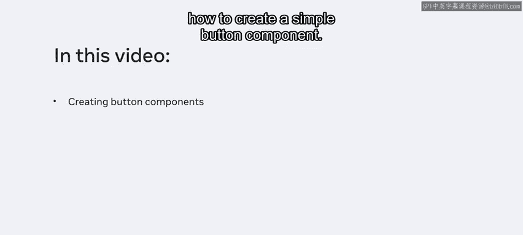
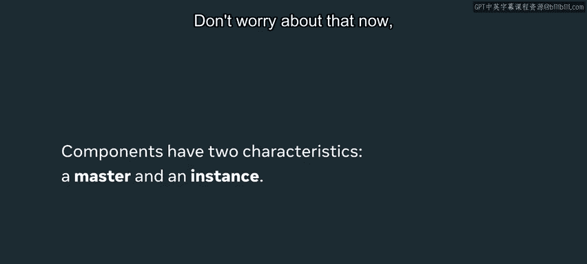
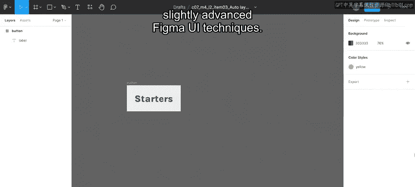
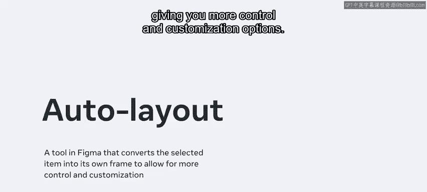
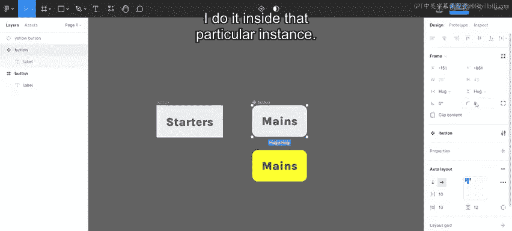
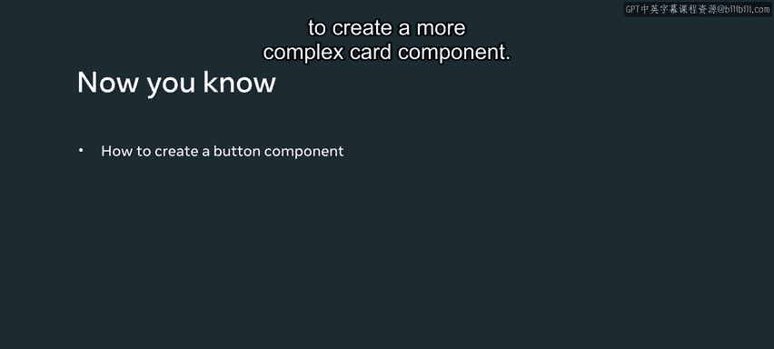

# Figma设计系统：P115：32_Figma中的设计系统 🎨

## 概述
在本节课中，我们将要学习如何在Figma中创建和使用组件。组件是设计系统中的可复用元素，能够显著提升设计效率和一致性。我们将以创建一个简单的按钮组件为例，介绍组件的核心概念和创建流程。

---

随着小柠檬餐厅的重新设计项目不断推进，设计变得越来越复杂。然而，你可以创建一些可以在整个设计中重复使用的组件或元素，从而提高设计效率。

在本视频中，你将学习如何创建一个简单的按钮组件。

## 什么是组件？
任何图层或创建的对象都可以转换为组件。这包括多种多样的元素，例如按钮、图标、布局等等。

一个组件有两个核心特征：**主组件**和**实例**。实例是主组件的副本。别担心，我们很快就会详细讲解这个概念。

---

## 创建组件
上一节我们介绍了组件的基本概念，本节中我们来看看如何创建一个组件。为此，你需要使用一些稍微高级的Figma UI技巧。

这些技巧包括**自动布局**和**组件**功能。首先是自动布局功能。

### 自动布局功能
这个功能本质上将你正在创建的任何内容转换为其自身的框架，为你提供更多的控制和自定义选项。

在在线点餐页面上，我为菜单项创建了一些分类按钮，例如开胃菜、主菜、甜点、单点菜等。我最初是通过手动调整背景按钮形状以适应文本来创建这些按钮的。

以下是我最初创建这些分类的方式：我复制了“开胃菜”按钮，并输入了“主菜”。然而，按钮形状太大了。自动布局将纠正这个问题。

1.  我选中“主菜”元素。
2.  转到右侧面板，点击加号图标创建自动布局。
3.  按钮形状会自动调整到文本的大小。

现在，它在图层面板中已更改为一个自动布局框架。图标表明了这一点，并且属性显示在右侧边栏中。

现在，如果我将鼠标悬停在文本元素上，它会有一个外框。这就是框架。此时，按钮具有内边距，即文本与文本顶部、底部和两侧之间的一些空间，这个空间是可调整的。

---

## 从按钮到组件
了解了自动布局后，接下来我们将其转换为真正的组件。

然后，我通过点击顶部框架的“创建组件”图标（它类似于四个菱形）从这个按钮创建一个组件。这现在创建了一个**主组件**。

你可以基于此组件创建**实例**和**变体**。

---

## 使用组件实例
现在，让我们创建这个组件的实例。我可以通过在Windows上按 `Ctrl + D` 或在Mac上按 `Command + D` 来复制按钮，或者我可以点击并拖动主按钮组件，并在拖动时按住 `Alt` 键。

图层面板显示创建了第二个按钮，但图标是单个菱形。这告诉我们这是主按钮的一个**实例**。我将其重命名为“黄色按钮”。

1.  我点击“黄色按钮”实例。
2.  将框架的填充色改为黄色。
3.  只有这个按钮的实例变成了黄色。

现在，我回到我的主组件。

1.  我将圆角半径改为 `8`。
2.  所有实例都将保留这个更改。

**主组件按钮是“主”**。如果我想更改所有实例，我在这里进行更改。如果我希望实例具有各自的特性，我就在那个特定的实例内部进行更改。

---

## 总结
本节课中我们一起学习了如何在Figma中创建和使用组件。我们了解了主组件与实例的关系，掌握了使用自动布局功能创建可自适应内容的元素，并最终将其转换为可复用的组件。你还学会了如何创建实例并分别管理主组件和实例的样式。

我鼓励你继续探索组件，通过阅读相关材料来学习如何使用这些技巧创建更复杂的卡片组件。

