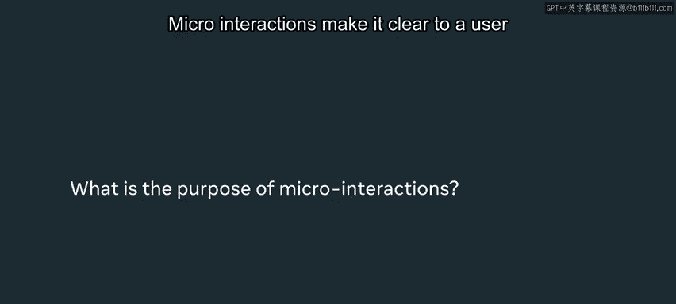
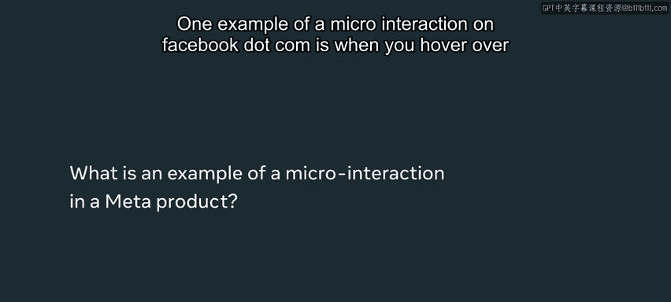
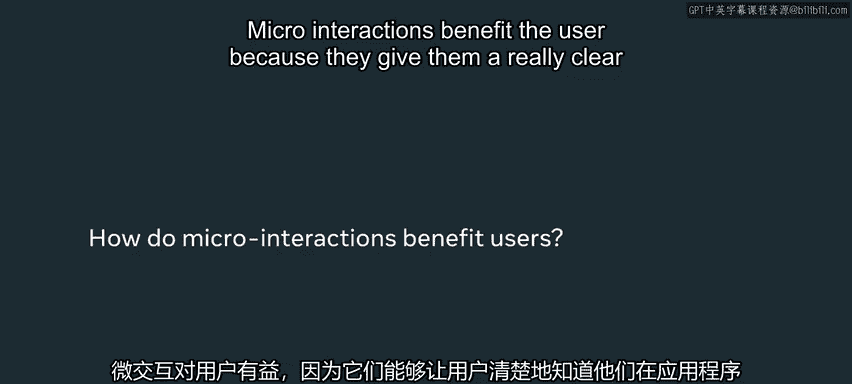
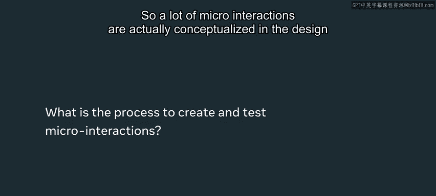
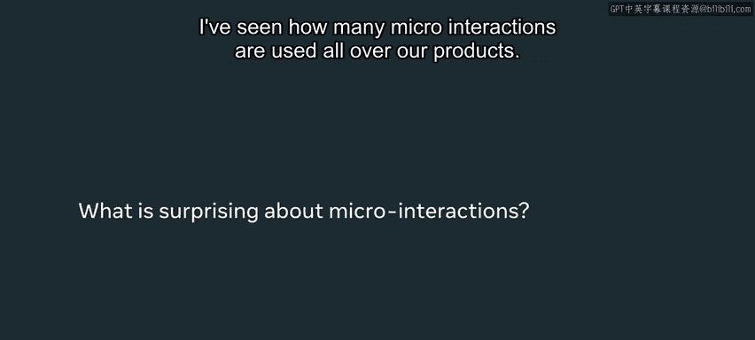
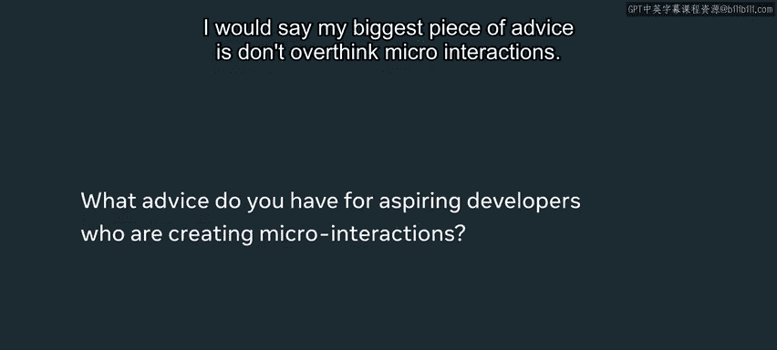

# 前端开发：P118：案例研究 - Meta 如何使用微交互 🎯

在本节课中，我们将学习微交互的概念、作用、设计过程以及它们如何提升用户体验。微交互是应用中那些微小但至关重要的互动细节，它们为用户提供清晰的反馈，并让应用体验更具人性化。

## 什么是微交互？🤔

微交互是你在使用应用时会频繁遇到的小型互动。它们通常服务于单一目的，旨在帮助你更好地理解当前的操作流程，同时也为应用增添情感化和人性化的色彩。



一个关于交互的有趣事实是，你在使用应用时经常遇到它们，但大多数时候并未意识到。微交互的设计初衷是**简单明了**，因此你可能甚至不会注意到自己关闭了一个对话框，或者看到了操作成功的确认信息。

## 微交互的作用与价值 💡

微交互的核心作用是向用户清晰地传达信息。它们让用户明白其刚刚执行的操作是否成功，或者触发用户去完成下一步操作。它们极大地提升了用户对其所执行操作的理解程度。



以下是微交互带来的主要好处：
*   **提供清晰反馈**：明确告知用户操作结果（成功或失败）。
*   **引导用户行为**：提示用户进行下一步操作或进入流程的下一阶段。
*   **增强情感连接**：通过动画等细节，为应用增添趣味性和人性化体验。
*   **提升状态感知**：让用户清楚了解自己在应用中所处的位置以及系统状态。

## Meta 的微交互实例 📱

在 Meta，微交互被广泛应用于各个产品中。许多微交互我都是在潜意识中使用的。现在，当我构建产品时，我会认真思考用户成功完成流程时会发生什么，或者他们可能遇到错误时该如何处理。

一个具体的例子是 Facebook.com 上的“点赞”按钮。当你将鼠标悬停在“点赞”按钮上时，会看到一个小栏，显示你可以对帖子做出的所有反应（如“喜欢”、“爱心”、“哈哈”等）。这个微交互的意图非常明确：用户应该点击其中一个反应，以便快速对他人的帖子做出回应。同时，它也提升了应用的愉悦感——如果你曾悬停过点赞按钮，会注意到这些反应图标带有动画效果，这为使用 Facebook 带来了更多乐趣和人性化体验。



## 微交互的设计与实现流程 🛠️

上一节我们看到了微交互的实际案例，本节中我们来看看它们是如何被设计和实现的。

许多微交互实际上是在设计过程中构思出来的。设计师通常会设计一个完整的端到端流程，并为流程中的每个屏幕设计不同的界面，明确点击某个按钮后应发生什么，等等。工程师负责实现这些微交互。



有时，在实现或测试阶段，我们可能会发现某些交互存在空白。例如，当你按下按钮时，没有任何反应。因此，在测试阶段，我们会意识到需要在何处添加更多微交互，或者某个微交互是否过于烦人且对用户无益。

幸运的是，在 Meta，我们拥有大量可复用的组件用于实现微交互。一个典型的例子是 **Toast 提示**。

**Toast** 是一种当你完成某个操作后，出现在屏幕底部角落的提示信息。例如：
*   **成功场景**：如果我尝试创建一个 Facebook 活动并成功，屏幕角落会出现一个带有绿色对勾的小提示。
*   **错误场景**：如果发生问题，比如网络断开导致无法创建活动，屏幕角落则会出现一个带有警告标志的小提示。

这使得用户非常清楚发生了什么，也提升了他们的体验理解度。

```javascript
// 伪代码示例：显示一个成功的 Toast 提示
showToast({
  message: "活动创建成功！",
  type: "success", // 对应绿色对勾图标
  duration: 3000 // 3秒后自动消失
});
```




## 设计微交互的最佳实践 ✨

我的最大建议是：**不要过度设计微交互**。有时人们学会制作非常花哨的动画，就认为必须将其应用到网站的每一个微交互中。微交互最关键的一点在于，它们应该非常清晰且易于理解，大多数时候也意味着要**简单**。

你既不想包含过多的微交互，也不想让你所包含的微交互过于花哨而分散用户的注意力。

通常，人们在设计产品时不会想到微交互，但在设计过程和测试过程中思考它们至关重要。我会多次使用产品，甚至不会注意到缺少一个小小的确认提示或错误对话框。因此，认真思考这些细节，并将你的产品展示给他人测试，以便他们也能发现这些空白并帮助你填补，这一点非常重要。

## 总结 📝

本节课中，我们一起学习了微交互的核心概念。微交互是应用中那些微小但至关重要的互动，它们为用户提供清晰的反馈、引导操作、增强情感连接并提升状态感知。在设计时，应追求清晰、简单和目的明确，避免过度设计。通过在设计、实现和测试阶段有意识地考虑微交互，并利用可复用组件（如 Toast），你可以显著提升产品的质量和用户体验，确保用户真正理解他们在你的新产品或想法中所经历的流程。



祝你在学习更多关于微交互知识的道路上一切顺利，请记住，它们将把你的应用提升到一个高质量的层次。