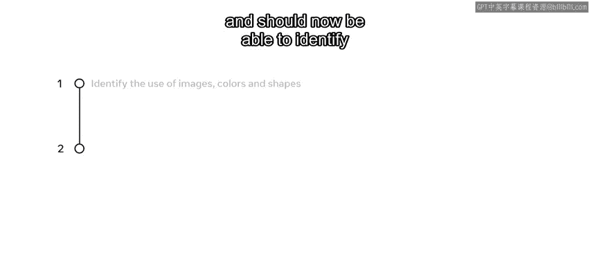
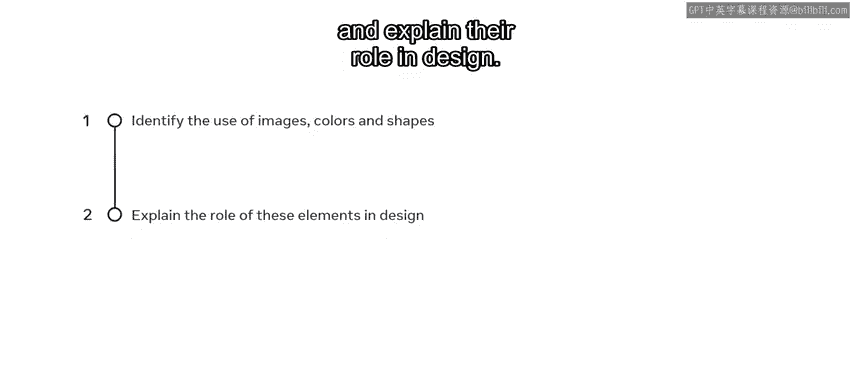
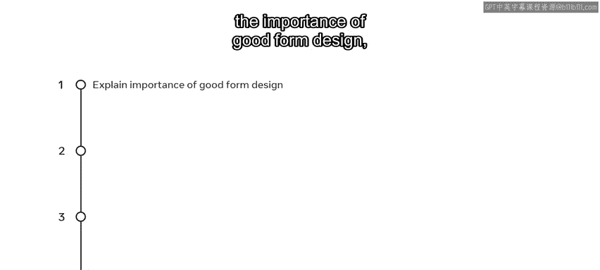
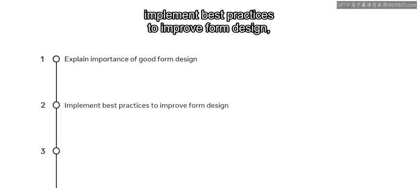
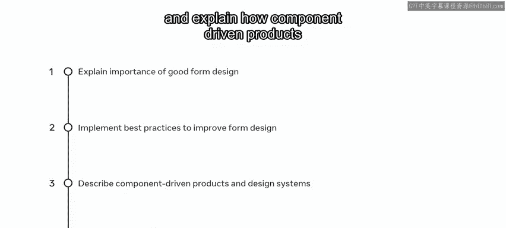
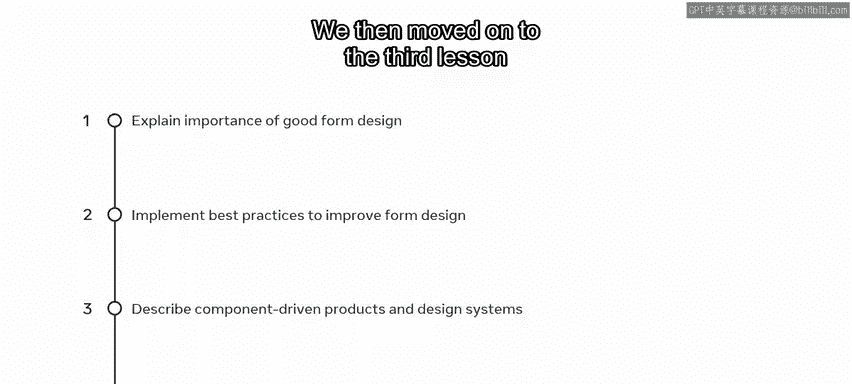
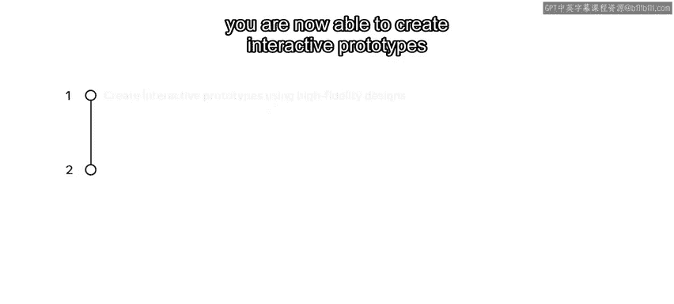
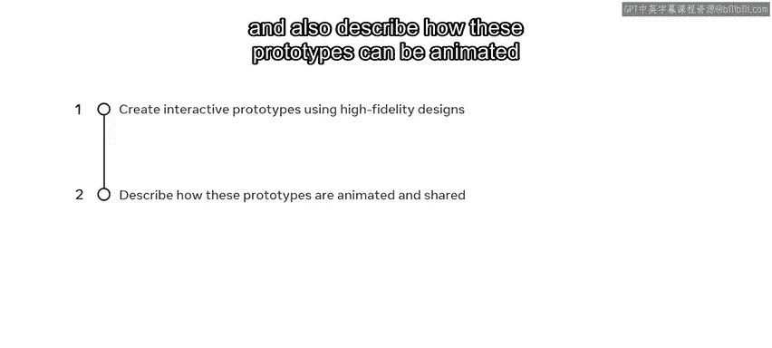
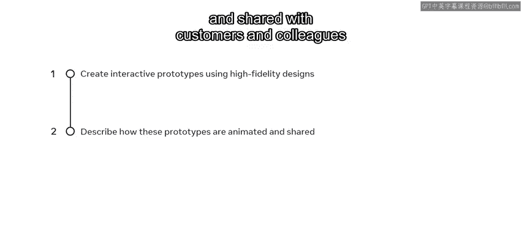

# 前端开发：P119：用户界面设计模块总结 🎉

在本节课中，我们将回顾并总结用户界面设计模块的核心内容。我们将梳理你在本模块中学到的关键技能，包括如何运用视觉元素、理解UX/UI设计原则、以及创建和测试交互式原型。

---

## 第一课：视觉元素在设计中的应用 🎨

上一节我们介绍了模块的整体目标，本节中我们来看看第一课的核心内容。在第一课中，你学习了如何提升设计水平，现在应当能够识别图像、颜色和形状的运用，并解释它们在设计中的作用。

以下是图像、颜色和形状在设计中的关键作用：

*   **图像**：用于传达信息、吸引注意力和建立情感连接。
*   **颜色**：用于引导视觉焦点、建立品牌识别和传达情绪。
*   **形状**：用于组织内容、建立视觉层次和引导用户流程。

---

## 第二课：UX/UI设计原则 📐

掌握了视觉元素的基础后，我们进入设计原则的学习。在第二课中，你学习了UX/UI设计原则。完成本课后，你能够解释良好表单设计的重要性，并应用最佳实践来改进表单设计。

此外，你还学习了以下关于组件化产品和设计系统的知识：

*   **描述组件化产品和设计系统**：理解如何通过可复用的**`<Button />`**、**`<Card />`**等组件构建界面。
*   **解释其如何吸引用户**：说明组件化产品和设计系统如何通过保证一致性和提升开发效率，来交付吸引人的用户体验。

---

## 第三课：原型设计、分享与测试 🚀

理解了设计原则，下一步是将静态设计转化为可交互的体验。在第三课中，你学习了如何制作原型、分享并测试你的设计。

完成本课后，你现在能够使用Figma中的高保真设计来创建交互式原型。

同时，你也能够描述如何为这些原型添加动画效果，并将其分享给客户和同事，以进行进一步的测试和收集反馈。

---

## 模块总结 ✅

本节课中我们一起学习了用户界面设计模块的全部内容。完成本模块后，你现在应当能够提升你的UX/UI设计水平，应用良好的表单设计原则，理解如何在Figma中创建组件，以及制作原型并分享你的设计。

做得好，你已成功掌握了用户界面设计模块的关键技能。