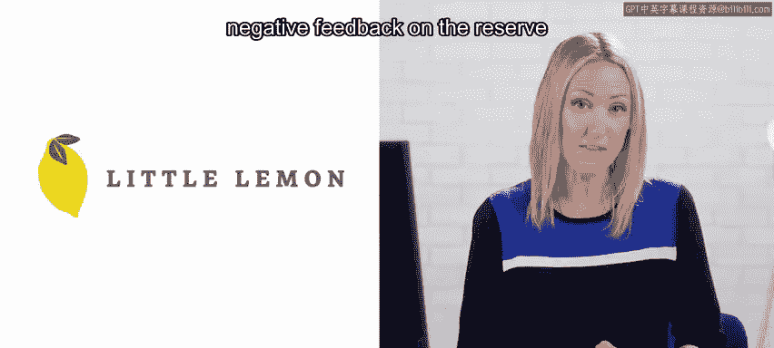
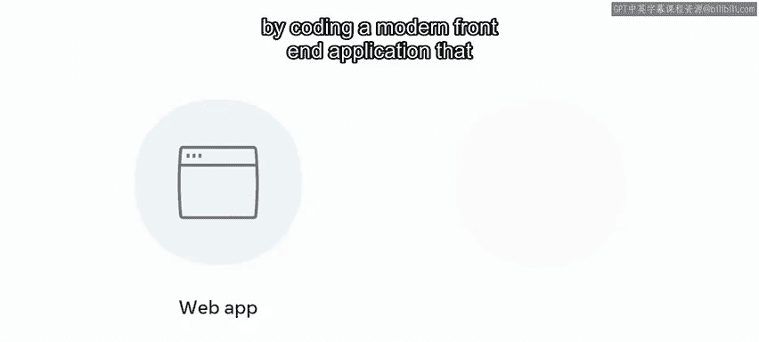
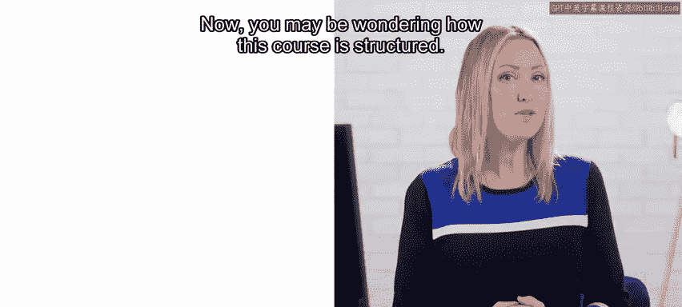
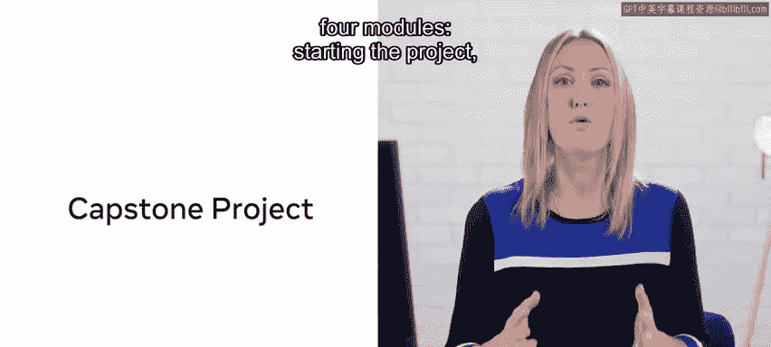
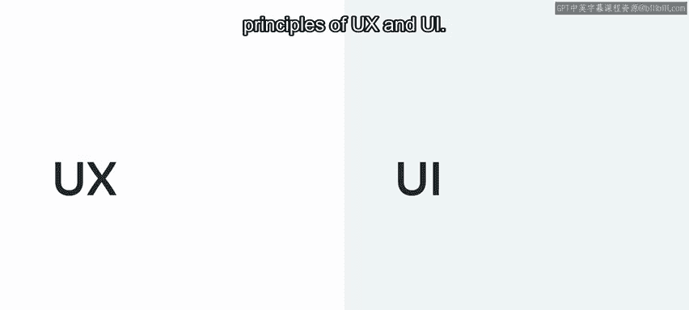
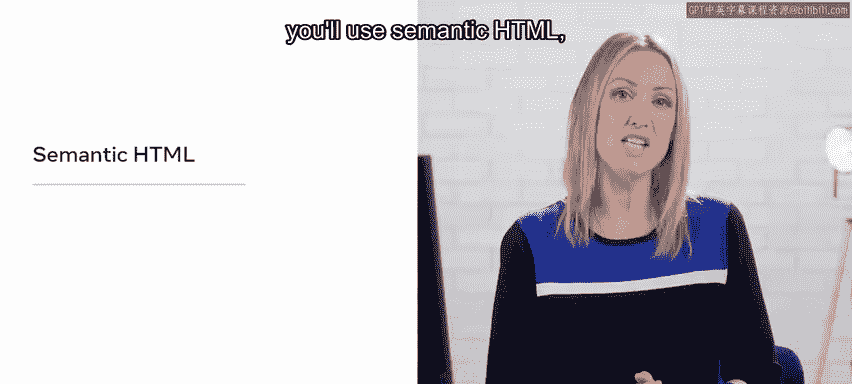
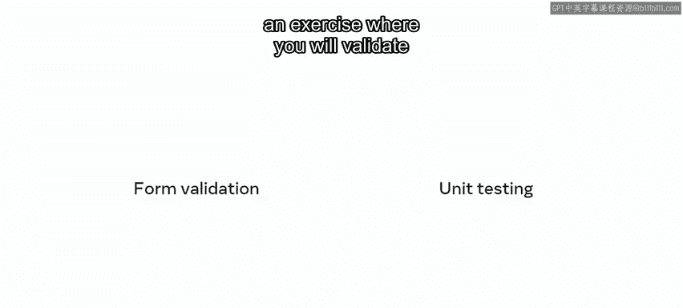
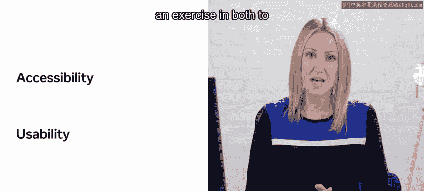
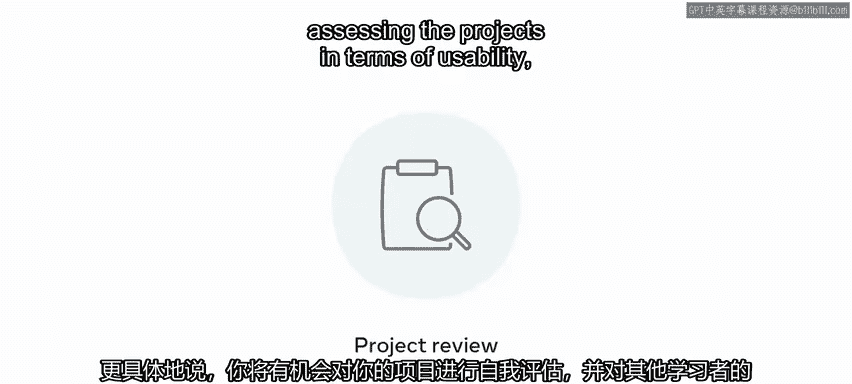

# 前端开发毕业项目：P122：0_简介 🎯

在本课程中，我们将学习如何构建一个响应式网页应用，并通过编码一个现代化的前端应用程序来展示多种技能。该应用将为 Little Lemon 餐厅实现一个用户预订餐桌的功能。

Little Lemon 餐厅的网站收到了关于其“预订餐桌”功能的负面反馈。用户对该功能的使用方式感到困惑，并且对其外观和功能不满意。这正是本课程要解决的问题。我们将综合运用在整个学习计划中学到的所有技能和技术，来构建这个应用。

现在，你可能会好奇本课程的结构。本课程包含四个模块。

以下是四个模块的简要介绍：

*   **启动项目**：你将开始毕业项目。这包括简要回顾已完成的 React 课程内容，并设置编码环境、React 项目以及在 GitHub 上为项目创建 Git 仓库。同时，你将回顾 UX 和 UI 设计原则，并在项目中使用这些方法，包括准备线框图和使用 Figma 应用设计基础。
*   **项目基础**：你将使用语义化 HTML、元标签和开放图谱协议为网页应用创建现代化的 HTML 结构。同时，你将使用 CSS Grid 和其他 CSS 样式来建立一个响应式、清晰且吸引人的网站。此外，还会回顾 React 的基础知识。
*   **项目功能**：你将使用 React 编写餐桌预订系统的代码。课程将涵盖用户体验和表单验证的重要性，并通过练习在应用中进行表单验证和编写单元测试。同时，将涉及可访问性和 UX/UI 可用性评估，并通过相关练习确保你的界面符合这些要求。
*   **项目评估**：你将有机会反思所学到的知识和取得的成就。具体来说，你将有机会对自己的项目进行自我评审，并对其他学习者为 Little Lemon 预订餐桌网页应用提供的解决方案进行同行评审，从可用性、可访问性、设计和代码等方面评估项目。

有了这些期待，相信你已经迫不及待想要开始了。让我们开始你的项目吧。

在本节课中，我们一起学习了毕业项目的整体结构、目标和四个核心模块的内容。接下来，我们将进入第一个模块，正式开始项目的搭建工作。