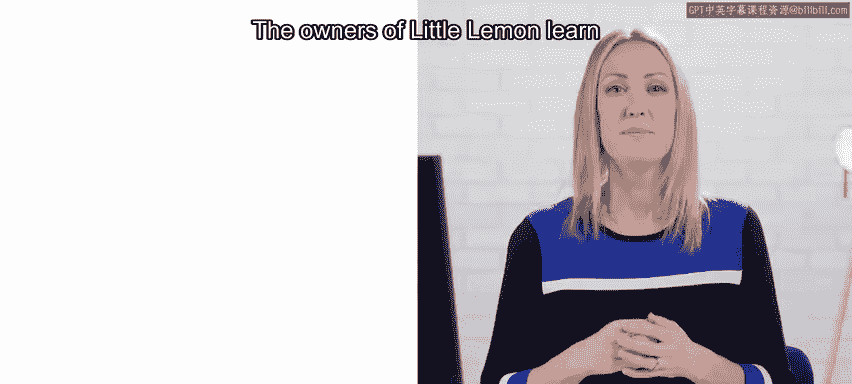
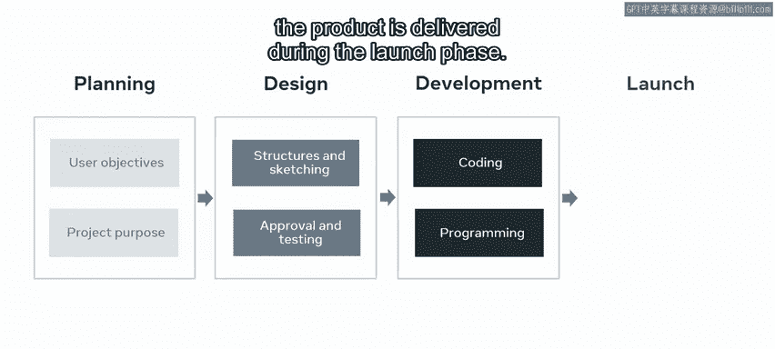
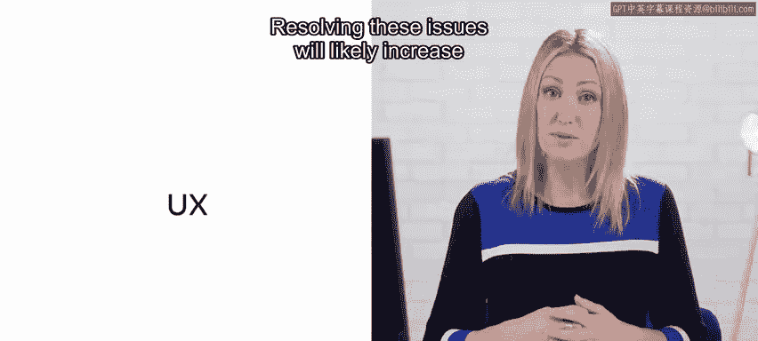
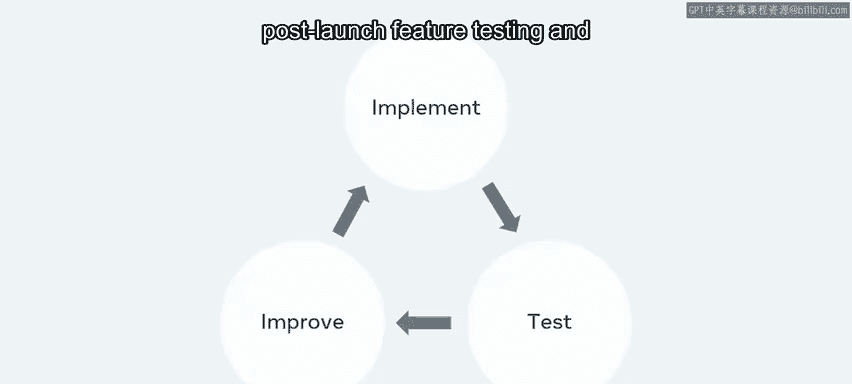
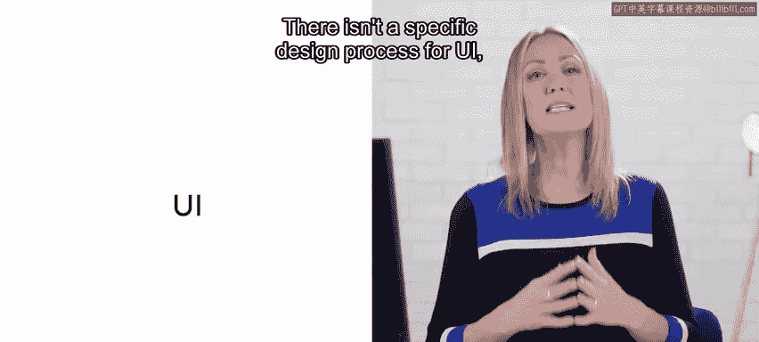
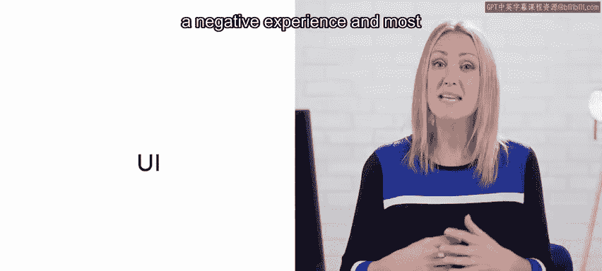
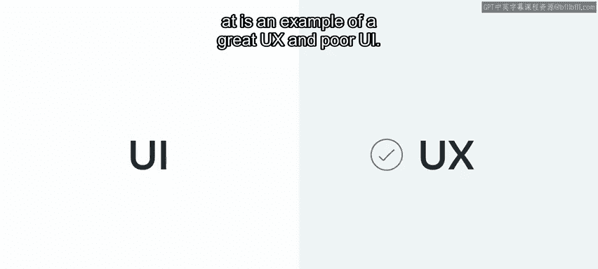

# 前端开发（React/UI、UX/毕业项目/代码评审）：P124：规划用户体验和用户界面 📋

在本节课中，我们将学习如何为“小柠檬”餐厅的在线订座功能规划和设计用户体验与用户界面。我们将回顾UX/UI的核心原则，并利用Figma工具创建线框图、组件和原型，以解决用户无法轻松预订座位的痛点。

---

## 概述

“小柠檬”餐厅的经营者了解到，顾客对于无法在其网站上轻松预订座位感到沮丧。他们希望解决这个问题，以便更好地规划员工和物资，不再仅仅依赖散客，并为食客提供出色的体验。通过将UX（用户体验）和UI（用户界面）的原则应用于当前网站的订座功能，我们可以帮助“小柠檬”实现这一目标。

## UX/UI流程回顾 🧩

上一节我们介绍了项目背景，本节中我们来看看构成UX/UI流程的几个关键阶段。这些阶段包括**规划**、**设计**、**开发**和**发布**。

*   **规划阶段**：这被认为是UX/UI流程中最关键的阶段。它包括收集用户的目标，并确定和规划项目的整体目的。
*   **设计阶段**：在此阶段，设计师将规划阶段的事实和信息转化为现实。必须产出设计结构和草图以供批准和测试。
*   **开发阶段**：此阶段主要完成编码和编程任务，并进行测试。它本质上是实现前一步骤所获结果的过程，例如制作一个功能性的网站或移动应用程序。
*   **发布阶段**：产品在此阶段交付给用户。

## 从UX开始：解决核心问题 🎯

现在，我们将开始探索UX，并了解遵循UX流程将如何帮助我们解决“小柠檬”网站在线订座功能的问题。解决这些问题可能会增加销售额并留住回头客。

需要记住的是，因为产品可以不断改进，所以UX是一个迭代过程。发布后的功能测试和改进将持续进行。

UI虽然没有特定的设计流程，但若处理得当，它同样至关重要。出色的UI通常不会被用户注意到，但如果UI设计不佳，用户将获得负面体验，大多数人会离开网站且不再回来。

为了阐明UI和UX的目的，我们可以看两个例子：
*   **出色的UI但糟糕的UX**：看起来很美，但使用起来很有挑战性。
*   **出色的UX但糟糕的UI**：非常易用，但外观令人不悦。

## 用户研究与设计机会 🔍

根据已进行的用户研究，我们创建了一个用户角色和用户旅程地图，以帮助解决“小柠檬”网络应用的问题。

用户旅程地图识别出了多个改进机会，以下是具体列表：

*   允许顾客选择座位。
*   提供更多选项。
*   允许添加额外备注。
*   发送确认邮件。
*   选择日期、时间和用餐人数。

## 实践步骤 🛠️

在本课的后续部分，你将通过阅读材料、练习和测验，逐步学习如何为订座功能创建出色的UX和UI。

---

## 总结

本节课中，我们一起学习了UX/UI设计的基本流程和核心概念。我们了解到，规划阶段对于确定项目方向至关重要，而设计阶段则负责将想法可视化。通过分析“小柠檬”的用户旅程，我们明确了具体的功能改进点，例如增加座位选择、日期时间选择器等。接下来，我们将运用这些知识，开始动手设计解决方案。