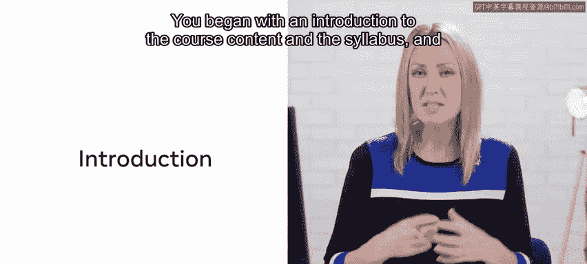
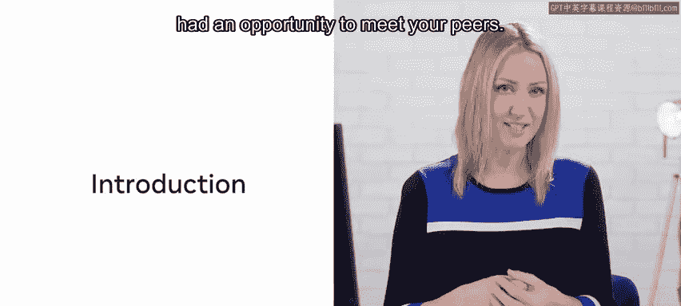
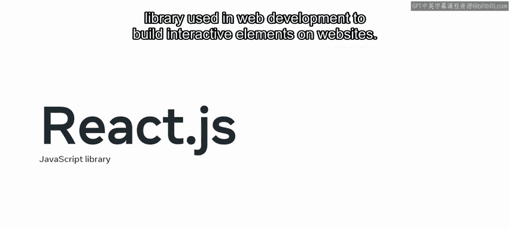
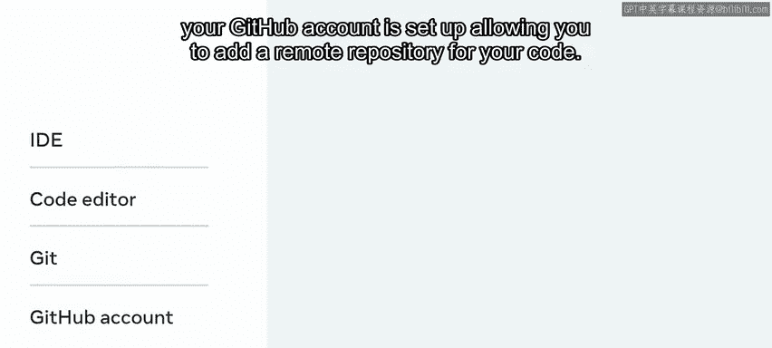
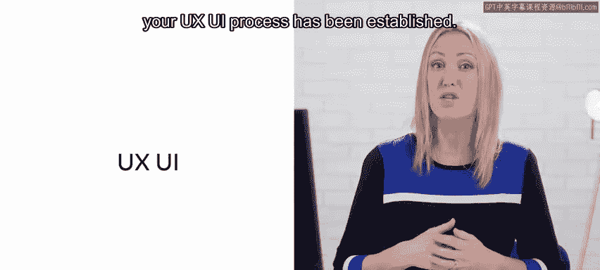
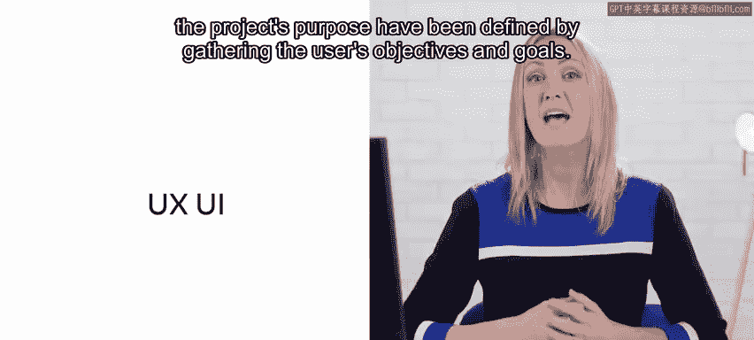
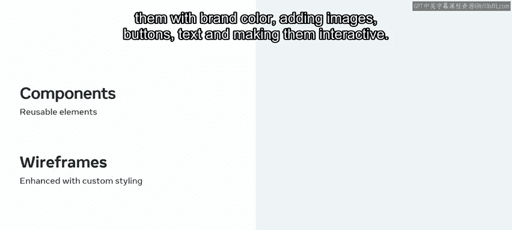
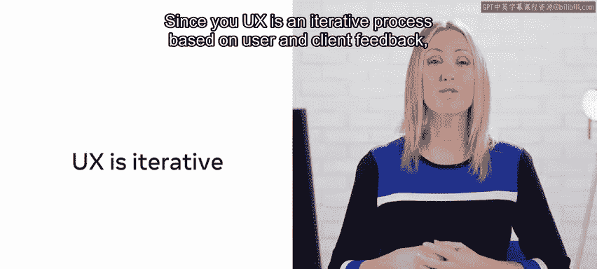
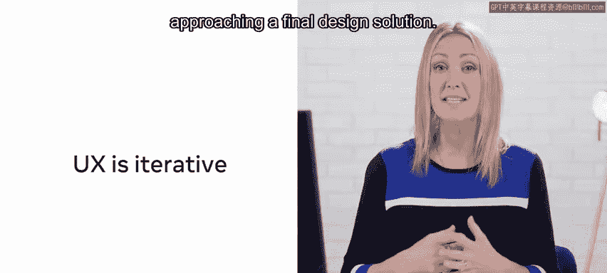

# Meta《前端开发（React／UI、UX／毕业项目／code review）｜Meta Front-End Developer》中英字幕 - P125：3_启动项目模块总结.zh_en - GPT中英字幕课程资源 - BV1uJ4m1e7HT

In this module， you have come a long way in addressing the issues users of the little Lemon website have been facing when trying to reserve a table。

 You began with an introduction to the course content and the syllabus and had an opportunity to meet your peers。

 You then moved on to setting up your project to ensure you use the right tools for developing effective and efficient code and ultimately the successful development of your Web app。

 So you have set up your coding environment react Js。

 a javascript library used in Web development to build interactive elements on websites。

 You now have the correct version of node dot Js and Nm installed on your machine and can now work with an operating system that allows you to interact with no dotjs and build the little lemon project freely。

 using the create， react app， Nm package。 You have an I D E or a code editor installed and set up to work with react。

 Git is installed on your machine and your gi。😊。

Help account is set up， allowing you to add a remote repository for your code。

 The principles of UX and U I have been revisited， and your UX U I process has been established。

 The scope and the project's purpose have been defined by gathering the user's objectives and goals。

 You have begun the UX U I process using Figma， a highly scalable design tool based on vectors。

 its browser based architecture is clever enough to save your work as you go。

 and even continue working If your internet connection is briefly lost。

 You design the project wireframes using Figma， which clarified the reserve table function on the little M website。

😊。

During this lesson， usability was pushed to the forefront， and your page layouts were showcased。

 The website's functionality and layout， as well as creative and branding aspects were addressed one at a time。

 allowing the owners and the little Le website users to provide early feedback。

 saving you time in the long run。 componentson have been created in Figma El you are able to reuse across your design。

 helping you to create and manage consistency in your proposed solution for reserving a table on the little Le website。

😊，You also fleshed out your wire frames， using little lemon style guide。

 enhancing them with brand color， adding images， buttons， text， and making them interactive。

 Since U X is an iterative process based on user and client feedback。

 you may also have had to iterate at this stage。 In this process。

 your ideas are constantly refined into something approaching a final design solution。😊。

Having set up your coding environment and a set of designs for the project created。

 you are in a fantastic position to begin coding the project。 Well done。😊。

