# Meta《前端开发（React／UI、UX／毕业项目／code review）｜Meta Front-End Developer》中英字幕 - P128：6_项目组件.zh_en - GPT中英字幕课程资源 - BV1uJ4m1e7HT

Continuing with covering the foundations of your project。

 the next foundational element you'll be working with is adding components。😊。

Going through the lesson， you'll start by revising the basics of react。

 There are quite a few concepts that this entails。 After all。

 there is an entire course in this specialization。 Re basics。

 Here's a quick overview of things covered in the react basics course。

 The course includes an introduction to react components and where they live。

 as well as how to use and style。 those components。

 Data and state and data and events are additional concepts。

 The course also covers the concepts of navigation。😊。

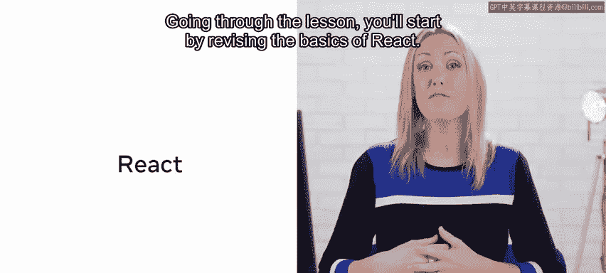

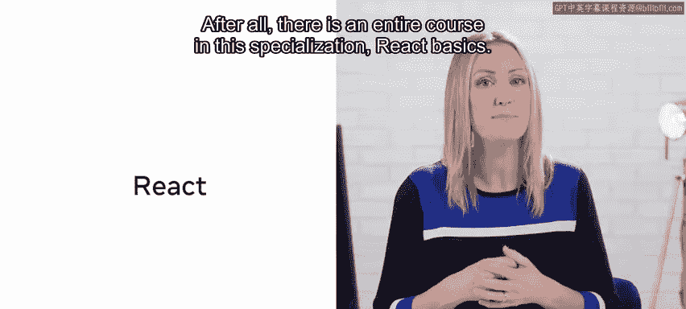

Updating and assets and how to use assets in react。 Plus。

 there is an opportunity to create your first react app。Importantly。

 the concept of components is at the core of the react approach to web development。 Of course。

 react is not the only piece of technology that revolves around components。

 You may be wondering why that's the case。 Well， simply put。

 components are currently one of the best approaches to designing。

 building and talking about web pages。 Still， react has its own take on how to work with components。

 which is developed over time。 in older versions of react components were class based。

 In other words， you needed to use jascript classes to build react components。

 One can refer to this time as the prehooks era。 during the prehooks era。

 you could use classbased syntax to build components with state referred to as stateful components or components without state referred to as stateless components you。

😊。

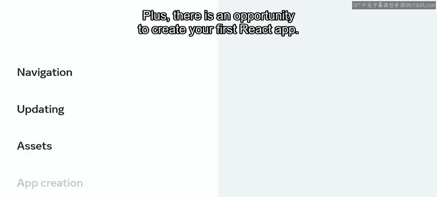

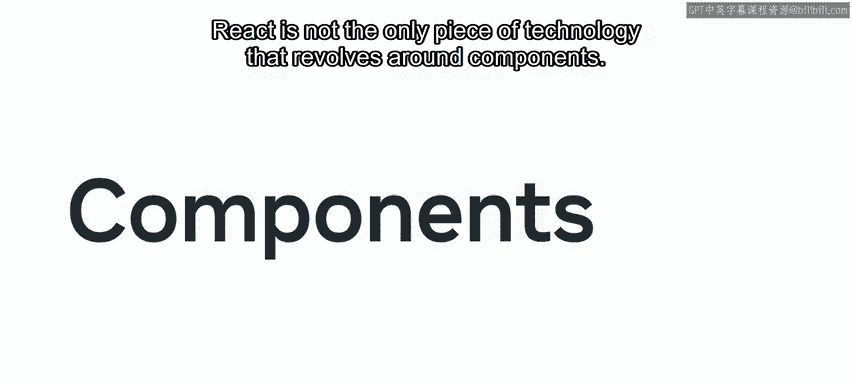

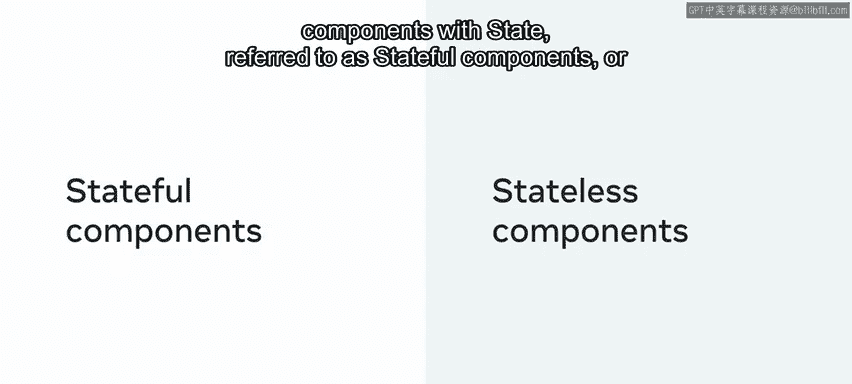

Also use function based components often referred to as functional components。 However。

 at this stage， there was no way for these function based components to have state。 Then hooks。

 which are functions that let you hook into react state and lifestyle features using function components were introduced to react。

 This opened the door to a new modern approach to building components in react。

 in this modern approach， you build react components as functions。

 Although the core react team hasn't made class based components obsolete。

 meaning you can still code your apps using class based syntax。

 there's been a trend of moving away from using class based syntax due to its downsides and embracing functional components instead。

 In fact， this trend has been so strong that very often。

 you'll hear people just mention components when discussing modern react without using the class versus function distinction。

 So in a way， with modern react， it is sort of imply that the only way to write components is to use function。

😊。

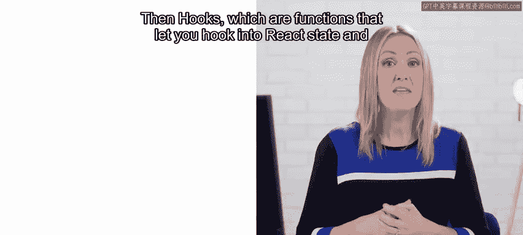

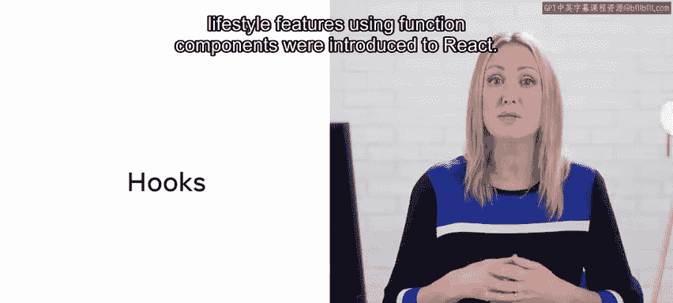

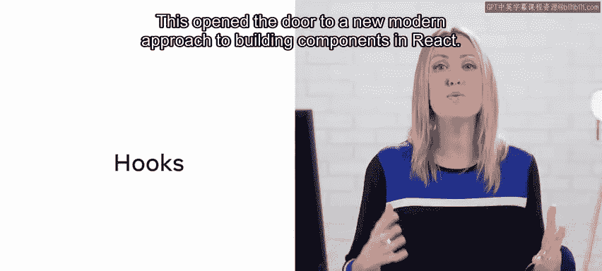

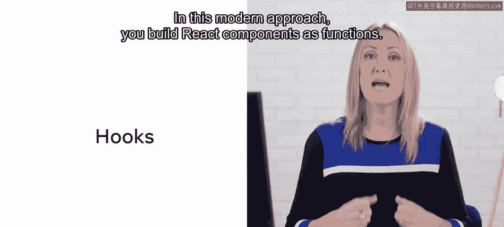

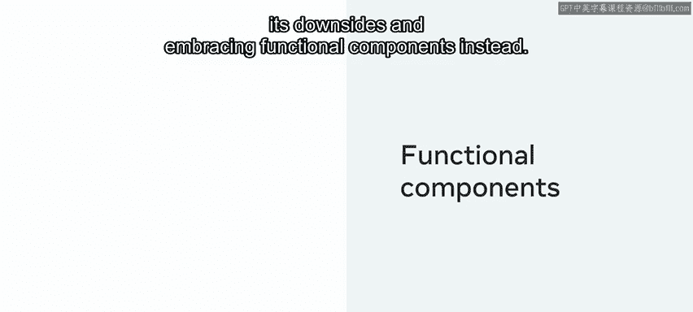

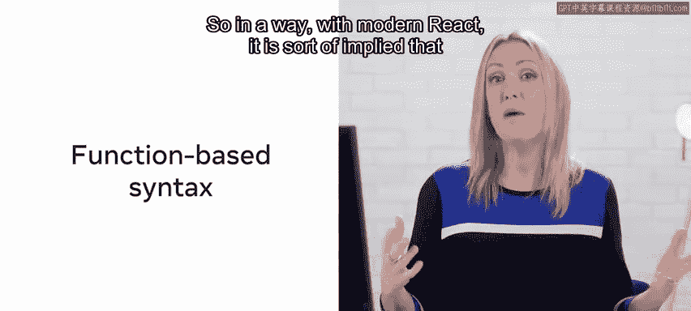

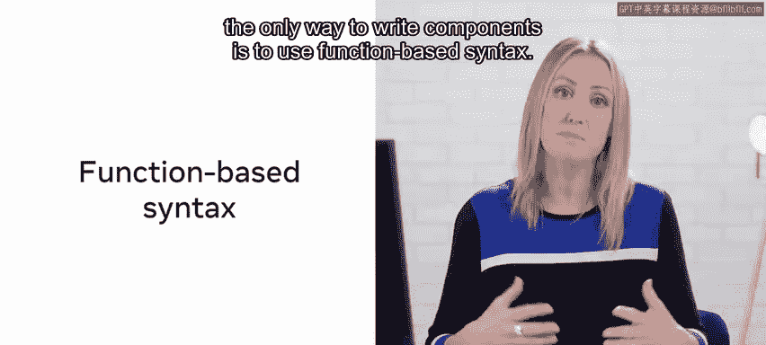

Base syntax， when coding these functional components。

 it's important to note that you can choose to code a react component either as an E S5 function declaration or as an E S 6 constant variable。

 which gets assigned and arrow function。 The latter approach is more modern。

 but the former approach works too， going back to the react basics course。

 besides understanding components and how to work with them in react， you also learned about data。

 state and events， metaphorically speaking， components are。

 so to say vehicles used to pass around data and state and events are there to influence how these components are rendered in the browser。

 and it's worth mentioning that although components set might include things like state and events。

 the focus for this lesson is components。 So while there are many things that you need to understand and to be able to work with in order to complete this lesson。

 the aim is for you to revisit the basics of components in react and set up little lemons reserve table apps components。

😊。

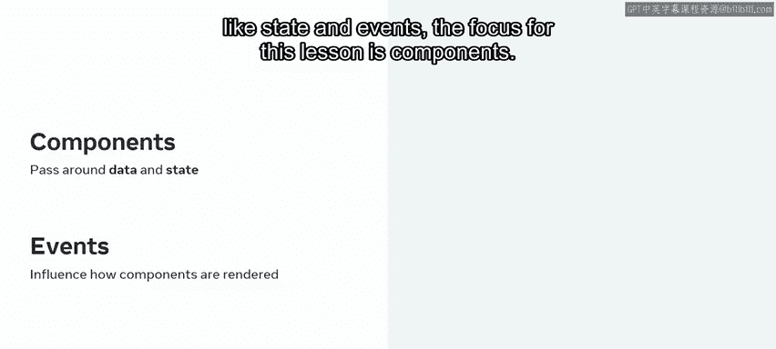

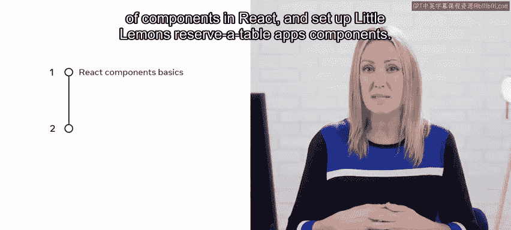

Let's get going。